# Container Registry - Visual Architecture

## Registry Architecture

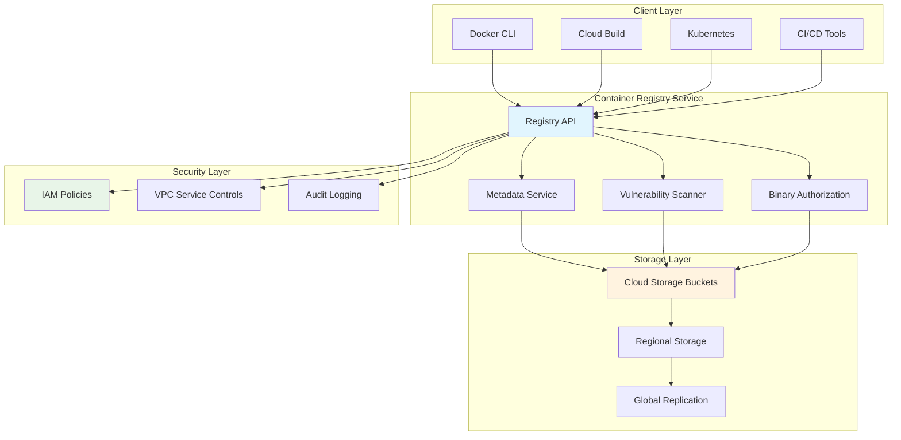

## Image Lifecycle Flow

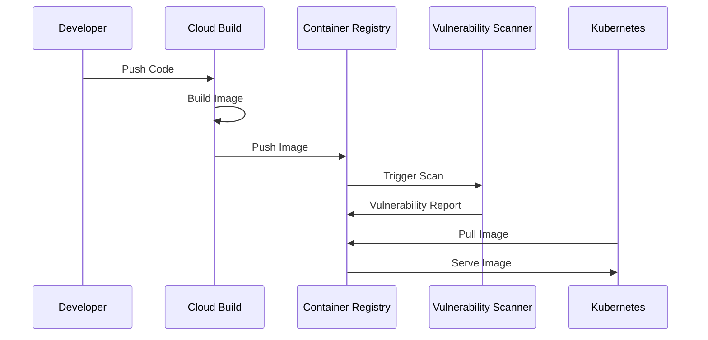

## Storage Architecture

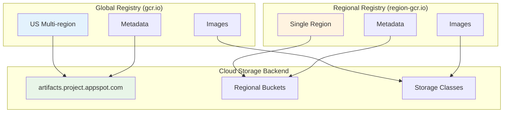

## Security Architecture

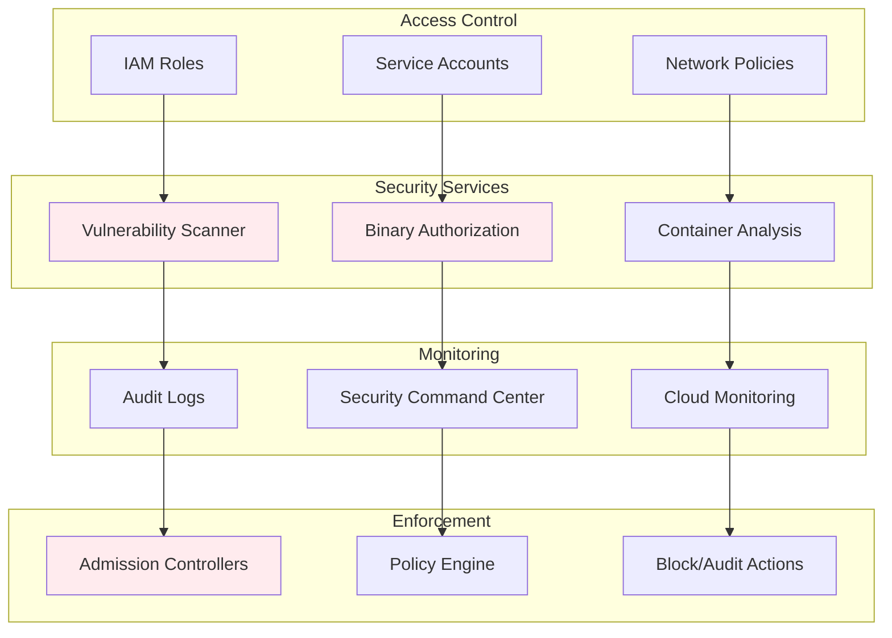

## CI/CD Integration

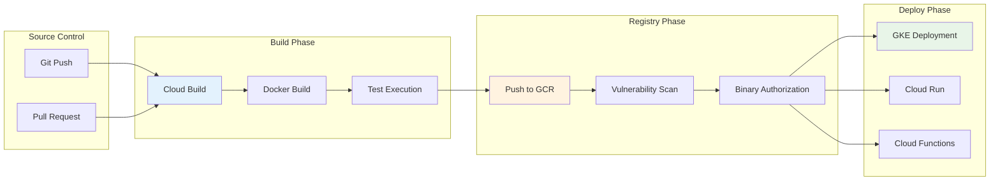

## Vulnerability Scanning Workflow

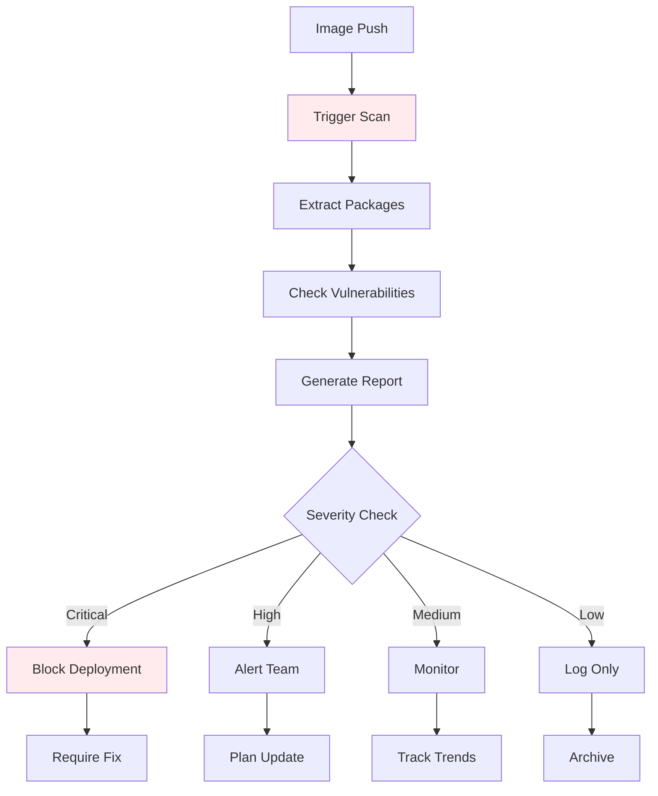

## Binary Authorization Flow

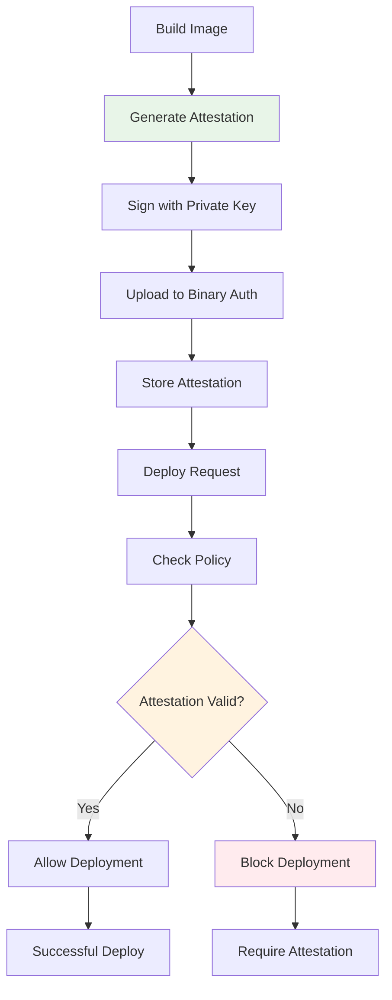

## Multi-Region Architecture

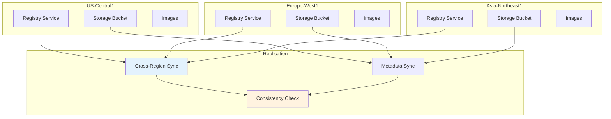

## Image Layer Caching

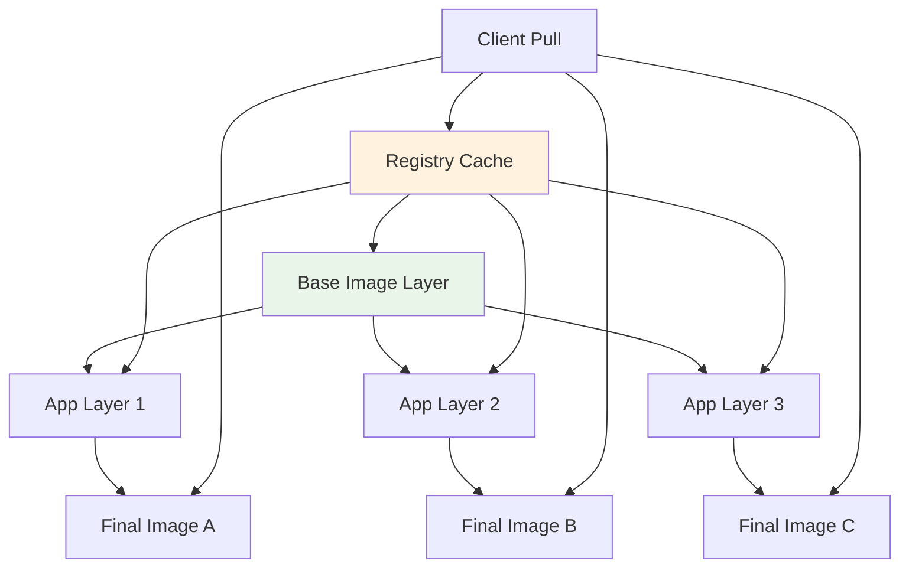

## Pull-Through Cache

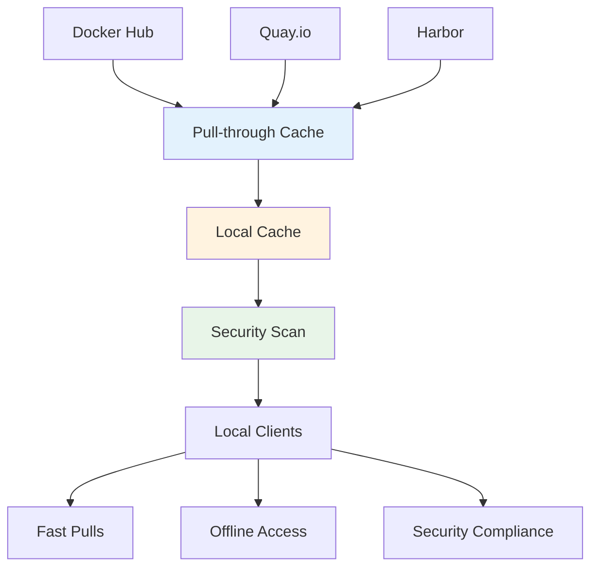

## Cost Optimization

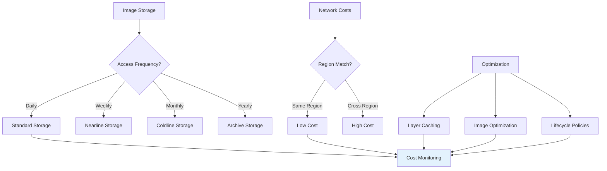

## Migration Patterns

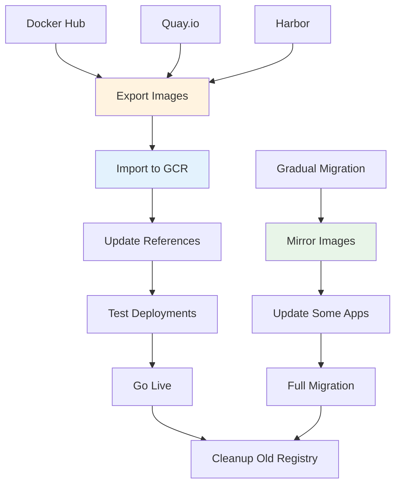

## Monitoring Dashboard

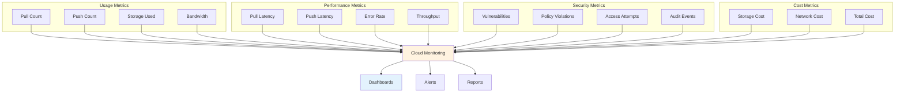

## Compliance Architecture

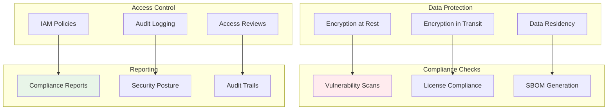

## High Availability Setup

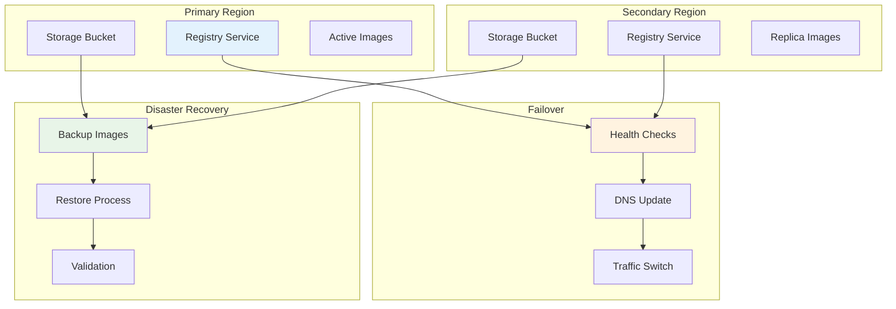

## Integration Patterns

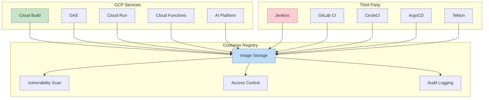

## Image Lifecycle Management

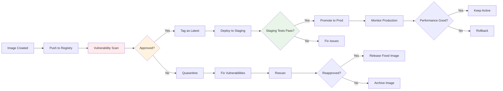

## Network Security

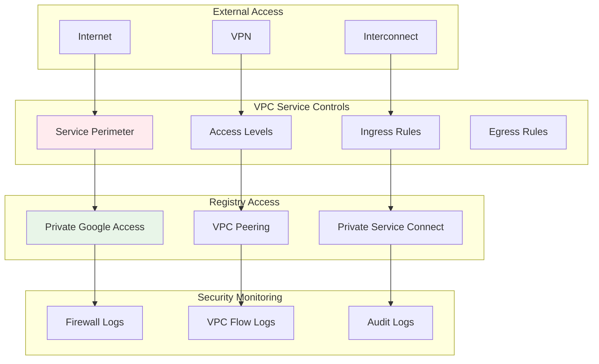

These diagrams illustrate the comprehensive architecture of Container Registry, showing its integration with various GCP services, security features, performance optimizations, and operational workflows. The visual representations help understand how Container Registry fits into the broader container ecosystem and DevOps pipelines.
