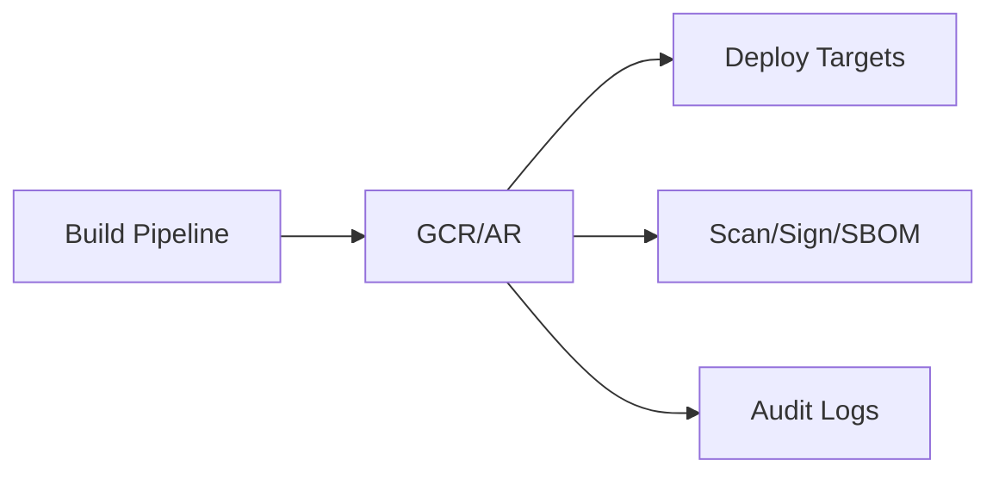

# Container Registry Guide – Basic → Architect

## Level 1 – Launch & Basics

### 1. Quick Push/Pull
```bash
gcloud auth configure-docker
docker pull nginx:1.25
docker tag nginx:1.25 gcr.io/$PROJECT_ID/nginx:1.25
docker push gcr.io/$PROJECT_ID/nginx:1.25
docker pull gcr.io/$PROJECT_ID/nginx:1.25
```

### 2. Core Concepts
- Registries per hostname: gcr.io, us.gcr.io, eu.gcr.io, asia.gcr.io
- Repositories are path-based; images are tagged; digests for immutability
- IAM on project/repo; VPC-SC support

### 3. Cleanup
```bash
gcloud container images list
gcloud container images delete gcr.io/$PROJECT_ID/nginx:1.25
```

## Level 2 – Production Patterns

### Security & Supply Chain
- Use Artifact Registry for new workloads (preferred); if sticking to GCR, enforce IAM, avoid anonymous
- Sign images (cosign); generate SBOM (syft); scan images
- Use digests for deploys; avoid mutable latest

### Performance & Cost
- Use regional endpoints close to workloads
- Clean unused tags/digests; lifecycle policies via scripts (no native in GCR—prefer AR)

### Access
- Least-privilege IAM; CI runners use short-lived creds (WIF)
- Private pulls from GKE/Cloud Run with Workload Identity

## Level 3 – Architect Playbook

### Migration to Artifact Registry
- Plan migration; update image paths; dual-publish during cutover
- Enforce AR policies (vulnerability scanning, lifecycle)

### Governance
- Naming conventions; per-team repos; labels in deploy manifests
- Org policies restricting public images/external pulls (via Binary Authz)

### Observability
- Monitor pull latencies and error rates; audit logs for access

## Ops Cheat Sheet

| Task | Command | Note |
| --- | --- | --- |
| List images | `gcloud container images list` | inventory |
| Delete tag | `gcloud container images delete ...` | cleanup |
| Configure Docker | `gcloud auth configure-docker` | auth |
| Scan | Use AR or external scanner | security |

## Architecture Patterns



## Checklist Before Production
- [ ] Prefer Artifact Registry; if GCR, set IAM and restrict access
- [ ] Sign images; generate SBOM; scan before deploy
- [ ] Use digests/immutable tags; avoid latest
- [ ] Regional registry aligned to workloads; cleanup unused images
- [ ] Short-lived creds (WIF); Workload Identity for pulls; audit logs on

