# Google Cloud Dataform Visual Guide

## Dataform Architecture Overview

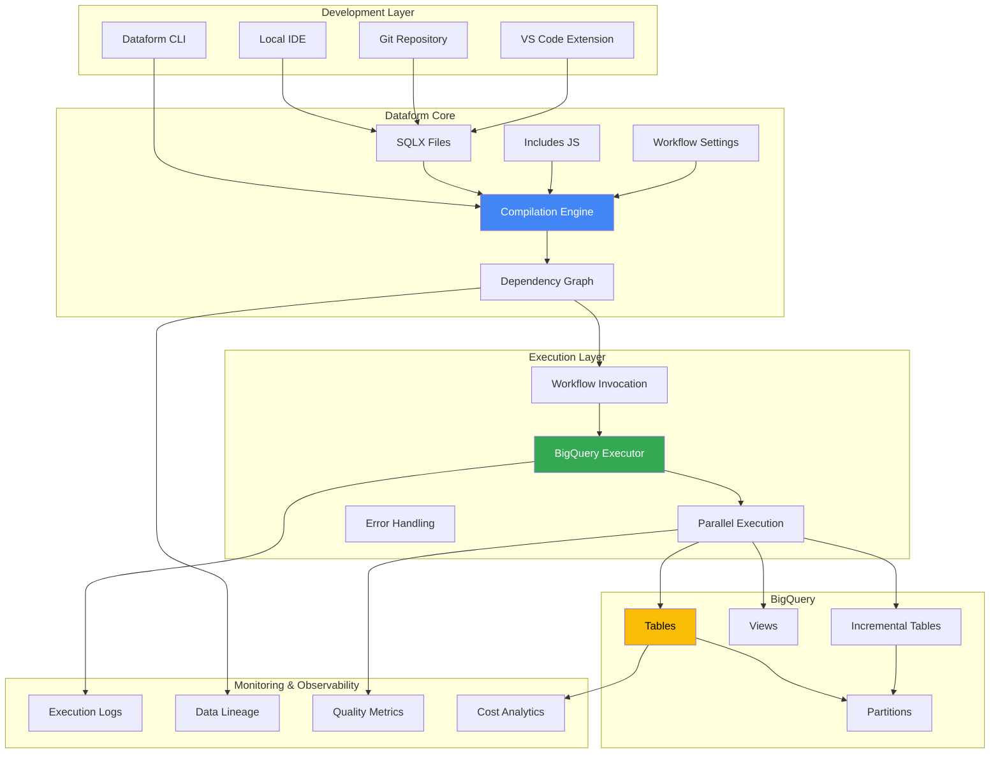
```mermaid
graph TB
    subgraph "Development Layer"
        D1[Local IDE]
        D2[Git Repository]
        D3[Dataform CLI]
        D4[VS Code Extension]
    end

    subgraph "Dataform Core"
        C1[SQLX Files]
        C2[Includes JS]
        C3[Workflow Settings]
        C4[Compilation Engine]
        C5[Dependency Graph]
    end

    subgraph "Execution Layer"
        E1[Workflow Invocation]
        E2[BigQuery Executor]
        E3[Parallel Execution]
        E4[Error Handling]
    end

    subgraph "BigQuery"
        BQ1[Tables]
        BQ2[Views]
        BQ3[Incremental Tables]
        BQ4[Partitions]
    end

    subgraph "Monitoring & Observability"
        M1[Execution Logs]
        M2[Data Lineage]
        M3[Quality Metrics]
        M4[Cost Analytics]
    end

    D1 --> C1
    D2 --> C1
    D3 --> C4
    D4 --> C1

    C1 --> C4
    C2 --> C4
    C3 --> C4
    C4 --> C5

    C5 --> E1
    E1 --> E2
    E2 --> E3
    E3 --> BQ1
    E3 --> BQ2
    E3 --> BQ3

    BQ1 --> BQ4
    BQ3 --> BQ4

    E2 --> M1
    C5 --> M2
    E3 --> M3
    BQ1 --> M4

    style C4 fill:#4285f4,color:#fff
    style E2 fill:#34a853,color:#fff
    style BQ1 fill:#fbbc04,color:#000
```

## Dataform Project Structure

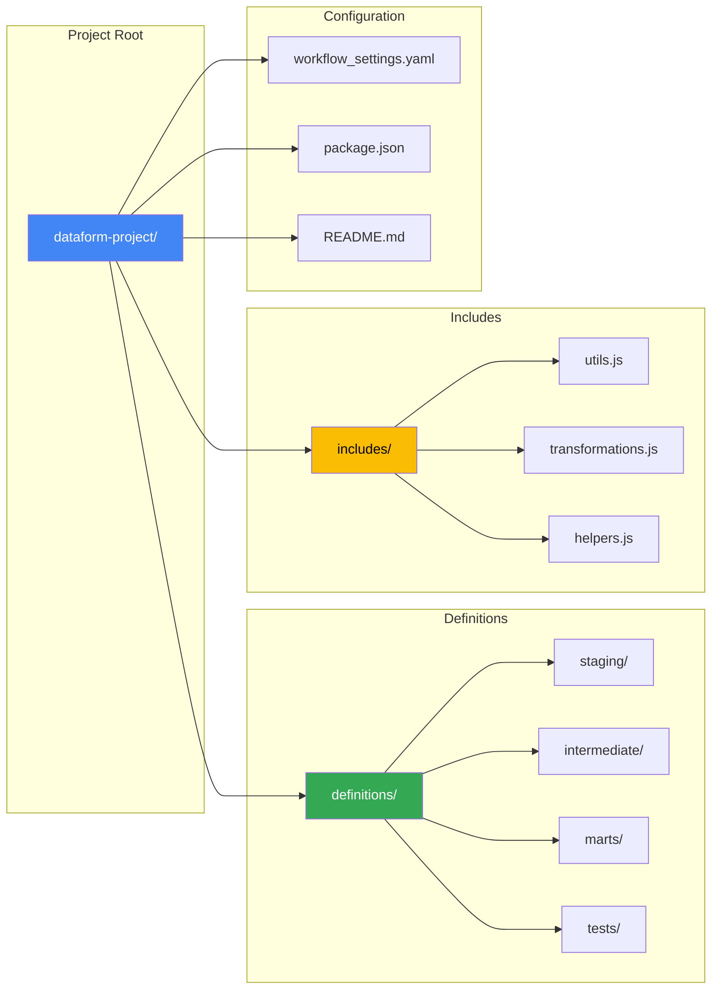
```mermaid
graph LR
    subgraph "Project Root"
        PR[dataform-project/]
    end

    subgraph "Definitions"
        DEF[definitions/]
        STG[staging/]
        INT[intermediate/]
        MRT[marts/]
        TST[tests/]
    end

    subgraph "Includes"
        INC[includes/]
        UTILS[utils.js]
        TRANS[transformations.js]
        HELPERS[helpers.js]
    end

    subgraph "Configuration"
        WF[workflow_settings.yaml]
        PKG[package.json]
        README[README.md]
    end

    PR --> DEF
    PR --> INC
    PR --> WF
    PR --> PKG
    PR --> README

    DEF --> STG
    DEF --> INT
    DEF --> MRT
    DEF --> TST

    INC --> UTILS
    INC --> TRANS
    INC --> HELPERS

    style PR fill:#4285f4,color:#fff
    style DEF fill:#34a853,color:#fff
    style INC fill:#fbbc04,color:#000
```

## Dependency Resolution Flow

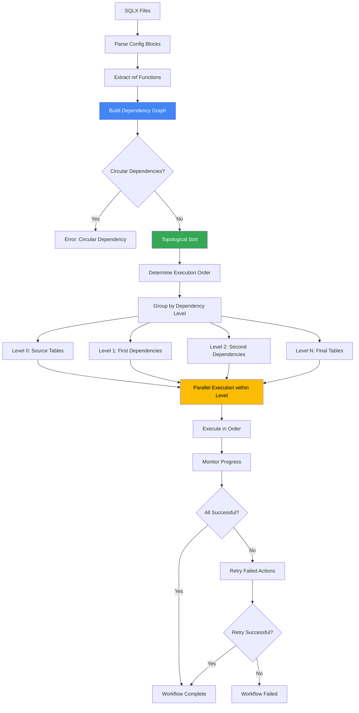
```mermaid
flowchart TD
    A[SQLX Files] --> B[Parse Config Blocks]
    B --> C[Extract ref Functions]
    C --> D[Build Dependency Graph]
    
    D --> E{Circular Dependencies?}
    E -->|Yes| F[Error: Circular Dependency]
    E -->|No| G[Topological Sort]
    
    G --> H[Determine Execution Order]
    H --> I[Group by Dependency Level]
    
    I --> J[Level 0: Source Tables]
    I --> K[Level 1: First Dependencies]
    I --> L[Level 2: Second Dependencies]
    I --> M[Level N: Final Tables]
    
    J --> N[Parallel Execution within Level]
    K --> N
    L --> N
    M --> N
    
    N --> O[Execute in Order]
    O --> P[Monitor Progress]
    P --> Q{All Successful?}
    
    Q -->|Yes| R[Workflow Complete]
    Q -->|No| S[Retry Failed Actions]
    S --> T{Retry Successful?}
    T -->|Yes| R
    T -->|No| U[Workflow Failed]

    style D fill:#4285f4,color:#fff
    style G fill:#34a853,color:#fff
    style N fill:#fbbc04,color:#000
```

## SQLX Compilation Process

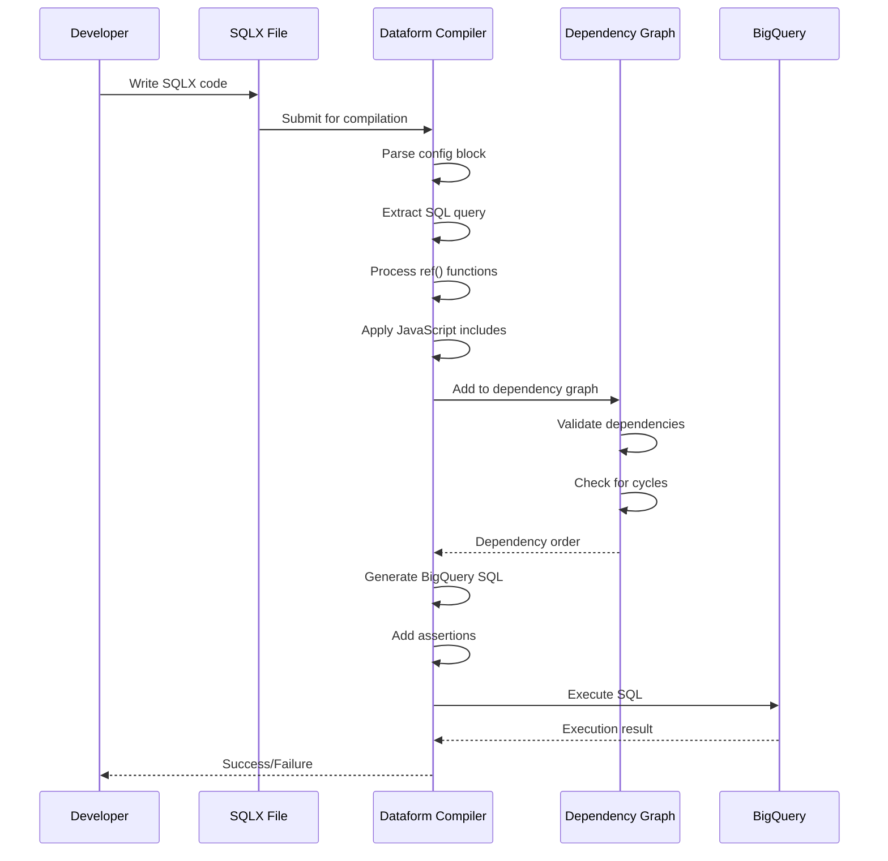
```mermaid
sequenceDiagram
    participant Dev as Developer
    participant SQLX as SQLX File
    participant Compiler as Dataform Compiler
    participant Graph as Dependency Graph
    participant BQ as BigQuery

    Dev->>SQLX: Write SQLX code
    SQLX->>Compiler: Submit for compilation
    
    Compiler->>Compiler: Parse config block
    Compiler->>Compiler: Extract SQL query
    Compiler->>Compiler: Process ref() functions
    Compiler->>Compiler: Apply JavaScript includes
    
    Compiler->>Graph: Add to dependency graph
    Graph->>Graph: Validate dependencies
    Graph->>Graph: Check for cycles
    
    Graph-->>Compiler: Dependency order
    Compiler->>Compiler: Generate BigQuery SQL
    Compiler->>Compiler: Add assertions
    
    Compiler->>BQ: Execute SQL
    BQ-->>Compiler: Execution result
    Compiler-->>Dev: Success/Failure
```

## Medallion Architecture (Bronze-Silver-Gold)

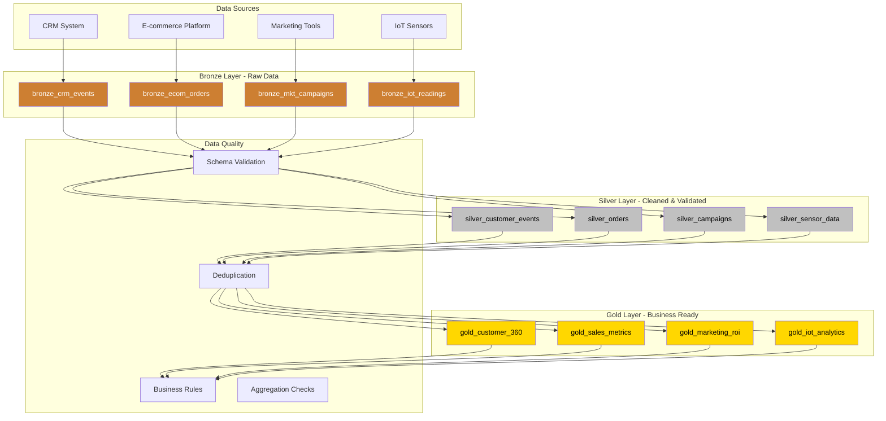
```mermaid
graph TB
    subgraph "Data Sources"
        S1[CRM System]
        S2[E-commerce Platform]
        S3[Marketing Tools]
        S4[IoT Sensors]
    end

    subgraph "Bronze Layer - Raw Data"
        B1[bronze_crm_events]
        B2[bronze_ecom_orders]
        B3[bronze_mkt_campaigns]
        B4[bronze_iot_readings]
    end

    subgraph "Silver Layer - Cleaned & Validated"
        SV1[silver_customer_events]
        SV2[silver_orders]
        SV3[silver_campaigns]
        SV4[silver_sensor_data]
    end

    subgraph "Gold Layer - Business Ready"
        G1[gold_customer_360]
        G2[gold_sales_metrics]
        G3[gold_marketing_roi]
        G4[gold_iot_analytics]
    end

    subgraph "Data Quality"
        DQ1[Schema Validation]
        DQ2[Deduplication]
        DQ3[Business Rules]
        DQ4[Aggregation Checks]
    end

    S1 --> B1
    S2 --> B2
    S3 --> B3
    S4 --> B4

    B1 --> DQ1
    B2 --> DQ1
    B3 --> DQ1
    B4 --> DQ1

    DQ1 --> SV1
    DQ1 --> SV2
    DQ1 --> SV3
    DQ1 --> SV4

    SV1 --> DQ2
    SV2 --> DQ2
    SV3 --> DQ2
    SV4 --> DQ2

    DQ2 --> G1
    DQ2 --> G2
    DQ2 --> G3
    DQ2 --> G4

    G1 --> DQ3
    G2 --> DQ3
    G3 --> DQ3
    G4 --> DQ3

    style B1 fill:#cd7f32,color:#fff
    style B2 fill:#cd7f32,color:#fff
    style B3 fill:#cd7f32,color:#fff
    style B4 fill:#cd7f32,color:#fff
    style SV1 fill:#c0c0c0,color:#000
    style SV2 fill:#c0c0c0,color:#000
    style SV3 fill:#c0c0c0,color:#000
    style SV4 fill:#c0c0c0,color:#000
    style G1 fill:#ffd700,color:#000
    style G2 fill:#ffd700,color:#000
    style G3 fill:#ffd700,color:#000
    style G4 fill:#ffd700,color:#000
```

## Incremental Table Processing

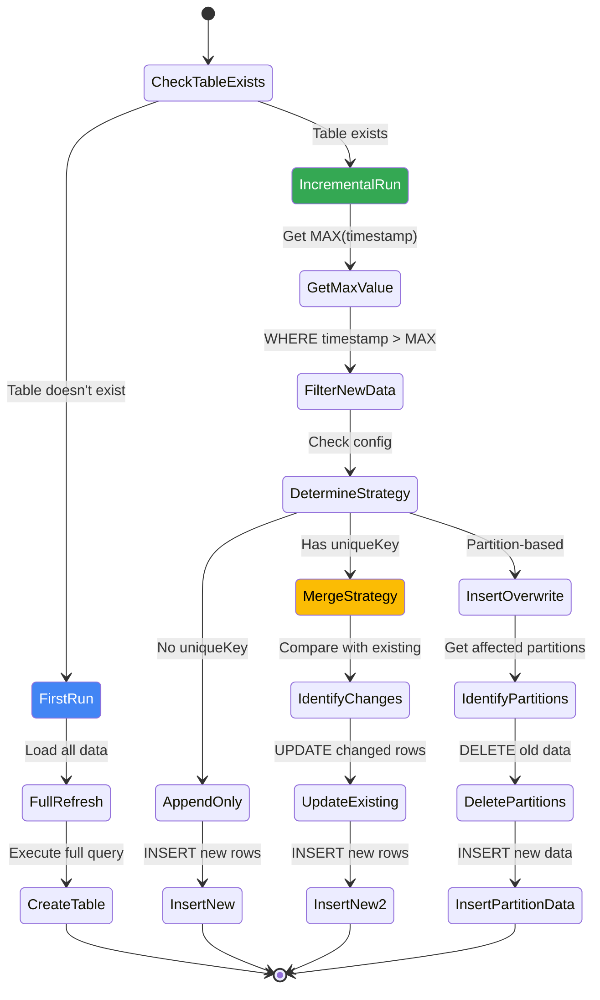
```mermaid
stateDiagram-v2
    [*] --> CheckTableExists
    
    CheckTableExists --> FirstRun: Table doesn't exist
    CheckTableExists --> IncrementalRun: Table exists
    
    FirstRun --> FullRefresh: Load all data
    FullRefresh --> CreateTable: Execute full query
    CreateTable --> [*]
    
    IncrementalRun --> GetMaxValue: Get MAX(timestamp)
    GetMaxValue --> FilterNewData: WHERE timestamp > MAX
    FilterNewData --> DetermineStrategy: Check config
    
    DetermineStrategy --> AppendOnly: No uniqueKey
    DetermineStrategy --> MergeStrategy: Has uniqueKey
    DetermineStrategy --> InsertOverwrite: Partition-based
    
    AppendOnly --> InsertNew: INSERT new rows
    InsertNew --> [*]
    
    MergeStrategy --> IdentifyChanges: Compare with existing
    IdentifyChanges --> UpdateExisting: UPDATE changed rows
    UpdateExisting --> InsertNew2: INSERT new rows
    InsertNew2 --> [*]
    
    InsertOverwrite --> IdentifyPartitions: Get affected partitions
    IdentifyPartitions --> DeletePartitions: DELETE old data
    DeletePartitions --> InsertPartitionData: INSERT new data
    InsertPartitionData --> [*]

    style FirstRun fill:#4285f4,color:#fff
    style IncrementalRun fill:#34a853,color:#fff
    style MergeStrategy fill:#fbbc04,color:#000
```

## Data Quality Testing Framework

```mermaid
graph TB
    subgraph "Test Layers"
        L1[Schema Tests]
        L2[Row-Level Tests]
        L3[Aggregate Tests]
        L4[Cross-Table Tests]
        L5[Business Rule Tests]
    end

    subgraph "Schema Tests"
        ST1[Non-Null Checks]
        ST2[Unique Key Checks]
        ST3[Data Type Validation]
        ST4[Column Existence]
    end

    subgraph "Row-Level Tests"
        RT1[Value Range Checks]
        RT2[Format Validation]
        RT3[Referential Integrity]
        RT4[Conditional Logic]
    end

    subgraph "Aggregate Tests"
        AT1[Count Validation]
        AT2[Sum Reconciliation]
        AT3[Statistical Anomalies]
        AT4[Trend Analysis]
    end

    subgraph "Cross-Table Tests"
        CT1[Join Completeness]
        CT2[Data Consistency]
        CT3[Temporal Alignment]
        CT4[Metric Reconciliation]
    end

    subgraph "Business Rule Tests"
        BR1[Domain Logic]
        BR2[Calculation Accuracy]
        BR3[SLA Compliance]
        BR4[Regulatory Checks]
    end

    L1 --> ST1
    L1 --> ST2
    L1 --> ST3
    L1 --> ST4

    L2 --> RT1
    L2 --> RT2
    L2 --> RT3
    L2 --> RT4

    L3 --> AT1
    L3 --> AT2
    L3 --> AT3
    L3 --> AT4

    L4 --> CT1
    L4 --> CT2
    L4 --> CT3
    L4 --> CT4

    L5 --> BR1
    L5 --> BR2
    L5 --> BR3
    L5 --> BR4

    ST1 --> REPORT[Test Report]
    ST2 --> REPORT
    ST3 --> REPORT
    ST4 --> REPORT
    RT1 --> REPORT
    RT2 --> REPORT
    RT3 --> REPORT
    RT4 --> REPORT
    AT1 --> REPORT
    AT2 --> REPORT
    AT3 --> REPORT
    AT4 --> REPORT
    CT1 --> REPORT
    CT2 --> REPORT
    CT3 --> REPORT
    CT4 --> REPORT
    BR1 --> REPORT
    BR2 --> REPORT
    BR3 --> REPORT
    BR4 --> REPORT

    style L1 fill:#4285f4,color:#fff
    style L2 fill:#34a853,color:#fff
    style L3 fill:#fbbc04,color:#000
    style L4 fill:#ea4335,color:#fff
    style L5 fill:#9334e6,color:#fff
```

## Workflow Execution Timeline

```mermaid
gantt
    title Dataform Daily Workflow Execution
    dateFormat HH:mm
    axisFormat %H:%M

    section Bronze Layer
    Ingest CRM Data           :b1, 02:00, 15m
    Ingest E-commerce Data    :b2, 02:00, 20m
    Ingest Marketing Data     :b3, 02:00, 10m
    Ingest IoT Data          :b4, 02:00, 25m

    section Silver Layer
    Clean Customer Data       :s1, after b1, 10m
    Clean Order Data         :s2, after b2, 15m
    Clean Campaign Data      :s3, after b3, 8m
    Clean Sensor Data        :s4, after b4, 12m

    section Gold Layer
    Customer 360             :g1, after s1 s2, 20m
    Sales Metrics            :g2, after s2, 15m
    Marketing ROI            :g3, after s3, 10m
    IoT Analytics            :g4, after s4, 18m

    section Data Quality
    Run Assertions           :dq1, after g1 g2 g3 g4, 10m
    Generate Reports         :dq2, after dq1, 5m

    section Notifications
    Send Success Alert       :n1, after dq2, 1m
```

## Table Materialization Strategies

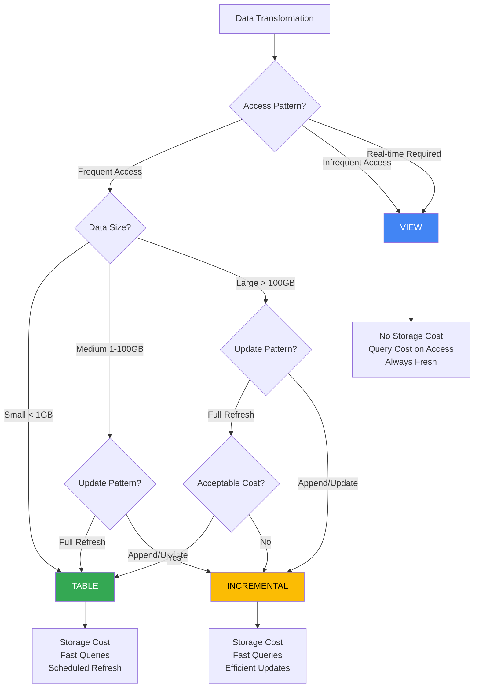
```mermaid
graph TD
    A[Data Transformation] --> B{Access Pattern?}
    
    B -->|Frequent Access| C{Data Size?}
    B -->|Infrequent Access| D[VIEW]
    B -->|Real-time Required| D
    
    C -->|Small < 1GB| E[TABLE]
    C -->|Medium 1-100GB| F{Update Pattern?}
    C -->|Large > 100GB| G{Update Pattern?}
    
    F -->|Full Refresh| E
    F -->|Append/Update| H[INCREMENTAL]
    
    G -->|Full Refresh| I{Acceptable Cost?}
    G -->|Append/Update| H
    
    I -->|Yes| E
    I -->|No| H
    
    D --> J[No Storage Cost<br/>Query Cost on Access<br/>Always Fresh]
    E --> K[Storage Cost<br/>Fast Queries<br/>Scheduled Refresh]
    H --> L[Storage Cost<br/>Fast Queries<br/>Efficient Updates]

    style D fill:#4285f4,color:#fff
    style E fill:#34a853,color:#fff
    style H fill:#fbbc04,color:#000
```

## Partitioning and Clustering Strategy

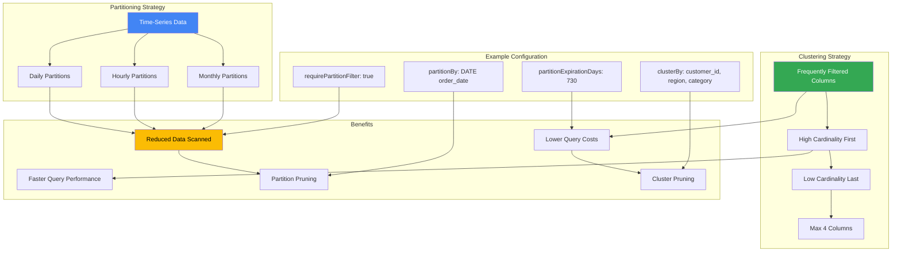
```mermaid
graph TB
    subgraph "Partitioning Strategy"
        P1[Time-Series Data]
        P2[Daily Partitions]
        P3[Hourly Partitions]
        P4[Monthly Partitions]
    end

    subgraph "Clustering Strategy"
        C1[Frequently Filtered Columns]
        C2[High Cardinality First]
        C3[Low Cardinality Last]
        C4[Max 4 Columns]
    end

    subgraph "Benefits"
        B1[Reduced Data Scanned]
        B2[Lower Query Costs]
        B3[Faster Query Performance]
        B4[Partition Pruning]
        B5[Cluster Pruning]
    end

    subgraph "Example Configuration"
        E1[partitionBy: DATE order_date]
        E2[clusterBy: customer_id, region, category]
        E3[requirePartitionFilter: true]
        E4[partitionExpirationDays: 730]
    end

    P1 --> P2
    P1 --> P3
    P1 --> P4

    C1 --> C2
    C2 --> C3
    C3 --> C4

    P2 --> B1
    P3 --> B1
    P4 --> B1
    C1 --> B2
    C2 --> B3

    B1 --> B4
    B2 --> B5

    E1 --> B4
    E2 --> B5
    E3 --> B1
    E4 --> B2

    style P1 fill:#4285f4,color:#fff
    style C1 fill:#34a853,color:#fff
    style B1 fill:#fbbc04,color:#000
```

## Data Lineage Visualization

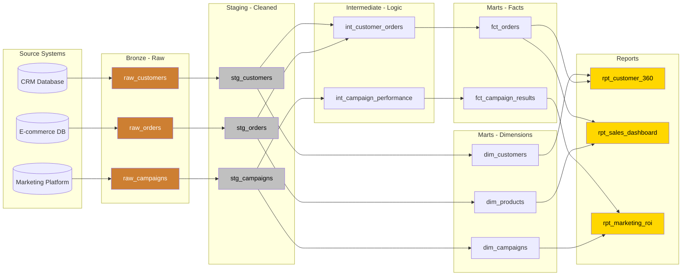
```mermaid
graph LR
    subgraph "Source Systems"
        SRC1[(CRM Database)]
        SRC2[(E-commerce DB)]
        SRC3[(Marketing Platform)]
    end

    subgraph "Bronze - Raw"
        B1[raw_customers]
        B2[raw_orders]
        B3[raw_campaigns]
    end

    subgraph "Staging - Cleaned"
        ST1[stg_customers]
        ST2[stg_orders]
        ST3[stg_campaigns]
    end

    subgraph "Intermediate - Logic"
        INT1[int_customer_orders]
        INT2[int_campaign_performance]
    end

    subgraph "Marts - Dimensions"
        DIM1[dim_customers]
        DIM2[dim_products]
        DIM3[dim_campaigns]
    end

    subgraph "Marts - Facts"
        FCT1[fct_orders]
        FCT2[fct_campaign_results]
    end

    subgraph "Reports"
        RPT1[rpt_customer_360]
        RPT2[rpt_sales_dashboard]
        RPT3[rpt_marketing_roi]
    end

    SRC1 --> B1
    SRC2 --> B2
    SRC3 --> B3

    B1 --> ST1
    B2 --> ST2
    B3 --> ST3

    ST1 --> INT1
    ST2 --> INT1
    ST3 --> INT2

    ST1 --> DIM1
    ST2 --> DIM2
    ST3 --> DIM3

    INT1 --> FCT1
    INT2 --> FCT2

    DIM1 --> RPT1
    FCT1 --> RPT1
    FCT1 --> RPT2
    DIM2 --> RPT2
    FCT2 --> RPT3
    DIM3 --> RPT3

    style B1 fill:#cd7f32,color:#fff
    style B2 fill:#cd7f32,color:#fff
    style B3 fill:#cd7f32,color:#fff
    style ST1 fill:#c0c0c0,color:#000
    style ST2 fill:#c0c0c0,color:#000
    style ST3 fill:#c0c0c0,color:#000
    style RPT1 fill:#ffd700,color:#000
    style RPT2 fill:#ffd700,color:#000
    style RPT3 fill:#ffd700,color:#000
```

## Slowly Changing Dimension (SCD Type 2) Flow

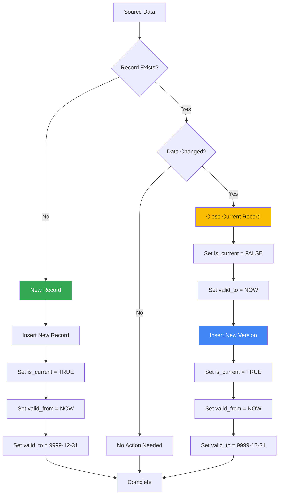
```mermaid
flowchart TD
    A[Source Data] --> B{Record Exists?}
    
    B -->|No| C[New Record]
    B -->|Yes| D{Data Changed?}
    
    C --> E[Insert New Record]
    E --> F[Set is_current = TRUE]
    F --> G[Set valid_from = NOW]
    G --> H[Set valid_to = 9999-12-31]
    
    D -->|No| I[No Action Needed]
    D -->|Yes| J[Close Current Record]
    
    J --> K[Set is_current = FALSE]
    K --> L[Set valid_to = NOW]
    L --> M[Insert New Version]
    
    M --> N[Set is_current = TRUE]
    N --> O[Set valid_from = NOW]
    O --> P[Set valid_to = 9999-12-31]
    
    H --> Q[Complete]
    I --> Q
    P --> Q

    style C fill:#34a853,color:#fff
    style J fill:#fbbc04,color:#000
    style M fill:#4285f4,color:#fff
```

## Error Handling and Retry Logic

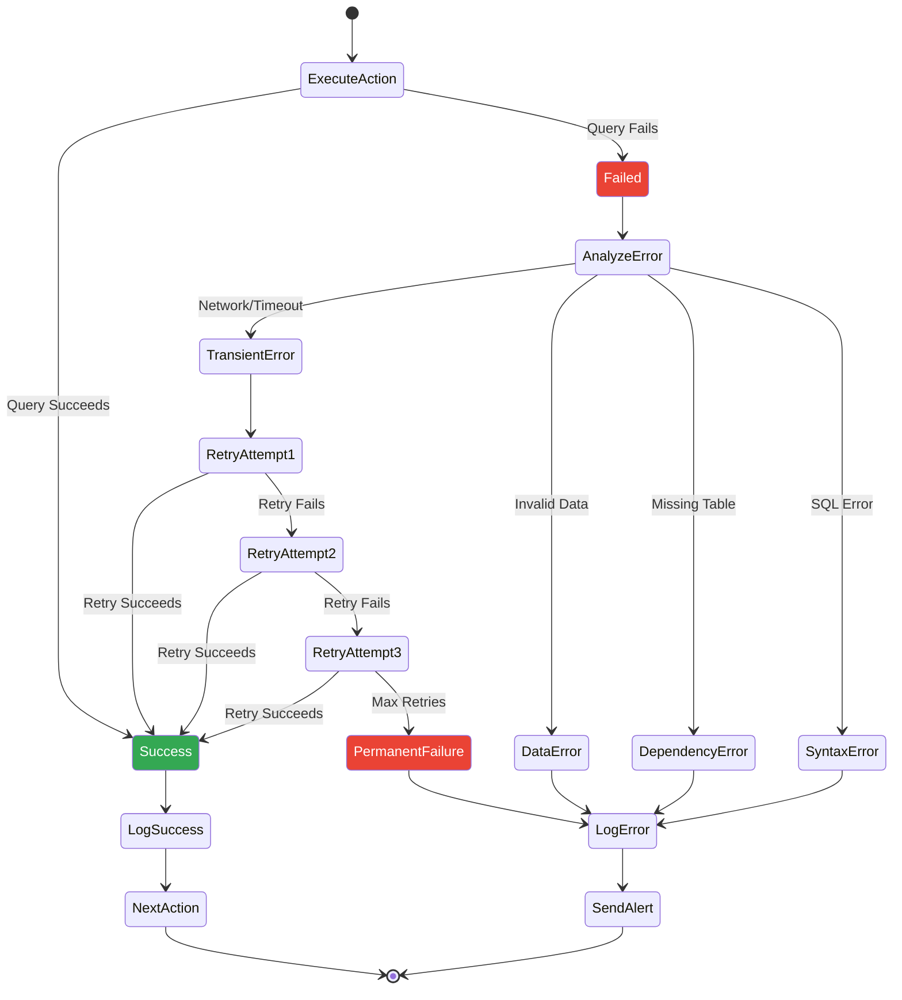
```mermaid
stateDiagram-v2
    [*] --> ExecuteAction
    
    ExecuteAction --> Success: Query Succeeds
    ExecuteAction --> Failed: Query Fails
    
    Success --> LogSuccess
    LogSuccess --> NextAction
    NextAction --> [*]
    
    Failed --> AnalyzeError
    
    AnalyzeError --> TransientError: Network/Timeout
    AnalyzeError --> DataError: Invalid Data
    AnalyzeError --> DependencyError: Missing Table
    AnalyzeError --> SyntaxError: SQL Error
    
    TransientError --> RetryAttempt1
    RetryAttempt1 --> Success: Retry Succeeds
    RetryAttempt1 --> RetryAttempt2: Retry Fails
    RetryAttempt2 --> Success: Retry Succeeds
    RetryAttempt2 --> RetryAttempt3: Retry Fails
    RetryAttempt3 --> Success: Retry Succeeds
    RetryAttempt3 --> PermanentFailure: Max Retries
    
    DataError --> LogError
    DependencyError --> LogError
    SyntaxError --> LogError
    PermanentFailure --> LogError
    
    LogError --> SendAlert
    SendAlert --> [*]

    style Success fill:#34a853,color:#fff
    style Failed fill:#ea4335,color:#fff
    style PermanentFailure fill:#ea4335,color:#fff
```

## Cost Optimization Strategies

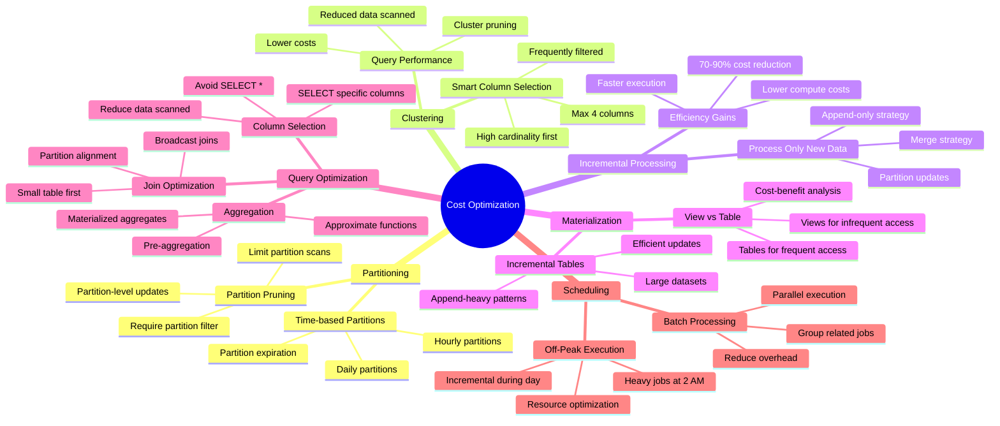
```mermaid
mindmap
  root((Cost Optimization))
    Partitioning
      Time-based Partitions
        Daily partitions
        Hourly partitions
        Partition expiration
      Partition Pruning
        Require partition filter
        Limit partition scans
        Partition-level updates
    Clustering
      Smart Column Selection
        High cardinality first
        Frequently filtered
        Max 4 columns
      Query Performance
        Cluster pruning
        Reduced data scanned
        Lower costs
    Incremental Processing
      Process Only New Data
        Append-only strategy
        Merge strategy
        Partition updates
      Efficiency Gains
        70-90% cost reduction
        Faster execution
        Lower compute costs
    Materialization
      View vs Table
        Views for infrequent access
        Tables for frequent access
        Cost-benefit analysis
      Incremental Tables
        Large datasets
        Append-heavy patterns
        Efficient updates
    Query Optimization
      Column Selection
        SELECT specific columns
        Avoid SELECT *
        Reduce data scanned
      Join Optimization
        Small table first
        Broadcast joins
        Partition alignment
      Aggregation
        Approximate functions
        Pre-aggregation
        Materialized aggregates
    Scheduling
      Off-Peak Execution
        Heavy jobs at 2 AM
        Incremental during day
        Resource optimization
      Batch Processing
        Group related jobs
        Reduce overhead
        Parallel execution
```

## Dataform vs dbt Comparison

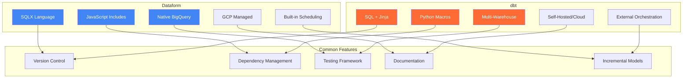
```mermaid
graph TB
    subgraph "Dataform"
        DF1[SQLX Language]
        DF2[JavaScript Includes]
        DF3[Native BigQuery]
        DF4[GCP Managed]
        DF5[Built-in Scheduling]
    end

    subgraph "dbt"
        DBT1[SQL + Jinja]
        DBT2[Python Macros]
        DBT3[Multi-Warehouse]
        DBT4[Self-Hosted/Cloud]
        DBT5[External Orchestration]
    end

    subgraph "Common Features"
        C1[Version Control]
        C2[Dependency Management]
        C3[Testing Framework]
        C4[Documentation]
        C5[Incremental Models]
    end

    DF1 --> C1
    DF2 --> C2
    DF3 --> C3
    DF4 --> C4
    DF5 --> C5

    DBT1 --> C1
    DBT2 --> C2
    DBT3 --> C3
    DBT4 --> C4
    DBT5 --> C5

    style DF1 fill:#4285f4,color:#fff
    style DF2 fill:#4285f4,color:#fff
    style DF3 fill:#4285f4,color:#fff
    style DBT1 fill:#ff6b35,color:#fff
    style DBT2 fill:#ff6b35,color:#fff
    style DBT3 fill:#ff6b35,color:#fff
```

## Workflow Scheduling Architecture

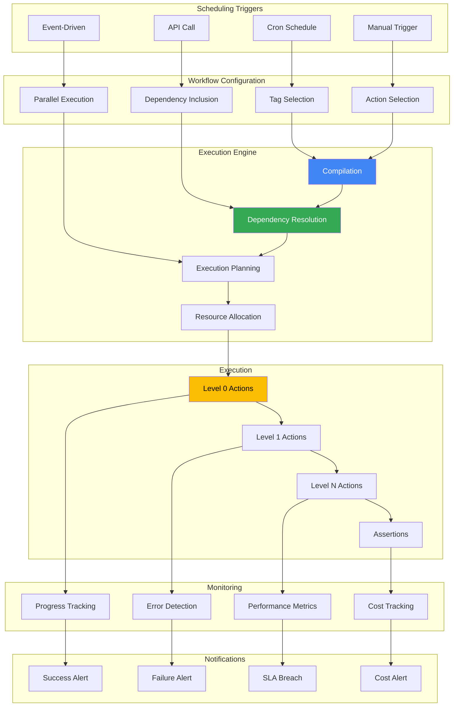
```mermaid
graph TB
    subgraph "Scheduling Triggers"
        T1[Cron Schedule]
        T2[Manual Trigger]
        T3[API Call]
        T4[Event-Driven]
    end

    subgraph "Workflow Configuration"
        WC1[Tag Selection]
        WC2[Action Selection]
        WC3[Dependency Inclusion]
        WC4[Parallel Execution]
    end

    subgraph "Execution Engine"
        EE1[Compilation]
        EE2[Dependency Resolution]
        EE3[Execution Planning]
        EE4[Resource Allocation]
    end

    subgraph "Execution"
        EX1[Level 0 Actions]
        EX2[Level 1 Actions]
        EX3[Level N Actions]
        EX4[Assertions]
    end

    subgraph "Monitoring"
        M1[Progress Tracking]
        M2[Error Detection]
        M3[Performance Metrics]
        M4[Cost Tracking]
    end

    subgraph "Notifications"
        N1[Success Alert]
        N2[Failure Alert]
        N3[SLA Breach]
        N4[Cost Alert]
    end

    T1 --> WC1
    T2 --> WC2
    T3 --> WC3
    T4 --> WC4

    WC1 --> EE1
    WC2 --> EE1
    WC3 --> EE2
    WC4 --> EE3

    EE1 --> EE2
    EE2 --> EE3
    EE3 --> EE4

    EE4 --> EX1
    EX1 --> EX2
    EX2 --> EX3
    EX3 --> EX4

    EX1 --> M1
    EX2 --> M2
    EX3 --> M3
    EX4 --> M4

    M1 --> N1
    M2 --> N2
    M3 --> N3
    M4 --> N4

    style EE1 fill:#4285f4,color:#fff
    style EE2 fill:#34a853,color:#fff
    style EX1 fill:#fbbc04,color:#000
```

## CI/CD Pipeline Integration

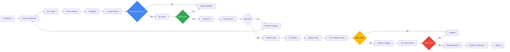
```mermaid
flowchart LR
    A[Developer] --> B[Local Development]
    B --> C[Git Commit]
    C --> D[Push to Branch]
    
    D --> E[CI Pipeline]
    E --> F[Compile Project]
    F --> G{Compilation Success?}
    
    G -->|No| H[Notify Developer]
    G -->|Yes| I[Run Tests]
    
    I --> J{Tests Pass?}
    J -->|No| H
    J -->|Yes| K[Create PR]
    
    K --> L[Code Review]
    L --> M{Approved?}
    
    M -->|No| N[Request Changes]
    N --> B
    M -->|Yes| O[Merge to Main]
    
    O --> P[CD Pipeline]
    P --> Q[Deploy to Dev]
    Q --> R[Run Integration Tests]
    
    R --> S{Tests Pass?}
    S -->|No| T[Rollback]
    S -->|Yes| U[Deploy to Staging]
    
    U --> V[Run Smoke Tests]
    V --> W{Tests Pass?}
    
    W -->|No| T
    W -->|Yes| X[Manual Approval]
    
    X --> Y[Deploy to Production]
    Y --> Z[Monitor]

    style G fill:#4285f4,color:#fff
    style J fill:#34a853,color:#fff
    style S fill:#fbbc04,color:#000
    style W fill:#ea4335,color:#fff
```

## Performance Optimization Flow

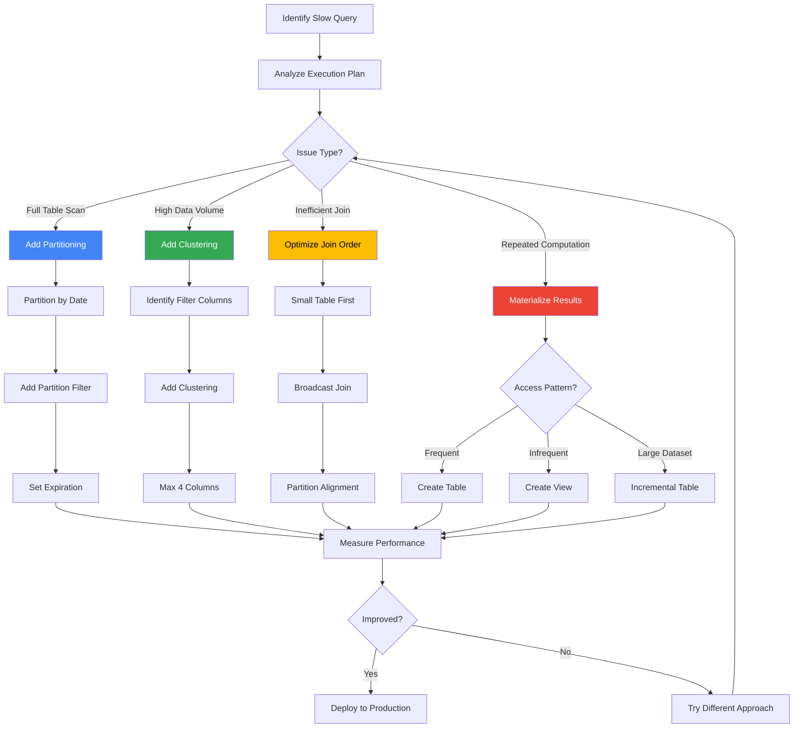
```mermaid
graph TD
    A[Identify Slow Query] --> B[Analyze Execution Plan]
    
    B --> C{Issue Type?}
    
    C -->|Full Table Scan| D[Add Partitioning]
    C -->|High Data Volume| E[Add Clustering]
    C -->|Inefficient Join| F[Optimize Join Order]
    C -->|Repeated Computation| G[Materialize Results]
    
    D --> H[Partition by Date]
    H --> I[Add Partition Filter]
    I --> J[Set Expiration]
    
    E --> K[Identify Filter Columns]
    K --> L[Add Clustering]
    L --> M[Max 4 Columns]
    
    F --> N[Small Table First]
    N --> O[Broadcast Join]
    O --> P[Partition Alignment]
    
    G --> Q{Access Pattern?}
    Q -->|Frequent| R[Create Table]
    Q -->|Infrequent| S[Create View]
    Q -->|Large Dataset| T[Incremental Table]
    
    J --> U[Measure Performance]
    M --> U
    P --> U
    R --> U
    S --> U
    T --> U
    
    U --> V{Improved?}
    V -->|Yes| W[Deploy to Production]
    V -->|No| X[Try Different Approach]
    X --> C

    style D fill:#4285f4,color:#fff
    style E fill:#34a853,color:#fff
    style F fill:#fbbc04,color:#000
    style G fill:#ea4335,color:#fff
```

## Real-Time Data Pipeline Architecture

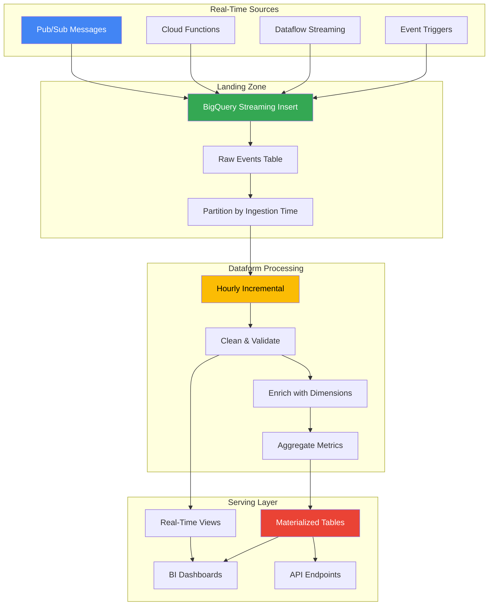
```mermaid
graph TB
    subgraph "Real-Time Sources"
        RT1[Pub/Sub Messages]
        RT2[Cloud Functions]
        RT3[Dataflow Streaming]
        RT4[Event Triggers]
    end

    subgraph "Landing Zone"
        LZ1[BigQuery Streaming Insert]
        LZ2[Raw Events Table]
        LZ3[Partition by Ingestion Time]
    end

    subgraph "Dataform Processing"
        DF1[Hourly Incremental]
        DF2[Clean & Validate]
        DF3[Enrich with Dimensions]
        DF4[Aggregate Metrics]
    end

    subgraph "Serving Layer"
        SL1[Real-Time Views]
        SL2[Materialized Tables]
        SL3[BI Dashboards]
        SL4[API Endpoints]
    end

    RT1 --> LZ1
    RT2 --> LZ1
    RT3 --> LZ1
    RT4 --> LZ1

    LZ1 --> LZ2
    LZ2 --> LZ3

    LZ3 --> DF1
    DF1 --> DF2
    DF2 --> DF3
    DF3 --> DF4

    DF2 --> SL1
    DF4 --> SL2
    SL1 --> SL3
    SL2 --> SL3
    SL2 --> SL4

    style RT1 fill:#4285f4,color:#fff
    style LZ1 fill:#34a853,color:#fff
    style DF1 fill:#fbbc04,color:#000
    style SL2 fill:#ea4335,color:#fff
```

## Data Quality Monitoring Dashboard

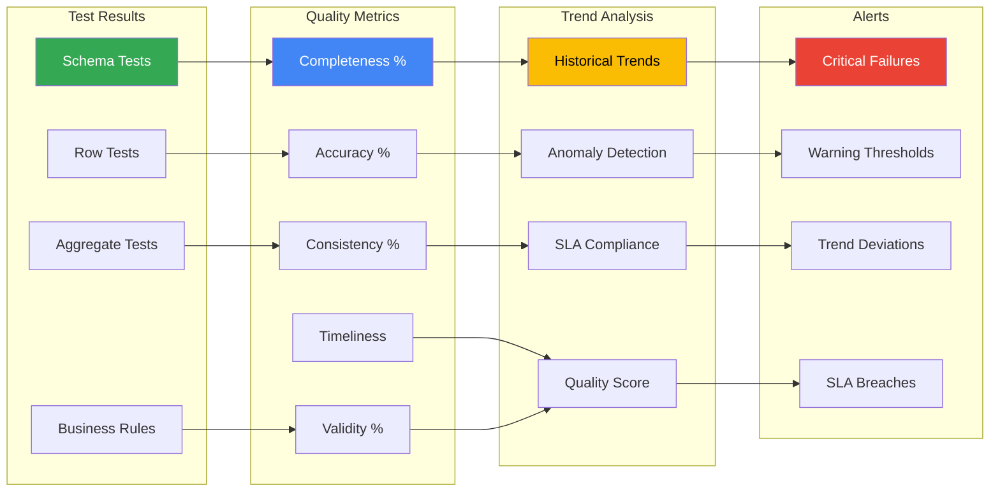
```mermaid
graph LR
    subgraph "Quality Metrics"
        QM1[Completeness %]
        QM2[Accuracy %]
        QM3[Consistency %]
        QM4[Timeliness]
        QM5[Validity %]
    end

    subgraph "Test Results"
        TR1[Schema Tests]
        TR2[Row Tests]
        TR3[Aggregate Tests]
        TR4[Business Rules]
    end

    subgraph "Trend Analysis"
        TA1[Historical Trends]
        TA2[Anomaly Detection]
        TA3[SLA Compliance]
        TA4[Quality Score]
    end

    subgraph "Alerts"
        AL1[Critical Failures]
        AL2[Warning Thresholds]
        AL3[Trend Deviations]
        AL4[SLA Breaches]
    end

    TR1 --> QM1
    TR2 --> QM2
    TR3 --> QM3
    TR4 --> QM5

    QM1 --> TA1
    QM2 --> TA2
    QM3 --> TA3
    QM4 --> TA4
    QM5 --> TA4

    TA1 --> AL1
    TA2 --> AL2
    TA3 --> AL3
    TA4 --> AL4

    style QM1 fill:#4285f4,color:#fff
    style TR1 fill:#34a853,color:#fff
    style TA1 fill:#fbbc04,color:#000
    style AL1 fill:#ea4335,color:#fff
```

## Multi-Environment Deployment

```mermaid
graph TB
    subgraph "Development"
        DEV1[Dev Repository]
        DEV2[Feature Branches]
        DEV3[Local Testing]
        DEV4[Dev BigQuery]
    end

    subgraph "Staging"
        STG1[Staging Repository]
        STG2[Main Branch]
        STG3[Integration Tests]
        STG4[Staging BigQuery]
    end

    subgraph "Production"
        PRD1[Prod Repository]
        PRD2[Release Tags]
        PRD3[Smoke Tests]
        PRD4[Prod BigQuery]
    end

    subgraph "Configuration"
        CFG1[workflow_settings.yaml]
        CFG2[Environment Variables]
        CFG3[Dataset Mapping]
        CFG4[Schedule Config]
    end

    DEV1 --> DEV2
    DEV2 --> DEV3
    DEV3 --> DEV4

    DEV4 --> STG1
    STG1 --> STG2
    STG2 --> STG3
    STG3 --> STG4

    STG4 --> PRD1
    PRD1 --> PRD2
    PRD2 --> PRD3
    PRD3 --> PRD4

    CFG1 --> DEV4
    CFG2 --> STG4
    CFG3 --> PRD4
    CFG4 --> PRD4

    style DEV4 fill:#4285f4,color:#fff
    style STG4 fill:#34a853,color:#fff
    style PRD4 fill:#fbbc04,color:#000
```

## Cost Analysis Dashboard

```mermaid
graph TB
    subgraph "Cost Metrics"
        CM1[Storage Costs]
        CM2[Query Costs]
        CM3[Streaming Costs]
        CM4[Total Costs]
    end

    subgraph "Usage Metrics"
        UM1[Data Scanned TB]
        UM2[Slot Hours]
        UM3[Storage GB]
        UM4[Query Count]
    end

    subgraph "Optimization Opportunities"
        OO1[Partition Candidates]
        OO2[Cluster Candidates]
        OO3[Incremental Candidates]
        OO4[View Candidates]
    end

    subgraph "Savings Potential"
        SP1[Estimated Savings]
        SP2[ROI Analysis]
        SP3[Implementation Effort]
        SP4[Priority Ranking]
    end

    UM1 --> CM2
    UM2 --> CM2
    UM3 --> CM1
    UM4 --> CM2

    CM1 --> CM4
    CM2 --> CM4
    CM3 --> CM4

    CM4 --> OO1
    CM4 --> OO2
    CM4 --> OO3
    CM4 --> OO4

    OO1 --> SP1
    OO2 --> SP1
    OO3 --> SP1
    OO4 --> SP1

    SP1 --> SP2
    SP2 --> SP3
    SP3 --> SP4

    style CM4 fill:#4285f4,color:#fff
    style OO1 fill:#34a853,color:#fff
    style SP1 fill:#fbbc04,color:#000
```

## Dataform Ecosystem Integration

```mermaid
graph TB
    subgraph "Version Control"
        VC1[GitHub]
        VC2[GitLab]
        VC3[Bitbucket]
        VC4[Cloud Source Repos]
    end

    subgraph "Dataform Core"
        DC1[Repository]
        DC2[Compilation]
        DC3[Execution]
        DC4[Monitoring]
    end

    subgraph "BigQuery Ecosystem"
        BQ1[BigQuery Tables]
        BQ2[BigQuery ML]
        BQ3[BigLake]
        BQ4[Dataplex]
    end

    subgraph "Orchestration"
        OR1[Cloud Scheduler]
        OR2[Cloud Composer]
        OR3[Workflows]
        OR4[Cloud Functions]
    end

    subgraph "Monitoring & Observability"
        MO1[Cloud Logging]
        MO2[Cloud Monitoring]
        MO3[Error Reporting]
        MO4[Cloud Trace]
    end

    subgraph "BI & Analytics"
        BI1[Looker]
        BI2[Data Studio]
        BI3[Tableau]
        BI4[Power BI]
    end

    VC1 --> DC1
    VC2 --> DC1
    VC3 --> DC1
    VC4 --> DC1

    DC1 --> DC2
    DC2 --> DC3
    DC3 --> DC4

    DC3 --> BQ1
    BQ1 --> BQ2
    BQ1 --> BQ3
    BQ1 --> BQ4

    OR1 --> DC3
    OR2 --> DC3
    OR3 --> DC3
    OR4 --> DC3

    DC4 --> MO1
    DC4 --> MO2
    DC4 --> MO3
    DC4 --> MO4

    BQ1 --> BI1
    BQ1 --> BI2
    BQ1 --> BI3
    BQ1 --> BI4

    style DC1 fill:#4285f4,color:#fff
    style BQ1 fill:#34a853,color:#fff
    style BI1 fill:#fbbc04,color:#000
```

## Learning Path: Beginner to Advanced

```mermaid
journey
    title Dataform Learning Journey
    section Beginner
      Understand SQLX basics: 5: Learner
      Create first table: 4: Learner
      Use ref() function: 5: Learner
      Write simple assertions: 4: Learner
    section Intermediate
      Implement incremental tables: 3: Practitioner
      Create reusable includes: 4: Practitioner
      Build data quality tests: 3: Practitioner
      Organize project structure: 4: Practitioner
    section Advanced
      Design medallion architecture: 2: Expert
      Implement SCD Type 2: 3: Expert
      Optimize for performance: 4: Expert
      Build CI/CD pipeline: 3: Expert
    section Architect
      Multi-environment setup: 4: Architect
      Cost optimization strategy: 5: Architect
      Enterprise governance: 4: Architect
      Team collaboration: 5: Architect
```

## Feature Comparison Matrix

```mermaid
graph TB
    subgraph "Dataform Features"
        F1[SQLX Language]
        F2[Dependency Management]
        F3[Incremental Tables]
        F4[Data Quality Tests]
        F5[Version Control]
        F6[Scheduling]
        F7[BigQuery Native]
        F8[JavaScript Includes]
    end

    subgraph "Maturity Levels"
        M1[Beginner Friendly]
        M2[Intermediate Required]
        M3[Advanced Expertise]
    end

    F1 --> M1
    F2 --> M1
    F5 --> M1

    F3 --> M2
    F4 --> M2
    F6 --> M2
    F8 --> M2

    F7 --> M3

    style M1 fill:#34a853,color:#fff
    style M2 fill:#fbbc04,color:#000
    style M3 fill:#ea4335,color:#fff
```

---

## Summary

This visual guide provides comprehensive diagrams covering:

✅ **Architecture & Structure** - Overall system design and project organization  
✅ **Data Flow** - Medallion architecture and data lineage  
✅ **Processing Patterns** - Incremental, SCD, and batch processing  
✅ **Quality & Testing** - Multi-layered testing framework  
✅ **Performance** - Optimization strategies and cost management  
✅ **Operations** - Scheduling, monitoring, and CI/CD  
✅ **Integration** - Ecosystem connections and tooling  
✅ **Learning Path** - Progression from beginner to architect  

These visualizations help understand Dataform from multiple perspectives, making complex concepts accessible to learners at all levels.
