# Dataflow Visual Architecture and Diagrams

## Pipeline Execution Architecture

### Core Dataflow Architecture

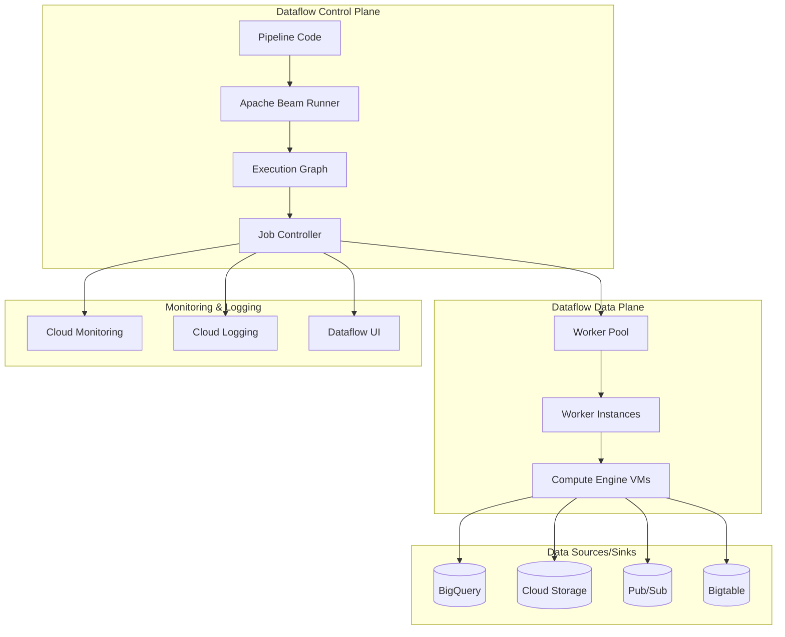

### Pipeline Lifecycle

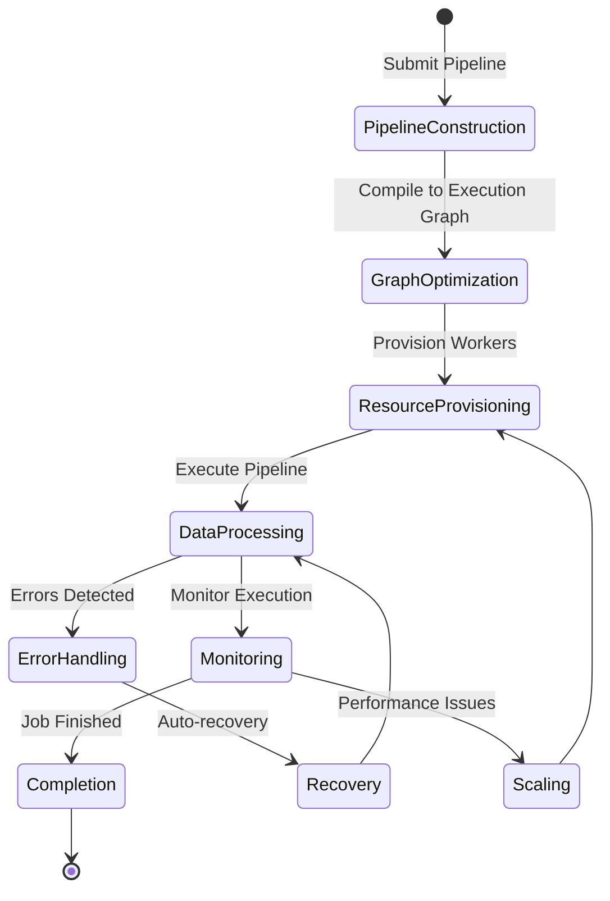

## Data Processing Patterns

### Batch Processing Pipeline

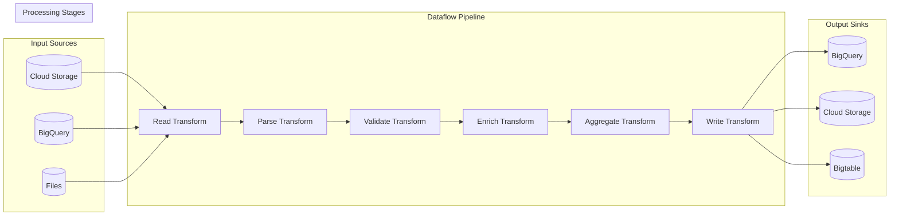

### Streaming Processing Pipeline

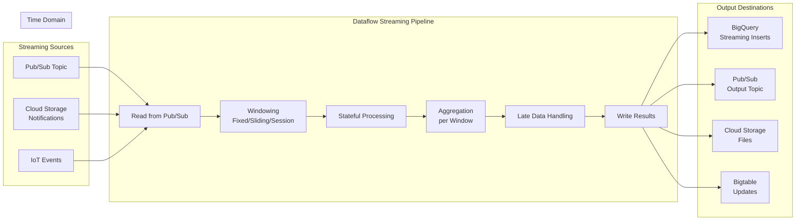

## Windowing Concepts

### Windowing Types

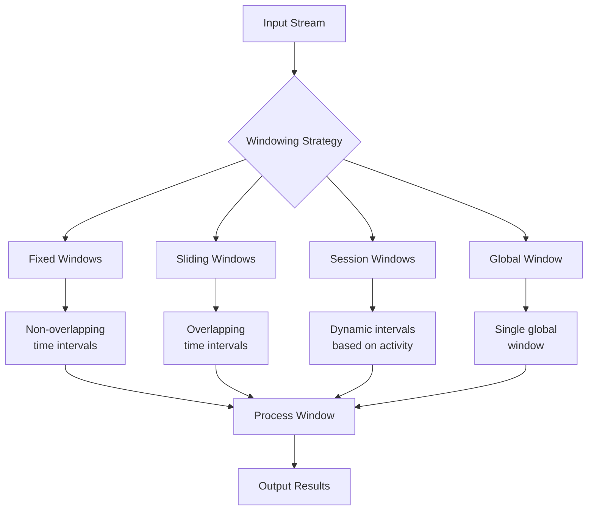

### Event Time vs Processing Time

```mermaid
timeline
    title Event Time vs Processing Time Windows

    section Event Time
        10:00 - 11:00 : Window 1
        11:00 - 12:00 : Window 2
        12:00 - 13:00 : Window 3

    section Processing Time
        10:05 - 11:05 : Window 1
        11:05 - 12:05 : Window 2
        12:05 - 13:05 : Window 3

    section Data Arrival
        10:30 : Event A (timestamp 10:15)
        10:45 : Event B (timestamp 10:20)
        11:15 : Event C (timestamp 10:45)
        11:30 : Event D (timestamp 11:10)
```

## State and Timers

### Stateful Processing Architecture

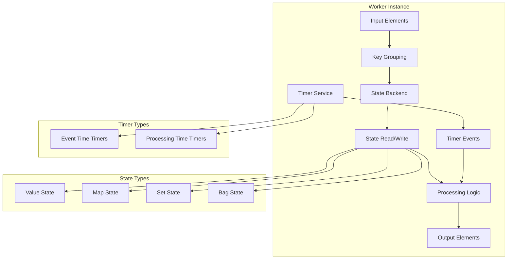

### Timer Lifecycle

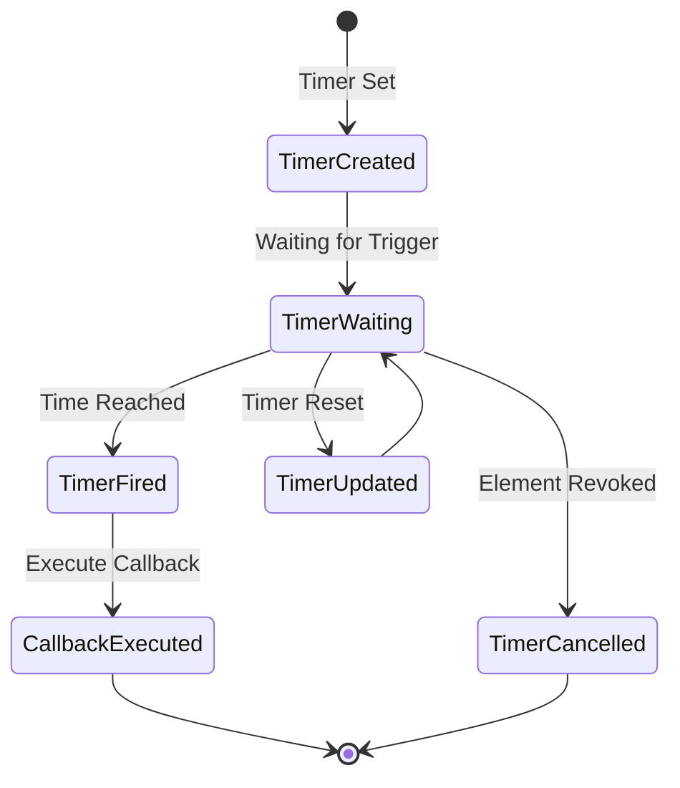

## Dataflow Runner Architecture

### Execution Graph Optimization

```mermaid
graph LR
    subgraph "Pipeline Definition"
        A[Beam Pipeline] --> B[Transform Graph]
    end

    subgraph "Optimization Phase"
        B --> C[Fusion Optimization]
        C --> D[Combine Optimization]
        D --> E[Shuffle Optimization]
    end

    subgraph "Execution Planning"
        E --> F[Stage Creation]
        F --> G[Parallelism Analysis]
        G --> H[Resource Allocation]
    end

    subgraph "Runtime Execution"
        H --> I[Worker Assignment]
        I --> J[Task Execution]
        J --> K[Result Aggregation]
    end

    K --> L[Final Output]
```

### Worker Architecture

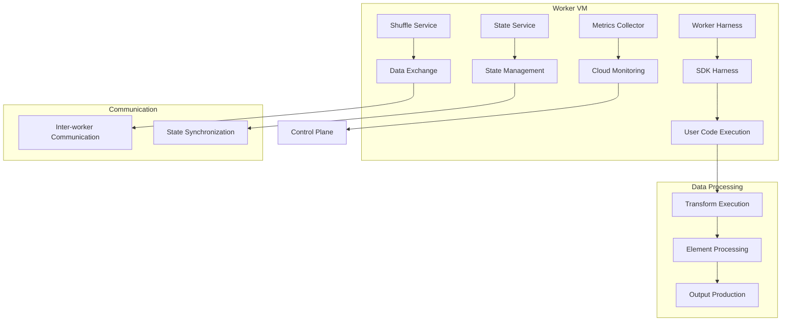

## Integration Patterns

### BigQuery Integration

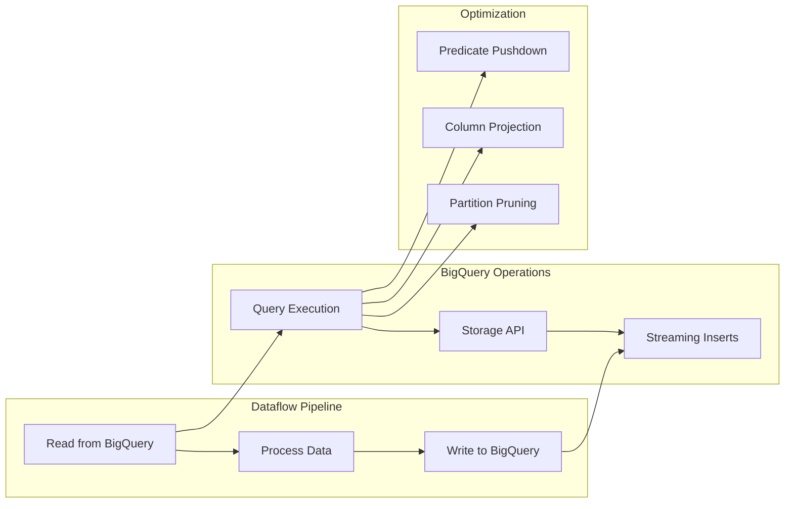

### Pub/Sub Integration

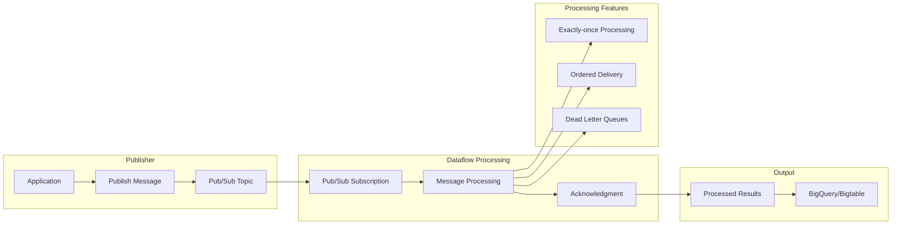

## Error Handling and Reliability

### Error Handling Architecture

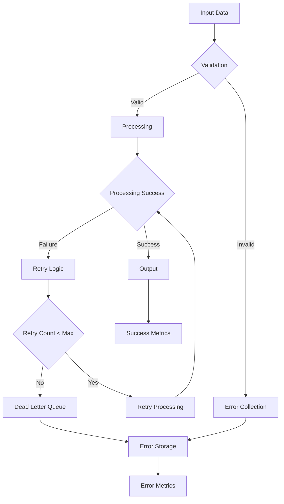

### Fault Tolerance Mechanisms

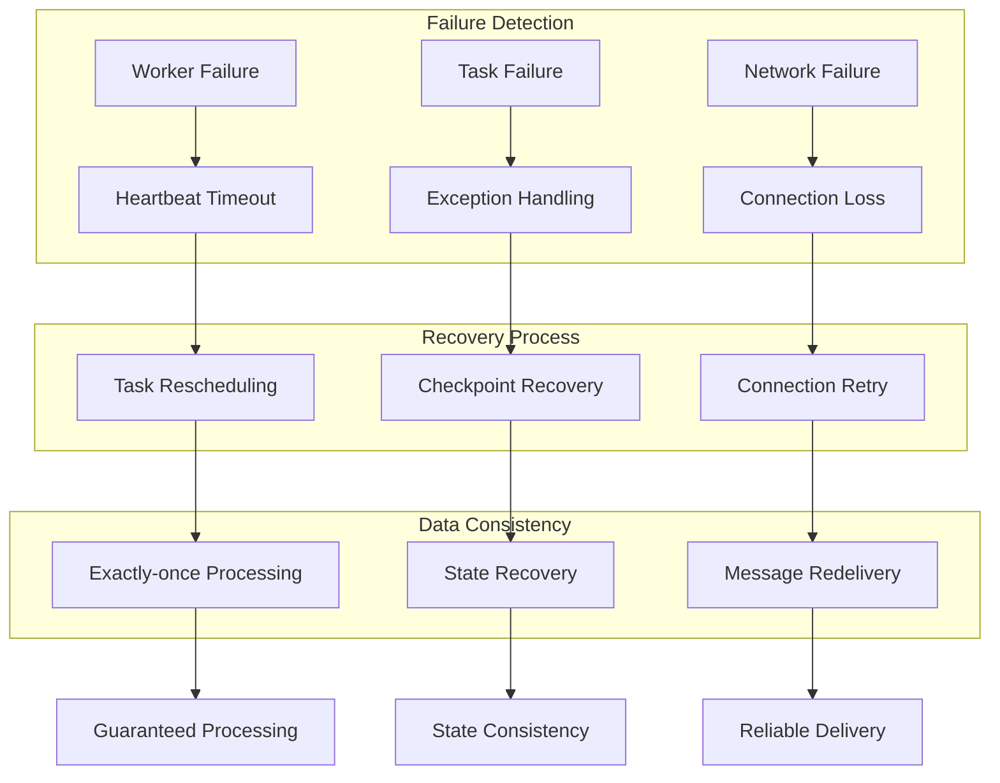

## Autoscaling and Resource Management

### Autoscaling Architecture

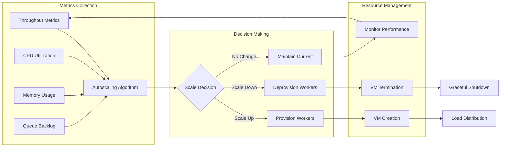

### Resource Allocation Strategy

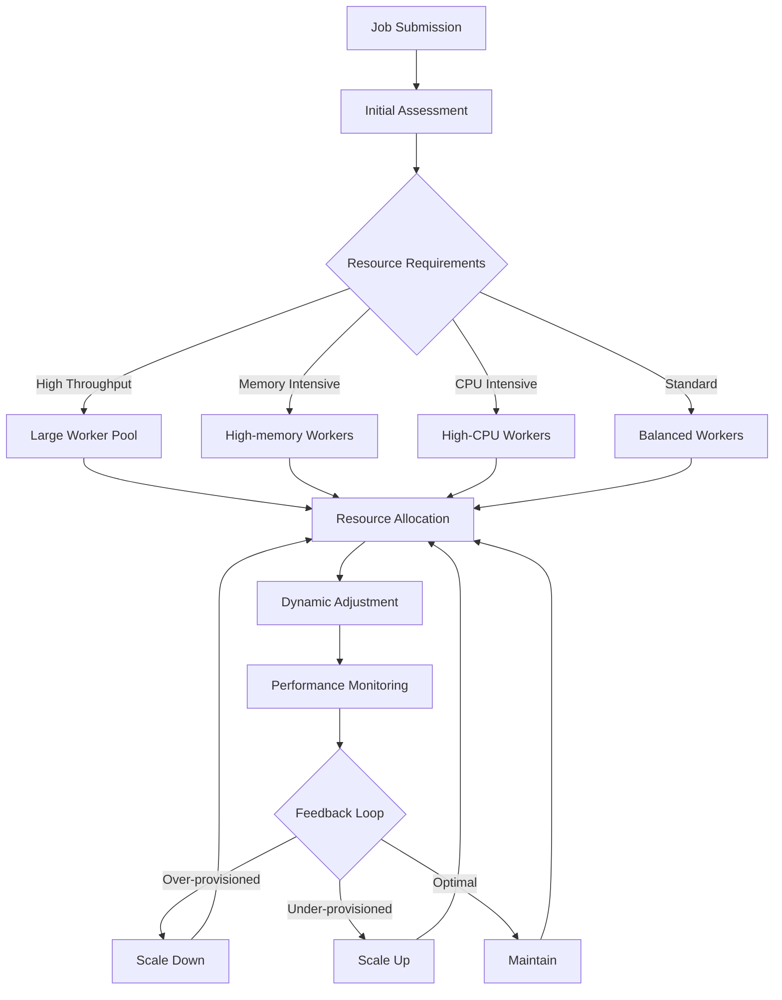

## Performance Monitoring

### Pipeline Performance Dashboard

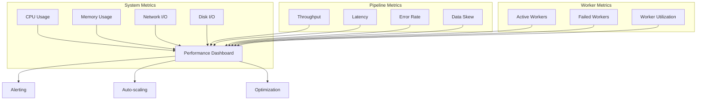

### Data Skew Visualization

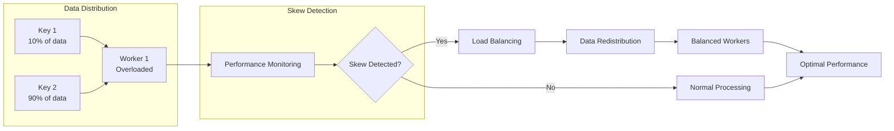

## Security Architecture

### Data Security Flow

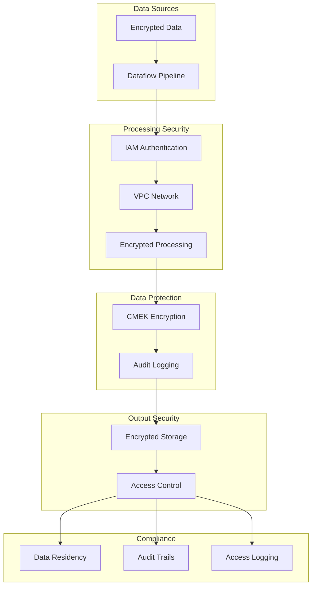

### Network Security

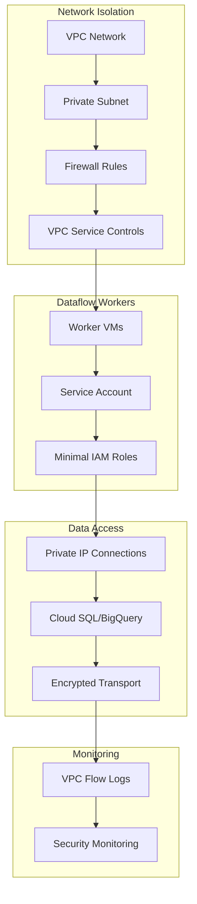

## Cost Optimization

### Cost Monitoring Architecture

```mermaid
graph TB
    subgraph "Resource Tracking"
        A[VM Hours] --> D[Cost Analysis]
        B[Storage Usage] --> D
        C[Network Transfer] --> D
        E[Data Processing] --> D
    end

    subgraph "Optimization Engine"
        D --> F[Usage Patterns]
        F --> G[Recommendations]
        G --> H[Auto-optimization]
    end

    subgraph "Cost Controls"
        H --> I[Resource Limits]
        I --> J[Budget Alerts]
        J --> K[Scaling Policies]
    end

    K --> L[Cost Optimization]
    L --> M[Reduced Expenses]
```

### Resource Efficiency Metrics

```mermaid
graph LR
    subgraph "Efficiency Metrics"
        A[CPU Utilization %] --> D[Efficiency Dashboard]
        B[Memory Utilization %] --> D
        C[Processing Throughput] --> D
        E[Cost per GB] --> D
    end

    subgraph "Optimization Actions"
        D --> F[Right-sizing]
        D --> G[Autoscaling Tuning]
        D --> H[Pipeline Optimization]
    end

    F --> I[Cost Reduction]
    G --> I
    H --> I

    I --> J[Optimal Performance]
```

## Deployment Patterns

### CI/CD Integration

```mermaid
graph LR
    subgraph "Development"
        A[Code Repository] --> B[Build Pipeline]
        B --> C[Unit Tests]
        C --> D[Integration Tests]
    end

    subgraph "Deployment"
        D --> E[Artifact Creation]
        E --> F[Staging Deployment]
        F --> G[Production Deployment]
    end

    subgraph "Monitoring"
        G --> H[Performance Monitoring]
        H --> I[Alerting]
        I --> J[Rollback]
    end

    J --> K[Stable Deployment]
```

### Multi-environment Setup

```mermaid
graph TD
    A[Development] --> B[Code Changes]
    B --> C[Unit Tests]
    C --> D[Dev Deployment]

    D --> E[Integration Tests]
    E --> F[Staging Deployment]

    F --> G[Load Tests]
    G --> H[Performance Validation]
    H --> I[Production Deployment]

    I --> J[Monitoring]
    J --> K[Feedback Loop]

    K -->|Issues| L[Rollback]
    K -->|Success| M[Stable Release]

    L --> F
    M --> A
```

## Migration Patterns

### From Legacy ETL

```mermaid
graph LR
    subgraph "Legacy System"
        A[ETL Jobs] --> B[Data Warehouse]
        C[Custom Scripts] --> B
        D[Cron Jobs] --> B
    end

    subgraph "Migration Path"
        B --> E[Dataflow Pipeline]
        E --> F[Unified Processing]
        F --> G[Cloud-native Architecture]
    end

    subgraph "Benefits"
        G --> H[Scalability]
        G --> I[Reliability]
        G --> J[Cost Efficiency]
        G --> K[Maintainability]
    end
```

### Hybrid Cloud Integration

```mermaid
graph TB
    subgraph "On-premises"
        A[Legacy Systems] --> B[Data Export]
        B --> C[Secure Transfer]
    end

    subgraph "Cloud Processing"
        C --> D[Data Ingestion]
        D --> E[Dataflow Pipeline]
        E --> F[Processing & Analytics]
    end

    subgraph "Hybrid Features"
        F --> G[VPN/Interconnect]
        G --> H[Private Connectivity]
        H --> I[Secure Data Flow]
    end

    I --> J[Unified Analytics]
```

## Advanced Patterns

### Machine Learning Pipelines

```mermaid
graph LR
    subgraph "Data Preparation"
        A[Raw Data] --> B[Data Validation]
        B --> C[Feature Engineering]
        C --> D[Data Splitting]
    end

    subgraph "ML Pipeline"
        D --> E[Training Data]
        E --> F[Model Training]
        F --> G[Model Evaluation]
        G --> H[Model Deployment]
    end

    subgraph "Inference"
        I[New Data] --> J[Feature Processing]
        J --> K[Model Prediction]
        K --> L[Results Storage]
    end

    H --> K
```

### Real-time Analytics

```mermaid
graph LR
    subgraph "Event Stream"
        A[User Events] --> B[Event Ingestion]
        B --> C[Stream Processing]
    end

    subgraph "Real-time Analytics"
        C --> D[Windowed Aggregation]
        D --> E[Pattern Detection]
        E --> F[Anomaly Detection]
    end

    subgraph "Actions"
        F --> G[Real-time Alerts]
        G --> H[Automated Responses]
        H --> I[Dashboard Updates]
    end

    I --> J[Business Insights]
```

### IoT Data Processing

```mermaid
graph LR
    subgraph "IoT Devices"
        A[Sensors] --> B[MQTT/HTTP]
        B --> C[Cloud IoT Core]
    end

    subgraph "Stream Processing"
        C --> D[Pub/Sub]
        D --> E[Dataflow Pipeline]
        E --> F[Real-time Processing]
    end

    subgraph "Analytics & Storage"
        F --> G[Time-series Analysis]
        G --> H[BigQuery]
        H --> I[Real-time Dashboards]
        I --> J[ML Predictions]
    end

    J --> K[Automated Actions]
```

## Troubleshooting Diagrams

### Common Issues Resolution

```mermaid
flowchart TD
    A[Pipeline Issue] --> B{What type of issue?}

    B -->|Performance| C[Check worker utilization]
    B -->|Errors| D[Check error logs]
    B -->|Data| E[Check data skew]
    B -->|Resources| F[Check resource limits]

    C --> G[Scale workers]
    D --> H[Fix code errors]
    E --> I[Rebalance data]
    F --> J[Increase limits]

    G --> K[Monitor improvement]
    H --> K
    I --> K
    J --> K

    K --> L{Issue resolved?}
    L -->|Yes| M[Pipeline stable]
    L -->|No| N[Escalate to support]
```

### Performance Troubleshooting

```mermaid
graph TD
    A[Slow Pipeline] --> B[Check Metrics]

    B --> C{CPU High?}
    C -->|Yes| D[Optimize code]
    C -->|No| E{Memory High?}

    E -->|Yes| F[Increase memory]
    E -->|No| G{Network High?}

    G -->|Yes| H[Optimize shuffling]
    G -->|No| I{Disk I/O High?}

    I -->|Yes| J[Use SSD storage]
    I -->|No| K[Check parallelism]

    D --> L[Test optimization]
    F --> L
    H --> L
    J --> L
    K --> L

    L --> M{Performance improved?}
    M -->|Yes| N[Deploy optimized pipeline]
    M -->|No| O[Deep dive analysis]
```

This comprehensive visual architecture covers the key aspects of Google Cloud Dataflow, including pipeline execution, data processing patterns, windowing concepts, state management, integration patterns, error handling, performance monitoring, security, and cost optimization. The diagrams provide a clear understanding of how Dataflow processes data at scale while maintaining reliability and efficiency.
