# Cloud Firestore Visual Guide

## Firestore Data Model Architecture

```mermaid
graph TD
    subgraph "Firestore Database"
        DB[Firestore Database<br/>NoSQL Document Database]
    end

    subgraph "Collections & Documents"
        USERS[Collection: users<br/>Container for user documents]
        POSTS[Collection: posts<br/>Container for post documents]

        USER_DOC[Document: user123<br/>JSON-like object]
        POST_DOC[Document: post456<br/>JSON-like object]

        USER_DATA[User Data<br/>name, email, created_at]
        POST_DATA[Post Data<br/>title, content, tags]

        SUBCOLLECTION[Subcollection: comments<br/>Nested in post document]
        COMMENT_DOC[Document: comment789<br/>Comment data]
    end

    subgraph "Document Structure"
        FIELDS[Fields<br/>Key-Value Pairs]
        ARRAYS[Arrays<br/>[item1, item2, item3]]
        MAPS[Maps<br/>{key1: value1, key2: value2}]
        REFERENCES[References<br/>Document pointers]
        TIMESTAMPS[Timestamps<br/>Server/Client timestamps]
        GEOPOINTS[Geopoints<br/>Latitude/Longitude]
    end

    DB --> USERS
    DB --> POSTS

    USERS --> USER_DOC
    POSTS --> POST_DOC

    USER_DOC --> USER_DATA
    POST_DOC --> POST_DATA

    POST_DOC --> SUBCOLLECTION
    SUBCOLLECTION --> COMMENT_DOC

    USER_DOC --> FIELDS
    POST_DOC --> ARRAYS
    USER_DOC --> MAPS
    POST_DOC --> REFERENCES
    USER_DOC --> TIMESTAMPS
    POST_DOC --> GEOPOINTS

    style DB fill:#2196f3
    style USERS fill:#ffb74d
    style USER_DOC fill:#4caf50
    style FIELDS fill:#ba68c8
```

## Real-Time Synchronization Flow

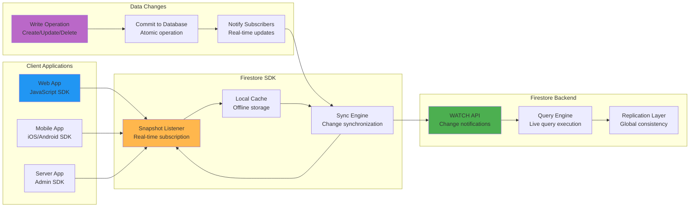

## Offline Support and Conflict Resolution

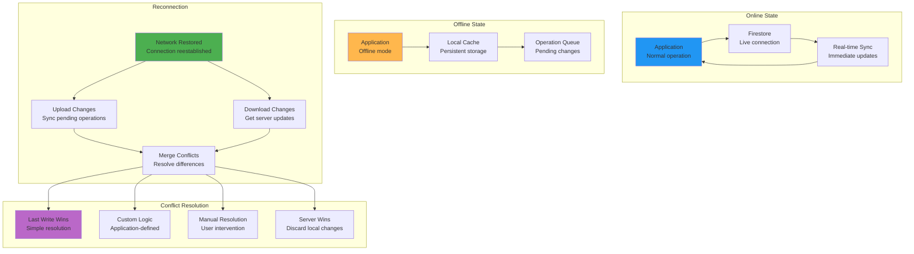

## Security Rules Architecture

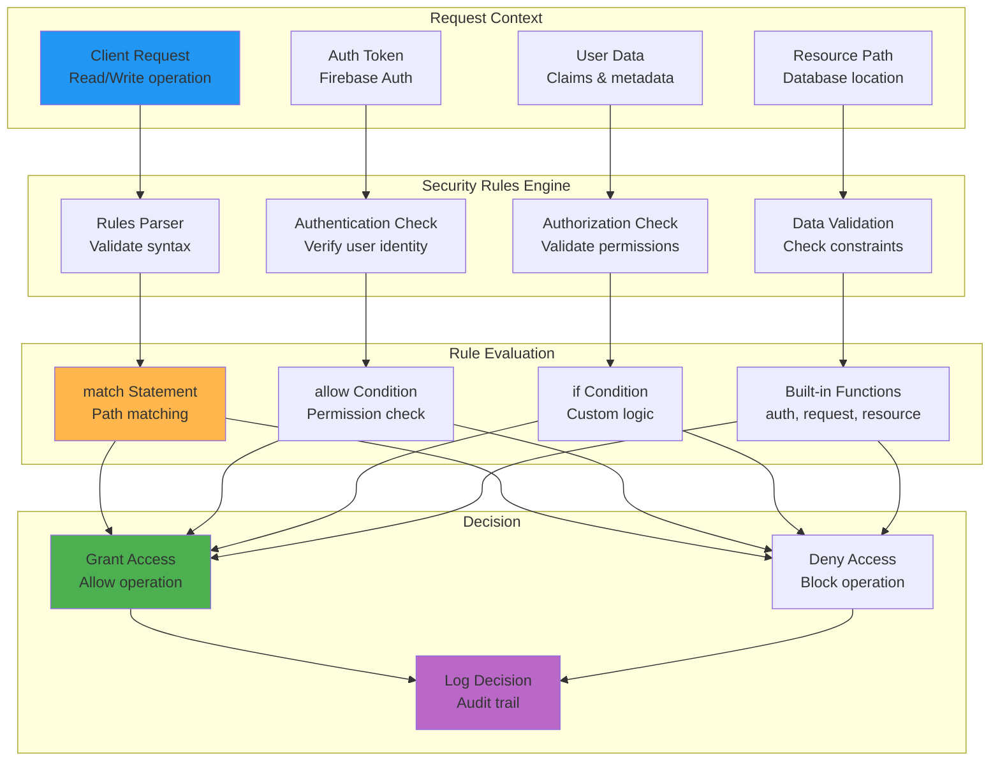

## Query Execution and Indexing

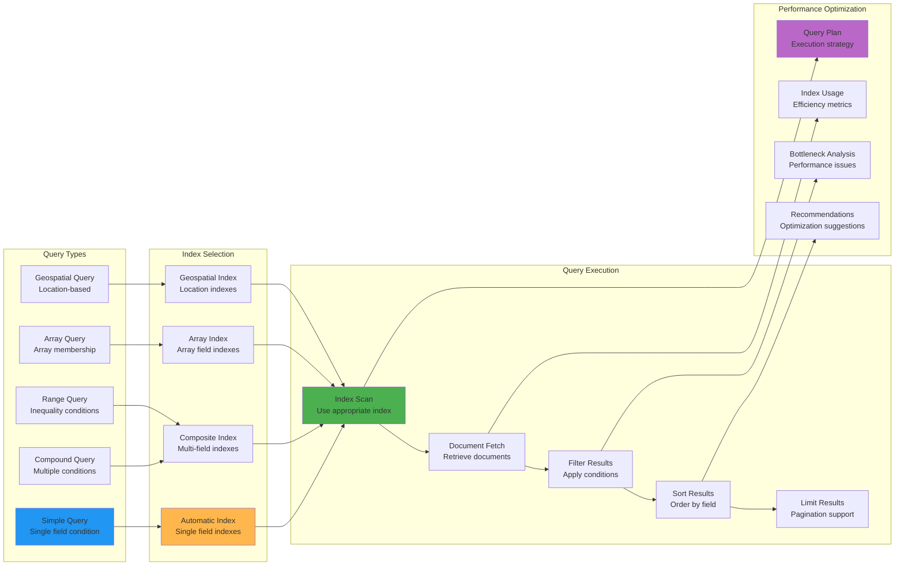

## Multi-Region Replication

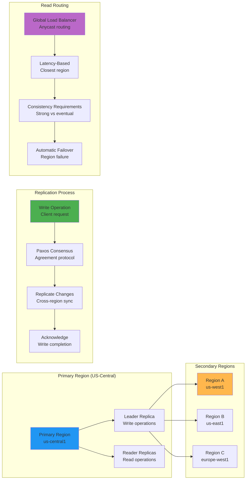

## Firebase Integration Ecosystem

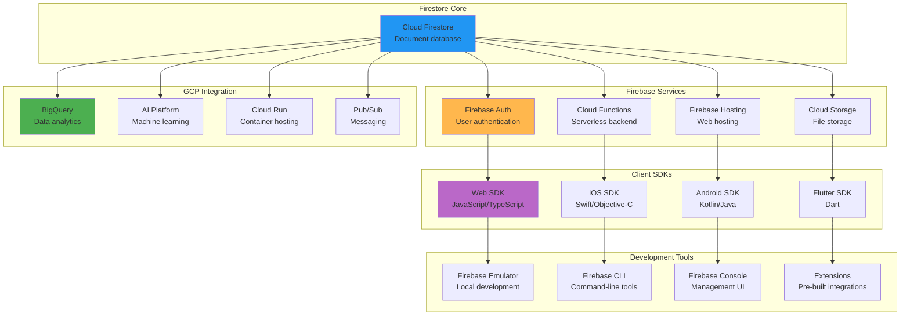

## Performance Monitoring Dashboard

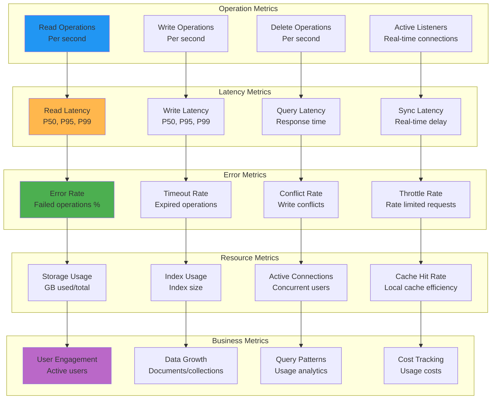

## Cost Optimization Strategies

```mermaid
graph TD
    A[Firestore Cost Optimization] --> B[Read Operations]
    A --> C[Write Operations]
    A --> D[Storage Costs]
    A --> E[Network Costs]

    B --> B1[Use listeners efficiently<br/>Unsubscribe when not needed]
    B --> B2[Implement pagination<br/>Limit result sets]
    B --> B3[Cache frequently accessed data<br/>Reduce repeated reads]
    B --> B4[Use collection group queries<br/>Optimize hierarchical queries]

    C --> C1[Batch multiple writes<br/>Reduce operation count]
    C --> C2[Use transactions wisely<br/>Minimize transaction scope]
    C --> C3[Optimize document structure<br/>Reduce field updates]
    C --> C4[Implement offline queuing<br/>Batch offline changes]

    D --> D1[Remove unused indexes<br/>Delete unnecessary indexes]
    D --> D2[Compress large documents<br/>Optimize document size]
    D --> D3[Archive old data<br/>Move to BigQuery]
    D --> D4[Use subcollections appropriately<br/>Balance hierarchy depth]

    E --> E1[Minimize data transfer<br/>Optimize query results]
    E --> E2[Use regional instances<br/>Reduce cross-region traffic]
    E --> E3[Compress client data<br/>Reduce payload size]
    E --> E4[Implement caching<br/>Reduce network requests]

    style A fill:#2196f3
    style B fill:#ffb74d
    style C fill:#4caf50
    style D fill:#ba68c8
    style E fill:#2196f3
```

## Data Modeling Patterns

```mermaid
graph TD
    subgraph "One-to-Many Relationships"
        ONE_TO_MANY[One-to-Many<br/>User → Posts]
        SUBCOLLECTION[Subcollection Pattern<br/>posts in user document]
        ARRAY_FIELD[Array Field Pattern<br/>post_ids in user document]
        REFERENCE_FIELD[Reference Field Pattern<br/>post references in user]
    end

    subgraph "Many-to-Many Relationships"
        MANY_TO_MANY[Many-to-Many<br/>Users ↔ Groups]
        JUNCTION_COLLECTION[Junction Collection<br/>user_groups collection]
        ARRAY_REFERENCES[Array References<br/>user_ids in groups]
        DENORMALIZATION[Denormalization<br/>Duplicate data]
    end

    subgraph "Hierarchical Data"
        HIERARCHY[Hierarchical Data<br/>Organization structure]
        ANCESTOR_QUERIES[Ancestor Queries<br/>Parent-child relationships]
        COLLECTION_GROUPS[Collection Groups<br/>Cross-document queries]
        MATERIALIZED_PATHS[Materialized Paths<br/>Path-based queries]
    end

    subgraph "Time Series Data"
        TIME_SERIES[Time Series<br/>Sensor readings]
        DAILY_COLLECTIONS[Daily Collections<br/>Partition by date]
        ROLLUP_DOCUMENTS[Rollup Documents<br/>Aggregated data]
        TTL_POLICIES[TTL Policies<br/>Automatic cleanup]
    end

    ONE_TO_MANY --> SUBCOLLECTION
    ONE_TO_MANY --> ARRAY_FIELD
    ONE_TO_MANY --> REFERENCE_FIELD

    MANY_TO_MANY --> JUNCTION_COLLECTION
    MANY_TO_MANY --> ARRAY_REFERENCES
    MANY_TO_MANY --> DENORMALIZATION

    HIERARCHY --> ANCESTOR_QUERIES
    HIERARCHY --> COLLECTION_GROUPS
    HIERARCHY --> MATERIALIZED_PATHS

    TIME_SERIES --> DAILY_COLLECTIONS
    TIME_SERIES --> ROLLUP_DOCUMENTS
    TIME_SERIES --> TTL_POLICIES

    style ONE_TO_MANY fill:#2196f3
    style MANY_TO_MANY fill:#ffb74d
    style HIERARCHY fill:#4caf50
    style TIME_SERIES fill:#ba68c8
```

## Backup and Export Architecture

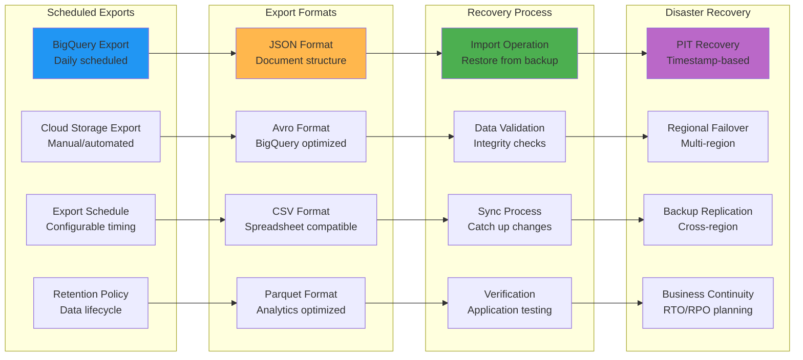

## Client-Server Synchronization

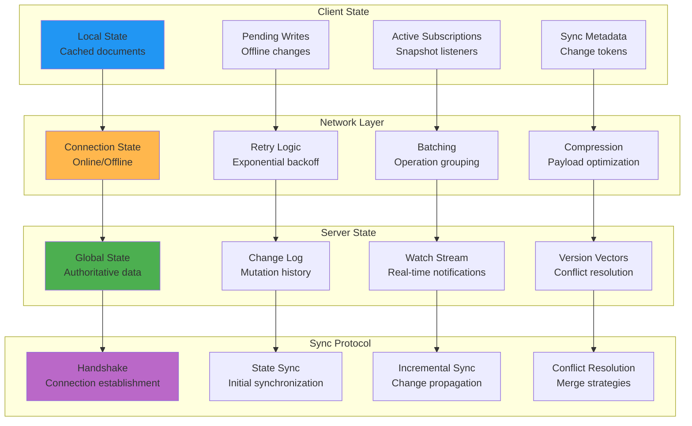

This visual guide illustrates Cloud Firestore's document-based architecture, real-time capabilities, offline support, and comprehensive integration with the Firebase and Google Cloud ecosystems, highlighting its role as a modern NoSQL database for web and mobile applications.
