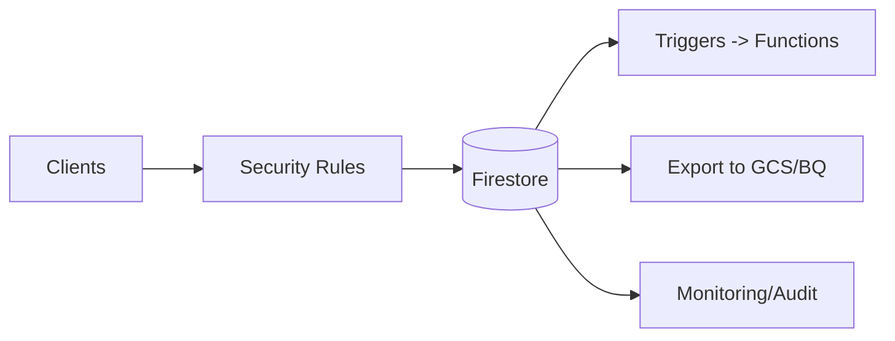

# Firestore Guide – Basic → Architect

## Level 1 – Launch & Basics

### 1. Quick Setup
```bash
gcloud config set project <PROJECT_ID>
gcloud firestore databases create --region=us-central1
```

### 2. Core Concepts
- Document/collection model; hierarchical; automatic indexes
- Two modes: Native (recommended) vs Datastore mode
- Strong vs eventual consistency (single-document strong)

### 3. Basic Ops (Node)
```js
import {Firestore} from '@google-cloud/firestore';
const db = new Firestore();
await db.collection('users').doc('1').set({name: 'alice'});
const snap = await db.collection('users').get();
```

## Level 2 – Production Patterns

### Data Modeling
- Flatten where possible; avoid deep nesting; favor subcollections for fan-out
- Bounded collections for hot paths; sharding via random IDs
- Use queries that hit composite indexes intentionally

### Performance & Cost
- Control reads: use `select()`, cursors, limit; avoid unbounded listeners
- TTL policies for ephemeral data; export to GCS for backup/ETL
- Index hygiene: remove unused composite indexes

### Security
- Firebase/Firestore security rules; principle of least privilege
- Use App Check where applicable; server-side SDKs for privileged ops

## Level 3 – Architect Playbook

### Reliability & DR
- Multi-region for HA; understand consistency tradeoffs
- Backups via exports to GCS; schedule regular exports

### Observability & Governance
- Monitor read/write/delete/list counts and latency
- Audit logs; rules versioning; staged rollout of rules

### Integrations
- Cloud Functions triggers; event-driven patterns
- BI/analytics via exports to BQ

## Ops Cheat Sheet

| Task | Command | Note |
| --- | --- | --- |
| Export | `gcloud firestore export gs://bucket/prefix` | backup |
| Import | `gcloud firestore import gs://bucket/prefix` | restore |
| Indexes | console / index config | manage |
| Rules | deploy rules via CI | version |

## Architecture Patterns



## Checklist Before Production
- [ ] Rules least privilege; tested; versioned
- [ ] Data model sharded for hot paths; indexes intentional
- [ ] Backups/exports scheduled; DR plan
- [ ] Monitoring on read/write costs, latency; audit logs enabled
- [ ] App Check where applicable; server SDK for admin actions

