# Google Kubernetes Engine (GKE) Visual Guide

## GKE Architecture Overview

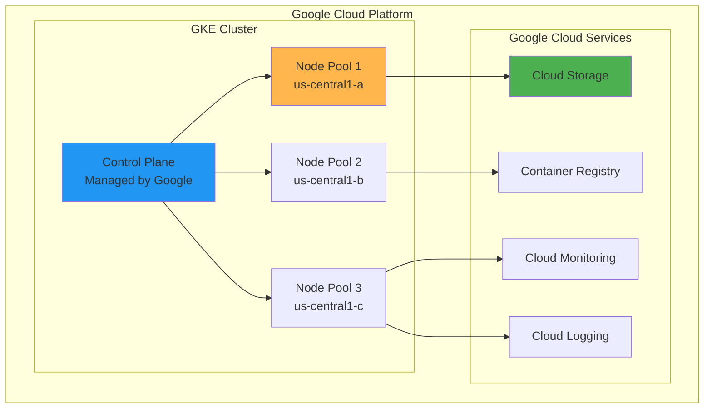

## Cluster Types Comparison

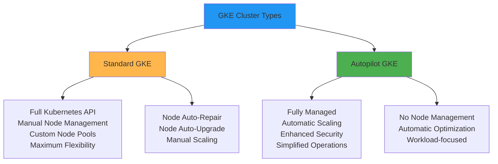

## Node Pool Architecture

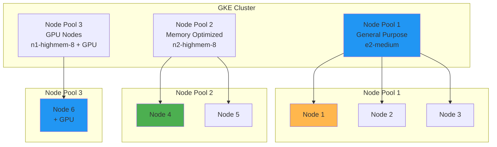

## Pod and Service Architecture

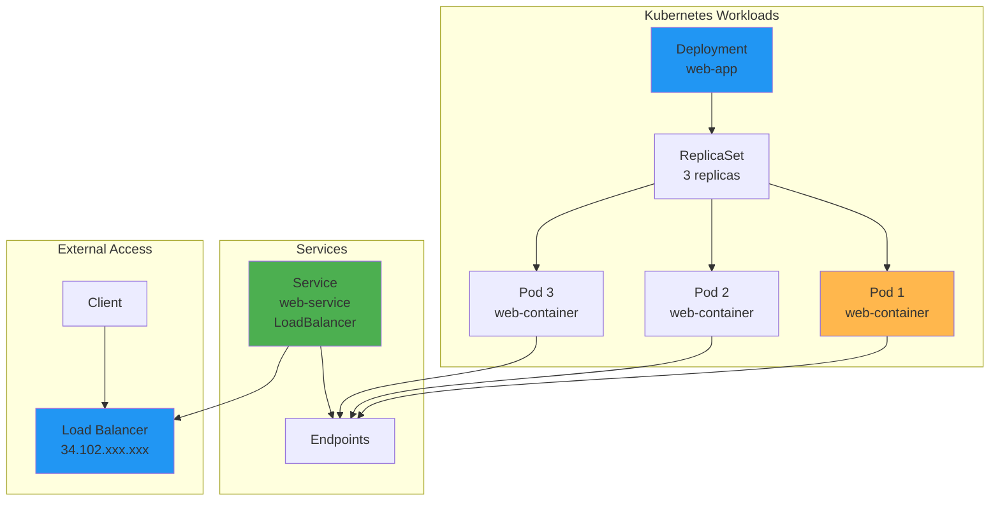

## Networking Architecture

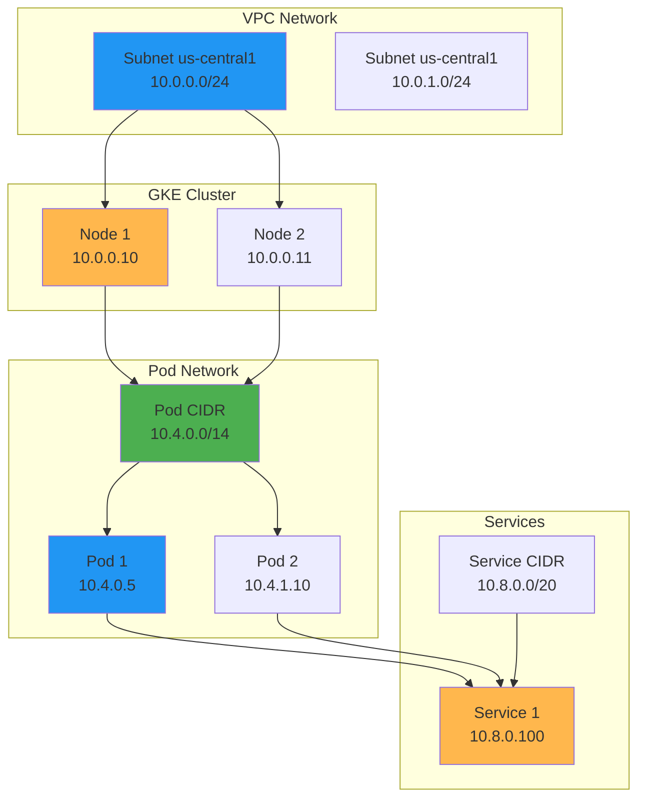

## Ingress and Load Balancing

```mermaid
graph LR
    subgraph "External Traffic"
        USER[User]
        DNS[Cloud DNS<br/>app.example.com]
    end

    subgraph "Global Load Balancer"
        GLB[HTTP(S) Load Balancer]
        URL_MAP[URL Map<br/>Path-based Routing]
        BACKEND_SVC[Backend Service<br/>Health Checks]
    end

    subgraph "GKE Cluster"
        NEG[Network Endpoint Group]
        INGRESS[GKE Ingress]
        SVC[Service]
        POD1[Pod 1]
        POD2[Pod 2]
    end

    USER --> DNS
    DNS --> GLB
    GLB --> URL_MAP
    URL_MAP --> BACKEND_SVC
    BACKEND_SVC --> NEG
    NEG --> INGRESS
    INGRESS --> SVC
    SVC --> POD1
    SVC --> POD2

    style USER fill:#2196f3
    style GLB fill:#ffb74d
    style NEG fill:#4caf50
    style SVC fill:#2196f3
```

## Storage Architecture

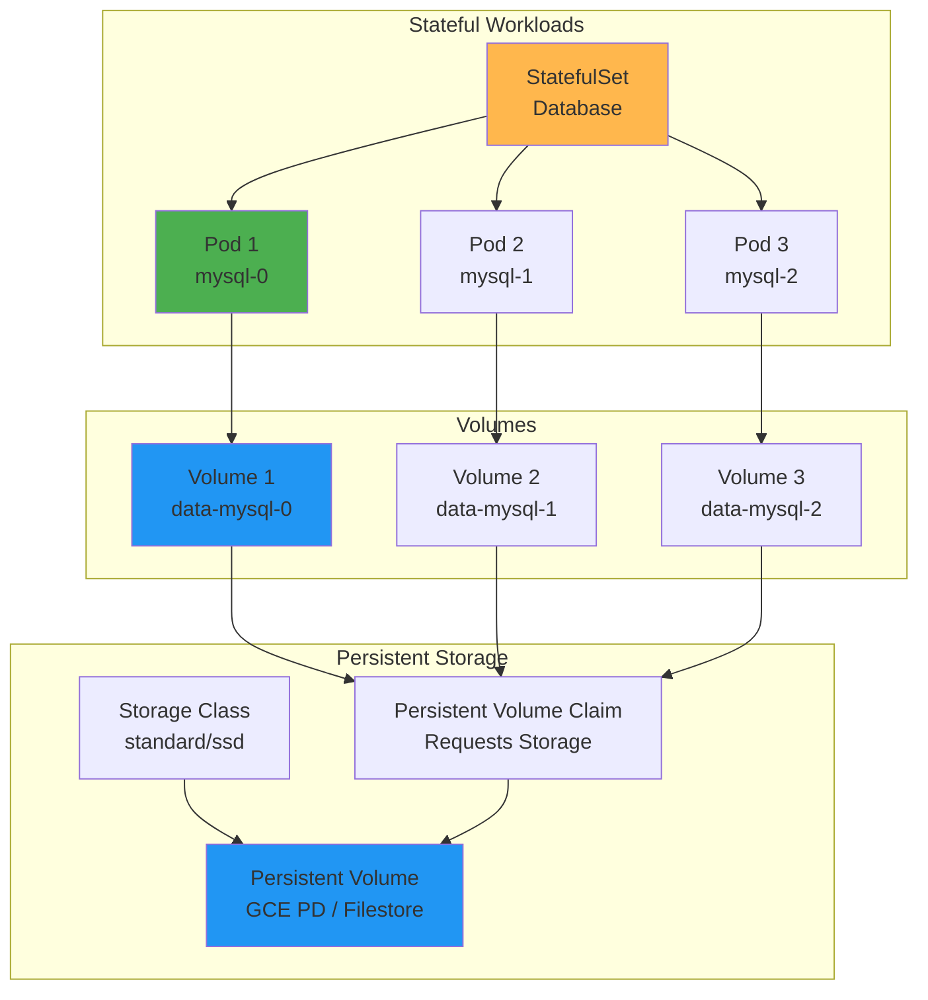

## Security Architecture

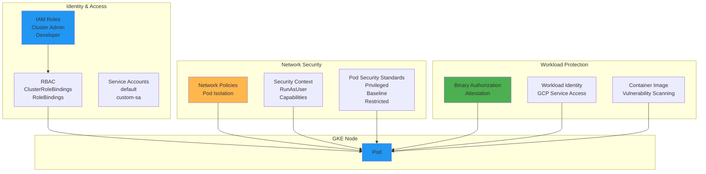

## Auto-Scaling Architecture

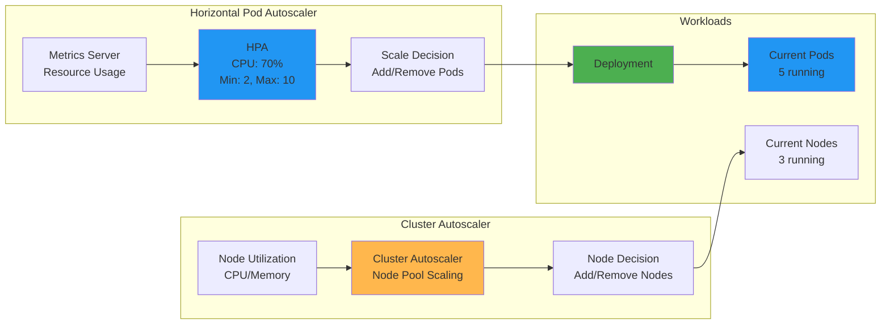

## CI/CD Pipeline Integration

```mermaid
graph LR
    subgraph "Source Control"
        GITHUB[GitHub<br/>Source Code]
        COMMIT[Commit/Push]
    end

    subgraph "Cloud Build"
        BUILD[Build<br/>Docker Image]
        TEST[Test<br/>Unit Tests]
        SCAN[Security Scan<br/>Vulnerabilities]
        PUSH[Push to GCR<br/>Container Registry]
    end

    subgraph "GKE Deployment"
        DEPLOY[Deploy to GKE<br/>kubectl apply]
        CANARY[Canary Deployment<br/>10% Traffic]
        PROMOTE[Promote to Production<br/>100% Traffic]
    end

    subgraph "Monitoring"
        MONITOR[Cloud Monitoring<br/>Performance]
        ALERTS[Alerts<br/>Issues Detected]
        ROLLBACK[Rollback<br/>If Issues]
    end

    GITHUB --> COMMIT
    COMMIT --> BUILD
    BUILD --> TEST
    TEST --> SCAN
    SCAN --> PUSH
    PUSH --> DEPLOY
    DEPLOY --> CANARY
    CANARY --> PROMOTE

    PROMOTE --> MONITOR
    MONITOR --> ALERTS
    ALERTS --> ROLLBACK

    style GITHUB fill:#2196f3
    style BUILD fill:#ffb74d
    style DEPLOY fill:#4caf50
    style MONITOR fill:#2196f3
```

## Multi-Cluster Architecture

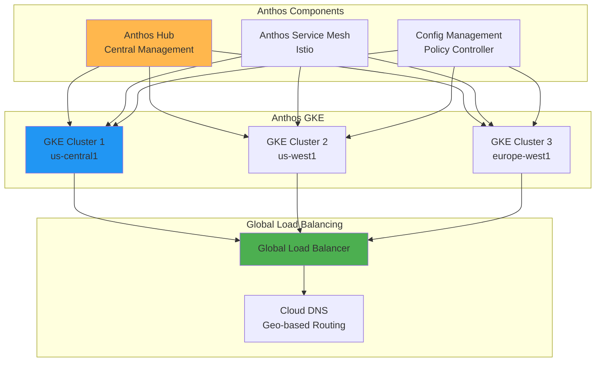

## Monitoring and Observability

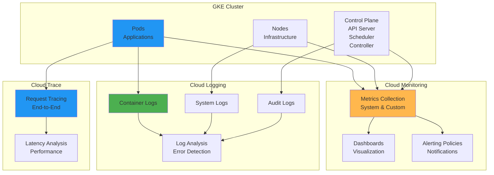

## Disaster Recovery

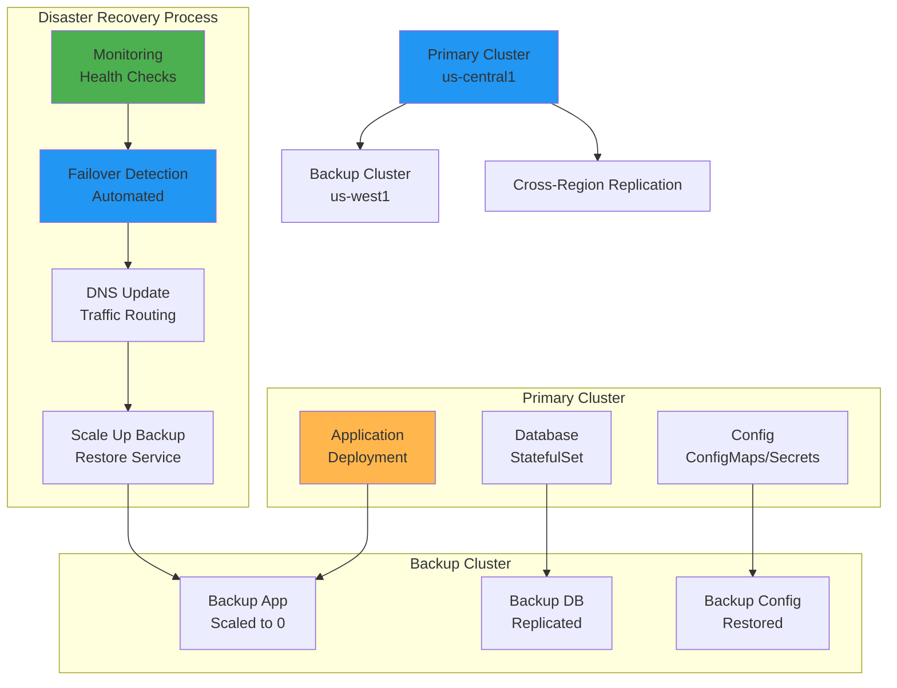

## Service Mesh with Istio

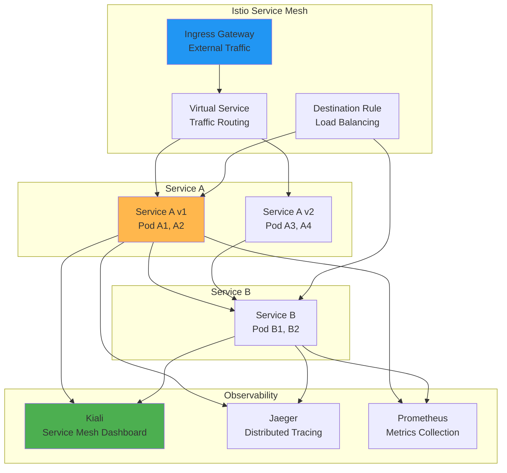

## Cost Optimization

```mermaid
graph TD
    A[GKE Cost Optimization] --> B[Resource Optimization]
    A --> C[Node Pool Strategy]
    A --> D[Workload Scheduling]
    A --> E[Storage Optimization]

    B --> B1[Right-sizing Pods<br/>CPU/Memory Requests]
    B --> B2[HPA Configuration<br/>Avoid Over-provisioning]
    B --> B3[Bin Packing<br/>Maximize Node Utilization]

    C --> C1[Spot VM Node Pools<br/>80% Cost Savings]
    C --> C2[Preemptible Nodes<br/>For Batch Workloads]
    C --> C3[Custom Machine Types<br/>Exact Resource Needs]

    D --> D1[Pod Disruption Budgets<br/>Control Evictions]
    D --> D2[Node Affinity/Anti-affinity<br/>Workload Placement]
    D --> D3[Cluster Autoscaling<br/>Scale Down Unused Nodes]

    E --> E1[Storage Classes<br/>Choose Appropriate Type]
    E --> E2[Volume Snapshots<br/>Efficient Backups]
    E --> E3[EmptyDir for Temp Data<br/>No Persistent Storage]

    style A fill:#2196f3
    style B fill:#ffb74d
    style C fill:#4caf50
    style D fill:#2196f3
    style E fill:#ffb74d
```

## Migration Strategies

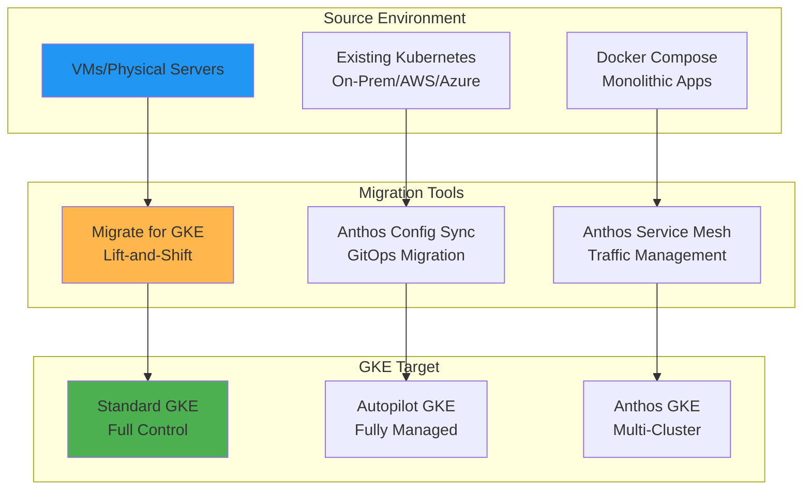

This visual guide provides a comprehensive overview of GKE's architecture, components, and operational patterns. The diagrams illustrate how GKE simplifies Kubernetes management while providing enterprise-grade features for container orchestration, scaling, security, and monitoring.
