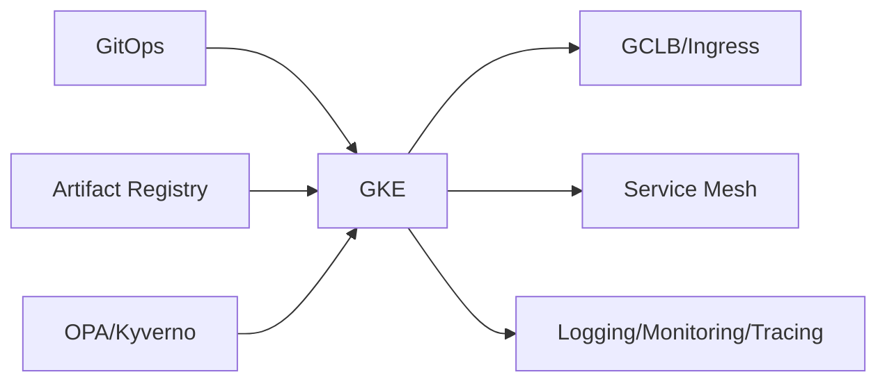

# GKE Guide – Basic → Architect

## Level 1 – Launch & Basics

### 1. Quick Cluster
```bash
gcloud container clusters create-auto demo --region=us-central1
gcloud container clusters get-credentials demo --region=us-central1
kubectl get nodes
```

### 2. Core Concepts
- Autopilot vs Standard; node pools; release channels
- Workloads: Deployments/StatefulSets; Services; Ingress
- IAM vs RBAC; Workload Identity for pods

### 3. First App
```bash
kubectl create deploy web --image=nginx:1.25
kubectl expose deploy web --port=80 --target-port=80 --type=LoadBalancer
```

## Level 2 – Production Patterns

### Cluster & Node Pools
- Use release channels; regional clusters for HA
- Separate node pools for workload classes; autoscaling settings
- Shielded nodes; COS/Ubuntu LTS; surge upgrades

### Security
- Workload Identity; avoid node SA credentials in pods
- NetworkPolicies; private clusters; master authorized networks
- Binary Authorization for image policy; Image scanning

### Networking & Ingress
- Use GCLB Ingress; NEG/ILB as needed; pod readiness for traffic
- Set proper health checks; configure timeouts; TLS with cert-manager/managed certs

## Level 3 – Architect Playbook

### Reliability & Operations
- PodDisruptionBudgets; HPA/VPA; cluster autoscaler tuning
- Reserved IP ranges for Pod/Service CIDRs; avoid overlap
- Surge/blue-green upgrades; maintenance windows

### Observability
- Cloud Ops for GKE; metrics/logs; cost views
- Traces via OTel; audit logs on; events monitoring

### Governance & Cost
- Namespaces per team; ResourceQuotas/LimitRanges
- OPA/Gatekeeper/Kyverno for policy; Pod Security levels
- Cost: right-size nodes; autoscale; preemptible/spot pools where safe

## Ops Cheat Sheet

| Task | Command | Note |
| --- | --- | --- |
| Credentials | `gcloud container clusters get-credentials ...` | kubeconfig |
| Nodes | `kubectl get nodes -o wide` | view |
| Upgrade | `gcloud container clusters upgrade ...` | control plane/nodes |
| Autopilot logs | Cloud Logging | default |
| Policies | `kubectl get constrainttemplates` | opa/kyverno |

## Architecture Patterns



## Checklist Before Production
- [ ] Regional or HA plan; release channel set; surge upgrades
- [ ] Workload Identity; private cluster; NetworkPolicies; Pod Security
- [ ] Ingress/LB configured with TLS; health checks; NEG where needed
- [ ] HPA/VPA + PDBs; autoscaler tuned; quotas/limits set
- [ ] Observability: logs/metrics/traces/audit; OPA policies enforced

