# IAM - Visual Architecture

## Resource Hierarchy & Policy Inheritance

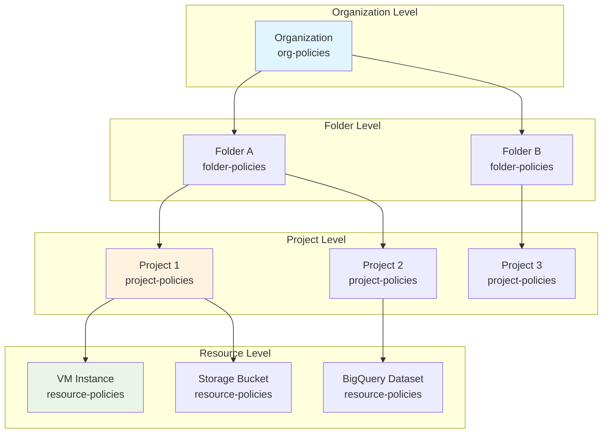

## IAM Policy Structure

```mermaid
graph TD
    subgraph "IAM Policy"
        A[Policy Document]
    end

    subgraph "Bindings Array"
        B[Binding 1]
        C[Binding 2]
        D[Binding 3]
    end

    subgraph "Role Binding"
        E[Role:<br/>roles/storage.admin]
        F[Members Array]
    end

    subgraph "Members"
        G[user:alice@domain.com]
        H[serviceAccount:sa@project.iam.gserviceaccount.com]
        I[group:developers@domain.com]
        J[domain:domain.com]
    end

    A --> B
    A --> C
    A --> D
    B --> E
    E --> F
    F --> G
    F --> H
    F --> I
    F --> J

    style A fill:#e3f2fd
    style E fill:#fff3e0
    style G fill:#e8f5e8
```

## Role Types & Permissions

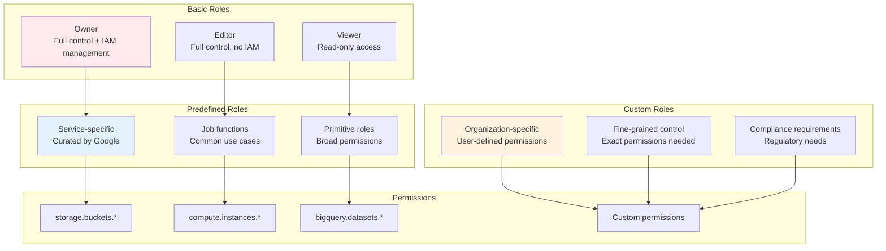

## Access Control Flow

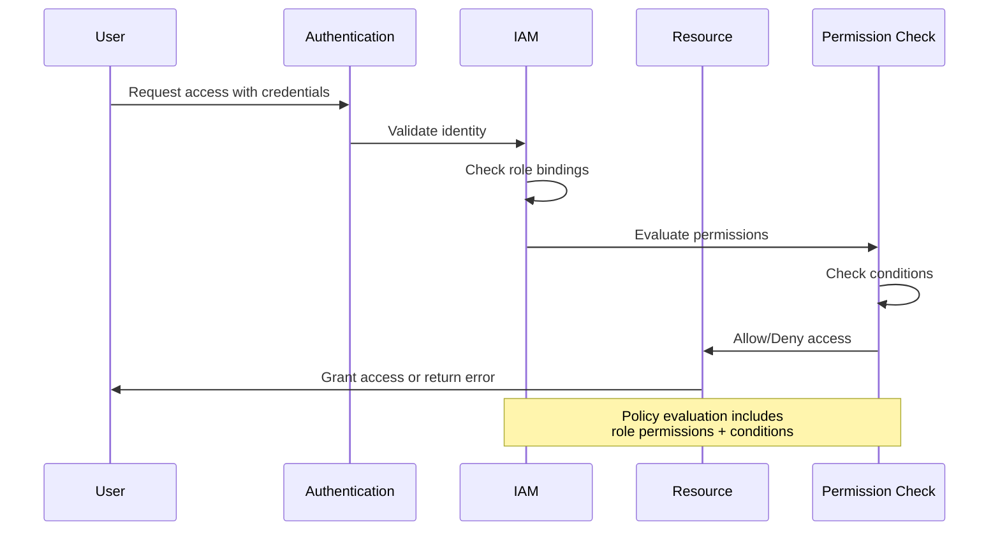

## Service Account Architecture

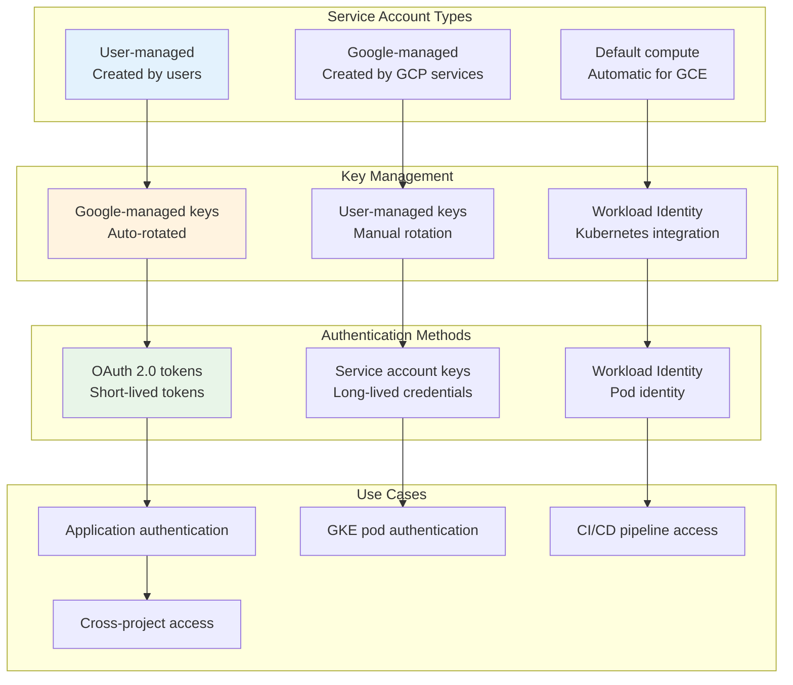

## Conditional Access Policies

```mermaid
graph TD
    subgraph "Role Binding"
        A[Role: roles/storage.admin]
        B[Members: user:alice@domain.com]
    end

    subgraph "Condition"
        C[title: "Business Hours Only"]
        D[expression: "request.time.getHours() >= 9 &&<br/>request.time.getHours() <= 17"]
    end

    subgraph "Context Attributes"
        E[request.time<br/>Timestamp of request]
        F[request.ip<br/>Source IP address]
        G[resource.name<br/>Resource identifier]
        H[resource.service<br/>GCP service name]
    end

    subgraph "Evaluation"
        I[Check condition]
        J[Allow/Deny access]
        K[Log decision]
    end

    A --> C
    B --> C
    C --> D
    D --> E
    D --> F
    D --> G
    D --> H
    E --> I
    F --> I
    G --> I
    H --> I
    I --> J
    J --> K

    style C fill:#ffebee
    style I fill:#e8f5e8
```

## Multi-Project Access Patterns

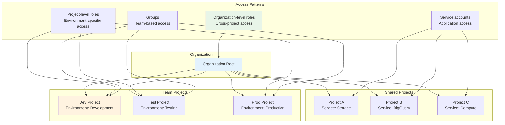

## Identity Federation

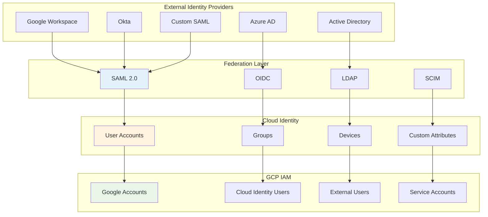

## Audit & Compliance Monitoring

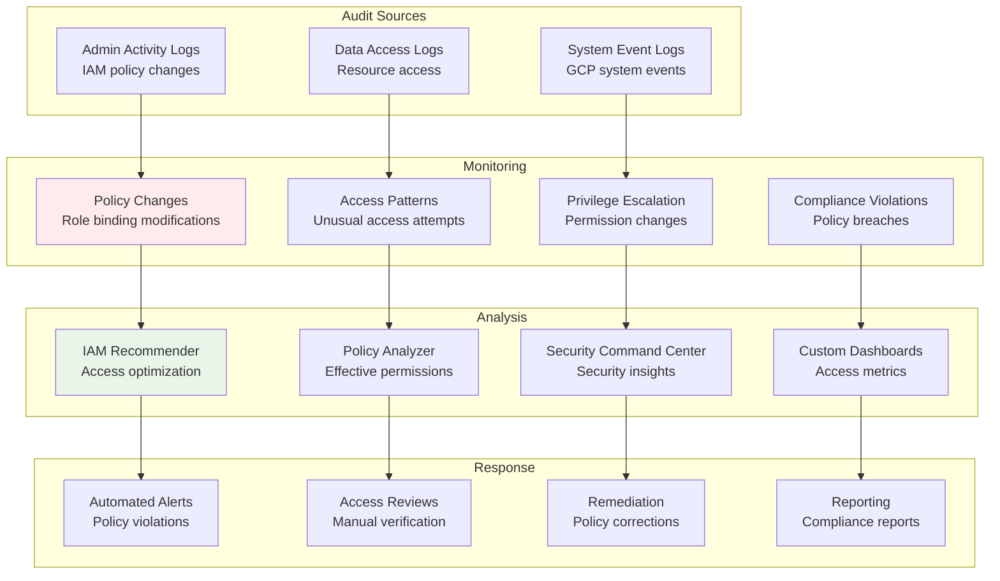

## DevOps Access Patterns

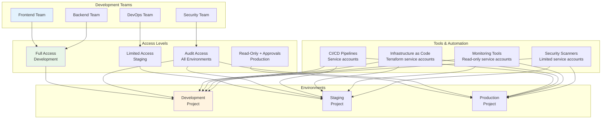

## Zero Trust Architecture

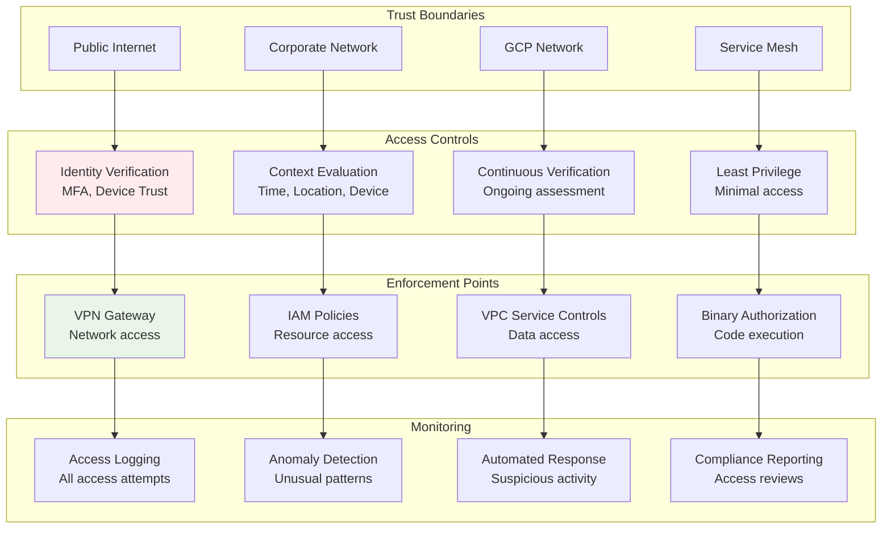

## Incident Response Access

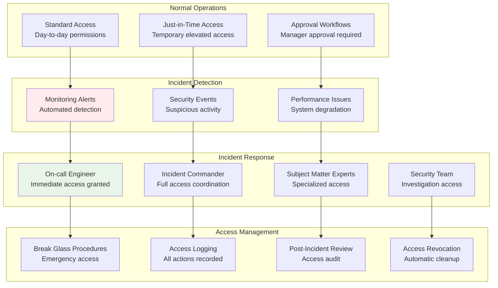

## Cost Management & Optimization

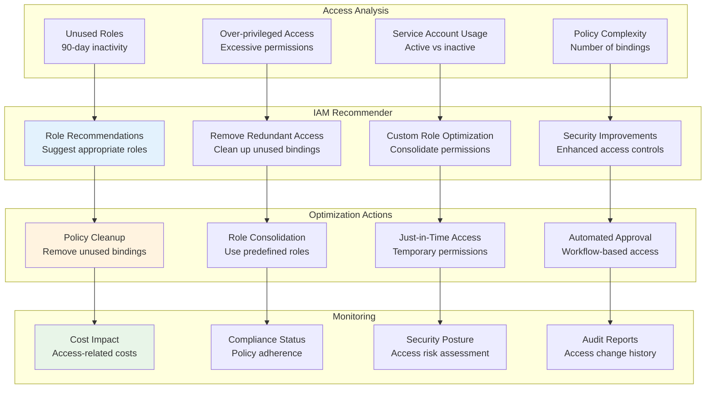

## Cross-Cloud Identity Management

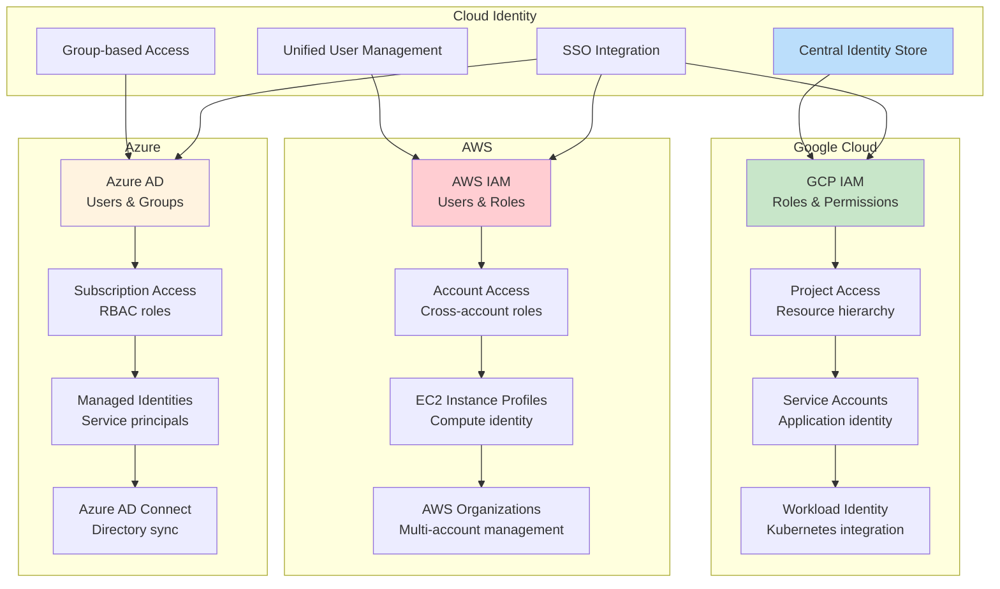

These diagrams illustrate the comprehensive access control architecture of IAM, showing how identities, roles, and policies work together to provide secure, governed access to Google Cloud resources across different organizational structures and use cases.
