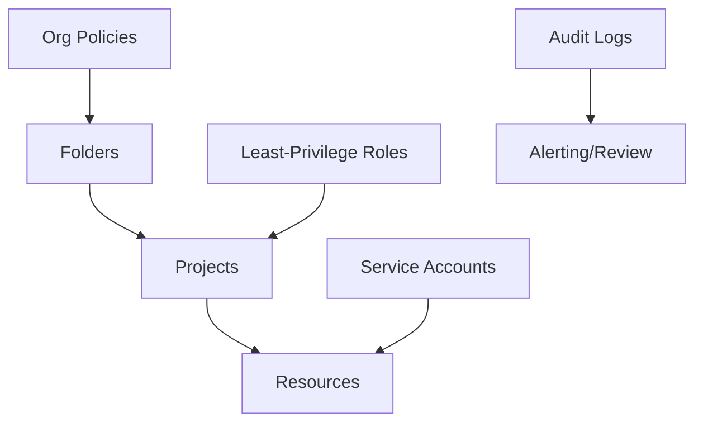

# IAM Guide – Basic → Architect

## Level 1 – Launch & Basics

### 1. Core Concepts
- Principals (users, service accounts, groups), roles (basic, predefined, custom), policies
- Inheritance via resource hierarchy (org → folder → project → resource)

### 2. Basic Ops
```bash
gcloud projects add-iam-policy-binding $PROJECT \
  --member="serviceAccount:svc@$PROJECT.iam.gserviceaccount.com" \
  --role="roles/storage.objectViewer"
```

### 3. Service Accounts
- Create, keyless preferred; avoid user-managed keys
- Workload Identity Federation for external workloads

## Level 2 – Production Patterns

### Least Privilege & Boundaries
- Prefer predefined roles; custom roles for tighter scopes
- Avoid basic roles (Owner/Editor); separate admin vs ops vs app roles
- Use folders and org policies to constrain permissions

### Key Management
- Disable key creation unless required; rotate; audit
- Use short-lived creds (OIDC/WIF) for CI/CD

### Access Reviews & Monitoring
- Regular review of IAM bindings; remove dormant principals
- Audit logs enabled; alert on policy changes; Access Transparency (where available)

## Level 3 – Architect Playbook

### Governance
- Policy automation (Terraform/Cloud Asset Inventory diffs)
- Org policies: restrict service accounts, external IPs, domains
- VPC-SC for data exfil; conditional bindings for context-aware access

### Multi-Env Strategy
- Separate projects per env; per-service SAs; least privilege per project
- Break-glass accounts and process

### Compliance
- Principle of least privilege enforced; traceability; approvals for escalations

## Ops Cheat Sheet

| Task | Command | Note |
| --- | --- | --- |
| List bindings | `gcloud projects get-iam-policy $PROJECT` | audit |
| Add binding | `gcloud projects add-iam-policy-binding ...` | grant |
| Remove binding | `gcloud projects remove-iam-policy-binding ...` | revoke |
| Keys | `gcloud iam service-accounts keys list ...` | avoid usage |
| Custom role | `gcloud iam roles create ...` | scoped |

## Architecture Patterns



## Checklist Before Production
- [ ] No basic roles; least privilege roles applied
- [ ] Service accounts keyless; WIF for CI/CD; keys restricted/rotated
- [ ] Org policies set (domains, external IPs, SA creation as needed)
- [ ] Audit logs on; alerts for IAM changes; periodic reviews
- [ ] Separate projects/envs; break-glass access defined

## Learning Path Links
- Track: `LearningTracks/Backend-GCP/track.md`
- Projects: `Projects/GCP-Backend/` and `Projects/Integrated/backend-gcp-capstone.md`
- Mastery: `Mastery/GCP-IAM/` (quiz, scenarios, flashcards)

