# Load Balancing - Visual Architecture

## Load Balancer Types Overview

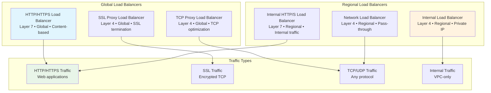

## HTTP Load Balancer Architecture

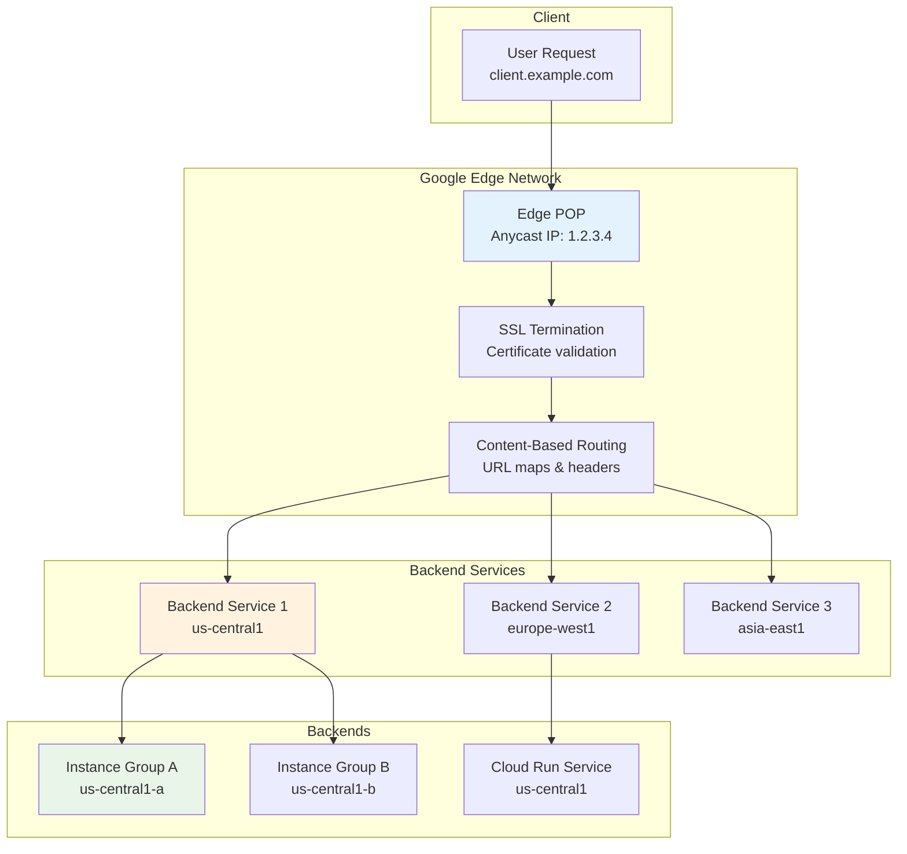

## Global Load Balancing Flow

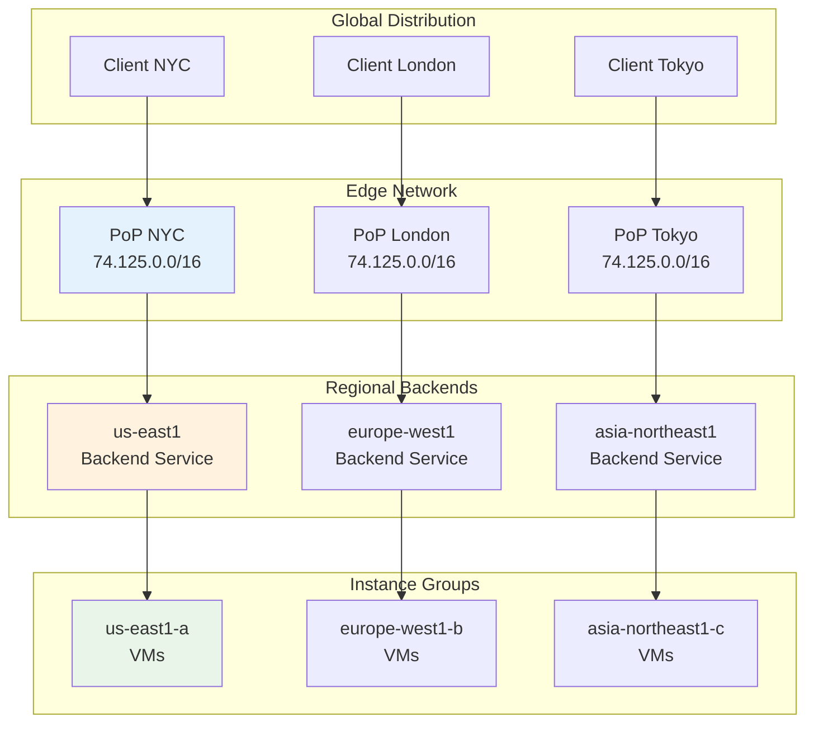

## Backend Configuration

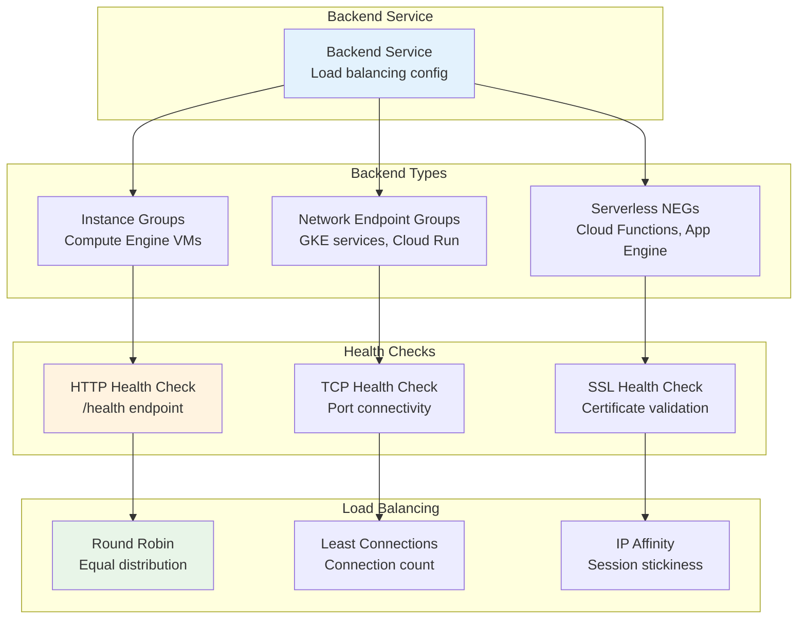

## Content-Based Routing

```mermaid
graph TD
    subgraph "URL Map"
        A[URL Map<br/>Routing rules]
    end

    subgraph "Host Rules"
        B[api.example.com<br/>→ API Backend]
        C[web.example.com<br/>→ Web Backend]
        D[static.example.com<br/>→ CDN Backend]
    end

    subgraph "Path Rules"
        E[/api/*<br/>→ API Service]
        F[/web/*<br/>→ Web Service]
        G[/static/*<br/>→ Storage Service]
    end

    subgraph "Backend Services"
        H[API Backend<br/>Cloud Run]
        I[Web Backend<br/>GKE]
        J[Storage Backend<br/>Cloud Storage]
    end

    A --> B
    A --> C
    A --> D
    B --> E
    C --> F
    D --> G
    E --> H
    F --> I
    G --> J

    style A fill:#e3f2fd
    style E fill:#fff3e0
    style H fill:#e8f5e8
```

## Multi-Region Deployment

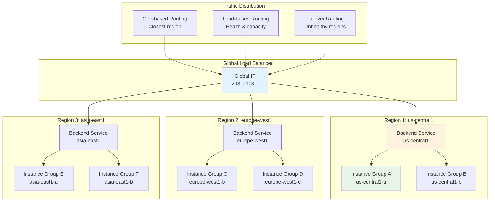

## Health Check Architecture

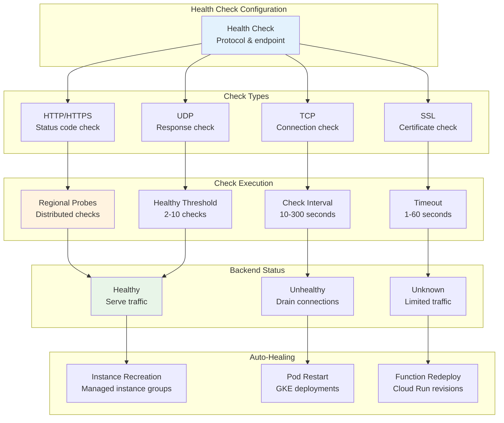

## SSL Termination Flow

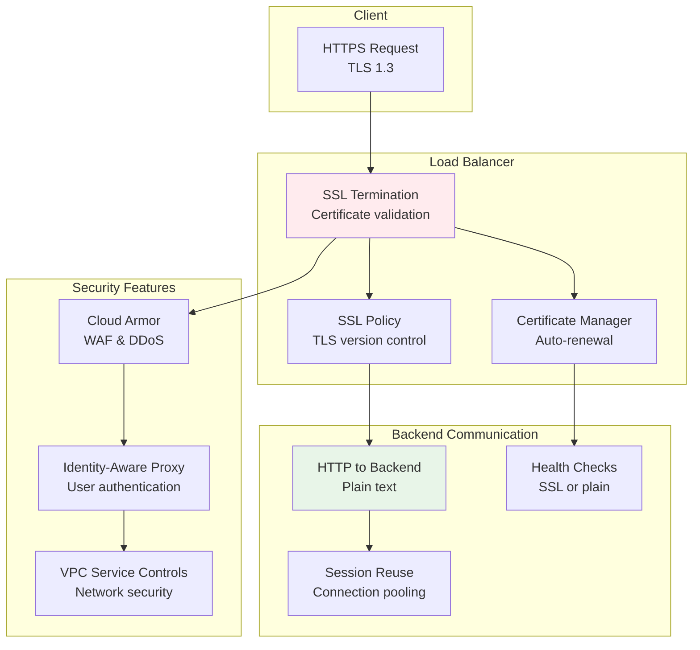

## Internal Load Balancing

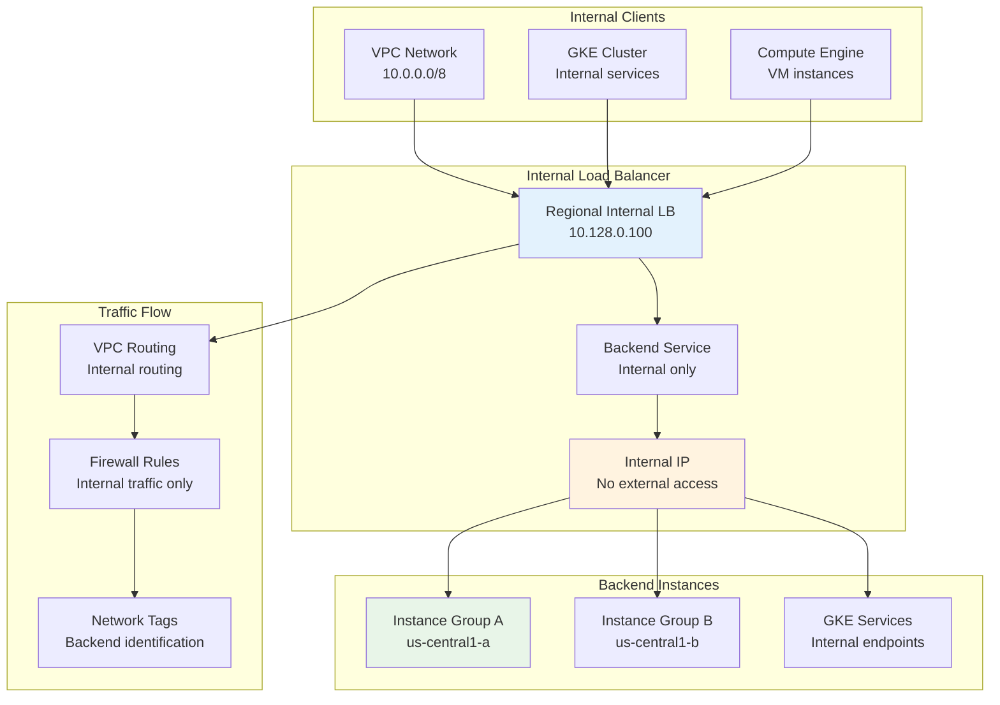

## Traffic Splitting & A/B Testing

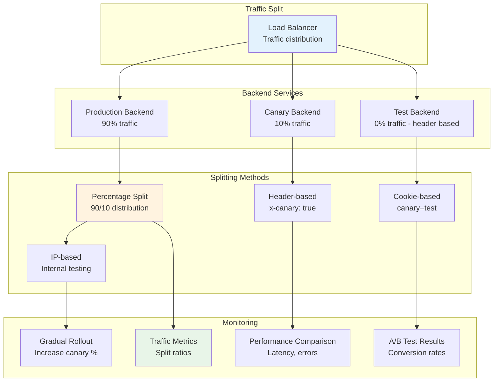

## Auto-Scaling Integration

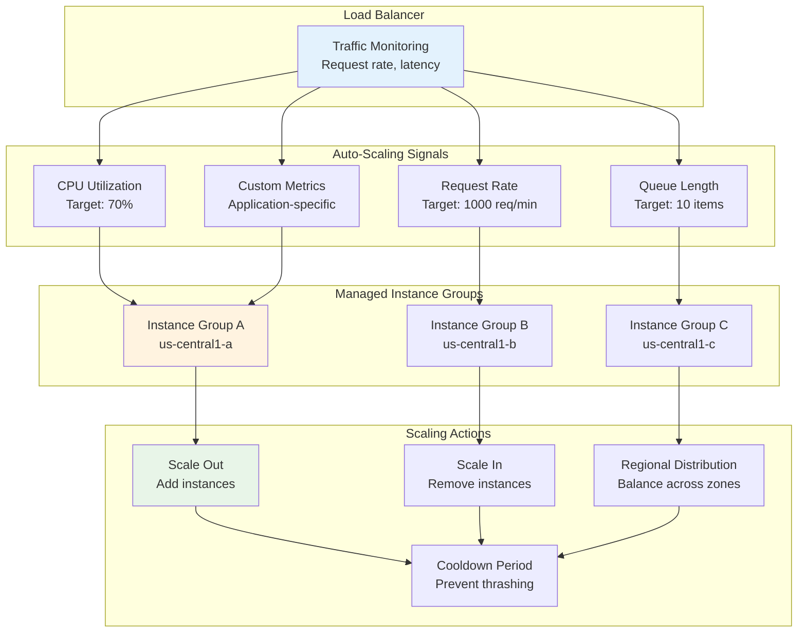

## CDN Integration

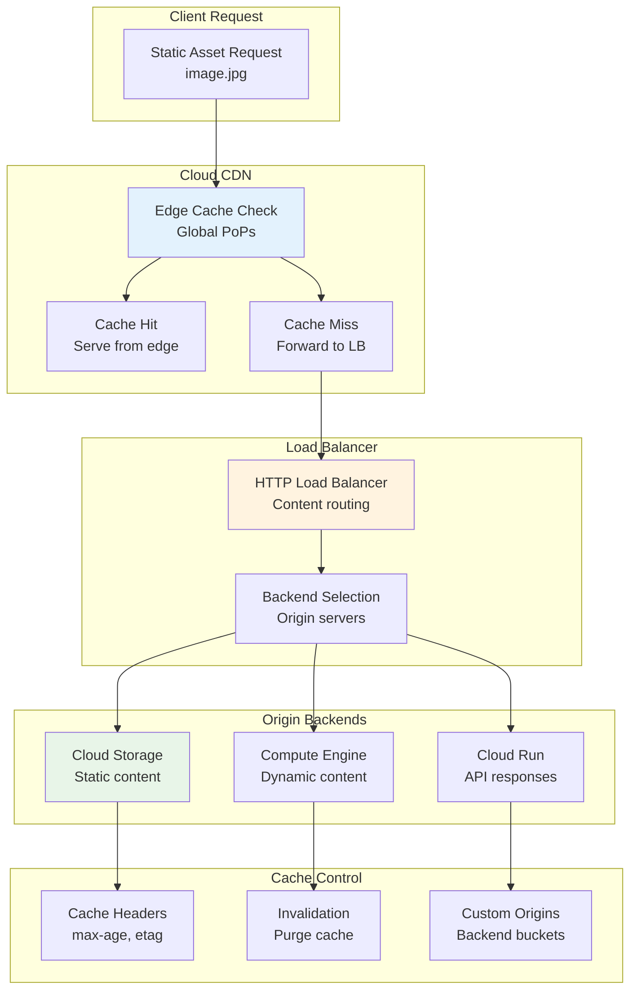

## Monitoring & Observability

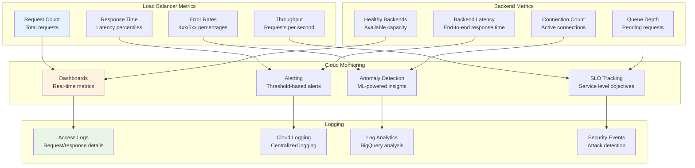

## Disaster Recovery

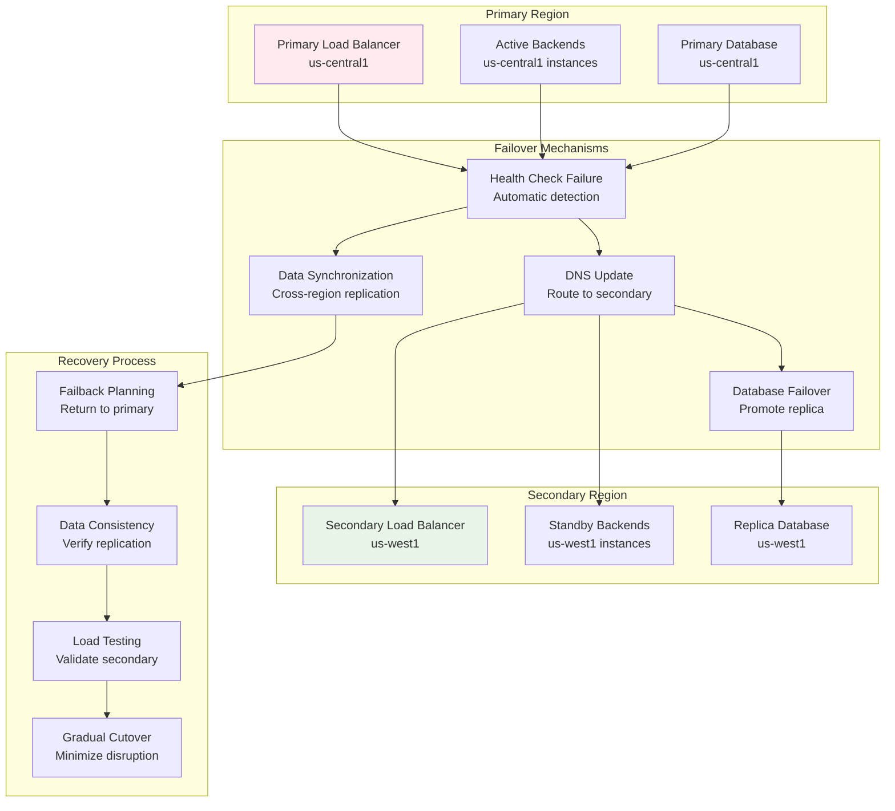

## Cost Optimization

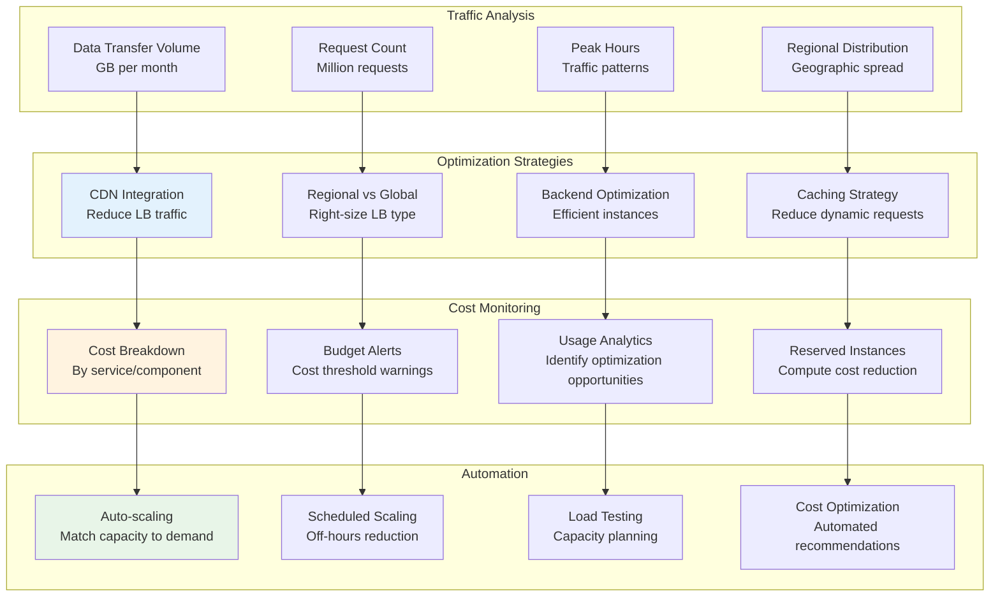

These diagrams illustrate the comprehensive load balancing architecture in Google Cloud, showing how different load balancer types handle various traffic patterns, integrate with backend services, and provide high availability and scalability for applications.
