# Looker - Visual Architecture

## LookML Data Model Architecture

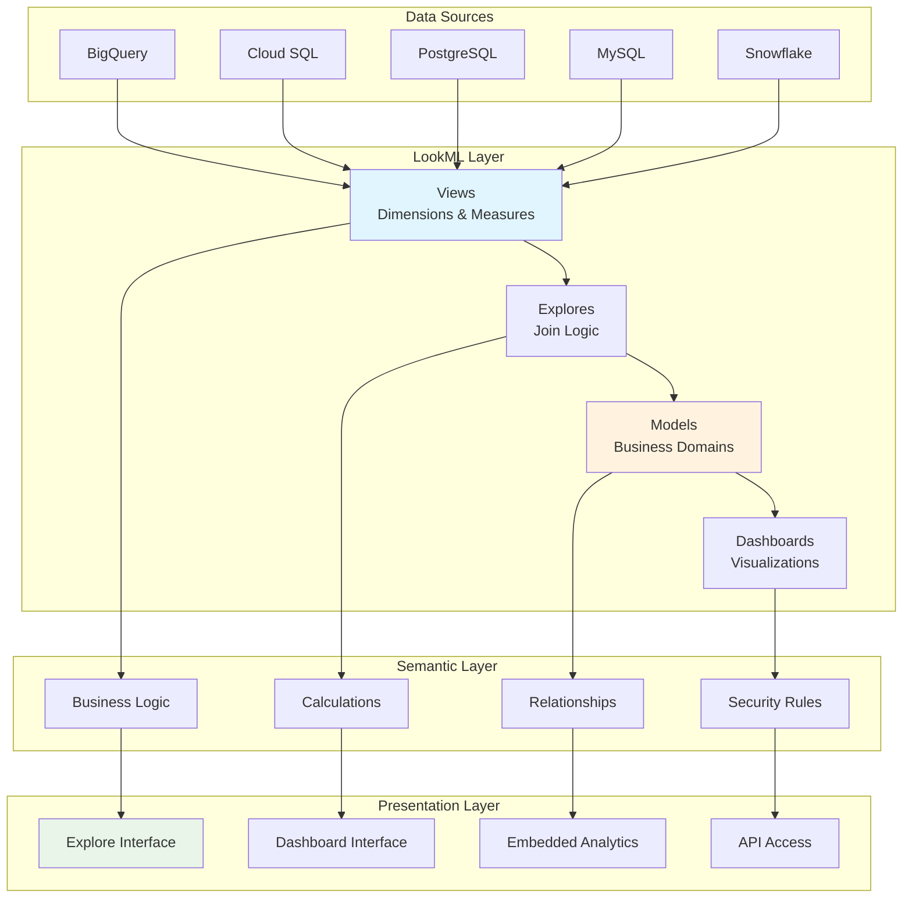

## LookML Development Workflow

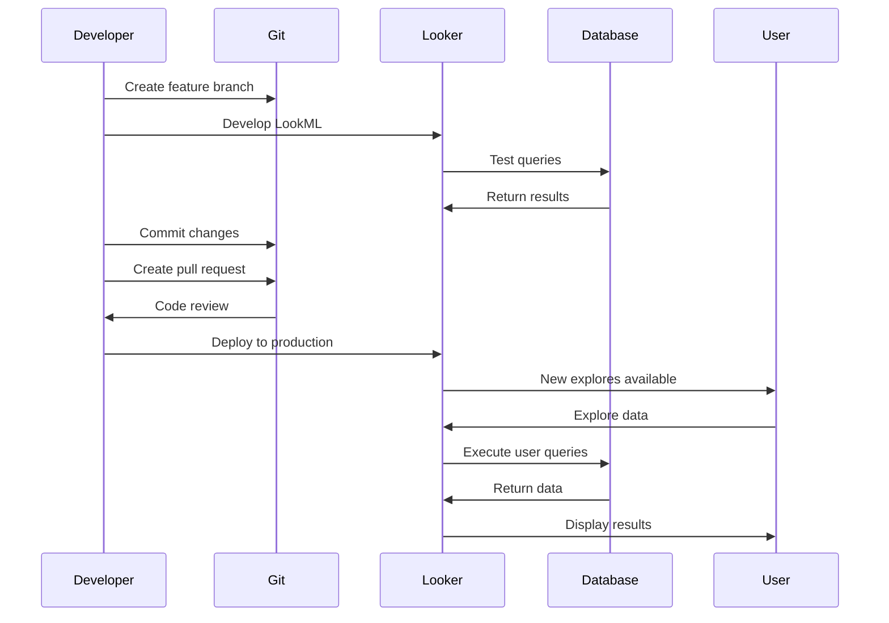

## Data Exploration Flow

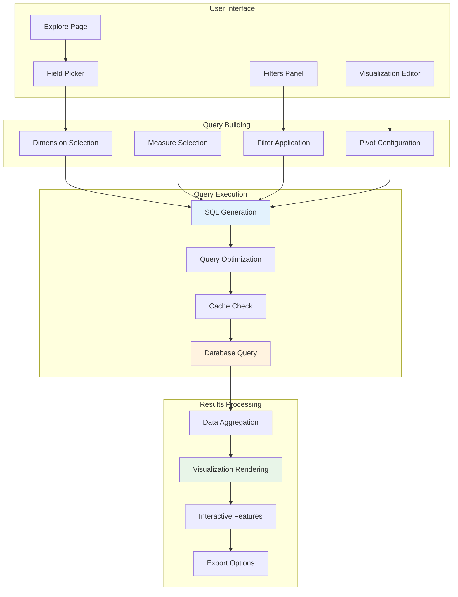

## Dashboard Layout Examples

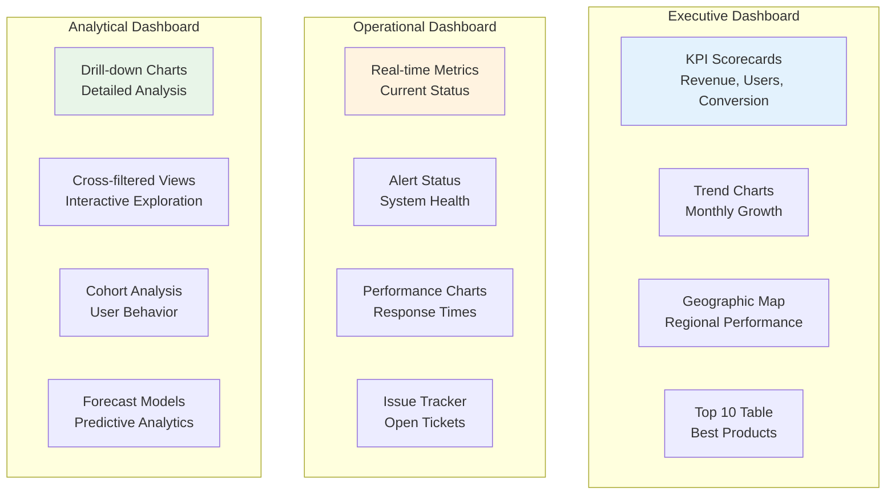

## LookML Model Structure

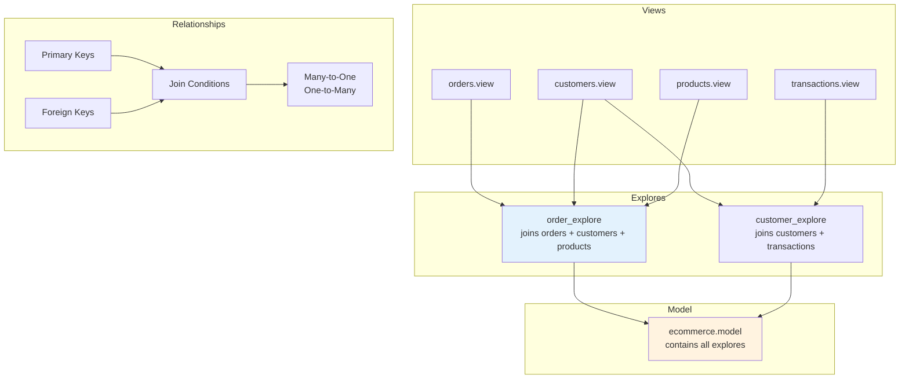

## Caching Architecture

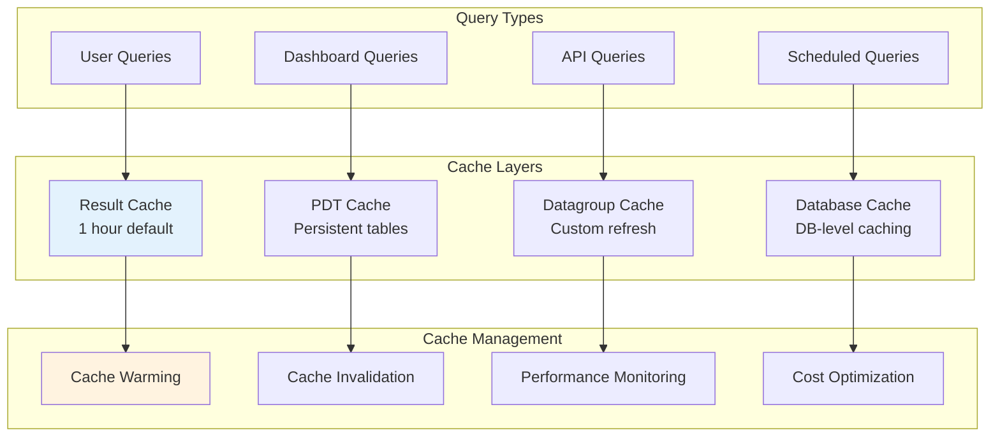

## Embedded Analytics Architecture

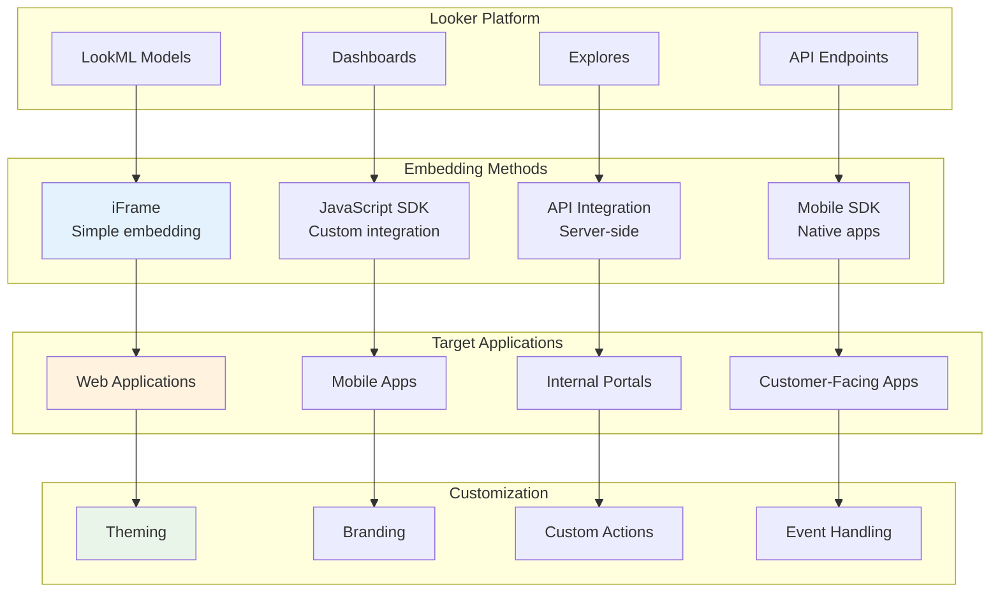

## Security & Access Control

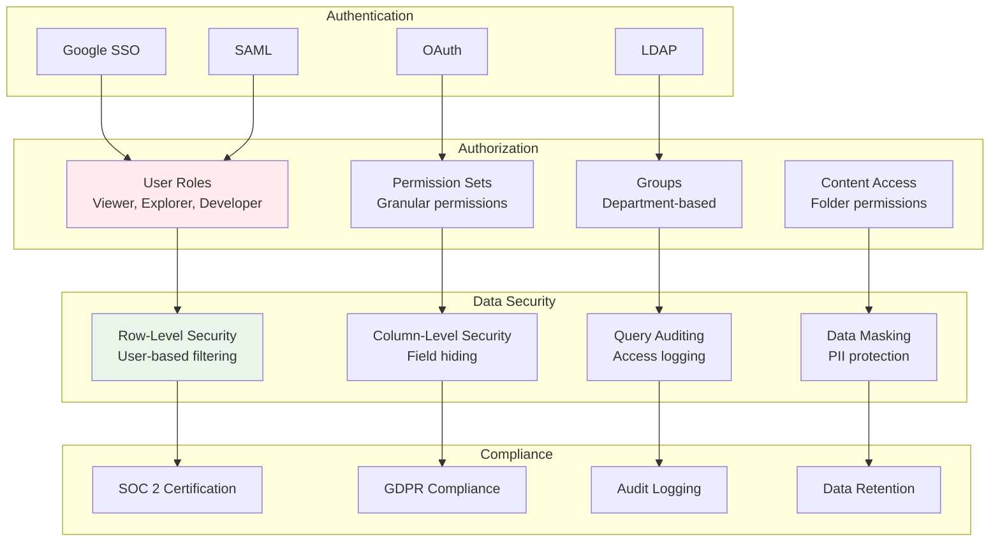

## Data Pipeline Integration

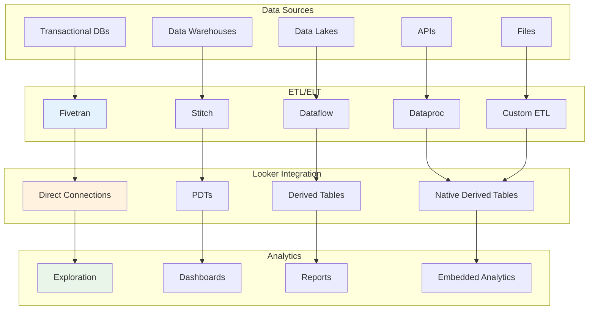

## Performance Optimization

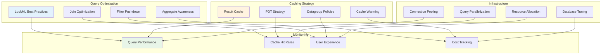

## Multi-Cloud Analytics

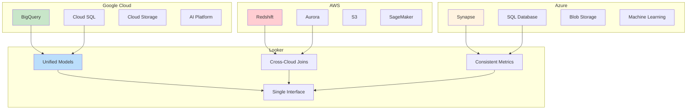

## Development Lifecycle

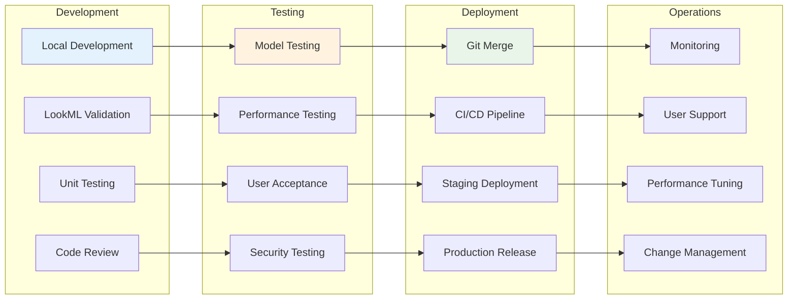

## Custom Visualization Architecture

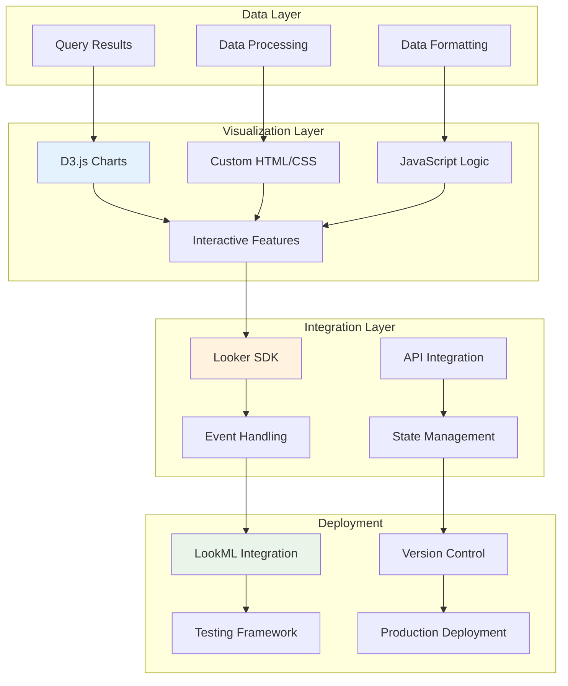

## Governance & Compliance

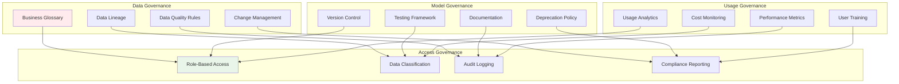

These diagrams illustrate the comprehensive architecture of Looker, showing how it creates a semantic layer over data sources, enables governed self-service analytics, and integrates with various systems for enterprise BI and embedded analytics use cases.
