# Pub/Sub Visual Architecture and Diagrams

## Overview

This document provides visual representations of Cloud Pub/Sub's architecture, message flows, and integration patterns using Mermaid diagrams.

## Core Architecture

### Pub/Sub Service Architecture

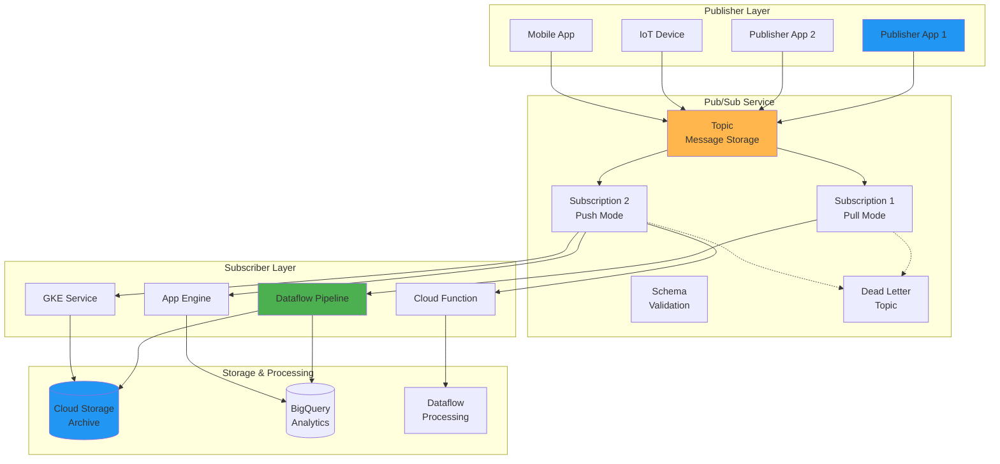

### Message Lifecycle

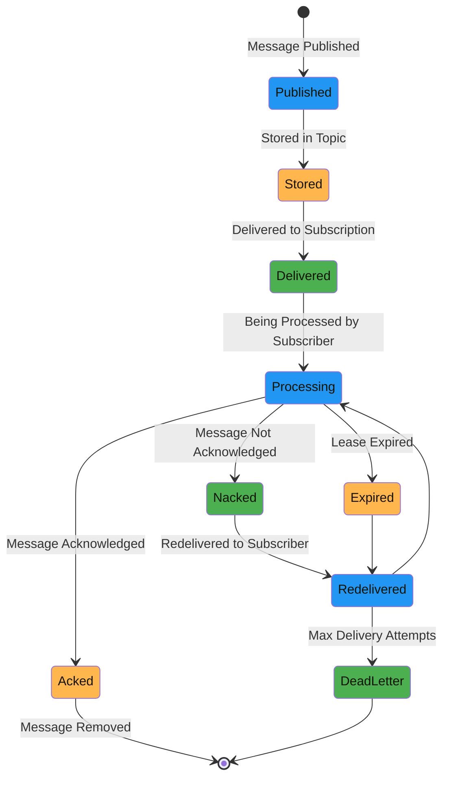

## Message Flow Patterns

### Basic Publish-Subscribe Pattern

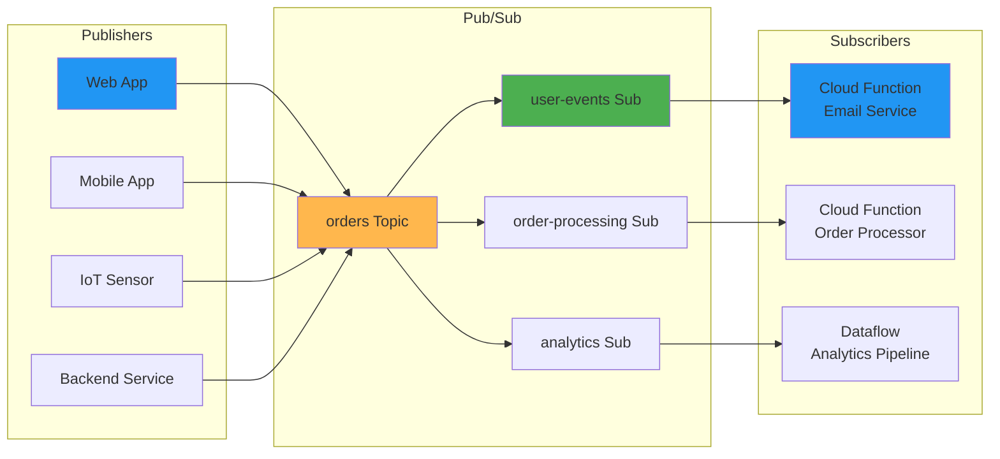

### Fan-out Pattern

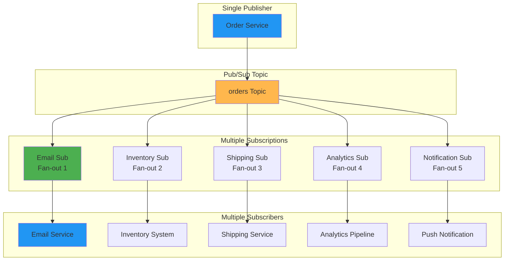

### Message Ordering Flow

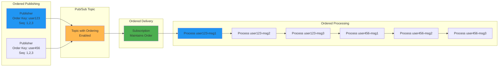

## Integration Architectures

### Real-time Data Pipeline

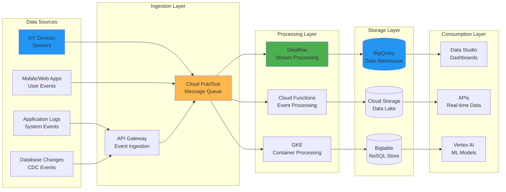

### Event-Driven Microservices

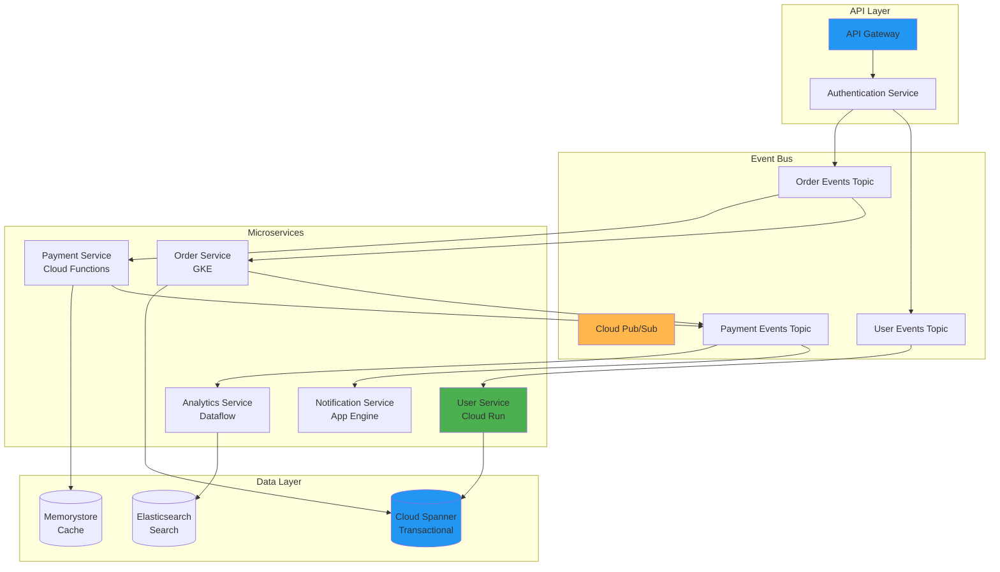

### IoT Data Architecture

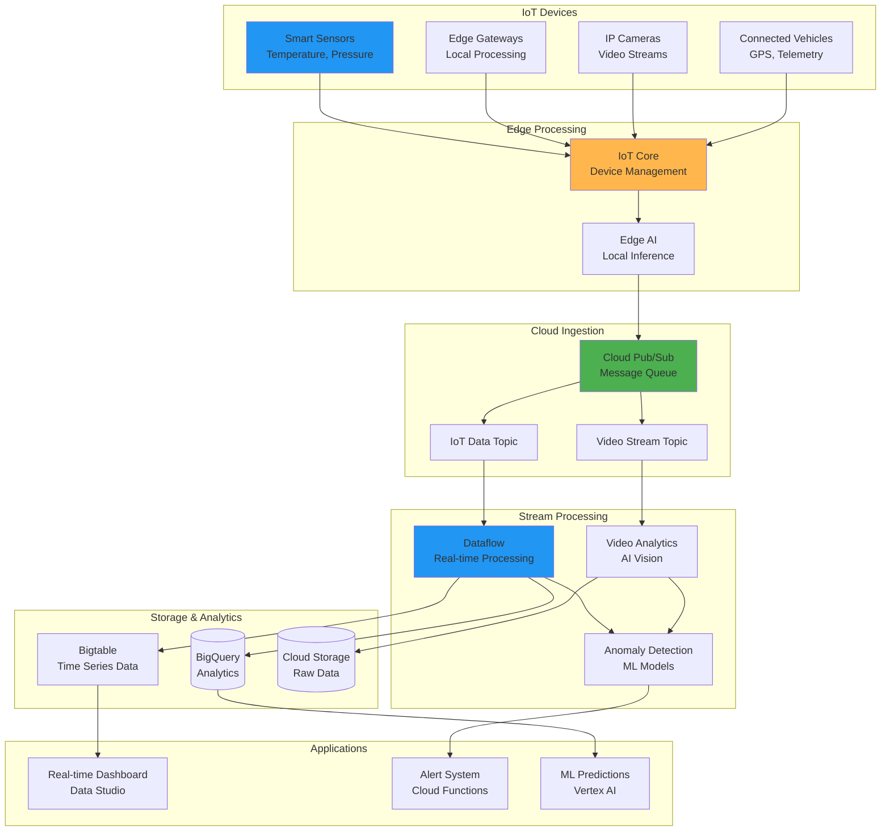

## Security Architecture

### Authentication and Authorization

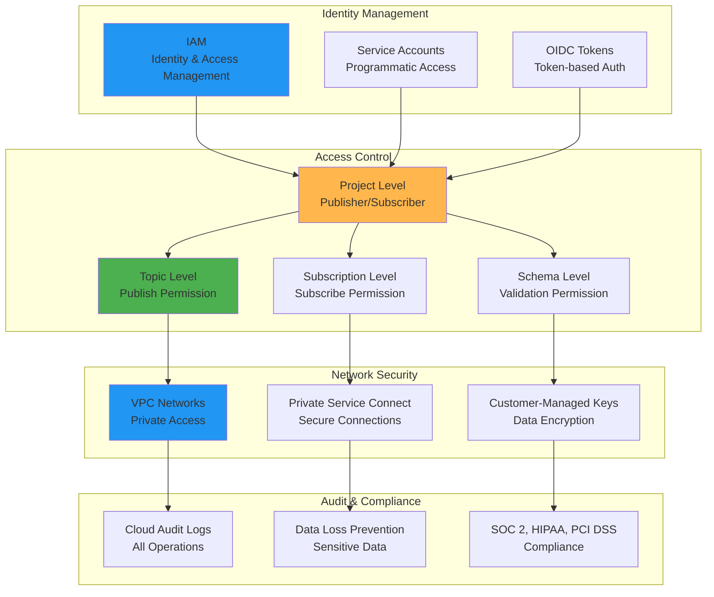

### Message Encryption Flow

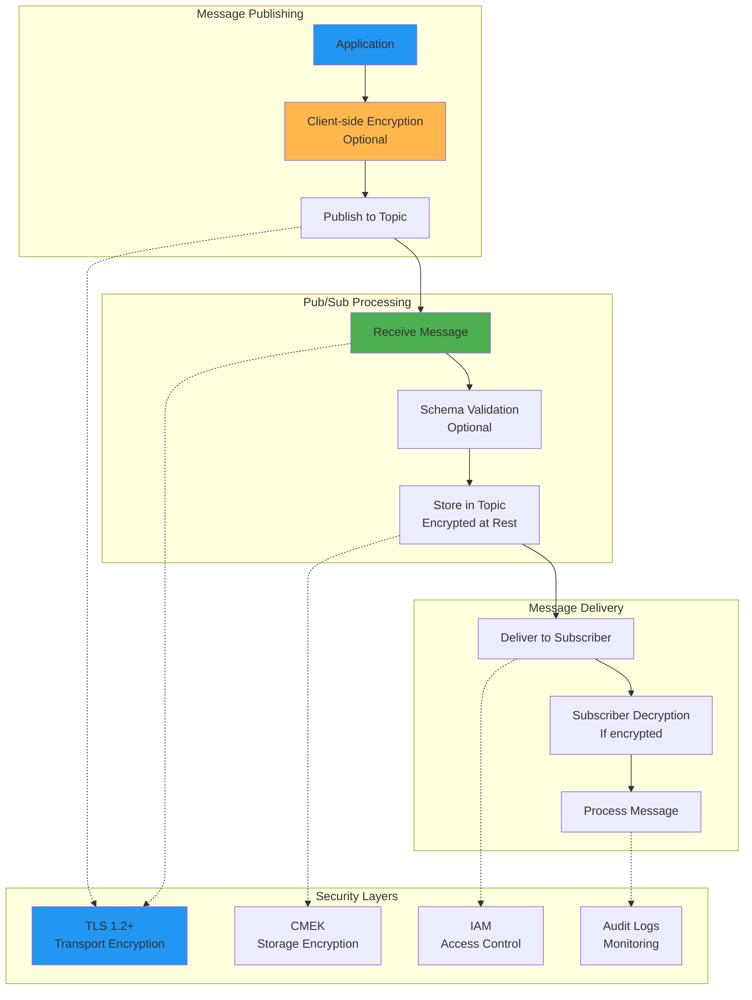

## Performance and Monitoring

### Throughput and Latency Metrics

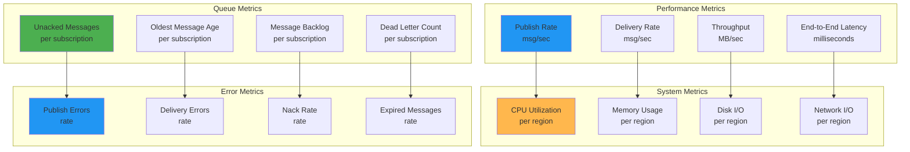

### Scaling Architecture

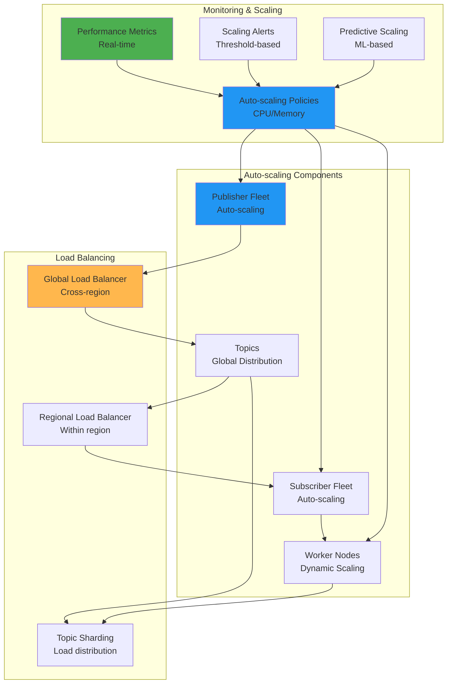

## Cost Optimization

### Cost Components

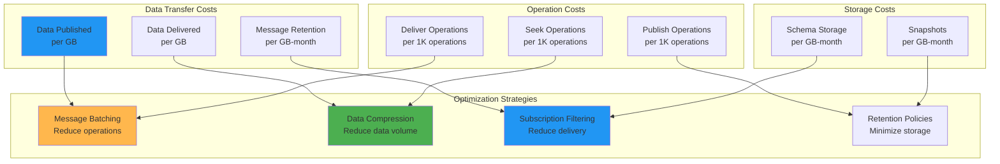

### Cost Monitoring Dashboard

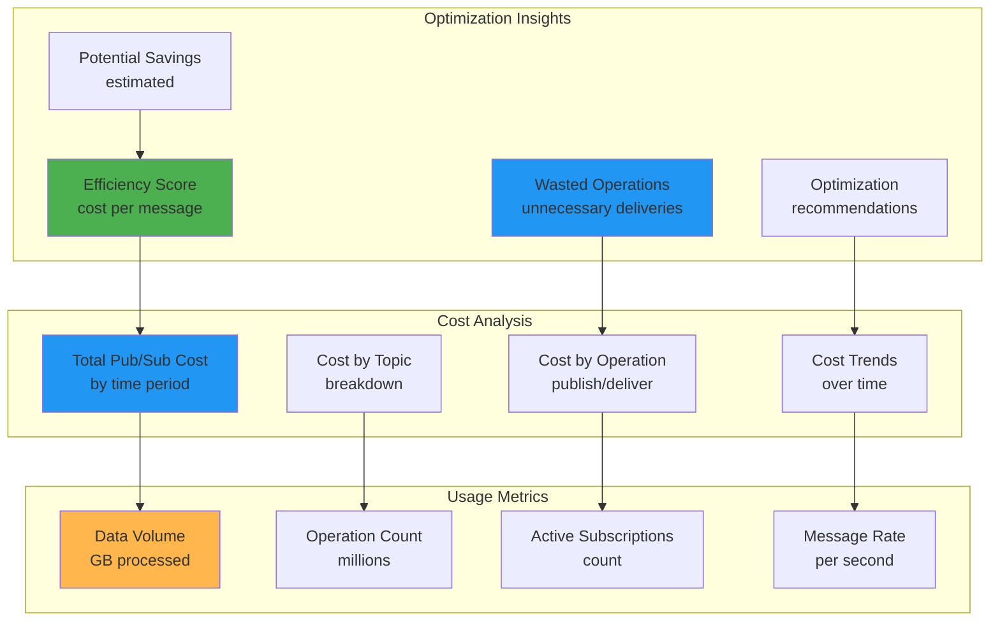

## Integration Patterns

### Pub/Sub with Google Cloud Services

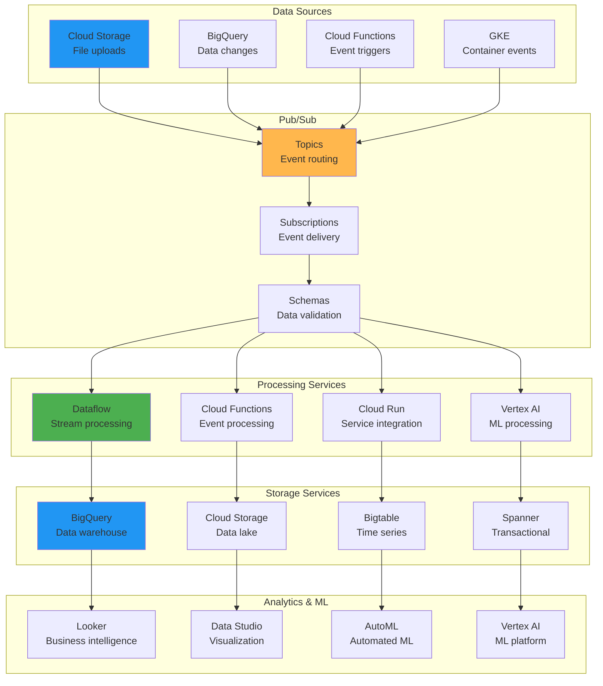

### Cross-Cloud Integration

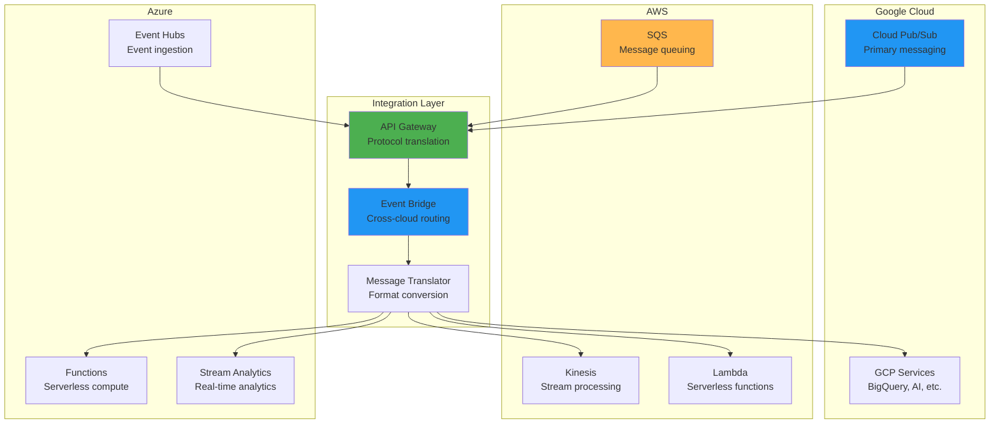

## Summary

These diagrams illustrate the key architectural patterns and data flows in Cloud Pub/Sub:

1. **Service Architecture**: Publisher-subscriber model with topics and subscriptions
2. **Message Lifecycle**: Complete journey from publishing to acknowledgment
3. **Integration Patterns**: Real-time pipelines, microservices, and IoT architectures
4. **Security Model**: Authentication, authorization, and encryption layers
5. **Performance Monitoring**: Throughput, latency, and scaling metrics
6. **Cost Optimization**: Usage patterns and optimization strategies
7. **Cross-Cloud Integration**: Multi-cloud messaging architectures

These visual representations help understand how Pub/Sub enables event-driven architectures and supports real-time data processing at scale.
