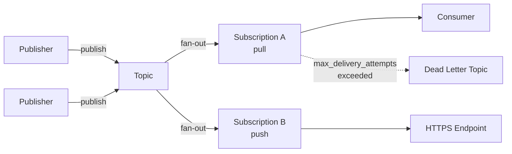

# GCP Pub/Sub — Cheatsheet

## Architecture (30-second mental model)

## When to use vs alternatives

| Need | Use Pub/Sub | Not Pub/Sub |
|------|-------------|-------------|
| Managed async messaging on GCP | Yes -- zero-ops, global topics | Kafka if you need replay/compaction at scale |
| Strict ordering + exactly-once | Partial -- ordering keys per partition only | Kafka gives true partitioned log semantics |
| Sub-10ms latency point-to-point | No -- typical p50 ~50-100ms | Use gRPC direct or Redis Streams |
| Complex routing / exchanges | No -- attribute filters only | RabbitMQ gives exchange/binding flexibility |
| Cross-cloud event bus | Possible but lock-in heavy | Confluent Cloud or NATS for portability |

## 5 things you always forget

1. **Messages are base64-encoded** -- `event.data` in Cloud Functions is base64; you must decode before parsing JSON. Every new teammate hits this once.
2. **Ack deadline != processing timeout** -- Default ack deadline is 10s. If your consumer takes 30s, the message gets re-delivered mid-processing. Extend with `modify_ack_deadline` or set `ack_deadline_seconds` on the subscription.
3. **Ordering keys throttle throughput** -- Messages sharing an ordering key are serialized to one subscriber. A single hot ordering key (e.g., `"global"`) kills parallelism entirely.
4. **Subscription filters are free but immutable** -- You cannot change a filter after subscription creation; you must delete and recreate the subscription, losing any unacked messages.
5. **`num_outstanding_messages` is the backlog metric, not `message_count`** -- To alert on consumer lag, use `pubsub.googleapis.com/subscription/num_undelivered_messages` and `oldest_unacked_message_age`.

## Interview killer answer

> "We used Pub/Sub as the backbone of an event-driven pipeline ingesting 50K events/sec from IoT devices into Dataflow and BigQuery. The key design decision was choosing ordering keys per device-id rather than a global key, which let us scale consumers horizontally while still guaranteeing per-device ordering. We paired every subscription with a dead-letter topic capped at 5 delivery attempts, and monitored oldest-unacked-message-age to catch consumer stalls before they became user-visible."
