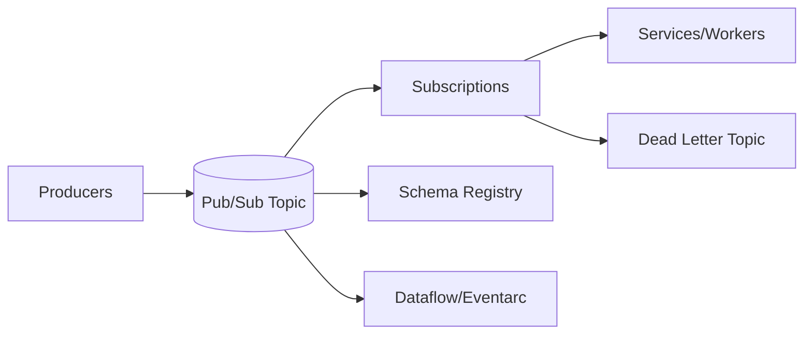

# Pub/Sub Guide – Basic → Architect

## Level 1 – Launch & Basics

### 1. Quick Start
```bash
gcloud config set project <PROJECT_ID>
gcloud pubsub topics create demo
gcloud pubsub subscriptions create demo-sub --topic=demo
gcloud pubsub topics publish demo --message="hello"
gcloud pubsub subscriptions pull demo-sub --auto-ack
```

### 2. Core Concepts
- Topics, subscriptions; push vs pull; ordering keys; message retention/ack deadlines
- At-least-once delivery; exactly-once requires idempotent consumers

### 3. Client Basics
- Use client libraries; set ack deadlines; handle retries

## Level 2 – Production Patterns

### Producers
- Batch settings; ordering keys if required; retries with backoff
- Attributes for routing/metadata; size limits awareness

### Consumers
- Concurrency tuned; ack deadline extensions; flow control
- Dead-letter topics for poison pills; exponential backoff
- Idempotency in downstream; dedupe keys

### Subscriptions & Retention
- Configure retention; seek to timestamp/snapshot for recovery
- Filtering subscriptions to reduce consumer load

## Level 3 – Architect Playbook

### Reliability & Scale
- High-throughput pull with streaming pull; push with JWT validation
- Ordering: one subscriber per ordering key; handle out-of-order gracefully
- SLOs on end-to-end latency; monitor backlog

### Security & Governance
- IAM per topic/sub; VPC-SC if needed; private service connect for on-prem?
- CMEK optional; audit logs; org policies to restrict public

### Integrations
- Eventarc/Cloud Run/Functions; Dataflow for streaming pipelines
- Schema Registry (Pub/Sub schemas) for validation

## Ops Cheat Sheet

| Task | Command | Note |
| --- | --- | --- |
| Create topic | `gcloud pubsub topics create ...` | setup |
| Create sub | `gcloud pubsub subscriptions create ...` | consumer |
| Publish | `gcloud pubsub topics publish ...` | produce |
| Pull | `gcloud pubsub subscriptions pull ...` | consume |
| Seek | `gcloud pubsub subscriptions seek ...` | recovery |

## Architecture Patterns



## Checklist Before Production
- [ ] Ordering only when needed; batch tuned; attributes used
- [ ] DLQ configured; retries/backoff; idempotent consumers
- [ ] Ack deadlines/flow control tuned; backlog alerts
- [ ] IAM least privilege; schema validation if used; audit logs
- [ ] Retention set; seek/backup strategy known

## Learning Path Links
- Track: `LearningTracks/Data-Engineer-GCP/track.md`
- Projects: `Projects/GCP-DataEngineer/starter/04-pubsub-streaming-to-bq.md` and `Projects/Integrated/data-engineer-gcp-capstone.md`
- Mastery: `Mastery/GCP-PubSub/` (quiz, scenarios, flashcards)

