# Cloud Spanner Visual Guide

## Cloud Spanner Global Architecture

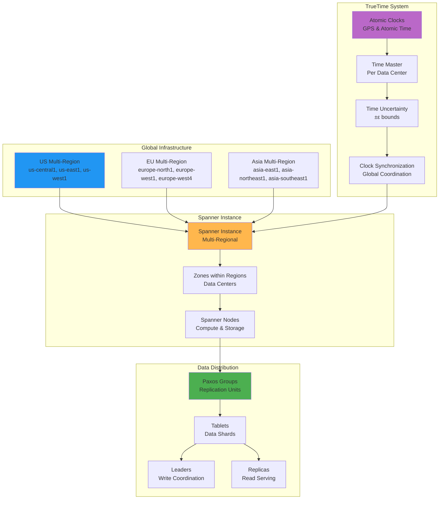

## TrueTime and External Consistency

```mermaid
graph LR
    subgraph "TrueTime Architecture"
        GPS_CLOCKS[GPS Clocks<br/>Satellite Time]
        ATOMIC_CLOCKS[Atomic Clocks<br/>Ground-based Time]
        TIME_MASTERS[Time Masters<br/>Per Data Center]
        DAEMONS[Time Daemons<br/>Per Machine]
    end

    subgraph "Time Coordination"
        EARLIEST[Earliest Time<br/>T_earliest]
        LATEST[Latest Time<br/>T_latest]
        UNCERTAINTY[Uncertainty<br/>ε = T_latest - T_earliest]
        SYNCHRONIZED[Synchronized Time<br/>Global Consistency]
    end

    subgraph "Transaction Ordering"
        START[Transaction Start<br/>Get Timestamp]
        EXECUTE[Execute Operations<br/>Within ε bounds]
        COMMIT[Commit Timestamp<br/>T_commit ∈ [T_earliest, T_latest]]
        EXTERNAL[External Consistency<br/>Serializable Order]
    end

    GPS_CLOCKS --> TIME_MASTERS
    ATOMIC_CLOCKS --> TIME_MASTERS
    TIME_MASTERS --> DAEMONS

    DAEMONS --> EARLIEST
    DAEMONS --> LATEST
    EARLIEST --> UNCERTAINTY
    LATEST --> UNCERTAINTY
    UNCERTAINTY --> SYNCHRONIZED

    SYNCHRONIZED --> START
    START --> EXECUTE
    EXECUTE --> COMMIT
    COMMIT --> EXTERNAL

    style GPS_CLOCKS fill:#2196f3
    style EARLIEST fill:#ffb74d
    style START fill:#4caf50
    style COMMIT fill:#ba68c8
```

## Paxos-Based Replication

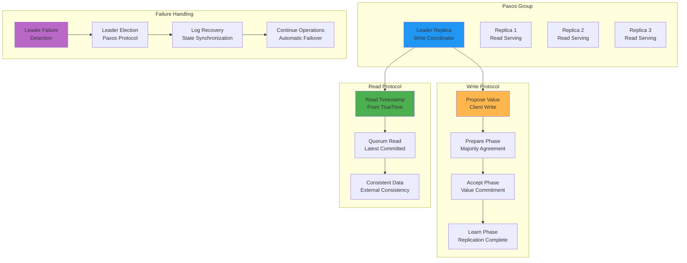

## Data Model and Interleaving

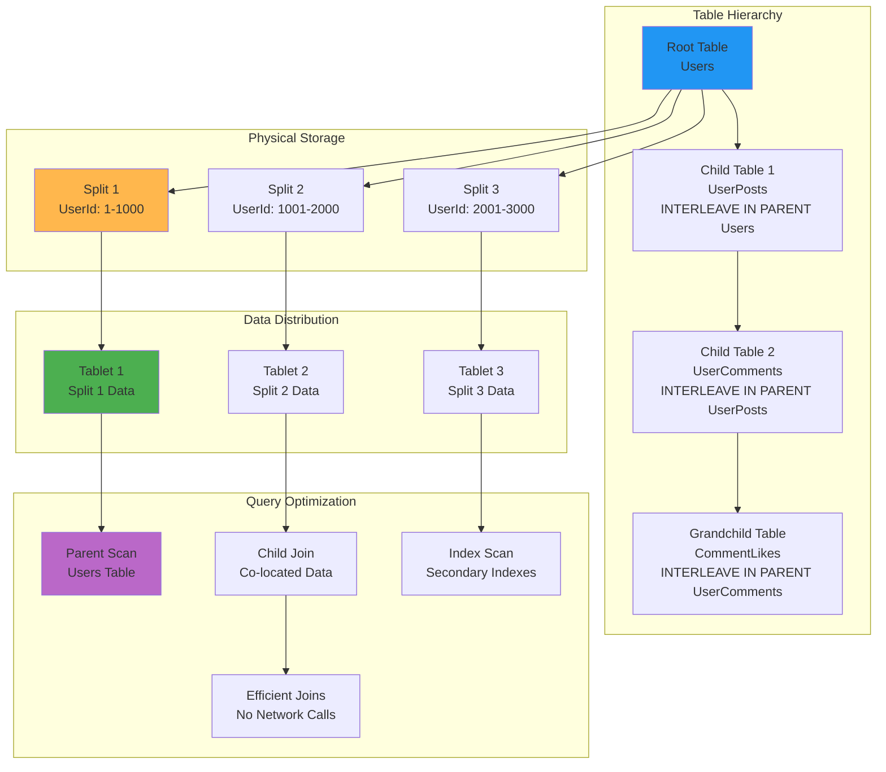

## Multi-Region Deployment Architecture

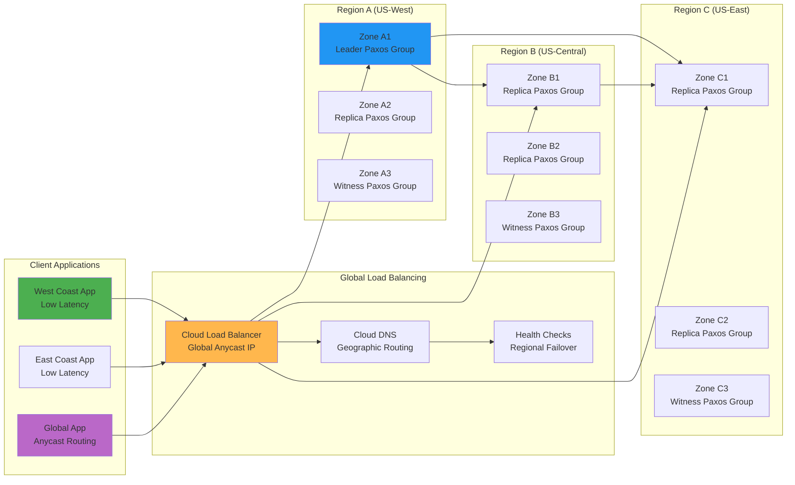

## Transaction Processing Flow

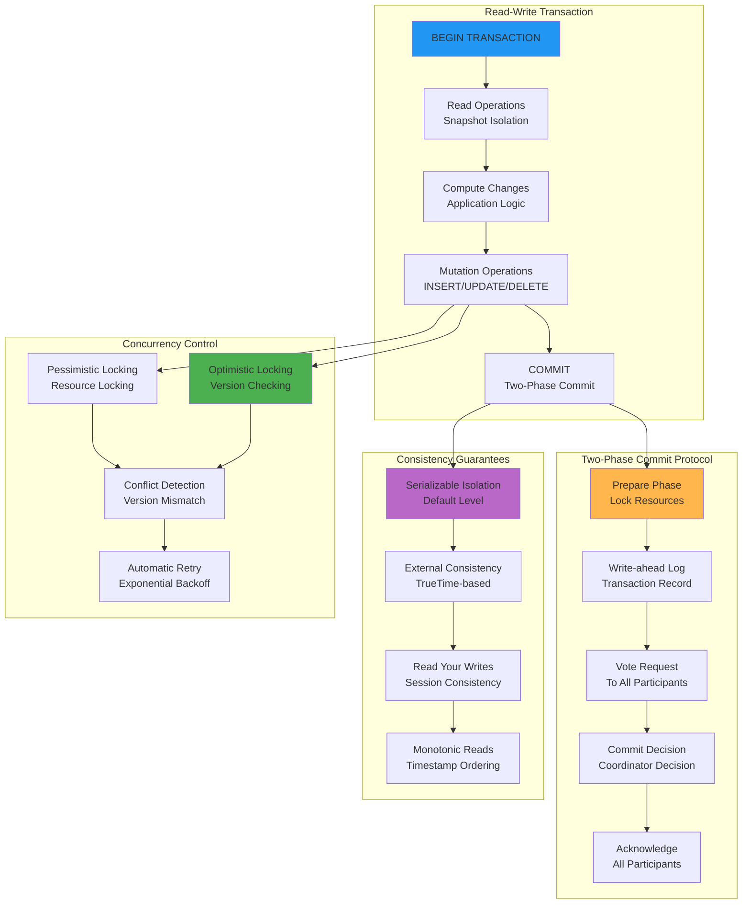

## Query Execution and Optimization

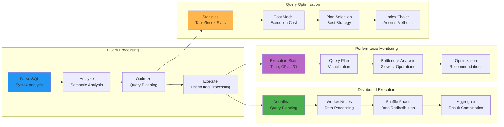

## Change Streams and Real-Time Processing

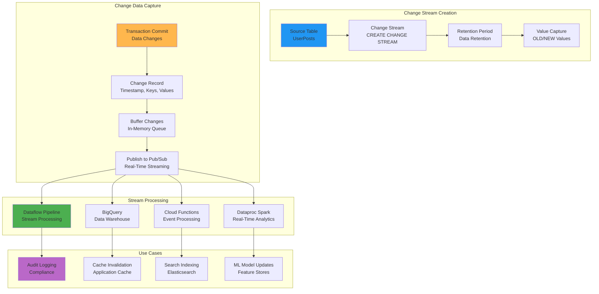

## Backup and Recovery Architecture

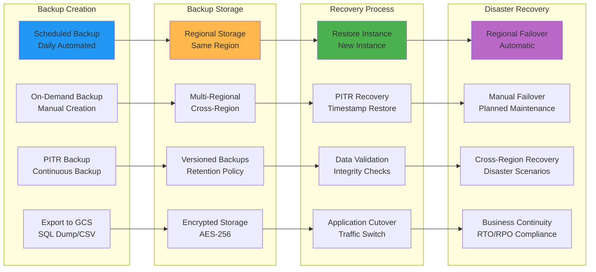

## Performance Monitoring Dashboard

```mermaid
graph TD
    subgraph "System Metrics"
        CPU_UTIL[CPU Utilization<br/>Processing Units]
        STORAGE_UTIL[Storage Utilization<br/>GB Used/Total]
        NETWORK_IO[Network I/O<br/>Read/Write Throughput]
        LATENCY[Query Latency<br/>P50, P95, P99]
    end

    subgraph "Database Metrics"
        ACTIVE_CONNECTIONS[Active Connections<br/>Concurrent Sessions]
        TRANSACTION_RATE[Transaction Rate<br/>TPS/QPS]
        LOCK_CONFLICTS[Lock Conflicts<br/>Deadlocks/Timeouts]
        QUERY_DISTRIBUTION[Query Distribution<br/>Read/Write Mix]
    end

    subgraph "SLA Compliance"
        AVAILABILITY[Availability<br/>Uptime Percentage]
        LATENCY_SLA[Latency SLA<br/>Response Time]
        THROUGHPUT_SLA[Throughput SLA<br/>Operations/Second]
        ERROR_RATE[Error Rate<br/>Failed Operations]
    end

    subgraph "Optimization Insights"
        SLOW_QUERIES[Slow Queries<br/>Top 10 by Time]
        INDEX_EFFICIENCY[Index Efficiency<br/>Usage Statistics]
        SCHEMA_RECOMMENDATIONS[Schema Recommendations<br/>Interleaving/Indexing]
        CAPACITY_PLANNING[Capacity Planning<br/>Scaling Recommendations]
    end

    CPU_UTIL --> AVAILABILITY
    STORAGE_UTIL --> THROUGHPUT_SLA
    NETWORK_IO --> LATENCY_SLA
    LATENCY --> ERROR_RATE

    ACTIVE_CONNECTIONS --> SLOW_QUERIES
    TRANSACTION_RATE --> INDEX_EFFICIENCY
    LOCK_CONFLICTS --> SCHEMA_RECOMMENDATIONS
    QUERY_DISTRIBUTION --> CAPACITY_PLANNING

    style CPU_UTIL fill:#2196f3
    style ACTIVE_CONNECTIONS fill:#ffb74d
    style AVAILABILITY fill:#4caf50
    style SLOW_QUERIES fill:#ba68c8
```

## Cost Optimization Strategies

```mermaid
graph TD
    A[Spanner Cost Optimization] --> B[Compute Optimization]
    A --> C[Storage Optimization]
    A --> D[Query Optimization]
    A --> E[Architecture Optimization]

    B --> B1[Processing Units<br/>Right-size capacity]
    B --> B2[Auto-scaling<br/>Scale with demand]
    B --> B3[Regional vs Multi-regional<br/>Cost vs availability]
    B --> B4[Peak/off-peak usage<br/>Schedule heavy operations]

    C --> C1[Data compression<br/>Automatic optimization]
    C --> C2[Backup retention<br/>Configure appropriate periods]
    C --> C3[Data lifecycle<br/>Archive old data]
    C --> C4[Storage efficiency<br/>Schema optimization]

    D --> D1[Query optimization<br/>Efficient SQL]
    D --> D2[Index usage<br/>Proper indexing]
    D --> D3[Read-only transactions<br/>For analytics]
    D --> D4[Batch operations<br/>Partitioned DML]

    E --> E1[Schema design<br/>Interleaved tables]
    E --> E2[Data distribution<br/>Key design]
    E --> E3[Workload isolation<br/>Separate instances]
    E --> E4[Change streams<br/>Efficient CDC]

    style A fill:#2196f3
    style B fill:#ffb74d
    style C fill:#4caf50
    style D fill:#ba68c8
    style E fill:#2196f3
```

## Security and Compliance Architecture

```mermaid
graph TB
    subgraph "Access Control"
        IAM[IAM Roles<br/>spanner.databaseAdmin]
        DATABASE_USERS[Database Users<br/>GRANT/REVOKE]
        SERVICE_ACCOUNTS[Service Accounts<br/>Application Identity]
        AUDIT_LOGS[Audit Logs<br/>Cloud Logging]
    end

    subgraph "Data Protection"
        ENCRYPTION_AT_REST[Encryption at Rest<br/>AES-256]
        ENCRYPTION_IN_TRANSIT[Encryption in Transit<br/>TLS 1.2+]
        CMEK[Customer-Managed Keys<br/>Cloud KMS]
        BACKUP_ENCRYPTION[Backup Encryption<br/>Automatic]
    end

    subgraph "Network Security"
        VPC_NETWORK[VPC Networks<br/>Private Connectivity]
        SERVICE_CONTROLS[VPC Service Controls<br/>Data Exfiltration Prevention]
        PRIVATE_ENDPOINTS[Private Endpoints<br/>Secure Access]
        FIREWALL_RULES[Firewall Rules<br/>Access Control]
    end

    subgraph "Compliance"
        SOC2[SOC 2 Compliance<br/>Security Controls]
        HIPAA[HIPAA Compliance<br/>Healthcare Data]
        PCI_DSS[PCI DSS Compliance<br/>Payment Data]
        GDPR[GDPR Compliance<br/>Data Privacy]
    end

    IAM --> SERVICE_ACCOUNTS
    SERVICE_ACCOUNTS --> DATABASE_USERS
    DATABASE_USERS --> AUDIT_LOGS

    ENCRYPTION_AT_REST --> CMEK
    ENCRYPTION_IN_TRANSIT --> BACKUP_ENCRYPTION

    VPC_NETWORK --> SERVICE_CONTROLS
    SERVICE_CONTROLS --> PRIVATE_ENDPOINTS
    PRIVATE_ENDPOINTS --> FIREWALL_RULES

    SOC2 --> HIPAA
    HIPAA --> PCI_DSS
    PCI_DSS --> GDPR

    style IAM fill:#2196f3
    style ENCRYPTION_AT_REST fill:#ffb74d
    style VPC_NETWORK fill:#4caf50
    style SOC2 fill:#ba68c8
```

## Integration with GCP Ecosystem

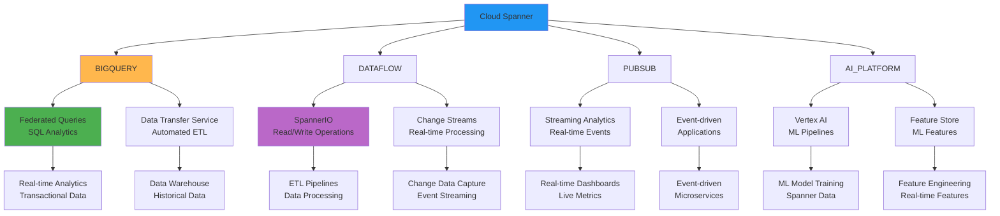

This visual guide illustrates Cloud Spanner's unique architecture combining relational database semantics with global scale, highlighting its TrueTime-based consistency, Paxos replication, and integration with the broader Google Cloud ecosystem.
