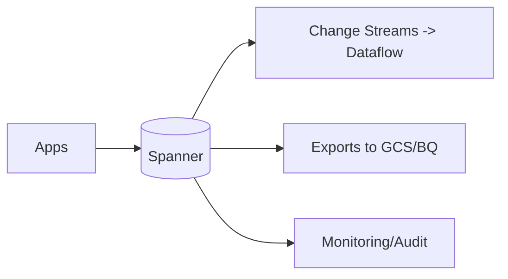

# Spanner Guide – Basic → Architect

## Level 1 – Launch & Basics

### 1. Quick Instance
```bash
gcloud spanner instances create demo --config=regional-us-central1 --description="demo" --nodes=1
gcloud spanner databases create mydb --instance=demo --ddl="CREATE TABLE users (id STRING(36) NOT NULL, name STRING(100)) PRIMARY KEY(id)"
```

### 2. Core Concepts
- Regional vs multi-region configs; nodes vs processing units
- Strong and bounded-staleness reads; TrueTime; schema-first
- Interleaving for locality; secondary indexes

### 3. Basic Query
```bash
gcloud spanner databases execute-sql mydb --instance=demo --sql="SELECT COUNT(*) FROM users"
```

## Level 2 – Production Patterns

### Schema & Modeling
- Normalize with interleaved tables for locality; beware hotspots
- Use secondary indexes; staleness for read scale
- Mutation batching; commit size awareness

### Performance
- Right-size nodes; watch CPU/latency; hot partition mitigation
- Query plans via `EXPLAIN`; limit cross-partition scans
- Change streams for downstream; avoid large transactions

### Security
- IAM at instance/db; CMEK; audit logs
- Client retries with backoff; idempotent mutations where possible

## Level 3 – Architect Playbook

### Reliability & Scale
- Multi-region for HA; RPO=0, low RTO
- Online schema changes; DDL batches; avoid lock contention
- Change streams for CDC; Dataflow connectors

### Cost & Governance
- Scale nodes up/down; autoscaling where available
- Query budgeting via limits; monitor storage growth

### Integration
- JDBC/gRPC clients; ORMs limited—prefer direct SQL
- ETL via Dataflow/DBT; exports to GCS

## Ops Cheat Sheet

| Task | Command | Note |
| --- | --- | --- |
| List instances | `gcloud spanner instances list` | inventory |
| Query | `gcloud spanner databases execute-sql ...` | SQL |
| DDL | `gcloud spanner databases ddl update ...` | schema |
| Change streams | enable per table | CDC |
| Scale | `gcloud spanner instances update ... --nodes` | capacity |

## Architecture Patterns



## Checklist Before Production
- [ ] Schema reviewed for locality; avoid hotspots; indexes defined
- [ ] Capacity sized; autoscaling/alerts on latency/CPU
- [ ] IAM least privilege; CMEK if required; audit logs on
- [ ] Client retries/backoff; idempotent mutations; bounded staleness where ok
- [ ] DR/HA via regional/multi-region config; change streams if needed

## Learning Path Links
- Track: `LearningTracks/Backend-GCP/track.md`
- Projects: `Projects/GCP-Backend/starter/04-spanner-basic.md` and `Projects/Integrated/backend-gcp-capstone.md`
- Mastery: `Mastery/GCP-Spanner/` (quiz, scenarios, flashcards)

