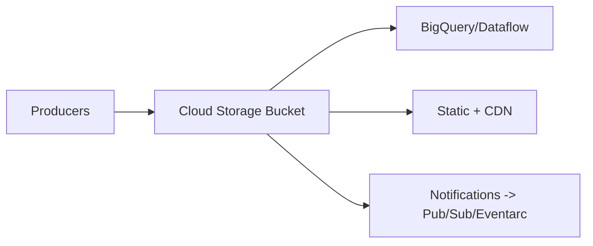

# Cloud Storage (Legacy Variant) Guide – Basic → Architect

> Note: For new workloads, use `GCP/Cloud-Storage`. This file covers the legacy/duplicated path to maintain completeness; content aligns with the main guide.

## Level 1 – Launch & Basics

### 1. Quick Setup
```bash
gsutil mb -l us-central1 gs://my-bucket
gsutil cp file.txt gs://my-bucket/
```

### 2. Core Concepts
- Buckets (location/class), objects, uniform access, versioning
- Storage classes: Standard/Nearline/Coldline/Archive

### 3. Basic Ops
```bash
gsutil ls gs://my-bucket
gsutil cp -r data/ gs://my-bucket/data/
```

## Level 2 – Production Patterns
- IAM over ACLs; uniform bucket-level access
- Signed URLs; VPC-SC for egress guardrails
- Lifecycle rules for tiering; versioning/retention policies
- Performance: parallel/composite uploads; regional buckets close to compute

## Level 3 – Architect Playbook
- CMEK for sensitive data; audit logs; access reviews
- Event notifications (Pub/Sub/Eventarc); static hosting + CDN
- DR: cross-region/dual-region; backups via versioning/exports
- Monitoring: errors/egress; cost controls

## Ops Cheat Sheet
- `gsutil mb/ls/cp/rsync/lifecycle/signurl`
- Versioning: `gsutil versioning set on gs://bucket`
- Lifecycle: `gsutil lifecycle set rule.json gs://bucket`

## Architecture Patterns


## Checklist Before Production
- [ ] Uniform access; IAM least privilege; CMEK if required
- [ ] Lifecycle + versioning/retention set; signed URLs/CDN as needed
- [ ] VPC-SC for sensitive data; audit logs on
- [ ] Monitoring/alerts on errors/egress; cost guardrails

