# VPC - Visual Architecture

## VPC Network Architecture

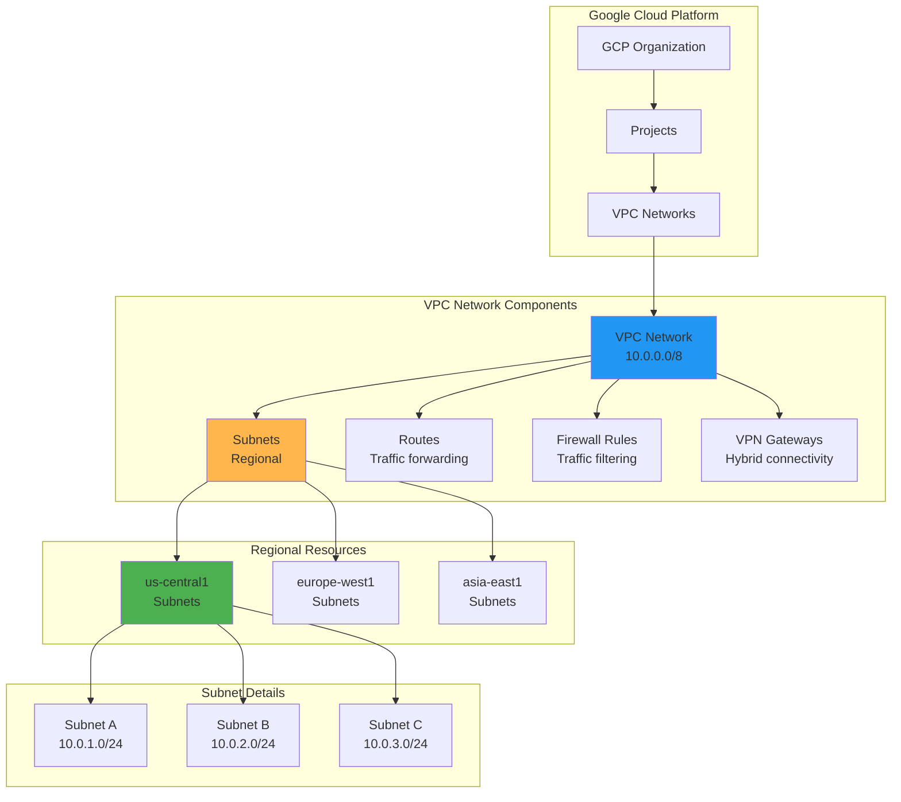

## Auto Mode vs Custom Mode VPC

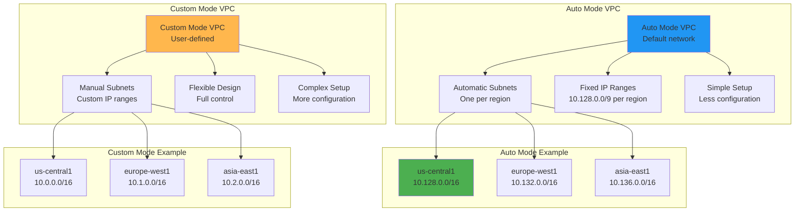

## Subnet Architecture

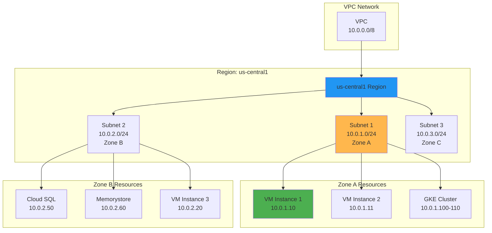

## Routing Architecture

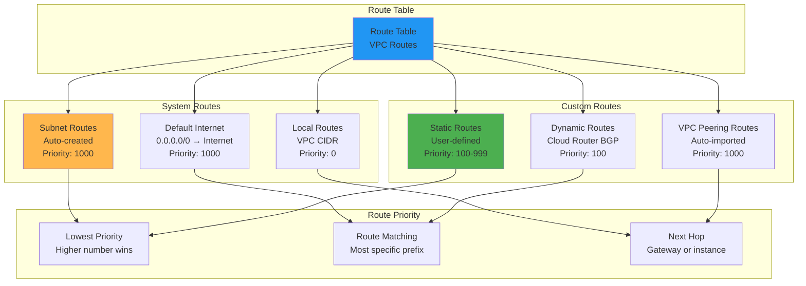

## Firewall Rules Architecture

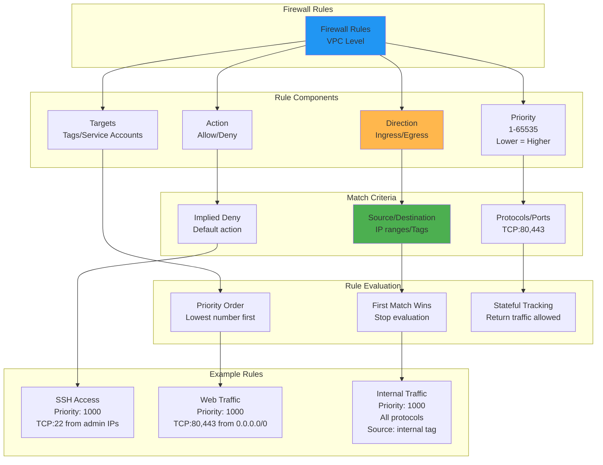

## VPC Peering Architecture

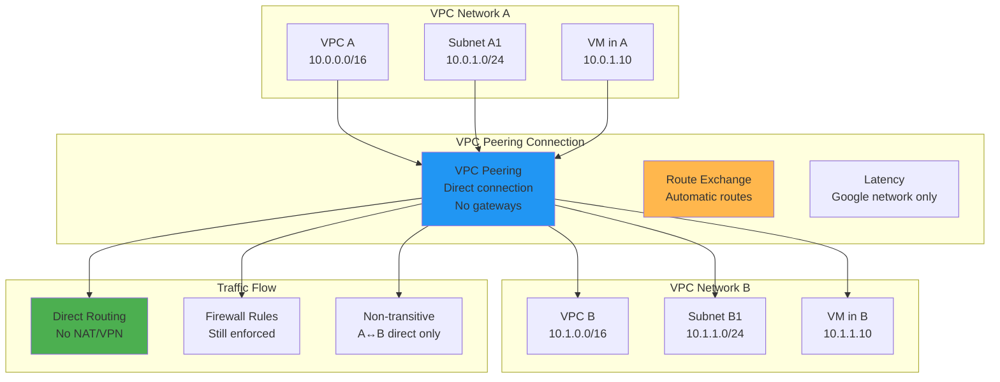

## Shared VPC Architecture

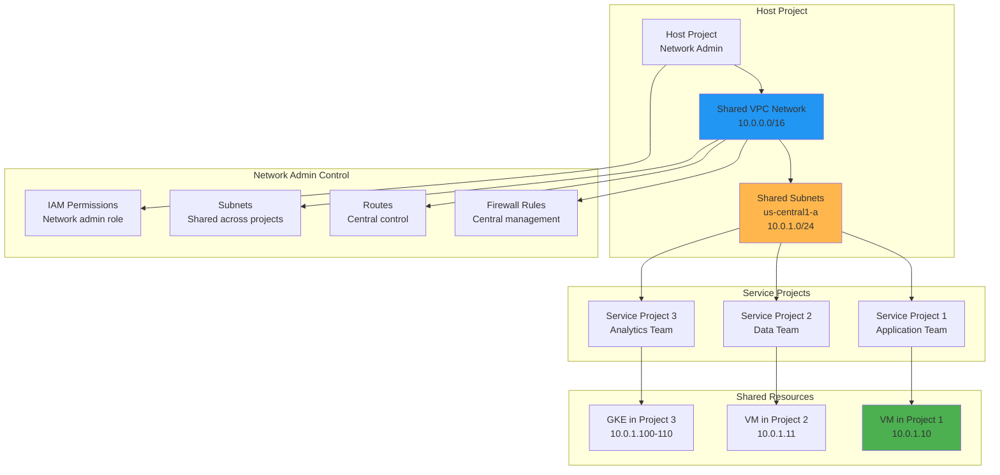

## Hybrid Connectivity

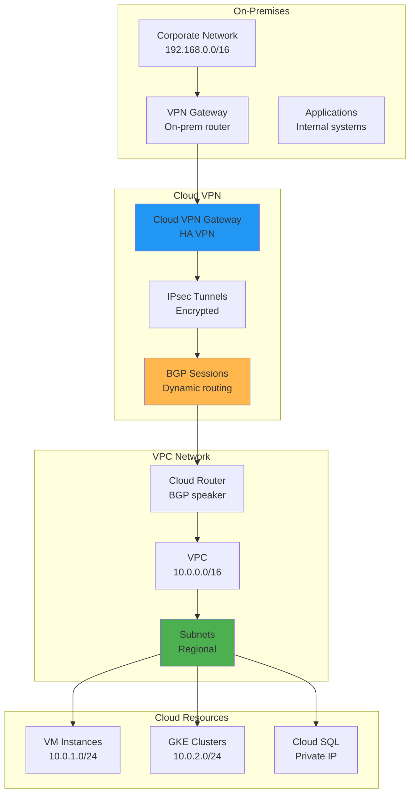

## Cloud Interconnect

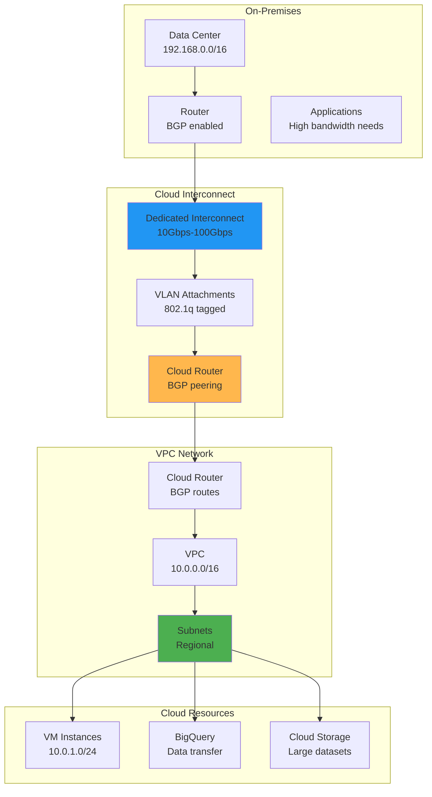

## Private Google Access

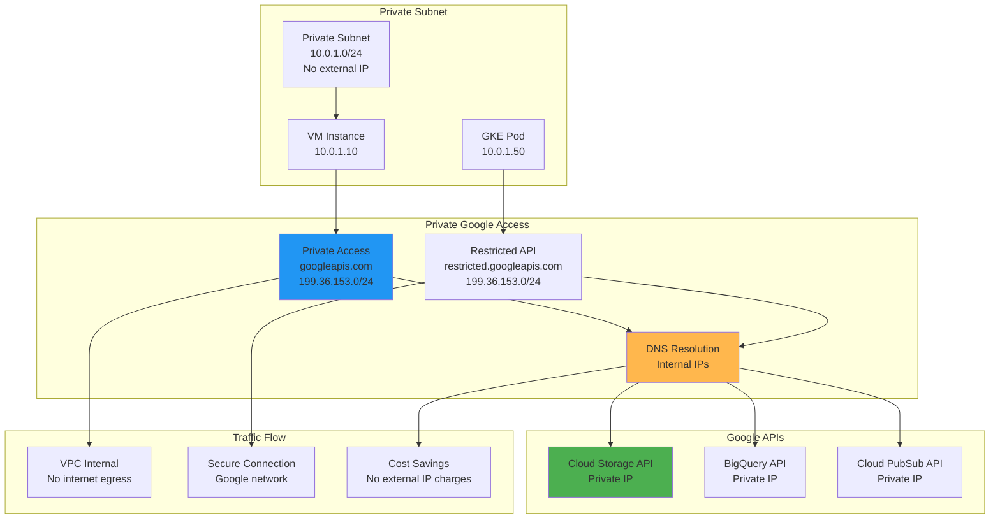

## Cloud NAT Architecture

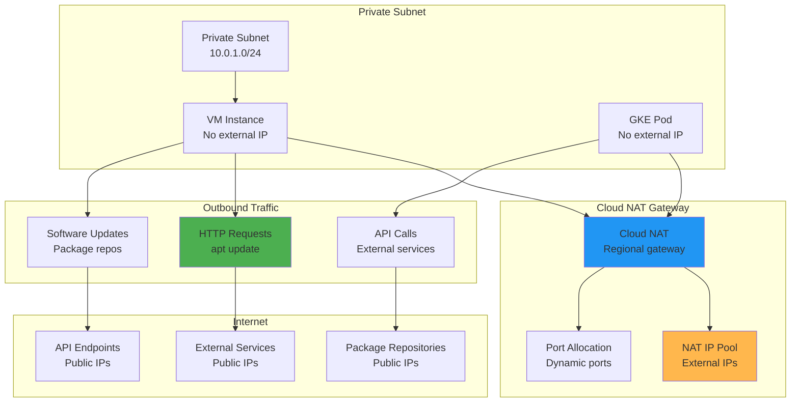

## Multi-Environment Architecture

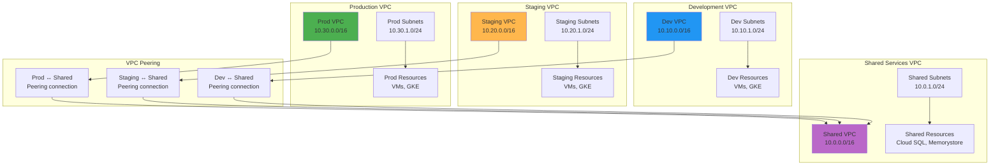

## Network Security Architecture

```mermaid
graph TD
    subgraph "Internet"
        A[External Traffic<br/>0.0.0.0/0]
    end

    subgraph "Cloud Armor"
        B[Cloud Armor<br/>WAF & DDoS]
        C[Security Policies<br/>Rate limiting]
        D[Custom Rules<br/>IP blocking]
    end

    subgraph "Load Balancer"
        E[HTTP(S) Load Balancer<br/>Global distribution]
        F[SSL Termination<br/>Certificate validation]
        G[Health Checks<br/>Backend monitoring]
    end

    subgraph "VPC Network"
        H[VPC Firewall<br/>Network level]
        I[Network Tags<br/>Instance grouping]
        J[Service Accounts<br/>Identity-based]
    end

    subgraph "Subnet Isolation"
        K[Public Subnet<br/>DMZ resources]
        L[Private Subnet<br/>Application tier]
        M[Database Subnet<br/>Data layer]
    end

    subgraph "Instance Level"
        N[OS Firewall<br/>iptables]
        O[Endpoint Verification<br/>Device security]
        P[IAM Permissions<br/>Access control]
    end

    A --> B
    B --> C
    C --> D
    D --> E
    E --> F
    F --> G
    G --> H
    H --> I
    I --> J
    J --> K
    K --> L
    L --> M
    M --> N
    N --> O
    O --> P

    style B fill:#2196f3
    style E fill:#ffb74d
    style H fill:#4caf50
    style K fill:#ba68c8
```

## VPC Flow Logs

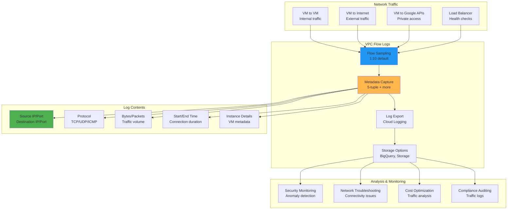

## Global VPC with Cross-Region Connectivity

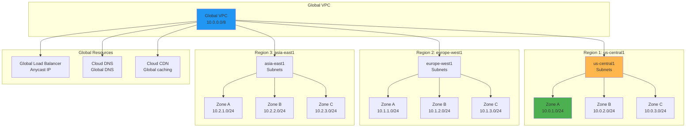

These diagrams illustrate the comprehensive VPC architecture in Google Cloud, showing how networks are structured, how traffic flows, and how various connectivity and security features work together to create secure, scalable network environments.
