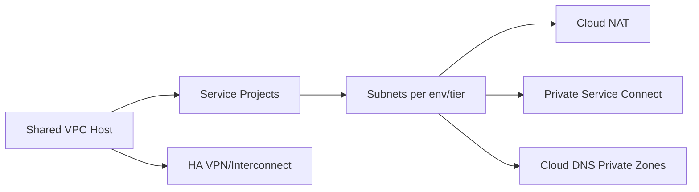

# VPC Guide – Basic → Architect

## Level 1 – Launch & Basics

### 1. Quick Network
```bash
gcloud compute networks create demo --subnet-mode=custom
gcloud compute networks subnets create demo-subnet --network=demo --range=10.10.0.0/20 --region=us-central1
```

### 2. Core Concepts
- Global VPC; subnets are regional
- Primary/secondary IP ranges; private services access
- Firewall rules (stateful), routes, tags/service accounts

### 3. Basic Ops
```bash
gcloud compute firewall-rules create demo-allow-ssh --network=demo --allow=tcp:22
gcloud compute routes list --filter="network:demo"
```

## Level 2 – Production Patterns

### Network Design
- Hub-and-spoke with Shared VPC for multi-project orgs
- Separate subnets per tier/env; non-overlapping CIDRs
- Private Google Access; Cloud NAT for egress

### Security
- Firewall least privilege; service account-based rules preferred
- Hierarchical firewall policies (org/folder)
- VPC Service Controls for data exfiltration guardrails

### Connectivity
- Private Service Connect/PEERING for managed services
- VPN/Interconnect for on-prem; HA VPN preferred
- DNS: Cloud DNS private zones; split-horizon

## Level 3 – Architect Playbook

### Governance & Operations
- Org policies: restrict external IPs, allowed services/regions
- Flow logs; log and alert on denied traffic
- Standardized naming/tags/labels; Terraform modules

### High Availability & DR
- Redundant VPN/Interconnect; route priorities/weights
- Plan for overlapping IPs with NAT if needed

### Cost & Performance
- Minimize cross-region traffic; right-size NAT; review egress

## Ops Cheat Sheet

| Task | Command | Note |
| --- | --- | --- |
| Create VPC | `gcloud compute networks create ...` | custom mode |
| Create subnet | `gcloud compute networks subnets create ...` | CIDR |
| Firewall | `gcloud compute firewall-rules create ...` | allow/deny |
| NAT | `gcloud compute routers nats create ...` | egress |
| Flow logs | enable on subnets | observability |

## Architecture Patterns



## Checklist Before Production
- [ ] Shared VPC or clear VPC per env; non-overlapping CIDRs
- [ ] Firewall least privilege; SA-based rules; hierarchical policies
- [ ] Private Google Access; Cloud NAT for egress; PSC for services
- [ ] Flow logs enabled; alerts on denies; org policies for external IPs
- [ ] HA VPN/Interconnect planned; DNS design in place

## Learning Path Links
- Track: `LearningTracks/Backend-GCP/track.md`
- Projects: `Projects/GCP-Backend/` and `Projects/Integrated/backend-gcp-capstone.md`
- Mastery: `Mastery/GCP-VPC/` (quiz, scenarios, flashcards)

