# Vertex AI Visual Architecture and Diagrams

## Overview

This document provides visual representations of Vertex AI architecture, ML pipelines, and integration patterns using Mermaid diagrams.

## Core Platform Architecture

### Vertex AI Unified Platform

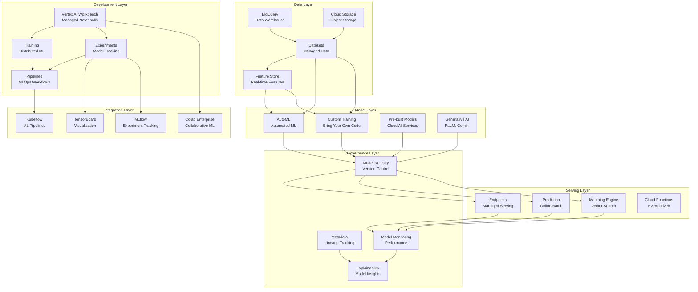

### ML Development Workflow

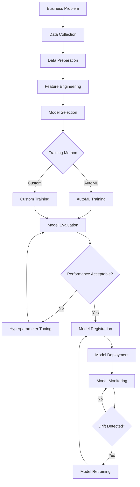

## Model Training Architectures

### Distributed Training Architecture

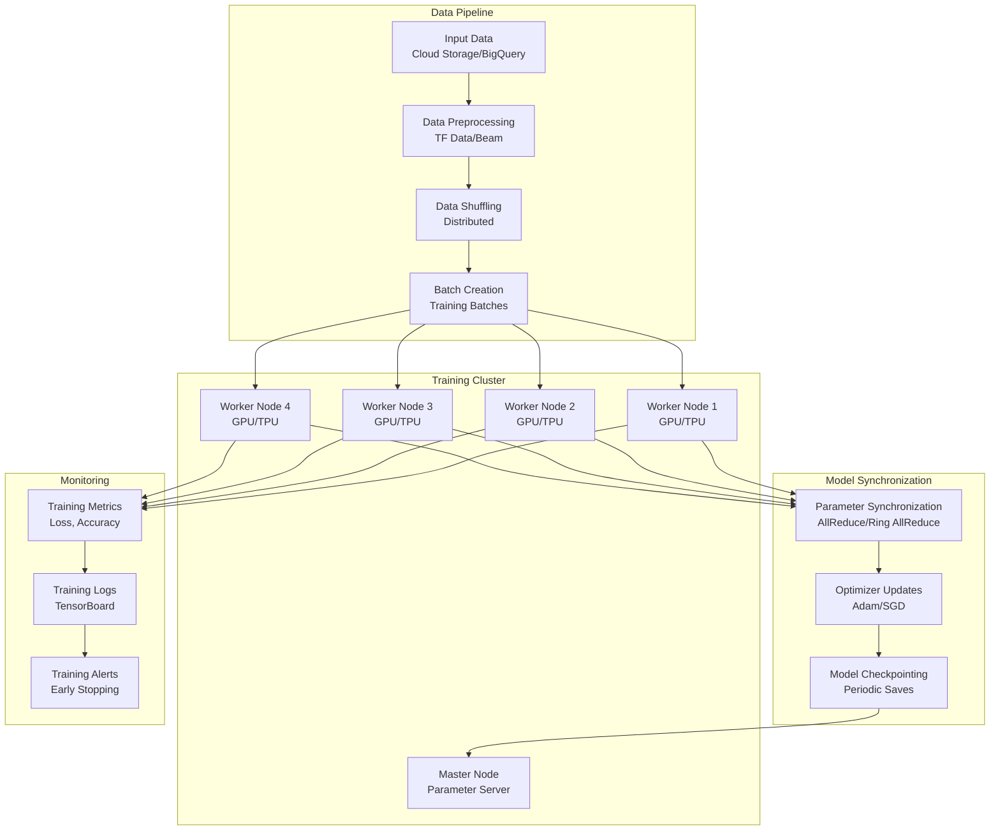

### AutoML Training Pipeline

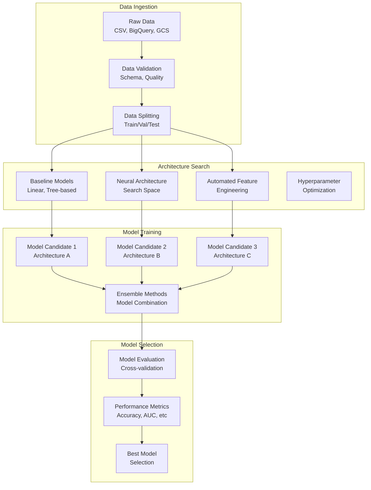

## Model Serving Patterns

### Online Prediction Architecture

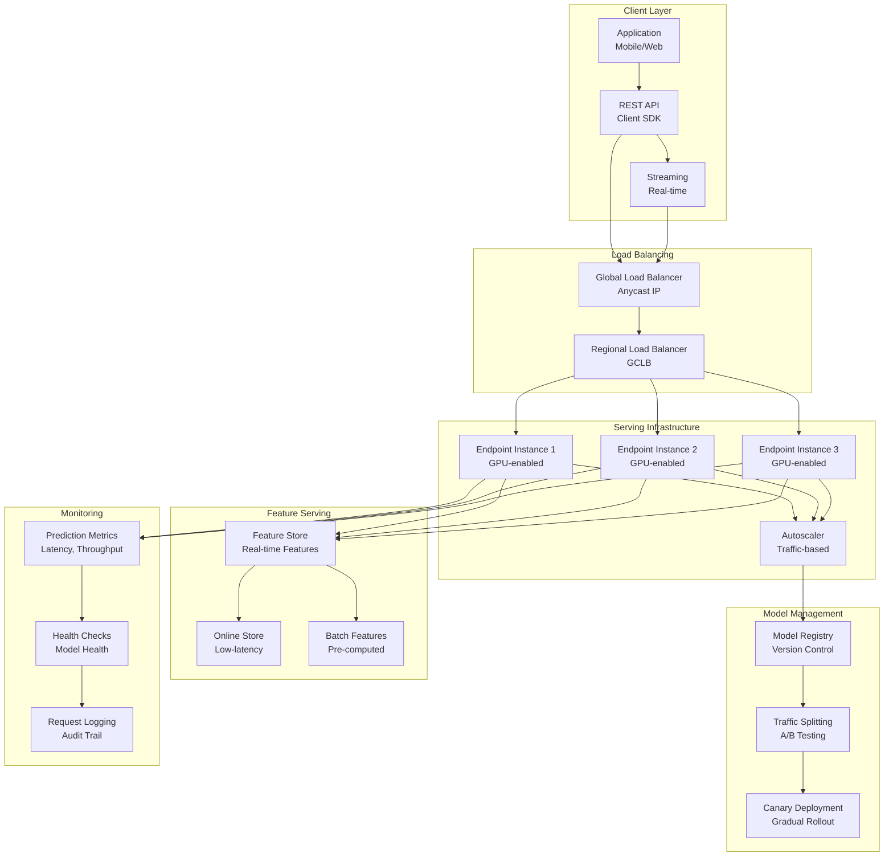

### Batch Prediction Architecture

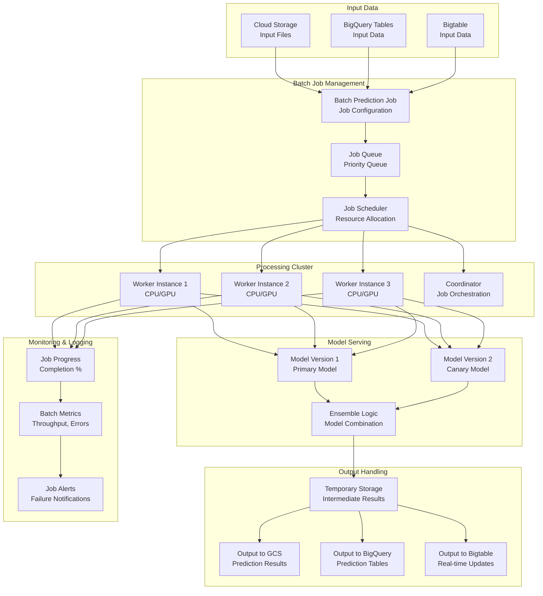

## MLOps Pipeline Architecture

### End-to-End ML Pipeline

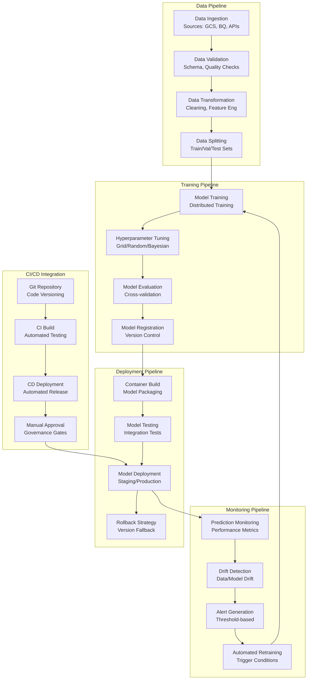

### Feature Store Architecture

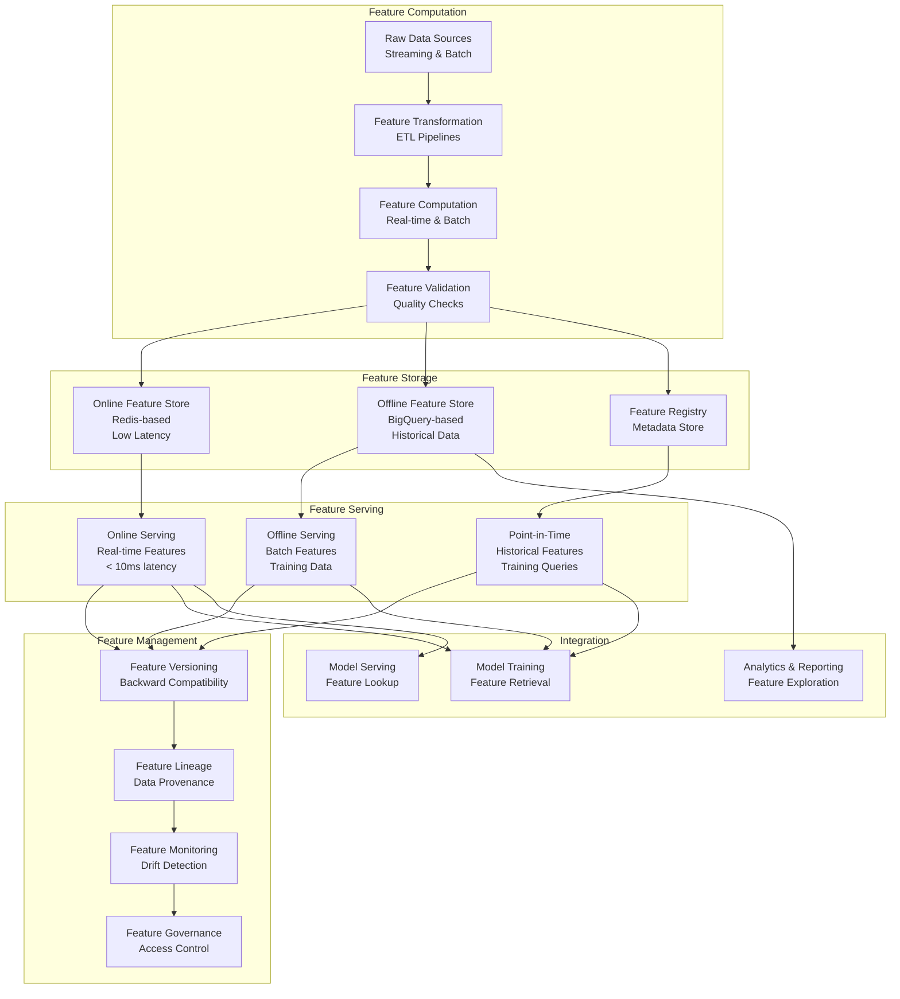

## Integration Patterns

### Vertex AI with Cloud AI Services

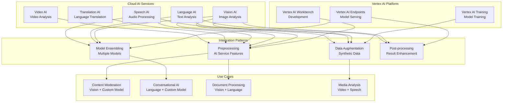

### Generative AI Integration

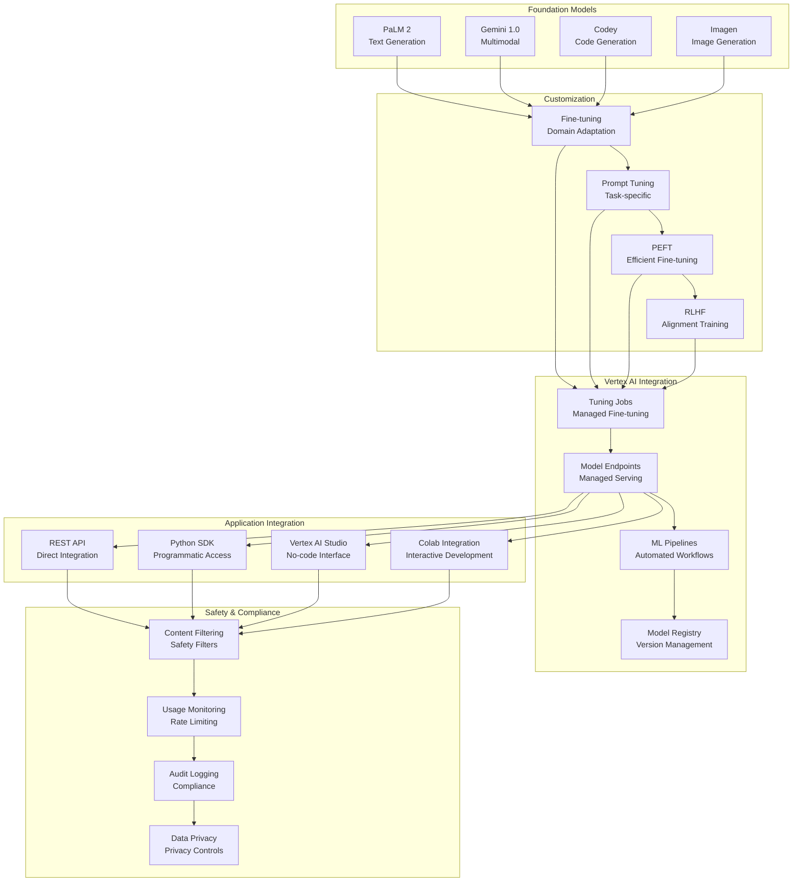

## Performance and Cost Optimization

### Resource Optimization Architecture

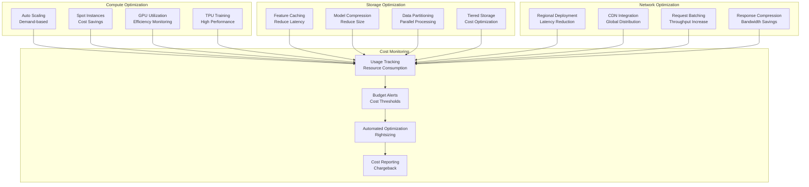

### Model Monitoring Dashboard

```mermaid
graph TD
    subgraph "Model Performance"
        Accuracy[Model Accuracy<br/>Prediction Quality]
        Latency[Prediction Latency<br/>Response Time]
        Throughput[Throughput<br/>Requests/Second]
        ErrorRate[Error Rate<br/>Failure Percentage]
    end

    subgraph "Data Quality"
        FeatureDrift[Feature Drift<br/>Input Distribution]
        LabelDrift[Label Drift<br/>Output Distribution]
        DataIntegrity[Data Integrity<br/>Missing Values]
        OutlierDetection[Outlier Detection<br/>Anomalous Inputs]
    end

    subgraph "System Health"
        ResourceUtil[Resource Utilization<br/>CPU, Memory, GPU]
        EndpointHealth[Endpoint Health<br/>Availability]
        DependencyHealth[Dependency Health<br/>External Services]
        AlertStatus[Alert Status<br/>Active Alerts]
    end

    subgraph "Business Metrics"
        ConversionRate[Conversion Rate<br/>Business Impact]
        UserSatisfaction[User Satisfaction<br/>Quality Scores]
        CostPerPrediction[Cost per Prediction<br/>Efficiency]
        SLACompliance[SLA Compliance<br/>Uptime Metrics]
    end

    subgraph "Alerting & Response"
        ThresholdAlerts[Threshold Alerts<br/>Metric-based]
        AnomalyAlerts[Anomaly Detection<br/>Statistical]
        Escalation[Alert Escalation<br/>Severity Levels]
        AutoRemediation[Auto Remediation<br/>Automated Fixes]
    end

    Accuracy --> ThresholdAlerts
    Latency --> ThresholdAlerts
    Throughput --> ThresholdAlerts
    ErrorRate --> ThresholdAlerts

    FeatureDrift --> AnomalyAlerts
    LabelDrift --> AnomalyAlerts
    DataIntegrity --> AnomalyAlerts
    OutlierDetection --> AnomalyAlerts

    ResourceUtil --> ThresholdAlerts
    EndpointHealth --> ThresholdAlerts
    DependencyHealth --> ThresholdAlerts

    ConversionRate --> ThresholdAlerts
    UserSatisfaction --> ThresholdAlerts
    CostPerPrediction --> ThresholdAlerts
    SLACompliance --> ThresholdAlerts

    ThresholdAlerts --> Escalation
    AnomalyAlerts --> Escalation
    Escalation --> AutoRemediation
```

## Security Architecture

### ML Security Framework

```mermaid
graph TD
    subgraph "Data Security"
        Encryption[Data Encryption<br/>At Rest & Transit]
        AccessControl[Access Control<br/>IAM Policies]
        DataMasking[Data Masking<br/>PII Protection]
        AuditLogging[Audit Logging<br/>Access Tracking]
    end

    subgraph "Model Security"
        ModelEncryption[Model Encryption<br/>Intellectual Property]
        CodeSigning[Code Signing<br/>Integrity Verification]
        SupplyChain[Supply Chain Security<br/>Trusted Sources]
        VulnerabilityScan[Vulnerability Scanning<br/>Security Assessment]
    end

    subgraph "Runtime Security"
        EndpointSecurity[Endpoint Security<br/>API Protection]
        RateLimiting[Rate Limiting<br/>DDoS Protection]
        InputValidation[Input Validation<br/>Malicious Input]
        OutputFiltering[Output Filtering<br/>Sensitive Data]
    end

    subgraph "Compliance"
        Regulatory[Regulatory Compliance<br/>GDPR, HIPAA]
        DataResidency[Data Residency<br/>Geographic Controls]
        RetentionPolicies[Retention Policies<br/>Data Lifecycle]
        PrivacyControls[Privacy Controls<br/>Consent Management]
    end

    subgraph "Monitoring & Response"
        SecurityMonitoring[Security Monitoring<br/>Threat Detection]
        IncidentResponse[Incident Response<br/>Breach Handling]
        Forensics[Digital Forensics<br/>Investigation]
        Recovery[Disaster Recovery<br/>Business Continuity]
    end

    Encryption --> SecurityMonitoring
    AccessControl --> SecurityMonitoring
    DataMasking --> SecurityMonitoring
    AuditLogging --> SecurityMonitoring

    ModelEncryption --> SecurityMonitoring
    CodeSigning --> SecurityMonitoring
    SupplyChain --> SecurityMonitoring
    VulnerabilityScan --> SecurityMonitoring

    EndpointSecurity --> SecurityMonitoring
    RateLimiting --> SecurityMonitoring
    InputValidation --> SecurityMonitoring
    OutputFiltering --> SecurityMonitoring

    Regulatory --> IncidentResponse
    DataResidency --> IncidentResponse
    RetentionPolicies --> IncidentResponse
    PrivacyControls --> IncidentResponse

    SecurityMonitoring --> IncidentResponse
    IncidentResponse --> Forensics
    Forensics --> Recovery
```

## Summary

These diagrams illustrate the key architectural patterns in Vertex AI:

1. **Unified Platform**: Integrated ML development, training, and serving
2. **ML Workflows**: End-to-end pipelines from data to production
3. **Training Architectures**: Distributed training and AutoML pipelines
4. **Serving Patterns**: Online and batch prediction architectures
5. **MLOps Integration**: CI/CD pipelines and model governance
6. **Feature Management**: Real-time and offline feature serving
7. **Generative AI**: Integration with foundation models
8. **Performance Optimization**: Resource and cost optimization
9. **Monitoring**: Comprehensive model and system monitoring
10. **Security**: Multi-layered security and compliance framework

These visual representations help understand how Vertex AI components interact and how to design scalable, secure ML systems.
