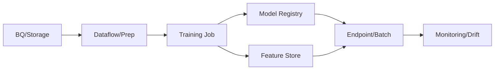

# Vertex AI Guide – Basic → Architect

## Level 1 – Launch & Basics

### 1. Quick Setup
```bash
gcloud config set project <PROJECT_ID>
gcloud services enable aiplatform.googleapis.com
```

### 2. Core Concepts
- Endpoints, Models, Pipelines, Datasets, Feature Store, Model Registry
- Prebuilt models vs custom training; prediction vs batch

### 3. First Prediction (prebuilt)
```bash
gcloud ai endpoints list
# deploy or use existing model, then:
gcloud ai endpoints predict <ENDPOINT_ID> --json-request request.json
```

## Level 2 – Production Patterns

### Training & Deployment
- Custom training on custom containers; use Artifact/Model Registry
- Batch vs online prediction; autoscaling policies
- Use CMEK for sensitive workloads; set traffic splits for canary

### Pipelines & MLOps
- Vertex Pipelines with TFX/Kubeflow or custom components
- CI/CD: build -> train -> evaluate -> register -> deploy
- Model monitoring: data drift, prediction skew; alerting

### Data & Features
- Feature Store for online/offline consistency; TTL and backfills
- Use Dataflow/BigQuery for ETL into training/serving sets

## Level 3 – Architect Playbook

### Governance & Security
- IAM fine-grained: endpoints, models, featurestore
- CMEK, VPC-SC, private service connect
- Audit logs; lineage; versioned models

### Cost & Performance
- Choose appropriate accelerator/CPU; schedule training windows
- Right-size autoscaling; batch for heavy workloads
- Caching/intermediate artifacts in pipelines

### Reliability
- Canary deployments with traffic split; rollback plan
- Health checks and latency/error SLOs

## Ops Cheat Sheet

| Task | Command | Note |
| --- | --- | --- |
| Train | `gcloud ai custom-jobs create` | custom training |
| Deploy | `gcloud ai endpoints deploy-model ...` | online |
| Predict | `gcloud ai endpoints predict ...` | infer |
| Batch | `gcloud ai batch-predictions create ...` | offline |
| Pipelines | `gcloud ai pipelines run ...` | orchestrate |

## Architecture Patterns



## Checklist Before Production
- [ ] Model registered with lineage; versions tracked
- [ ] Canary/traffic split set; rollback plan
- [ ] Monitoring for drift/skew; alerting on latency/errors
- [ ] IAM least privilege; CMEK/VPC-SC as required
- [ ] Cost controls: right-size compute, schedule heavy jobs, prefer batch when possible

## Learning Path Links
- Track: `LearningTracks/MLOps-GCP/track.md`
- Projects: `Projects/GCP-MLOps/starter/03-vertex-pipeline.md` and `Projects/Integrated/mlops-gcp-capstone.md`
- Mastery: `Mastery/GCP-VertexAI/` (quiz, scenarios, flashcards)

