# Google Cloud Platform Visual Architecture Guide

## GCP Global Infrastructure

```mermaid
graph TD
    A[GCP Global Infrastructure] --> B[Regions<br/>28 Regions Worldwide]
    A --> C[Zones<br/>200+ Zones]
    A --> D[Edge Locations<br/>200+ PoPs]
    A --> E[Data Centers<br/>28 Facilities]

    B --> F[Americas<br/>us-central1, us-east1, us-west1<br/>southamerica-east1]
    B --> G[Europe<br/>europe-west1, europe-west2<br/>europe-north1]
    B --> H[Asia Pacific<br/>asia-east1, asia-southeast1<br/>australia-southeast1]
    B --> I[Middle East<br/>me-central1, me-west1]
    B --> J[Africa<br/>africa-south1]

    C --> K[Zone Design<br/>3+ Zones per Region<br/>Fault Isolation]
    C --> L[High Availability<br/>Automatic Failover<br/>Load Balancing]

    D --> M[CDN Edge<br/>Cloud CDN<br/>Media CDN]
    D --> N[Network Edge<br/>Global Load Balancing<br/>DDoS Protection]

    E --> O[Security<br/>Military-Grade<br/>Compliance Certified]
    E --> P[Sustainability<br/>Carbon Neutral<br/>Energy Efficient]

    style A fill:#e3f2fd
    style B fill:#f3e5f5
    style C fill:#e8f5e8
    style D fill:#fff3e0
    style E fill:#fce4ec
    style F fill:#e1f5fe
    style G fill:#f1f8e9
    style H fill:#fff8e1
    style I fill:#fce4ec
    style J fill:#e8f5e8
    style K fill:#f3e5f5
    style L fill:#e3f2fd
    style M fill:#fff3e0
    style N fill:#fce4ec
    style O fill:#e1f5fe
    style P fill:#f1f8e9
```

## GCP Service Categories

```mermaid
graph TD
    A[GCP Services] --> B[Compute<br/>Virtual Machines<br/>Containers<br/>Serverless]
    A --> C[Storage<br/>Object Storage<br/>Databases<br/>Data Warehouse]
    A --> D[Networking<br/>VPC<br/>Load Balancing<br/>CDN]
    A --> E[Big Data & Analytics<br/>Dataflow<br/>BigQuery<br/>Dataproc]
    A --> F[AI/ML<br/>Vertex AI<br/>Vision AI<br/>Natural Language]
    A --> G[Security<br/>IAM<br/>KMS<br/>Security Command Center]
    A --> H[DevOps<br/>Cloud Build<br/>Cloud Monitoring<br/>Cloud Logging]
    A --> I[Management Tools<br/>Cloud Console<br/>CLI<br/>APIs]

    B --> J[Compute Engine<br/>IaaS VMs]
    B --> K[App Engine<br/>PaaS Applications]
    B --> L[GKE<br/>Managed Kubernetes]
    B --> M[Cloud Functions<br/>FaaS]
    B --> N[Cloud Run<br/>Serverless Containers]

    C --> O[Cloud Storage<br/>Object Storage]
    C --> P[BigQuery<br/>Data Warehouse]
    C --> Q[Cloud SQL<br/>Managed RDBMS]
    C --> R[Firestore<br/>NoSQL Document DB]
    C --> S[Bigtable<br/>NoSQL Wide-Column]

    D --> T[VPC<br/>Virtual Networks]
    D --> U[Cloud Load Balancing<br/>Global Load Balancer]
    D --> V[Cloud CDN<br/>Content Delivery]
    D --> W[Cloud Interconnect<br/>Hybrid Connectivity]

    E --> X[Dataflow<br/>Stream/Batch Processing]
    E --> Y[Dataproc<br/>Managed Hadoop/Spark]
    E --> Z[Pub/Sub<br/>Messaging Service]
    E --> AA[Composer<br/>Managed Airflow]

    F --> BB[Vertex AI<br/>Unified ML Platform]
    F --> CC[AutoML<br/>Auto ML Models]
    F --> DD[AI Platform<br/>Custom ML Training]
    F --> EE[Vision AI<br/>Image Analysis]
    F --> FF[Speech-to-Text<br/>Audio Processing]

    G --> GG[IAM<br/>Identity Management]
    G --> HH[KMS<br/>Key Management]
    G --> II[Security Command Center<br/>Security Monitoring]
    G --> JJ[Cloud Armor<br/>DDoS Protection]

    H --> KK[Cloud Build<br/>CI/CD Platform]
    H --> LL[Container Registry<br/>Docker Registry]
    H --> MM[Cloud Monitoring<br/>Observability]
    H --> NN[Cloud Logging<br/>Log Management]

    style A fill:#e3f2fd
    style B fill:#f3e5f5
    style C fill:#e8f5e8
    style D fill:#fff3e0
    style E fill:#fce4ec
    style F fill:#e1f5fe
    style G fill:#f1f8e9
    style H fill:#fff8e1
    style I fill:#fce4ec
```

## Compute Services Architecture

```mermaid
graph TD
    A[Compute Services] --> B[IaaS<br/>Infrastructure as a Service]
    A --> C[PaaS<br/>Platform as a Service]
    A --> D[FaaS<br/>Function as a Service]
    A --> E[CaaS<br/>Container as a Service]

    B --> F[Compute Engine<br/>Virtual Machines]
    F --> G[Instance Types<br/>General Purpose<br/>Compute Optimized<br/>Memory Optimized<br/>GPU Instances]
    F --> H[Persistent Disks<br/>SSD, HDD<br/>Snapshots, Images]
    F --> I[Networking<br/>VPC, Firewall<br/>Load Balancing]

    C --> J[App Engine<br/>Web Applications]
    J --> K[Standard Environment<br/>Python, Java, Go<br/>Node.js, PHP, Ruby]
    J --> L[Flexible Environment<br/>Docker Containers<br/>Custom Runtimes]
    J --> M[Auto Scaling<br/>Traffic-based<br/>CPU Utilization]

    D --> N[Cloud Functions<br/>Event-driven<br/>Serverless Functions]
    N --> O[Triggers<br/>HTTP, Cloud Storage<br/>Pub/Sub, Firestore]
    N --> P[Runtimes<br/>Node.js, Python<br/>Go, Java, .NET]
    N --> Q[Integration<br/>Cloud Build, Cloud Scheduler]

    E --> R[Cloud Run<br/>Containerized Apps]
    R --> S[Knative-based<br/>HTTP Requests<br/>Event Triggers]
    R --> T[Any Language<br/>Any Binary<br/>Custom Images]
    R --> U[Auto Scaling<br/>0 to N instances<br/>Traffic-based]

    V[GKE<br/>Managed Kubernetes] --> W[Clusters<br/>Standard, Autopilot]
    V --> X[Workloads<br/>Deployments, Jobs<br/>StatefulSets]
    V --> Y[Services<br/>Load Balancing<br/>Service Discovery]

    style A fill:#e3f2fd
    style B fill:#f3e5f5
    style C fill:#e8f5e8
    style D fill:#fff3e0
    style E fill:#fce4ec
    style F fill:#e1f5fe
    style G fill:#f1f8e9
    style H fill:#fff8e1
    style I fill:#fce4ec
    style J fill:#e8f5e8
    style K fill:#f3e5f5
    style L fill:#e3f2fd
    style M fill:#fff3e0
    style N fill:#fce4ec
    style O fill:#e1f5fe
    style P fill:#f1f8e9
    style Q fill:#fff8e1
    style R fill:#fce4ec
    style S fill:#e8f5e8
    style T fill:#f3e5f5
    style U fill:#e3f2fd
    style V fill:#fff3e0
    style W fill:#fce4ec
    style X fill:#e1f5fe
    style Y fill:#f1f8e9
```

## Storage Services Architecture

```mermaid
graph TD
    A[Storage Services] --> B[Object Storage<br/>Cloud Storage]
    A --> C[Data Warehouse<br/>BigQuery]
    A --> D[Relational DB<br/>Cloud SQL]
    A --> E[NoSQL Document<br/>Firestore]
    A --> F[NoSQL Wide-Column<br/>Bigtable]

    B --> G[Storage Classes<br/>Standard, Nearline<br/>Coldline, Archive]
    B --> H[Features<br/>Versioning, Lifecycle<br/>Encryption, CDN]
    B --> I[Integration<br/>Compute Engine, GKE<br/>AI/ML Services]

    C --> J[Serverless<br/>No Infrastructure<br/>Auto Scaling]
    C --> K[Performance<br/>Petabyte Scale<br/>Sub-second Queries]
    C --> L[Integration<br/>Data Studio, AI Platform<br/>Looker, Dataflow]

    D --> M[Managed RDBMS<br/>MySQL, PostgreSQL<br/>SQL Server]
    D --> N[High Availability<br/>Automatic Failover<br/>Read Replicas]
    D --> O[Security<br/>Encryption at Rest<br/>Automated Backups]

    E --> P[Document Database<br/>Hierarchical Data<br/>Real-time Sync]
    E --> Q[Features<br/>Queries, Indexes<br/>Offline Support]
    E --> R[Mobile/Web SDKs<br/>Real-time Listeners<br/>Authentication]

    F --> S[Wide-Column Store<br/>High Throughput<br/>Low Latency]
    F --> T[Use Cases<br/>Time Series, IoT<br/>Analytics, ML]
    F --> U[Integration<br/>Hadoop, Dataflow<br/>BigQuery, AI Platform]

    V[Data Transfer<br/>Services] --> W[Storage Transfer Service<br/>Batch Transfers]
    V --> X[BigQuery Data Transfer<br/>Scheduled Loads]
    V --> Y[Cloud Data Fusion<br/>ETL Pipelines]

    style A fill:#e3f2fd
    style B fill:#f3e5f5
    style C fill:#e8f5e8
    style D fill:#fff3e0
    style E fill:#fce4ec
    style F fill:#e1f5fe
    style G fill:#f1f8e9
    style H fill:#fff8e1
    style I fill:#fce4ec
    style J fill:#e8f5e8
    style K fill:#f3e5f5
    style L fill:#e3f2fd
    style M fill:#fff3e0
    style N fill:#fce4ec
    style O fill:#e1f5fe
    style P fill:#f1f8e9
    style Q fill:#fff8e1
    style R fill:#fce4ec
    style S fill:#e8f5e8
    style T fill:#f3e5f5
    style U fill:#e3f2fd
    style V fill:#fff3e0
    style W fill:#fce4ec
    style X fill:#e1f5fe
    style Y fill:#f1f8e9
```

## Big Data & Analytics Architecture

```mermaid
graph TD
    A[Big Data & Analytics] --> B[Data Ingestion]
    A --> C[Data Processing]
    A --> D[Data Storage]
    A --> E[Data Analysis]
    A --> F[Data Visualization]

    B --> G[Pub/Sub<br/>Real-time Messaging]
    B --> H[Dataflow<br/>Stream Processing]
    B --> I[Cloud Storage<br/>Batch Ingestion]
    B --> J[BigQuery Data Transfer<br/>Scheduled Loads]

    C --> K[Dataflow<br/>Apache Beam Pipelines]
    C --> L[Dataproc<br/>Managed Hadoop/Spark]
    C --> M[Cloud Data Fusion<br/>GUI-based ETL]
    C --> N[Cloud Composer<br/>Managed Airflow]

    D --> O[BigQuery<br/>Data Warehouse]
    D --> P[Cloud Storage<br/>Data Lake]
    D --> Q[Cloud Bigtable<br/>Time Series Data]
    D --> R[Cloud Spanner<br/>Global Database]

    E --> S[BigQuery ML<br/>SQL-based ML]
    E --> T[Vertex AI<br/>Advanced Analytics]
    E --> U[Looker<br/>Business Intelligence]
    E --> V[Data Studio<br/>Dashboarding]

    F --> W[Looker Studio<br/>Interactive Dashboards]
    F --> X[Connected Sheets<br/>BigQuery in Sheets]
    F --> Y[Tableau, Power BI<br/>Third-party Tools]
    F --> Z[Custom Applications<br/>APIs & SDKs]

    AA[Data Governance] --> BB[Data Catalog<br/>Metadata Management]
    AA --> CC[Dataplex<br/>Data Lake Management]
    AA --> DD[DLP<br/>Data Loss Prevention]

    style A fill:#e3f2fd
    style B fill:#f3e5f5
    style C fill:#e8f5e8
    style D fill:#fff3e0
    style E fill:#fce4ec
    style F fill:#e1f5fe
    style G fill:#f1f8e9
    style H fill:#fff8e1
    style I fill:#fce4ec
    style J fill:#e8f5e8
    style K fill:#f3e5f5
    style L fill:#e3f2fd
    style M fill:#fff3e0
    style N fill:#fce4ec
    style O fill:#e1f5fe
    style P fill:#f1f8e9
    style Q fill:#fff8e1
    style R fill:#fce4ec
    style S fill:#e8f5e8
    style T fill:#f3e5f5
    style U fill:#e3f2fd
    style W fill:#fff3e0
    style X fill:#fce4ec
    style Y fill:#e1f5fe
    style Z fill:#f1f8e9
    style AA fill:#fff8e1
    style BB fill:#fce4ec
    style CC fill:#e8f5e8
    style DD fill:#f3e5f5
```

## AI/ML Services Architecture

```mermaid
graph TD
    A[AI/ML Services] --> B[Vertex AI<br/>Unified ML Platform]
    A --> C[AutoML<br/>Automated ML]
    A --> D[Custom Training<br/>AI Platform]
    A --> E[Pre-trained APIs<br/>Vision, Language, Speech]

    B --> F[Workbench<br/>Jupyter Notebooks]
    B --> G[Training<br/>Distributed Training]
    B --> H[Model Registry<br/>Version Control]
    B --> I[Endpoints<br/>Model Deployment]
    B --> J[Feature Store<br/>Feature Management]
    B --> K[Experiments<br/>ML Metadata]

    C --> L[AutoML Vision<br/>Image Classification]
    C --> M[AutoML Tables<br/>Structured Data]
    C --> N[AutoML Text<br/>NLP Tasks]
    C --> O[AutoML Video<br/>Video Intelligence]

    D --> P[Training Jobs<br/>Custom Models]
    D --> Q[Hyperparameter Tuning<br/>Automated Optimization]
    D --> R[Custom Containers<br/>Bring Your Own Model]
    D --> S[Model Monitoring<br/>Drift Detection]

    E --> T[Vision AI<br/>Image Analysis]
    E --> U[Video AI<br/>Video Intelligence]
    E --> V[Speech-to-Text<br/>Audio Transcription]
    E --> W[Text-to-Speech<br/>Voice Synthesis]
    E --> X[Translation AI<br/>Language Translation]
    E --> Y[Natural Language<br/>Sentiment, Entities]

    Z[Integration Points] --> AA[BigQuery ML<br/>SQL-based ML]
    Z --> BB[Cloud Functions<br/>Serverless ML]
    Z --> CC[App Engine<br/>ML Applications]
    Z --> DD[Cloud Run<br/>ML APIs]

    style A fill:#e3f2fd
    style B fill:#f3e5f5
    style C fill:#e8f5e8
    style D fill:#fff3e0
    style E fill:#fce4ec
    style F fill:#e1f5fe
    style G fill:#f1f8e9
    style H fill:#fff8e1
    style I fill:#fce4ec
    style J fill:#e8f5e8
    style K fill:#f3e5f5
    style L fill:#e3f2fd
    style M fill:#fff3e0
    style N fill:#fce4ec
    style O fill:#e1f5fe
    style P fill:#f1f8e9
    style Q fill:#fff8e1
    style R fill:#fce4ec
    style S fill:#e8f5e8
    style T fill:#f3e5f5
    style U fill:#e3f2fd
    style V fill:#fff3e0
    style W fill:#fce4ec
    style X fill:#e1f5fe
    style Y fill:#f1f8e9
    style Z fill:#fff8e1
    style AA fill:#fce4ec
    style BB fill:#e8f5e8
    style CC fill:#f3e5f5
    style DD fill:#e3f2fd
```

## Security Architecture

```mermaid
graph TD
    A[Security Architecture] --> B[Identity & Access<br/>Management]
    A --> C[Network Security<br/>Perimeter Protection]
    A --> D[Data Protection<br/>Encryption & DLP]
    A --> E[Compliance<br/>Auditing & Monitoring]

    B --> F[IAM<br/>Role-Based Access]
    B --> G[Service Accounts<br/>Application Identity]
    B --> H[Workload Identity<br/>Kubernetes Integration]
    B --> I[Cloud Identity<br/>Directory Services]

    C --> J[VPC<br/>Network Isolation]
    C --> K[Firewall Rules<br/>Traffic Control]
    C --> L[Cloud Armor<br/>DDoS & WAF]
    C --> M[VPC Service Controls<br/>Security Perimeters]

    D --> N[Encryption at Rest<br/>KMS Integration]
    D --> O[Encryption in Transit<br/>TLS Everywhere]
    D --> P[Data Loss Prevention<br/>Sensitive Data Protection]
    D --> Q[Security Command Center<br/>Threat Detection]

    E --> R[Cloud Audit Logs<br/>Activity Monitoring]
    E --> S[Access Transparency<br/>Admin Activity Logs]
    E --> T[Compliance Reports<br/>Regulatory Requirements]
    E --> U[Security Health Analytics<br/>Risk Assessment]

    V[Zero Trust Model] --> W[BeyondCorp<br/>Context-Aware Access]
    V --> X[Identity-Aware Proxy<br/>Application Security]
    V --> Y[Binary Authorization<br/>Container Security]

    style A fill:#e3f2fd
    style B fill:#f3e5f5
    style C fill:#e8f5e8
    style D fill:#fff3e0
    style E fill:#fce4ec
    style F fill:#e1f5fe
    style G fill:#f1f8e9
    style H fill:#fff8e1
    style I fill:#fce4ec
    style J fill:#e8f5e8
    style K fill:#f3e5f5
    style L fill:#e3f2fd
    style M fill:#fff3e0
    style N fill:#fce4ec
    style O fill:#e1f5fe
    style P fill:#f1f8e9
    style Q fill:#fff8e1
    style R fill:#fce4ec
    style S fill:#e8f5e8
    style T fill:#f3e5f5
    style U fill:#e3f2fd
    style V fill:#fff3e0
    style W fill:#fce4ec
    style X fill:#e1f5fe
    style Y fill:#f1f8e9
```

## DevOps & CI/CD Architecture

```mermaid
graph TD
    A[DevOps & CI/CD] --> B[Source Control<br/>Version Management]
    A --> C[Build Automation<br/>Artifact Creation]
    A --> D[Testing<br/>Quality Assurance]
    A --> E[Deployment<br/>Release Management]
    A --> F[Monitoring<br/>Observability]

    B --> G[Cloud Source Repositories<br/>Git Hosting]
    B --> H[GitHub Integration<br/>External Repositories]
    B --> I[Cloud Build Triggers<br/>Automated Builds]

    C --> J[Cloud Build<br/>Container Builds]
    C --> K[Container Registry<br/>Artifact Storage]
    C --> L[Binary Authorization<br/>Security Scanning]

    D --> M[Cloud Build Tests<br/>Unit & Integration]
    D --> N[Container Analysis<br/>Vulnerability Scanning]
    D --> O[Cloud Deploy<br/>Progressive Delivery]

    E --> P[Cloud Run<br/>Serverless Deployment]
    E --> Q[GKE<br/>Container Orchestration]
    E --> R[Cloud Deploy<br/>Multi-target Deployment]
    E --> S[Anthos<br/>Multi-cloud Deployment]

    F --> T[Cloud Monitoring<br/>Metrics & Alerts]
    F --> U[Cloud Logging<br/>Centralized Logs]
    F --> V[Cloud Trace<br/>Performance Monitoring]
    F --> W[Cloud Profiler<br/>Performance Analysis]

    X[Infrastructure as Code] --> Y[Cloud Deployment Manager<br/>Template-based]
    X --> Z[Terraform<br/>Declarative Configuration]

    style A fill:#e3f2fd
    style B fill:#f3e5f5
    style C fill:#e8f5e8
    style D fill:#fff3e0
    style E fill:#fce4ec
    style F fill:#e1f5fe
    style G fill:#f1f8e9
    style H fill:#fff8e1
    style I fill:#fce4ec
    style J fill:#e8f5e8
    style K fill:#f3e5f5
    style L fill:#e3f2fd
    style M fill:#fff3e0
    style N fill:#fce4ec
    style O fill:#e1f5fe
    style P fill:#f1f8e9
    style Q fill:#fff8e1
    style R fill:#fce4ec
    style S fill:#e8f5e8
    style T fill:#f3e5f5
    style U fill:#e3f2fd
    style W fill:#fff3e0
    style X fill:#fce4ec
    style Y fill:#e1f5fe
    style Z fill:#f1f8e9
```

## Data Lakehouse Architecture

```mermaid
graph TD
    A[Data Lakehouse] --> B[Data Lake<br/>Raw Data Storage]
    A --> C[Data Warehouse<br/>Structured Analytics]
    A --> D[Unified Governance<br/>Single Source of Truth]
    A --> E[Open Formats<br/>Interoperability]

    B --> F[Cloud Storage<br/>Object Storage]
    B --> G[Raw Data Ingestion<br/>Batch & Streaming]
    B --> H[Data Lake Formats<br/>Parquet, ORC, Delta]
    B --> I[Schema-on-Read<br/>Flexible Schema]

    C --> J[BigQuery<br/>Serverless Analytics]
    C --> K[Structured Data<br/>Tables & Views]
    C --> L[Performance Optimization<br/>Partitioning, Clustering]
    C --> M[Advanced Analytics<br/>ML, GIS, Search]

    D --> N[Dataplex<br/>Data Governance]
    D --> O[Data Catalog<br/>Metadata Management]
    D --> P[Data Quality<br/>Validation & Monitoring]
    D --> Q[Security Policies<br/>Row-level Security]

    E --> R[Delta Lake<br/>ACID Transactions]
    E --> S[Apache Iceberg<br/>Table Format]
    E --> T[Apache Hudi<br/>Incremental Processing]
    E --> U[Multi-engine Support<br/>Spark, Presto, Trino]

    V[Data Processing] --> W[Batch Processing<br/>ETL Pipelines]
    V --> X[Stream Processing<br/>Real-time Analytics]
    V --> Y[Interactive Queries<br/>Ad-hoc Analysis]
    V --> Z[Machine Learning<br/>Model Training]

    AA[Consumption Layer] --> BB[BI Tools<br/>Tableau, Looker]
    AA --> CC[Notebooks<br/>Vertex AI, Colab]
    AA --> DD[APIs<br/>RESTful Services]
    AA --> EE[Applications<br/>Custom Dashboards]

    style A fill:#e3f2fd
    style B fill:#f3e5f5
    style C fill:#e8f5e8
    style D fill:#fff3e0
    style E fill:#fce4ec
    style F fill:#e1f5fe
    style G fill:#f1f8e9
    style H fill:#fff8e1
    style I fill:#fce4ec
    style J fill:#e8f5e8
    style K fill:#f3e5f5
    style L fill:#e3f2fd
    style M fill:#fff3e0
    style N fill:#fce4ec
    style O fill:#e1f5fe
    style P fill:#f1f8e9
    style Q fill:#fff8e1
    style R fill:#fce4ec
    style S fill:#e8f5e8
    style T fill:#f3e5f5
    style U fill:#e3f2fd
    style V fill:#fff3e0
    style W fill:#fce4ec
    style X fill:#e1f5fe
    style Y fill:#f1f8e9
    style Z fill:#fff8e1
    style AA fill:#fce4ec
    style BB fill:#e8f5e8
    style CC fill:#f3e5f5
    style DD fill:#e3f2fd
    style EE fill:#fff3e0
```

## Multi-Cloud & Hybrid Architecture

```mermaid
graph TD
    A[Multi-Cloud & Hybrid] --> B[Anthos<br/>Multi-Cloud Platform]
    A --> C[Cloud Interconnect<br/>Hybrid Connectivity]
    A --> D[Migration Tools<br/>Lift & Shift]
    A --> E[Data Transfer<br/>Cross-Cloud Movement]

    B --> F[GKE On-Prem<br/>Hybrid Kubernetes]
    B --> G[GKE Multi-Cloud<br/>AWS, Azure Support]
    B --> H[Config Management<br/>Policy as Code]
    B --> I[Service Mesh<br/>Istio Integration]

    C --> J[Dedicated Interconnect<br/>Private Connection]
    C --> K[Partner Interconnect<br/>Carrier-based]
    C --> L[Cloud VPN<br/>IPsec Tunnels]
    C --> M[Cloud Router<br/>Dynamic Routing]

    D --> N[VM Migration<br/>Lift & Shift VMs]
    D --> O[Database Migration<br/>Homogeneous/heterogeneous]
    D --> P[Application Migration<br/>Refactor/Modernize]
    D --> Q[Storage Transfer<br/>Data Migration]

    E --> R[BigQuery Omni<br/>Multi-Cloud Analytics]
    E --> S[Storage Transfer Service<br/>Cross-Cloud Transfer]
    E --> T[Cloud Data Fusion<br/>ETL Across Clouds]
    E --> U[Pub/Sub Lite<br/>Global Messaging]

    V[Governance & Security] --> W[Cloud Identity<br/>Unified Identity]
    V --> X[VPC Service Controls<br/>Security Perimeters]
    V --> Y[Security Command Center<br/>Unified Security]
    V --> Z[Cloud Asset Inventory<br/>Resource Discovery]

    style A fill:#e3f2fd
    style B fill:#f3e5f5
    style C fill:#e8f5e8
    style D fill:#fff3e0
    style E fill:#fce4ec
    style F fill:#e1f5fe
    style G fill:#f1f8e9
    style H fill:#fff8e1
    style I fill:#fce4ec
    style J fill:#e8f5e8
    style K fill:#f3e5f5
    style L fill:#e3f2fd
    style M fill:#fff3e0
    style N fill:#fce4ec
    style O fill:#e1f5fe
    style P fill:#f1f8e9
    style Q fill:#fff8e1
    style R fill:#fce4ec
    style S fill:#e8f5e8
    style T fill:#f3e5f5
    style U fill:#e3f2fd
    style V fill:#fff3e0
    style W fill:#fce4ec
    style X fill:#e1f5fe
    style Y fill:#f1f8e9
    style Z fill:#fff8e1
```

## Summary

Google Cloud Platform's visual architecture reveals a comprehensive, globally distributed cloud ecosystem:

- **Global Scale**: 28 regions with 200+ edge locations providing worldwide coverage
- **Service Integration**: 100+ tightly integrated services across all major categories
- **Security First**: Defense-in-depth security with compliance and regulatory support
- **AI-Native**: Deep integration of AI/ML capabilities throughout the platform
- **Open & Flexible**: Support for multi-cloud, hybrid, and on-premises deployments

GCP's architecture enables organizations to build, deploy, and scale applications with unprecedented speed and reliability, leveraging Google's infrastructure and AI innovations.
