# Workflows - Visual Architecture

## Workflow Execution Flow

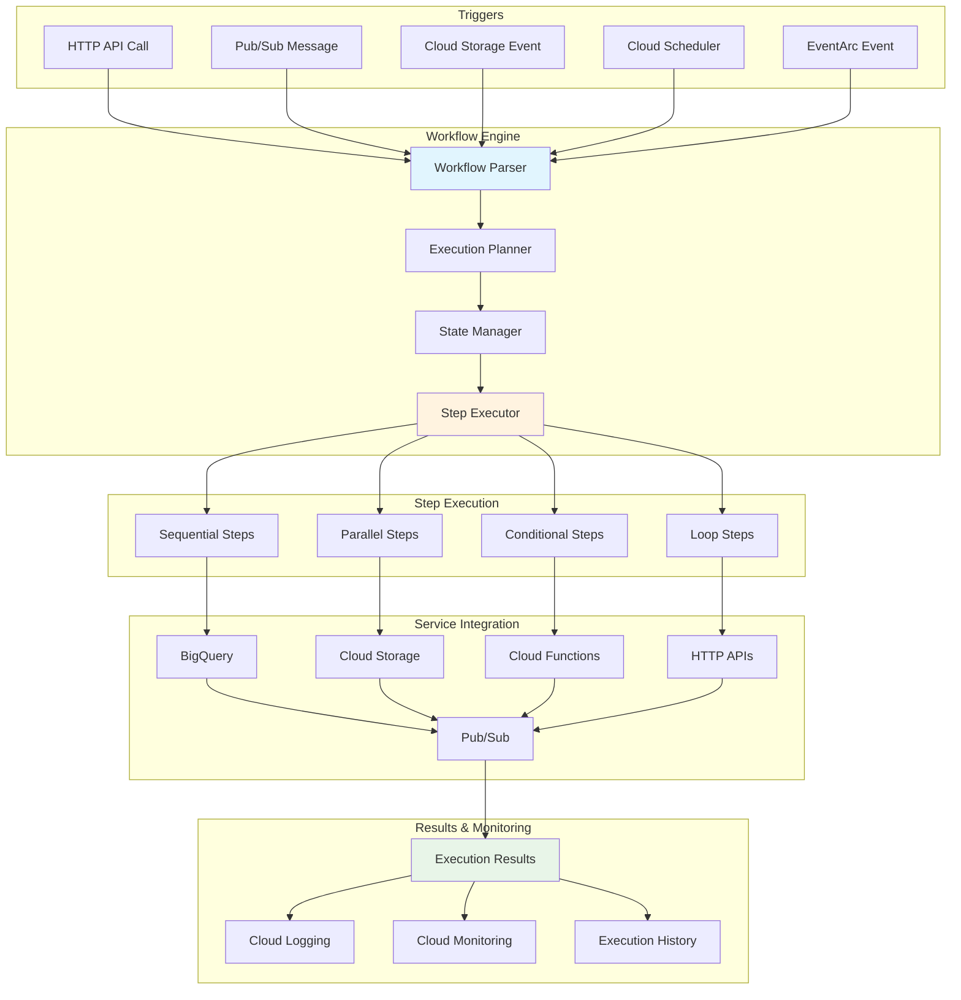

## Workflow Definition Structure

```mermaid
graph TD
    subgraph "Workflow YAML"
        A[main:]
        B[params: [input]]
        C[steps:]
    end

    subgraph "Step Types"
        D[- step1:<br/>call: http.get]
        E[- step2:<br/>assign: variable]
        F[- step3:<br/>return: result]
        G[- step4:<br/>raise: exception]
    end

    subgraph "Step Properties"
        H[args: {...}]
        I[result: variable]
        J[retry: {...}]
        K[timeout: 30s]
    end

    subgraph "Control Flow"
        L[switch: condition]
        M[for: loop]
        N[parallel: steps]
        O[try/except: error]
    end

    A --> C
    B --> C
    C --> D
    C --> E
    C --> F
    C --> G
    D --> H
    E --> I
    F --> J
    G --> K
    D --> L
    E --> M
    F --> N
    G --> O

    style A fill:#e3f2fd
    style D fill:#fff3e0
```

## Error Handling & Retry Logic

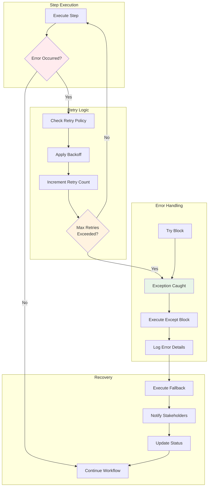

## Parallel Execution Architecture

```mermaid
graph TD
    subgraph "Parallel Step"
        A[parallel:]
        B[shared: [var1, var2]]
        C[branches:]
    end

    subgraph "Branch 1"
        D[- branch1:<br/>steps: [step1, step2]]
    end

    subgraph "Branch 2"
        E[- branch2:<br/>steps: [step3, step4]]
    end

    subgraph "Branch 3"
        F[- branch3:<br/>steps: [step5, step6]]
    end

    subgraph "Concurrency Control"
        G[Execute Branches<br/>Concurrently]
        H[Wait for All<br/>to Complete]
        I[Aggregate Results]
        J[Update Shared<br/>Variables]
    end

    subgraph "Result Processing"
        K[Combine Outputs]
        L[Continue Workflow]
        M[Handle Partial<br/>Failures]
    end

    A --> B
    B --> C
    C --> D
    C --> E
    C --> F
    D --> G
    E --> G
    F --> G
    G --> H
    H --> I
    I --> J
    J --> K
    K --> L
    K --> M

    style G fill:#e3f2fd
    style I fill:#fff3e0
    style K fill:#e8f5e8
```

## Service Integration Patterns

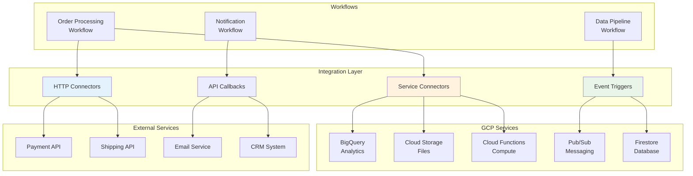

## Event-Driven Workflow Architecture

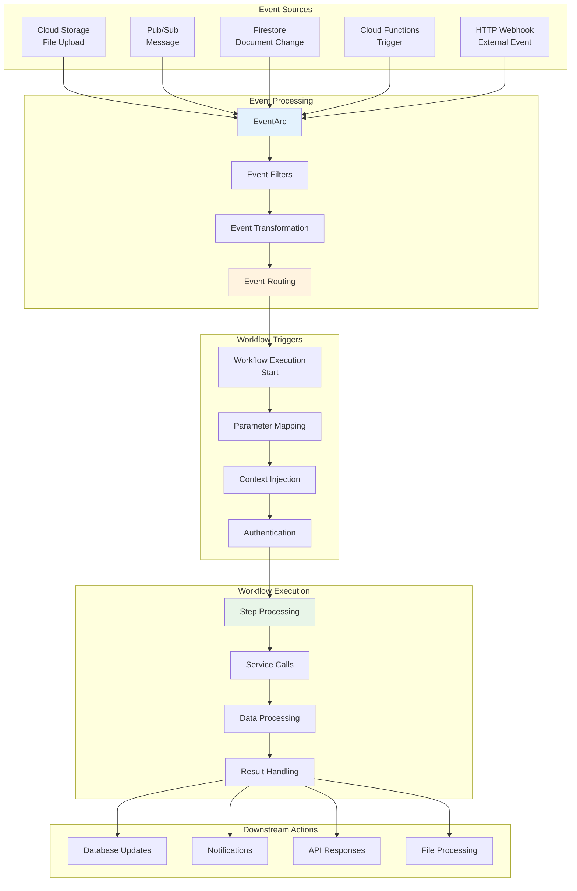

## Data Flow & State Management

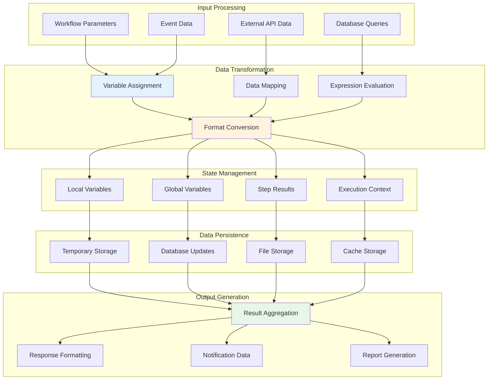

## Microservices Orchestration

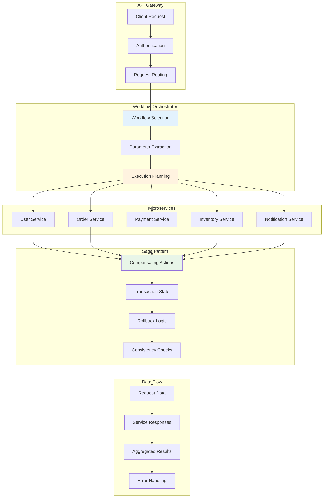

## Monitoring & Observability

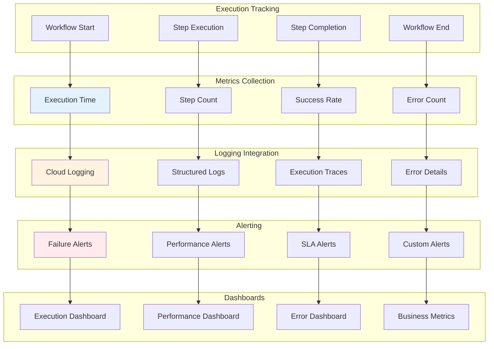

## ETL Pipeline Architecture

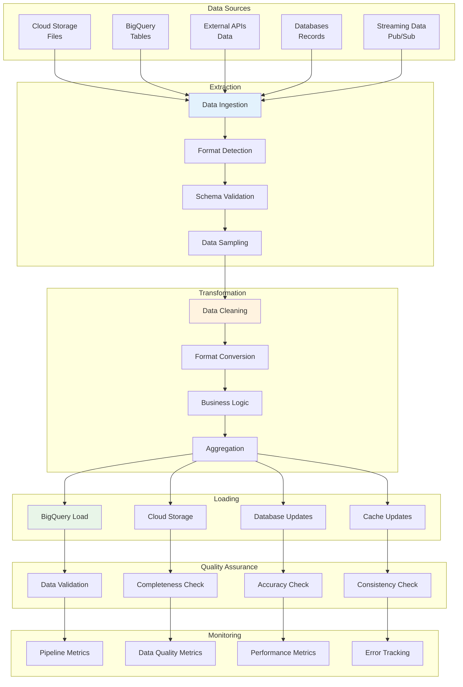

## Cost Optimization

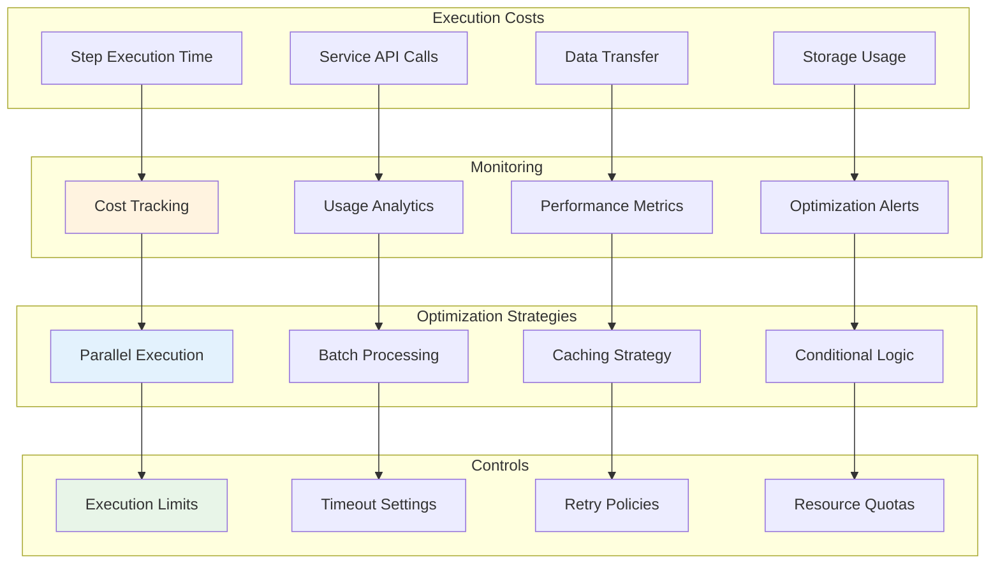

## Security Architecture

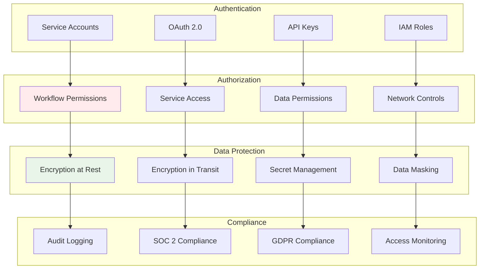

## Development Lifecycle

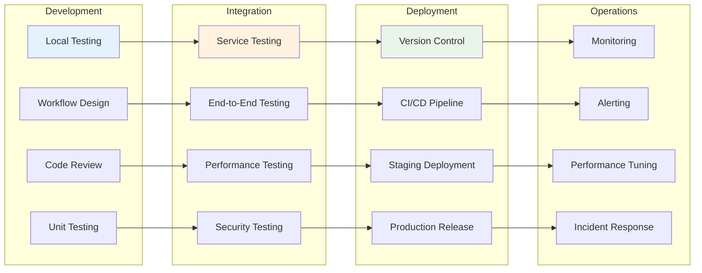

These diagrams illustrate the comprehensive orchestration capabilities of Workflows, showing how it handles complex business processes, integrates with GCP services, manages errors and retries, and provides robust monitoring and security features for enterprise-grade workflow automation.
