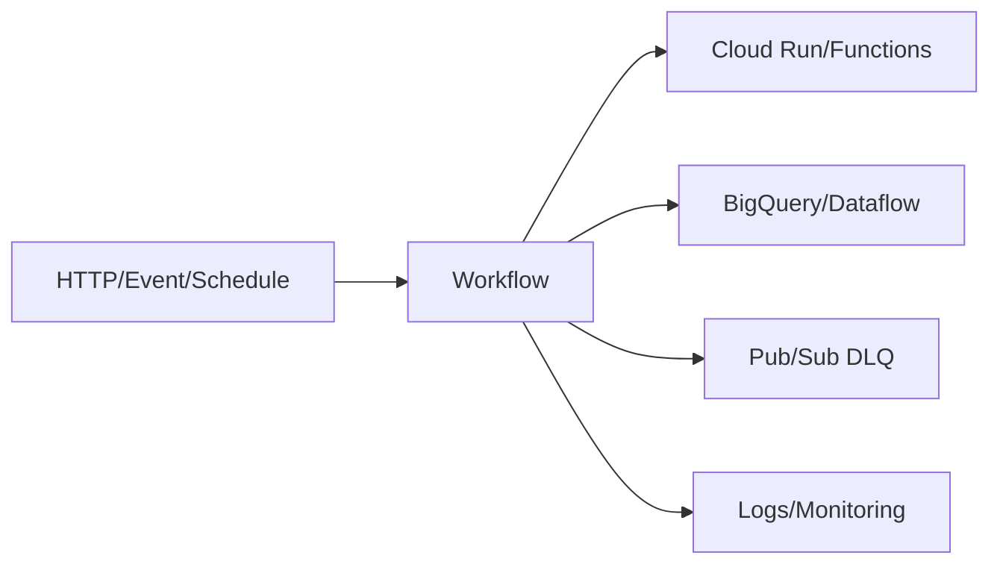

# Workflows Guide – Basic → Architect

## Level 1 – Launch & Basics

### 1. Quick Workflow
```yaml
# workflow.yaml
main:
  steps:
    - call_hello:
        call: http.get
        args:
          url: https://example.com/hello
```
```bash
gcloud workflows deploy demo --source=workflow.yaml --region=us-central1
gcloud workflows execute demo --region=us-central1
```

### 2. Core Concepts
- Steps, calls (HTTP, GCP connectors), variables, expressions
- Execution vs deployment; regions; service accounts

### 3. Inputs/Outputs
- Pass params at execution; return values; error handling with `try/retry/except`

## Level 2 – Production Patterns

### Composition & Connectors
- Use connectors for GCP services (BQ, Pub/Sub, GCS, etc.)
- Reusable subworkflows; modular design
- Handle auth via workflow service account; least privilege

### Reliability
- Retries with backoff/jitter; circuit-breaker patterns
- Timeouts per call; global execution timeout
- Dead-letter via Pub/Sub on failure

### Observability
- Execution logs; structured output; error details
- Alerts on failures/latency via Cloud Monitoring

## Level 3 – Architect Playbook

### Orchestration Strategy
- Event-driven (triggered via Eventarc/HTTP) vs scheduled
- Use Workflows to orchestrate Cloud Functions/Run/Dataflow/BQ jobs
- Idempotent design; compensate on partial failure

### Security & Governance
- IAM least privilege on service account; VPC-SC where needed
- CMEK where supported for called services; secrets via Secret Manager
- Version workflows; GitOps deploy

### Cost & Performance
- Avoid long-running steps; delegate heavy work to downstream services
- Pagination for large API responses

## Ops Cheat Sheet

| Task | Command | Note |
| --- | --- | --- |
| Deploy | `gcloud workflows deploy ...` | update |
| Execute | `gcloud workflows execute ...` | run |
| Logs | Cloud Logging | execution logs |
| Inspect | `gcloud workflows describe ...` | metadata |

## Architecture Patterns



## Checklist Before Production
- [ ] Service account least privilege; secrets via SM
- [ ] Retries/backoff/timeouts set; DLQ for failures
- [ ] Structured logs; alerts on failures/latency
- [ ] Modular subworkflows; versioned; GitOps deploy
- [ ] VPC-SC/CMEK as required by called services

