# Google Cloud Platform (GCP) Guide

## Table of Contents
1. [Introduction](#introduction)
2. [Compute Services](#compute-services)
3. [Storage and Databases](#storage-and-databases)
4. [Networking](#networking)
5. [Big Data](#big-data)
6. [Cloud AI](#cloud-ai)
7. [Management Tools](#management-tools)
8. [Identity and Security](#identity-and-security)
9. [Internet of Things (IoT)](#internet-of-things-iot)
10. [API Platform](#api-platform)
11. [Regions and Zones](#regions-and-zones)
12. [Timeline](#timeline)
13. [Similarities to Other Providers](#similarities-to-other-providers)

## Introduction
Google Cloud Platform (GCP) is a suite of cloud computing services offered by Google that provides modular cloud services including computing, data storage, data analytics, and machine learning. It runs on the same infrastructure used internally by Google for products like Google Search and Gmail.

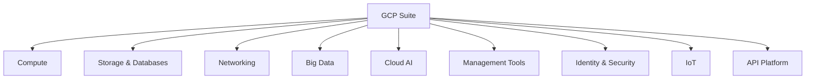

## Compute Services
Compute services provide infrastructure for running applications and workloads.

### App Engine
Platform as a Service (PaaS) for deploying applications developed with languages like Java, PHP, Node.js, Python, C#, .Net, Ruby, and Go.

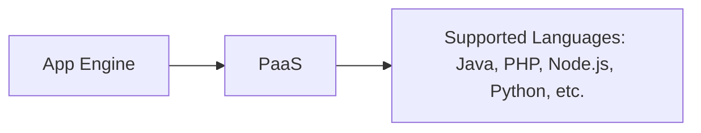

### Compute Engine
Infrastructure as a Service (IaaS) for running Windows and Linux virtual machines.

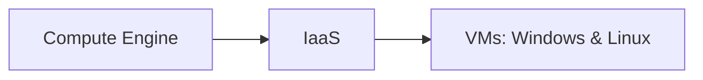

### Google Kubernetes Engine (GKE)
Containers as a Service based on Kubernetes.

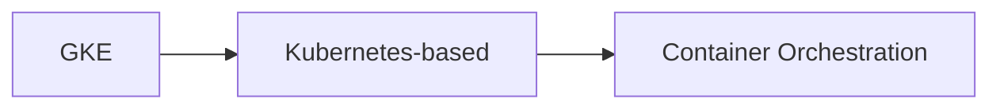

### Cloud Functions
Functions as a Service (FaaS) for running event-driven code in Node.js, Java, Python, or Go.

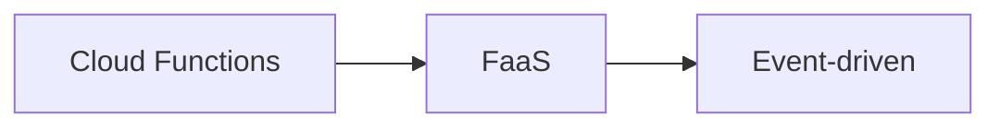

### Cloud Run
Compute execution environment based on Knative, supporting GCP, AWS, and VMware.

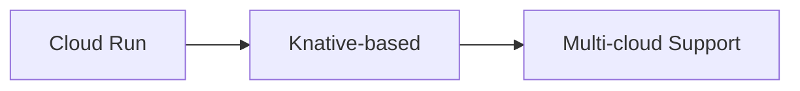

## Storage and Databases
Services for storing and managing data.

### Cloud Storage
Object storage with integrated edge caching for unstructured data.

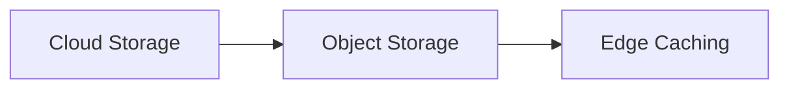

### Cloud SQL
Database as a Service based on MySQL, PostgreSQL, and SQL Server.

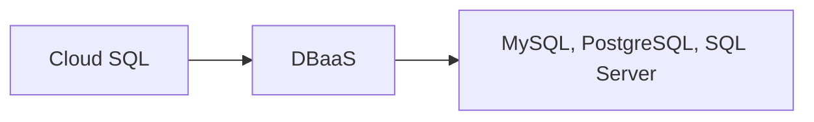

### Cloud Bigtable
Managed NoSQL database.

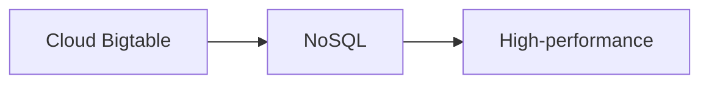

### Cloud Spanner
Horizontally scalable, strongly consistent relational database.

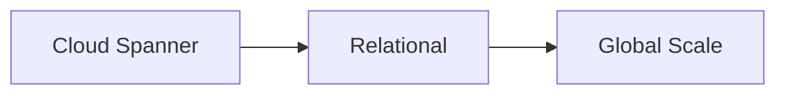

### Cloud Datastore
NoSQL database for web and mobile applications.

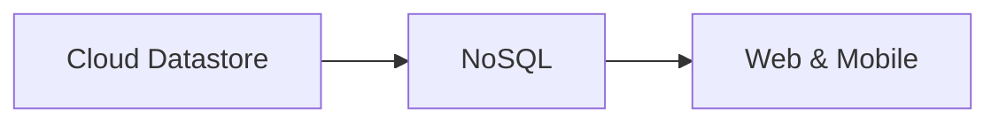

### Persistent Disk
Block storage for Compute Engine VMs.

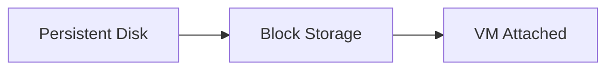

### Cloud Memorystore
In-memory data store based on Redis and Memcached.

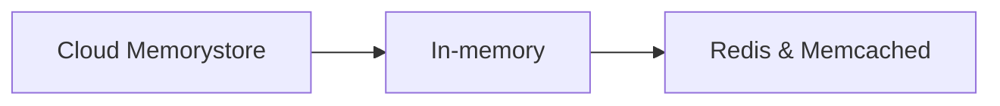

### Filestore
High-performance file storage.

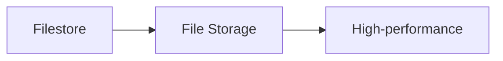

### AlloyDB
Fully managed PostgreSQL database.

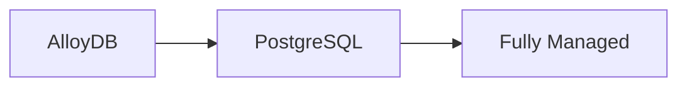

## Networking
Services for managing network infrastructure.

### VPC
Virtual Private Cloud for software-defined network management.

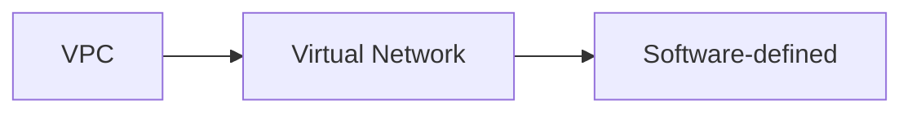

### Cloud Load Balancing
Managed service for load balancing traffic.

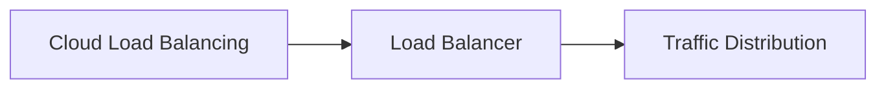

### Cloud Armor
Web application firewall to protect against DDoS attacks.

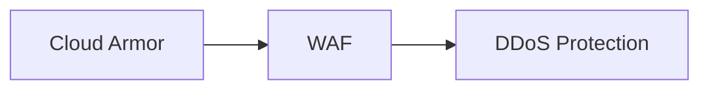

### Cloud CDN
Content Delivery Network based on Google's edge points.

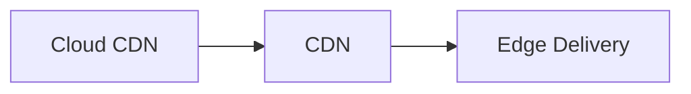

### Cloud Interconnect
Service to connect data centers to GCP.

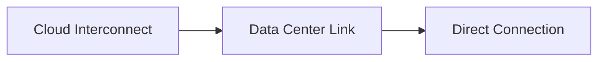

### Cloud DNS
Managed, authoritative DNS hosting.

```mermaid
graph LR
    A[Cloud DNS] --> B[DNS Hosting]
    B --> C[Managed Service]
```

### Network Service Tiers
Options for Premium vs Standard network tiers.

```mermaid
graph LR
    A[Network Tiers] --> B[Premium]
    A --> C[Standard]
```

## Big Data
Services for processing and analyzing large datasets.

### BigQuery
Scalable, managed enterprise data warehouse for analytics.

```mermaid
graph LR
    A[BigQuery] --> B[Data Warehouse]
    B --> C[Analytics]
```

### Cloud Dataflow
Managed service based on Apache Beam for stream and batch processing.

```mermaid
graph LR
    A[Cloud Dataflow] --> B[Apache Beam]
    B --> C[Stream & Batch]
```

### Cloud Data Fusion
ETL service based on Cask Data Application Platform.

```mermaid
graph LR
    A[Cloud Data Fusion] --> B[ETL]
    B --> C[Cask-based]
```

### Dataproc
Big data platform for Apache Hadoop and Spark jobs.

```mermaid
graph LR
    A[Dataproc] --> B[Hadoop & Spark]
    B --> C[Big Data Platform]
```

### Cloud Composer
Workflow orchestration service built on Apache Airflow.

```mermaid
graph LR
    A[Cloud Composer] --> B[Apache Airflow]
    B --> C[Orchestration]
```

### Cloud Datalab
Tool for data exploration, analysis, visualization, and ML using Jupyter Notebook.

```mermaid
graph LR
    A[Cloud Datalab] --> B[Jupyter Notebook]
    B --> C[Data Exploration]
```

### Cloud Dataprep
Data service for visually exploring, cleaning, and preparing data.

```mermaid
graph LR
    A[Cloud Dataprep] --> B[Data Prep]
    B --> C[Visual Interface]
```

### Cloud Pub/Sub
Scalable event ingestion service based on message queues.

```mermaid
graph LR
    A[Cloud Pub/Sub] --> B[Message Queues]
    B --> C[Event Ingestion]
```

### Looker Studio
Business intelligence tool for visualizing data through dashboards and reports.

```mermaid
graph LR
    A[Looker Studio] --> B[BI Tool]
    B --> C[Dashboards & Reports]
```

### Looker
Business intelligence platform.

```mermaid
graph LR
    A[Looker] --> B[BI Platform]
    B --> C[Data Visualization]
```

## Cloud AI
Services for machine learning and AI.

### Cloud AutoML
Service to train and deploy custom ML models.

```mermaid
graph LR
    A[Cloud AutoML] --> B[Custom ML]
    B --> C[Train & Deploy]
```

### Cloud TPU
Accelerators for training ML models.

```mermaid
graph LR
    A[Cloud TPU] --> B[ML Accelerators]
    B --> C[Training]
```

### Cloud Machine Learning Engine
Managed service for training and building ML models.

```mermaid
graph LR
    A[ML Engine] --> B[Managed ML]
    B --> C[Model Building]
```

### Cloud Talent Solution
Service for recruiting using search and ML.

```mermaid
graph LR
    A[Cloud Talent] --> B[Recruiting]
    B --> C[Search & ML]
```

### Dialogflow Enterprise
Environment for building conversational interfaces.

```mermaid
graph LR
    A[Dialogflow] --> B[Conversational AI]
    B --> C[Chatbots]
```

### Cloud Natural Language
Text analysis service using Deep Learning.

```mermaid
graph LR
    A[Cloud NL] --> B[Text Analysis]
    B --> C[Deep Learning]
```

### Cloud Speech-to-Text
Speech to text conversion using ML.

```mermaid
graph LR
    A[Speech-to-Text] --> B[STT]
    B --> C[ML-based]
```

### Cloud Text-to-Speech
Text to speech conversion using ML.

```mermaid
graph LR
    A[Text-to-Speech] --> B[TTS]
    B --> C[ML-based]
```

### Cloud Translation API
Dynamic translation between languages.

```mermaid
graph LR
    A[Translation API] --> B[Language Translation]
    B --> C[Dynamic]
```

### Cloud Vision API
Image analysis service using ML.

```mermaid
graph LR
    A[Vision API] --> B[Image Analysis]
    B --> C[ML-based]
```

### Cloud Video Intelligence
Video analysis service using ML.

```mermaid
graph LR
    A[Video Intelligence] --> B[Video Analysis]
    B --> C[ML-based]
```

## Management Tools
Tools for managing GCP resources.

### Operations Suite
Monitoring, logging, tracing, and diagnostics.

```mermaid
graph LR
    A[Operations Suite] --> B[Monitoring]
    B --> C[Logging, Tracing]
```

### Cloud Deployment Manager
Tool to deploy resources defined in YAML, Python, or Jinja2 templates.

```mermaid
graph LR
    A[Deployment Manager] --> B[Template-based]
    B --> C[YAML, Python, Jinja2]
```

### Cloud Console
Web interface for managing resources.

```mermaid
graph LR
    A[Cloud Console] --> B[Web UI]
    B --> C[Resource Management]
```

### Cloud Shell
Browser-based shell for command-line access.

```mermaid
graph LR
    A[Cloud Shell] --> B[Browser Shell]
    B --> C[CLI Access]
```

### Cloud Console Mobile App
Android and iOS app for managing resources.

```mermaid
graph LR
    A[Mobile App] --> B[Android & iOS]
    B --> C[Resource Management]
```

### Cloud APIs
APIs for programmatic access to resources.

```mermaid
graph LR
    A[Cloud APIs] --> B[Programmatic Access]
    B --> C[Resource Control]
```

## Identity and Security
Services for identity management and security.

### Cloud Identity
Single sign-on (SSO) service based on SAML 2.0 and OpenID.

```mermaid
graph LR
    A[Cloud Identity] --> B[SSO]
    B --> C[SAML 2.0, OpenID]
```

### Cloud IAM
Identity & Access Management with role-based access control.

```mermaid
graph LR
    A[Cloud IAM] --> B[IAM]
    B --> C[RBAC]
```

### Cloud Identity-Aware Proxy
Service to control access to cloud applications without VPN.

```mermaid
graph LR
    A[IAP] --> B[Access Control]
    B --> C[No VPN]
```

### Cloud Data Loss Prevention API
Service to discover, classify, and redact sensitive data.

```mermaid
graph LR
    A[DLP API] --> B[Data Protection]
    B --> C[Redaction]
```

### Security Key Enforcement
Two-step verification using security keys.

```mermaid
graph LR
    A[Security Key] --> B[2FA]
    B --> C[Hardware Keys]
```

### Cloud Key Management Service
Cloud-hosted key management with IAM and audit logging.

```mermaid
graph LR
    A[KMS] --> B[Key Management]
    B --> C[IAM Integrated]
```

### Cloud Resource Manager
Service to manage resources by project, folder, and organization.

```mermaid
graph LR
    A[Resource Manager] --> B[Hierarchy Management]
    B --> C[Project/Folder/Org]
```

### Cloud Security Command Center
Security and data risk platform.

```mermaid
graph LR
    A[Security SCC] --> B[Risk Platform]
    B --> C[Security Monitoring]
```

### Cloud Security Scanner
Automated vulnerability scanning for App Engine applications.

```mermaid
graph LR
    A[Security Scanner] --> B[Vulnerability Scan]
    B --> C[App Engine]
```

### Access Transparency
Near real-time audit logs for administrators.

```mermaid
graph LR
    A[Access Transparency] --> B[Audit Logs]
    B --> C[Real-time]
```

### VPC Service Controls
Security perimeters for sensitive data in services.

```mermaid
graph LR
    A[VPC SC] --> B[Security Perimeters]
    B --> C[Data Protection]
```

## Internet of Things (IoT)
Services for IoT device management.

### Cloud IoT Core
Secure device connection and management.

```mermaid
graph LR
    A[IoT Core] --> B[Device Management]
    B --> C[Secure Connection]
```

### Edge TPU
ASIC for running inference at the edge.

```mermaid
graph LR
    A[Edge TPU] --> B[Edge Inference]
    B --> C[ASIC Chip]
```

### Cloud IoT Edge
Brings AI to edge computing.

```mermaid
graph LR
    A[IoT Edge] --> B[Edge AI]
    B --> C[Inference]
```

## API Platform
Services for API management.

### Maps Platform
APIs for maps, routes, and places.

```mermaid
graph LR
    A[Maps Platform] --> B[APIs]
    B --> C[Maps, Routes, Places]
```

### Apigee API Platform
Lifecycle management for APIs.

```mermaid
graph LR
    A[Apigee] --> B[API Management]
    B --> C[Lifecycle]
```

### API Monetization
Tool for creating revenue models for APIs.

```mermaid
graph LR
    A[API Monetization] --> B[Revenue Models]
    B --> C[API Providers]
```

### Developer Portal
Self-service platform for developers to manage APIs.

```mermaid
graph LR
    A[Developer Portal] --> B[Self-service]
    B --> C[API Management]
```

### API Analytics
Service to analyze API-driven programs.

```mermaid
graph LR
    A[API Analytics] --> B[API Analysis]
    B --> C[Monitoring]
```

### Apigee Sense
API security by identifying suspicious behaviors.

```mermaid
graph LR
    A[Apigee Sense] --> B[API Security]
    B --> C[Behavior Analysis]
```

### Cloud Endpoints
NGINX-based proxy for deploying and managing APIs.

```mermaid
graph LR
    A[Cloud Endpoints] --> B[API Proxy]
    B --> C[NGINX-based]
```

### Service Infrastructure
Foundational services for building GCP products.

```mermaid
graph LR
    A[Service Infra] --> B[Foundational]
    B --> C[GCP Building Blocks]
```

## Regions and Zones
Geographical locations for deploying resources.

A region is a specific geographical location with multiple zones for high availability.

```mermaid
graph TD
    A[Region] --> B[Zone 1]
    A --> C[Zone 2]
    A --> D[Zone 3]
```

## Timeline
Key milestones in GCP development.

```mermaid
timeline
    2008 : App Engine announced
    2010 : Cloud Storage and BigQuery launched
    2011 : Cloud SQL announced
    2012 : Compute Engine preview
    2013 : Compute Engine GA
    2014 : Cloud SQL GA, Stackdriver acquired
    2015 : Kubernetes open-sourced, Cloud Dataflow
    2016 : Cloud Functions alpha, Apigee acquired
    2017 : Cloud Spanner beta, Kaggle acquired
    2018 : Cloud IoT GA, Cloud TPUs beta
    2019 : Cloud Run beta, Anthos announced
    2020 : Cloud Run GA
    2021 : GKE Autopilot, Vertex AI
    2022 : Cloud Run multi-cloud
    2023 : Generative AI capabilities
    2024 : New regions added
```

## Similarities to Other Providers
Comparison with AWS, Azure, and Oracle Cloud.

```mermaid
graph TD
    A[GCP] --> B[Compute Engine ~ EC2]
    A --> C[GKE ~ EKS]
    A --> D[Cloud Functions ~ Lambda]
    A --> E[Cloud Storage ~ S3]
    A --> F[BigQuery ~ Redshift]
    A --> G[Cloud Spanner ~ DynamoDB]
```
