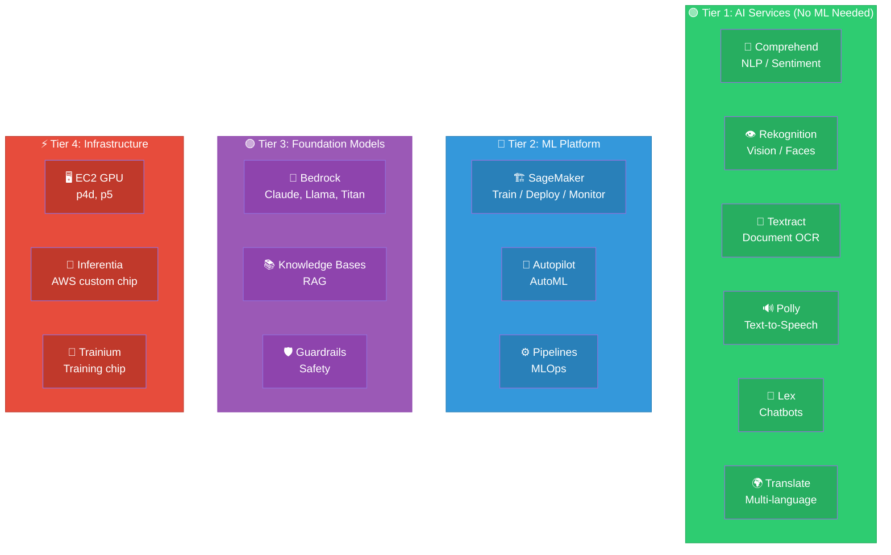
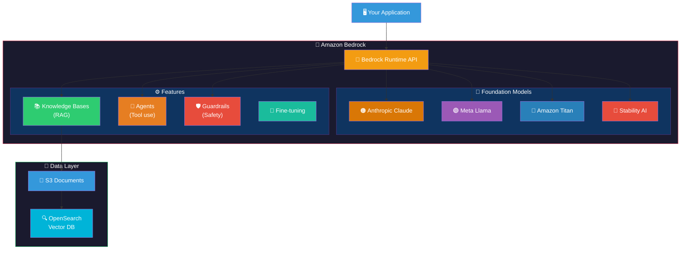
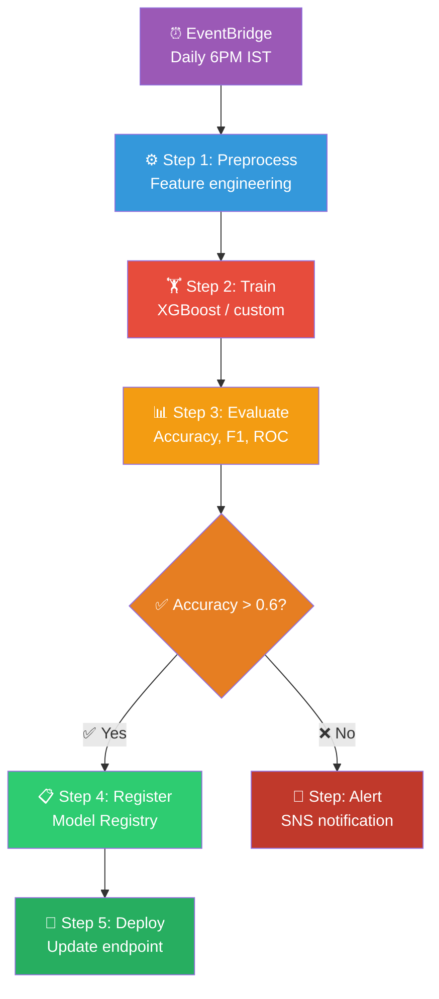
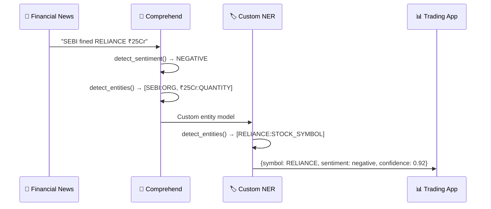
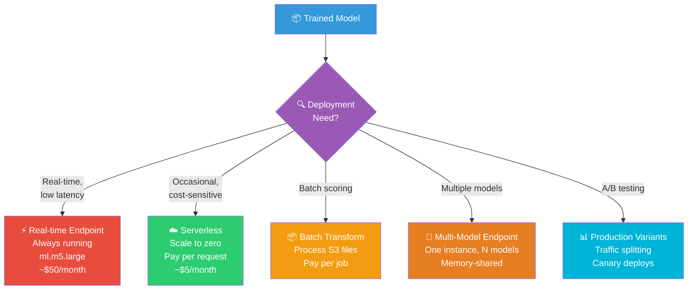
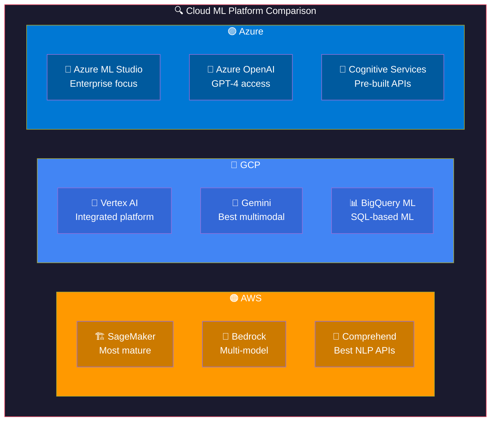
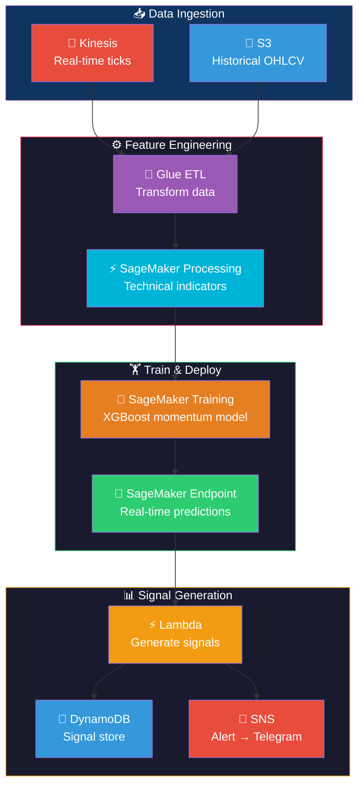
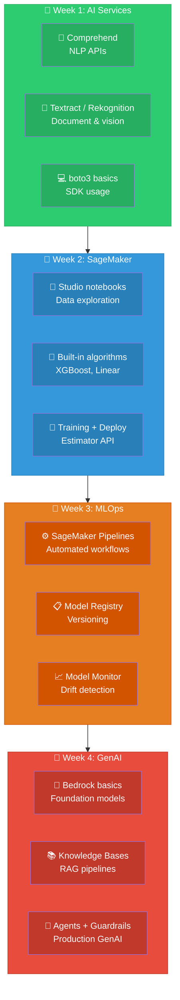

# AWS AI/ML: Visual Guide & Architecture Diagrams

## 1. AWS AI/ML Service Tiers

## 2. SageMaker Workflow

```mermaid
flowchart LR
    subgraph Prepare["📥 Prepare"]
        S3["💾 S3 Data Lake"]
        NB["📓 SageMaker Notebook"]
        PROC["⚙️ Processing Job<br/>Feature engineering"]
    end

    subgraph Train["🏋️ Train"]
        TRAIN2["🎯 Training Job<br/>ml.m5/p3/p4"]
        TUNE["🔧 Hyperparameter<br/>Tuning"]
        MODEL["📦 Model Artifacts<br/>→ S3"]
    end

    subgraph Deploy["🚀 Deploy"]
        REG["📋 Model Registry<br/>Version control"]
        EP["⚡ Real-time Endpoint"]
        BATCH["📦 Batch Transform"]
        SL["☁️ Serverless Inference"]
    end

    subgraph Monitor["📊 Monitor"]
        MON["📈 Model Monitor<br/>Data drift"]
        CLAR["⚖️ Clarify<br/>Bias detection"]
        CW["📊 CloudWatch<br/>Metrics & logs"]
    end

    S3 --> NB --> PROC --> TRAIN2
    TRAIN2 --> TUNE --> MODEL
    MODEL --> REG --> EP & BATCH & SL
    EP --> MON --> CLAR --> CW

    style Prepare fill:#0f3460,color:#fff,stroke:#533483
    style Train fill:#1a1a2e,color:#fff,stroke:#e94560
    style Deploy fill:#1a1a2e,color:#fff,stroke:#2ECC71
    style Monitor fill:#1a1a2e,color:#fff,stroke:#F39C12
    style S3 fill:#3498DB,color:#fff
    style NB fill:#9B59B6,color:#fff
    style PROC fill:#00B4D8,color:#fff
    style TRAIN2 fill:#E74C3C,color:#fff
    style TUNE fill:#E67E22,color:#fff
    style MODEL fill:#F39C12,color:#fff
    style REG fill:#2ECC71,color:#fff
    style EP fill:#27AE60,color:#fff
    style BATCH fill:#1ABC9C,color:#fff
    style SL fill:#16A085,color:#fff
    style MON fill:#E67E22,color:#fff
    style CLAR fill:#D35400,color:#fff
    style CW fill:#F39C12,color:#fff
```

## 3. Amazon Bedrock Architecture

## 4. SageMaker Pipeline Flow

## 5. AI Services for Financial NLP

## 6. Deployment Options Comparison

## 7. AWS vs GCP vs Azure ML

## 8. Financial ML on AWS (Trading Pipeline)

## 9. Learning Path

