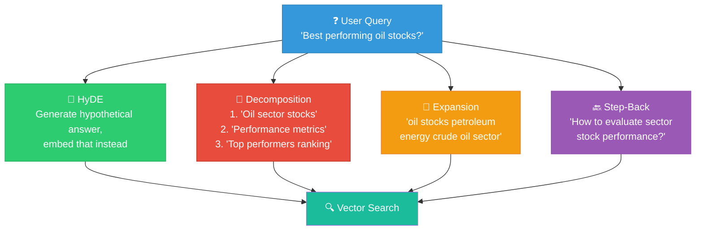
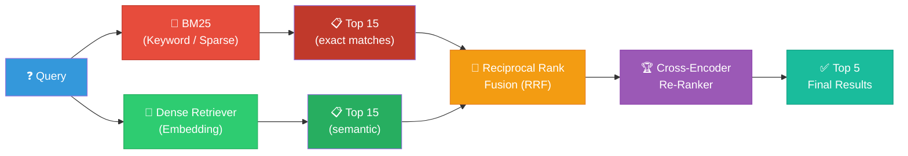
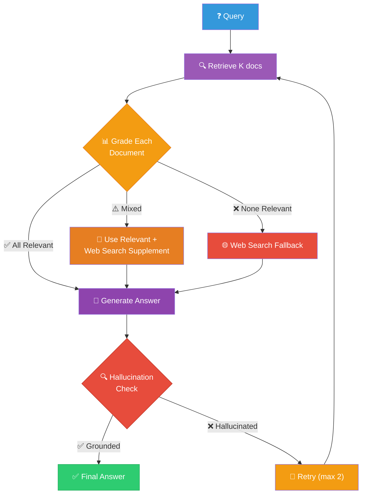
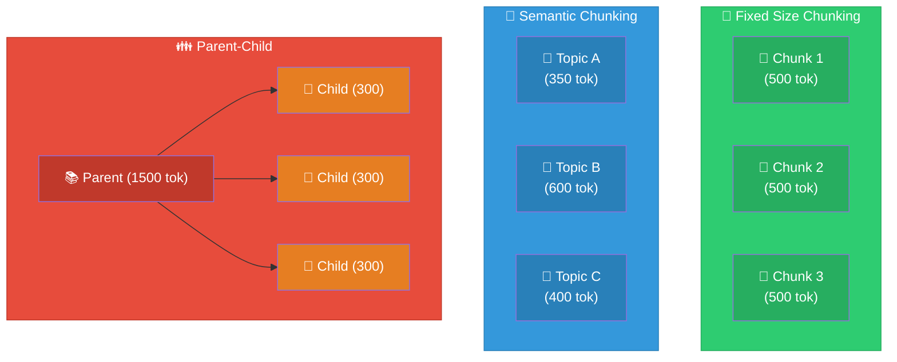
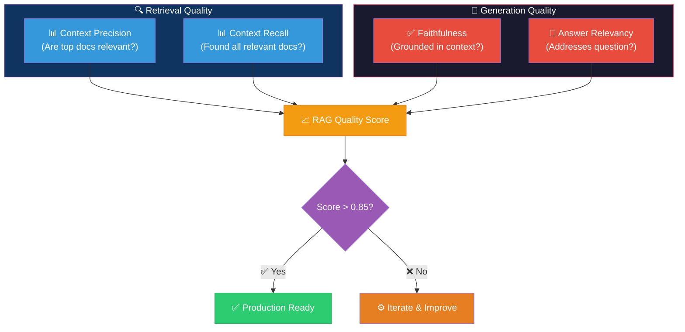
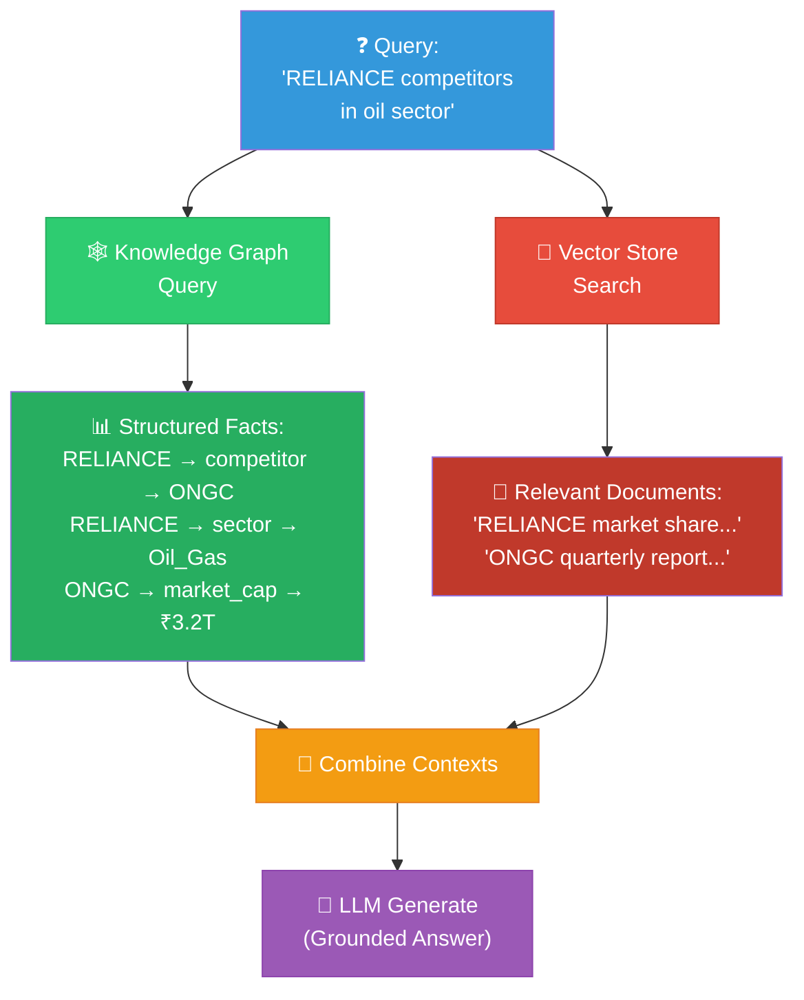
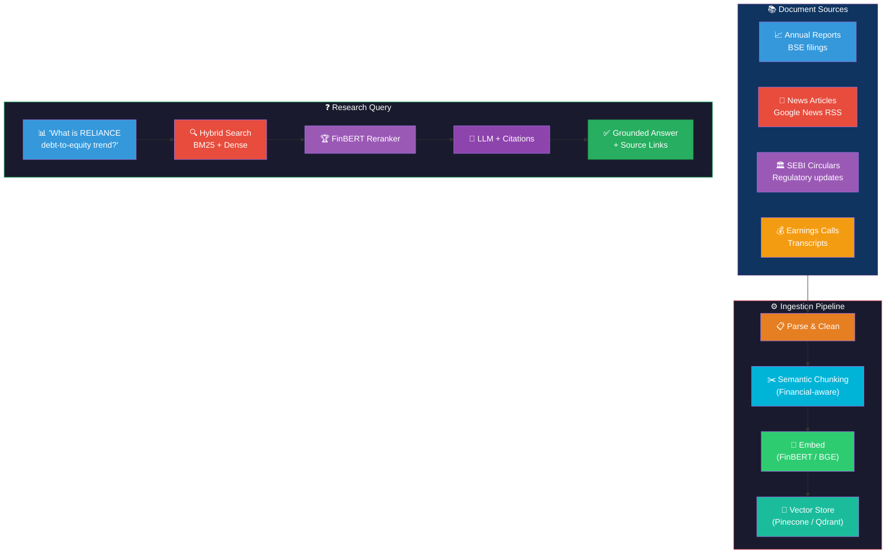
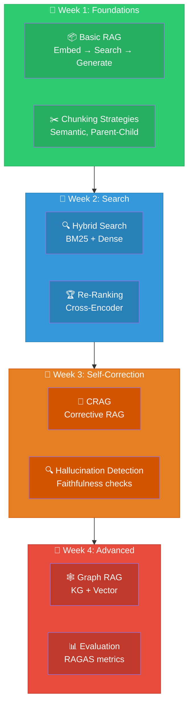

# Advanced RAG: Visual Guide & Architecture Diagrams

## 1. Basic vs Advanced RAG Pipeline

```mermaid
graph TD
    subgraph BASIC["📦 Basic RAG"]
        BQ["❓ Query"] --> BE["🔢 Embed"] --> BS["🔍 Vector Search"] --> BG["🧠 Generate"]
    end

    subgraph ADVANCED["🚀 Advanced RAG"]
        AQ["❓ Query"] --> QT["🔄 Query Transform<br/>(HyDE, Decompose)"]
        QT --> HS["🔍 Hybrid Search<br/>(Dense + Sparse)"]
        HS --> RR["📊 Re-Rank<br/>(Cross-Encoder)"]
        RR --> GRADE["✅ Grade Relevance<br/>(CRAG)"]
        GRADE --> GEN["🧠 Generate"]
        GEN --> VERIFY["🔍 Verify Faithfulness"]
        VERIFY -->|"❌ Hallucination"| QT
        VERIFY -->|"✅ Grounded"| OUT["📎 Output + Citations"]
    end

    style BASIC fill:#0f3460,color:#fff,stroke:#533483
    style ADVANCED fill:#1a1a2e,color:#fff,stroke:#e94560
    style BQ fill:#95A5A6,color:#fff
    style BE fill:#95A5A6,color:#fff
    style BS fill:#95A5A6,color:#fff
    style BG fill:#95A5A6,color:#fff
    style AQ fill:#3498DB,color:#fff
    style QT fill:#9B59B6,color:#fff
    style HS fill:#E74C3C,color:#fff
    style RR fill:#F39C12,color:#fff
    style GRADE fill:#E67E22,color:#fff
    style GEN fill:#8E44AD,color:#fff
    style VERIFY fill:#2ECC71,color:#fff
    style OUT fill:#27AE60,color:#fff,stroke:#1E8449
```

## 2. Query Transformation Techniques

## 3. Hybrid Search Architecture

## 4. Corrective RAG (CRAG) Flow

## 5. Chunking Strategies Comparison

## 6. RAGAS Evaluation Framework

## 7. Graph RAG Architecture

## 8. Financial RAG Pipeline (Trading Research)

## 9. Learning Path

