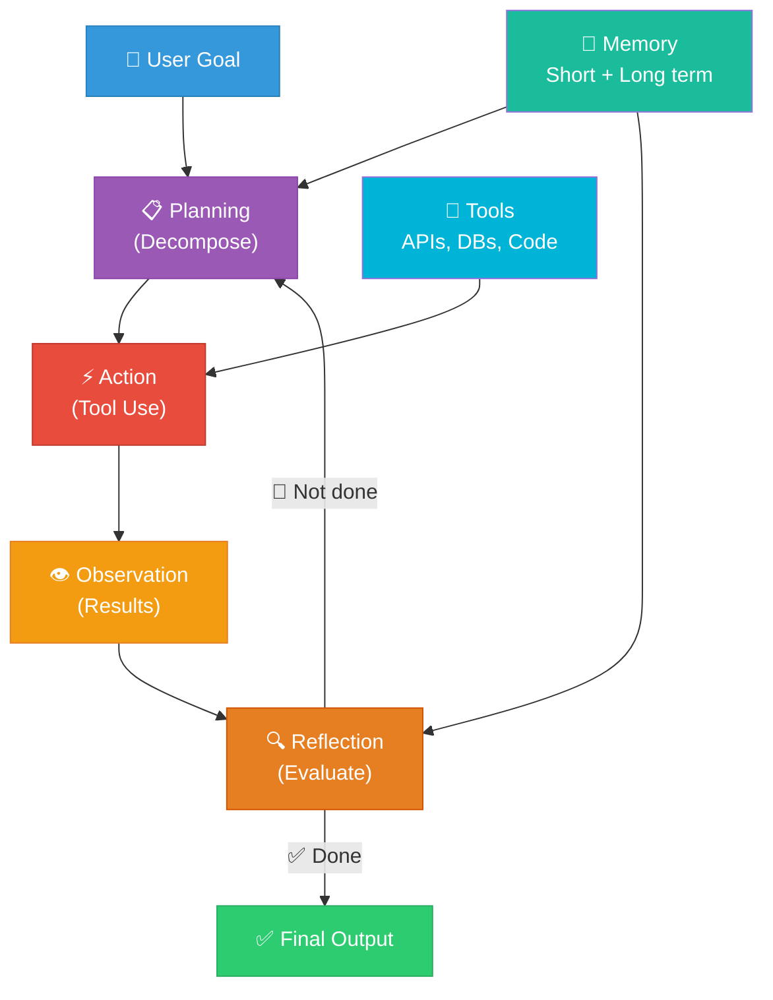
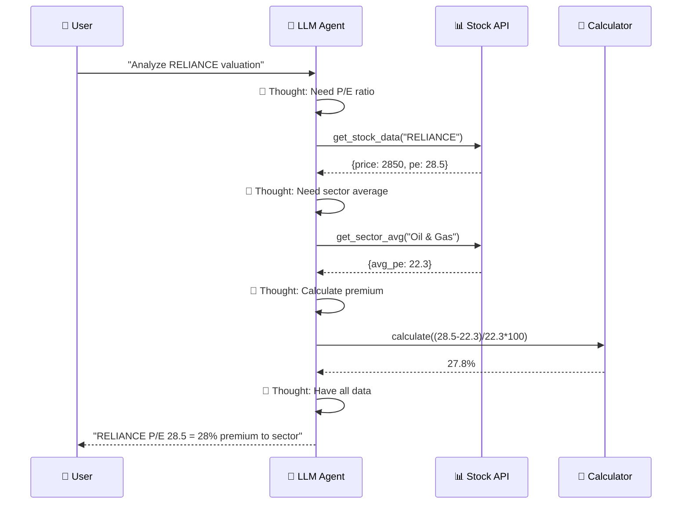
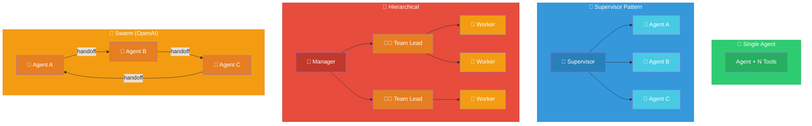
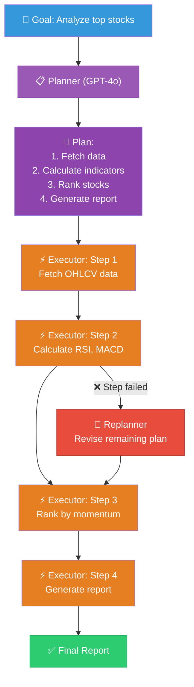
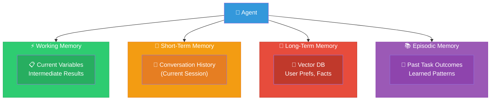
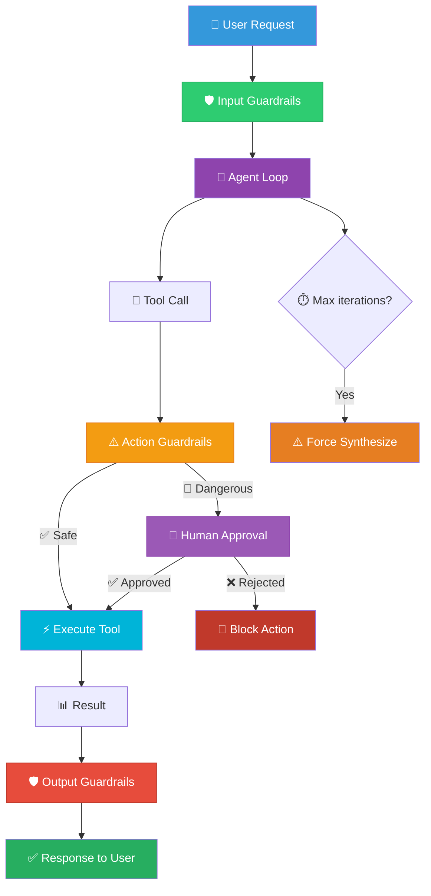
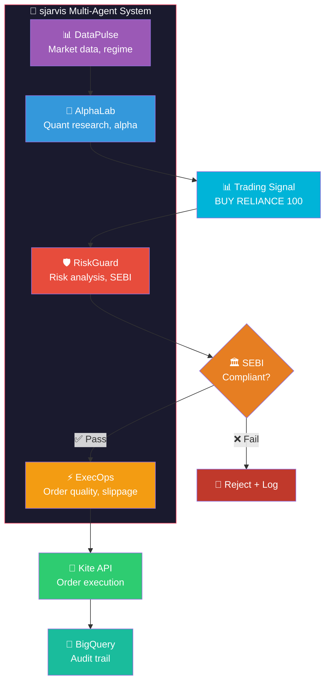
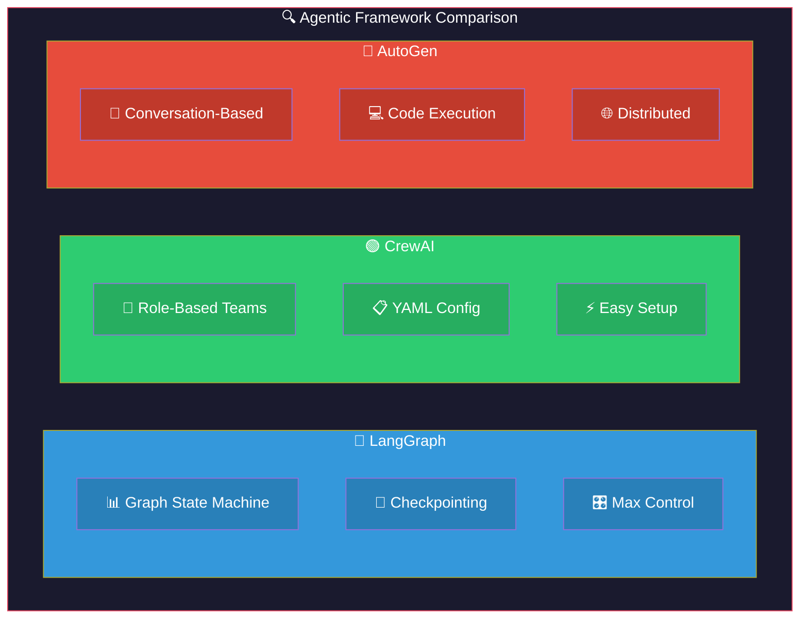
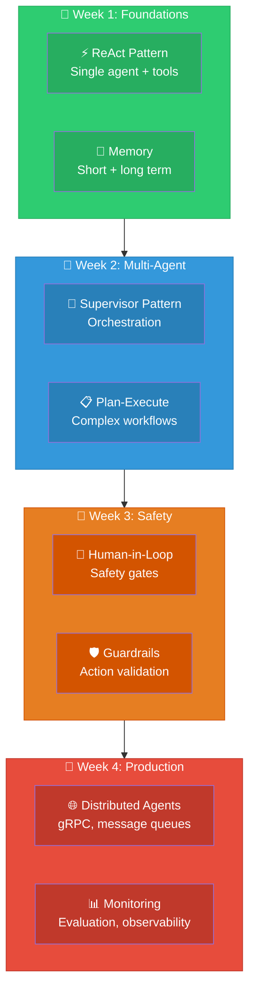

# Agentic AI: Visual Guide & Architecture Diagrams

## 1. Agent Architecture Overview

## 2. ReAct Pattern Flow

## 3. Multi-Agent Patterns

## 4. Plan-and-Execute Pattern

## 5. Memory Architecture

## 6. Safety & Guardrails for Agents

## 7. Trading Agent Architecture (sjarvis)

## 8. Framework Comparison

## 9. Learning Path

