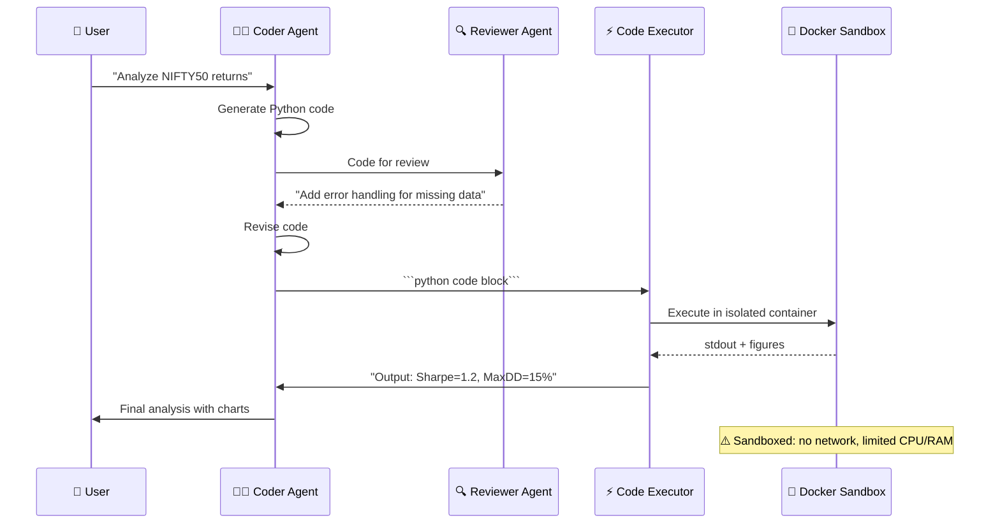
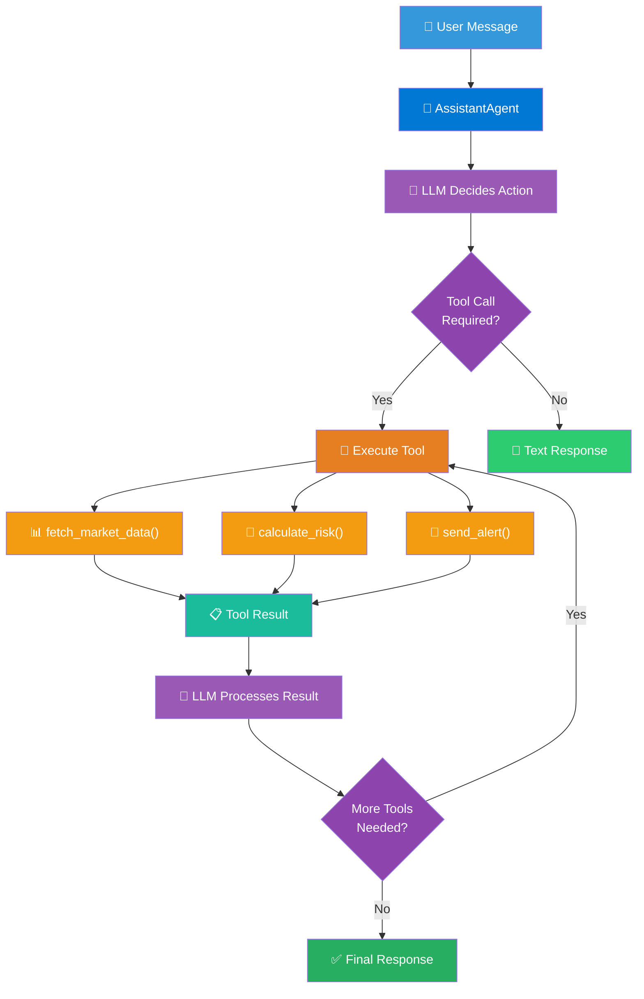
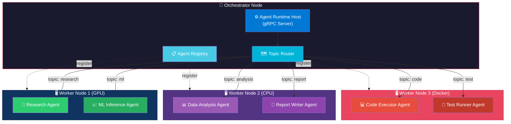
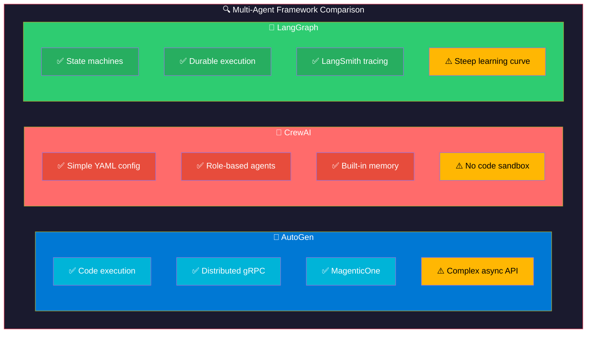
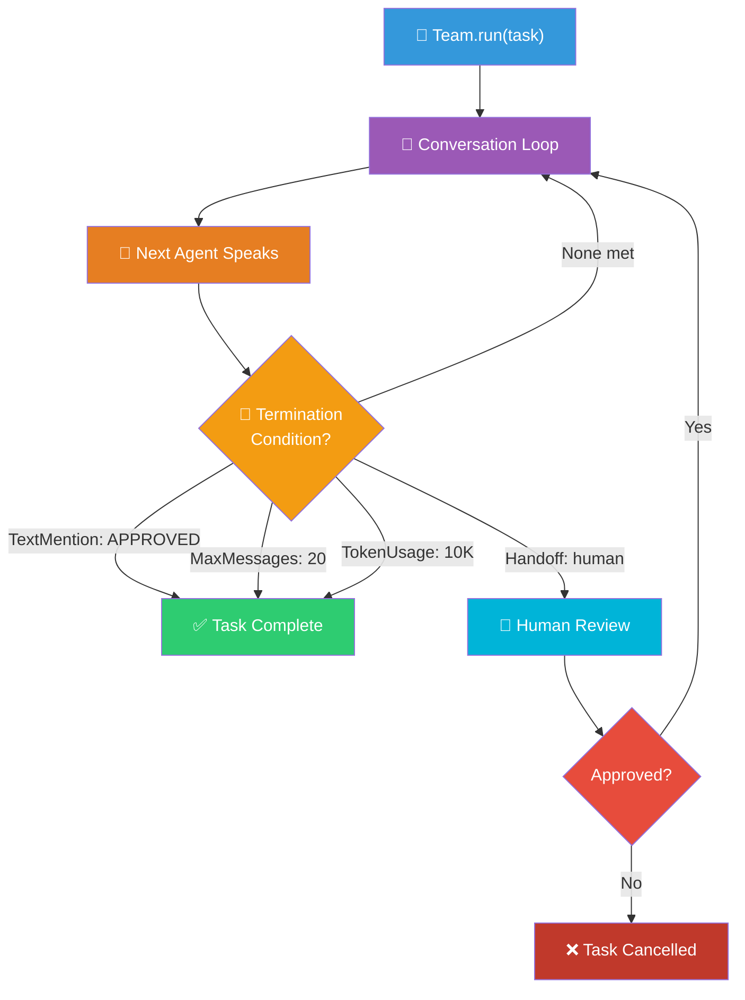
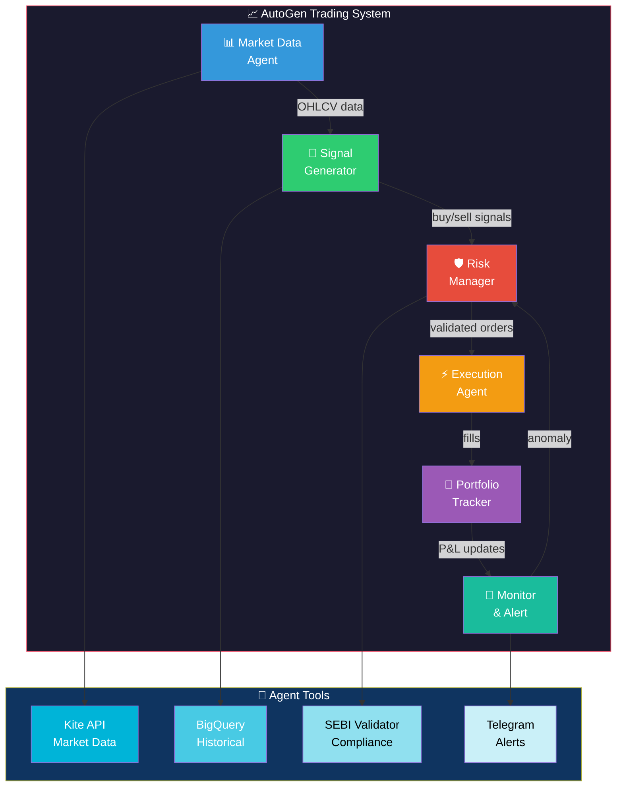
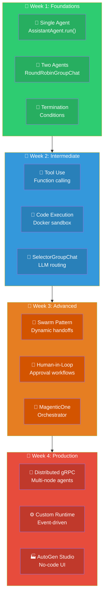

# AutoGen: Visual Guide & Architecture Diagrams

## 1. AutoGen Architecture Overview

```mermaid
graph TD
    AG["🤖 AutoGen Framework<br/>Microsoft Multi-Agent"]
    AG --> CHAT["💬 AgentChat<br/>High-level multi-agent"]
    AG --> CORE["⚙️ Core<br/>Event-driven runtime"]
    AG --> EXT["🔌 Extensions<br/>Integrations"]

    CHAT --> RR["🔄 RoundRobinGroupChat"]
    CHAT --> SEL["🎯 SelectorGroupChat"]
    CHAT --> SWM["🐝 Swarm"]
    CHAT --> MAG["👤 MagenticOne"]

    CORE --> RT["SingleThreadedRuntime"]
    CORE --> GRT["GrpcWorkerRuntime"]
    CORE --> MSG["Message Protocol"]
    CORE --> SUB["Topic Subscriptions"]

    EXT --> OAI["OpenAI / Anthropic"]
    EXT --> MCP["MCP Servers"]
    EXT --> DOCK["Docker Executor"]
    EXT --> GRPC["gRPC Distributed"]
    EXT --> AZ["Azure AI"]

    style AG fill:#0078D4,color:#fff,stroke:#005A9E
    style CHAT fill:#00B4D8,color:#fff,stroke:#0096C7
    style CORE fill:#E63946,color:#fff,stroke:#D62828
    style EXT fill:#FFB703,color:#000,stroke:#FB8500
    style RR fill:#48CAE4,color:#fff
    style SEL fill:#48CAE4,color:#fff
    style SWM fill:#48CAE4,color:#fff
    style MAG fill:#48CAE4,color:#fff
    style RT fill:#FF6B6B,color:#fff
    style GRT fill:#FF6B6B,color:#fff
    style MSG fill:#FF6B6B,color:#fff
    style SUB fill:#FF6B6B,color:#fff
    style OAI fill:#FFCA3A,color:#000
    style MCP fill:#FFCA3A,color:#000
    style DOCK fill:#FFCA3A,color:#000
    style GRPC fill:#FFCA3A,color:#000
    style AZ fill:#FFCA3A,color:#000
```

## 2. Multi-Agent Conversation Patterns

```mermaid
flowchart TB
    subgraph RR["🔄 Round Robin — Fixed Turn Order"]
        direction LR
        RR_A["🧑‍💻 Coder"] -->|"turn 1"| RR_B["🔍 Reviewer"]
        RR_B -->|"turn 2"| RR_C["✅ Approver"]
        RR_C -->|"turn 3"| RR_A
    end

    subgraph SEL["🎯 Selector — LLM Routes Dynamically"]
        SEL_LLM["🧠 LLM Router"]
        SEL_LLM -->|"needs data"| SEL_A["📊 Analyst"]
        SEL_LLM -->|"needs code"| SEL_B["💻 Developer"]
        SEL_LLM -->|"needs review"| SEL_C["🔒 Security"]
    end

    subgraph SW["🐝 Swarm — Dynamic Handoffs"]
        SW_A["🎫 Triage<br/>Agent"]
        SW_A -->|"billing issue"| SW_B["💳 Billing<br/>Agent"]
        SW_A -->|"tech issue"| SW_C["🔧 Tech<br/>Agent"]
        SW_B -->|"escalate"| SW_A
        SW_C -->|"resolved"| SW_D["📝 Summary<br/>Agent"]
    end

    subgraph MO["🌟 MagenticOne — Orchestrator Pattern"]
        MO_O["🎭 Orchestrator"] --> MO_W["🌐 WebSurfer"]
        MO_O --> MO_F["📁 FileSurfer"]
        MO_O --> MO_C["💻 Coder"]
        MO_O --> MO_T["🖥️ Terminal"]
    end

    style RR fill:#0f3460,color:#fff,stroke:#16213e
    style SEL fill:#533483,color:#fff,stroke:#2b1055
    style SW fill:#e94560,color:#fff,stroke:#c81d4e
    style MO fill:#0a8754,color:#fff,stroke:#086841
    style RR_A fill:#00B4D8,color:#fff
    style RR_B fill:#48CAE4,color:#fff
    style RR_C fill:#90E0EF,color:#000
    style SEL_LLM fill:#9B5DE5,color:#fff
    style SEL_A fill:#F15BB5,color:#fff
    style SEL_B fill:#FEE440,color:#000
    style SEL_C fill:#00BBF9,color:#fff
    style SW_A fill:#FF6B6B,color:#fff
    style SW_B fill:#4ECDC4,color:#fff
    style SW_C fill:#FFE66D,color:#000
    style SW_D fill:#A8E6CF,color:#000
    style MO_O fill:#2ECC71,color:#fff
    style MO_W fill:#3498DB,color:#fff
    style MO_F fill:#E67E22,color:#fff
    style MO_C fill:#9B59B6,color:#fff
    style MO_T fill:#1ABC9C,color:#fff
```

## 3. Code Execution Flow

## 4. Agent Tool Calling Flow

## 5. Distributed Agent Architecture (gRPC)

## 6. AutoGen vs CrewAI vs LangGraph

## 7. Termination & Control Flow

## 8. Financial Trading Multi-Agent System

## 9. Learning Path

