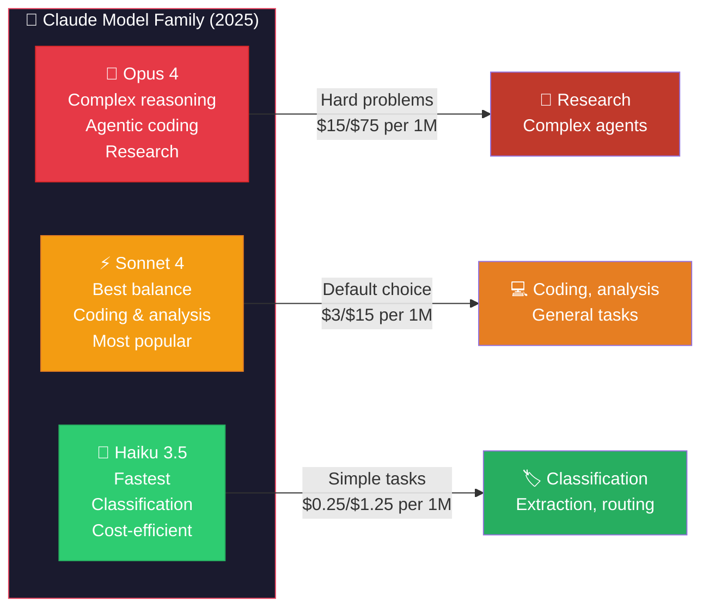
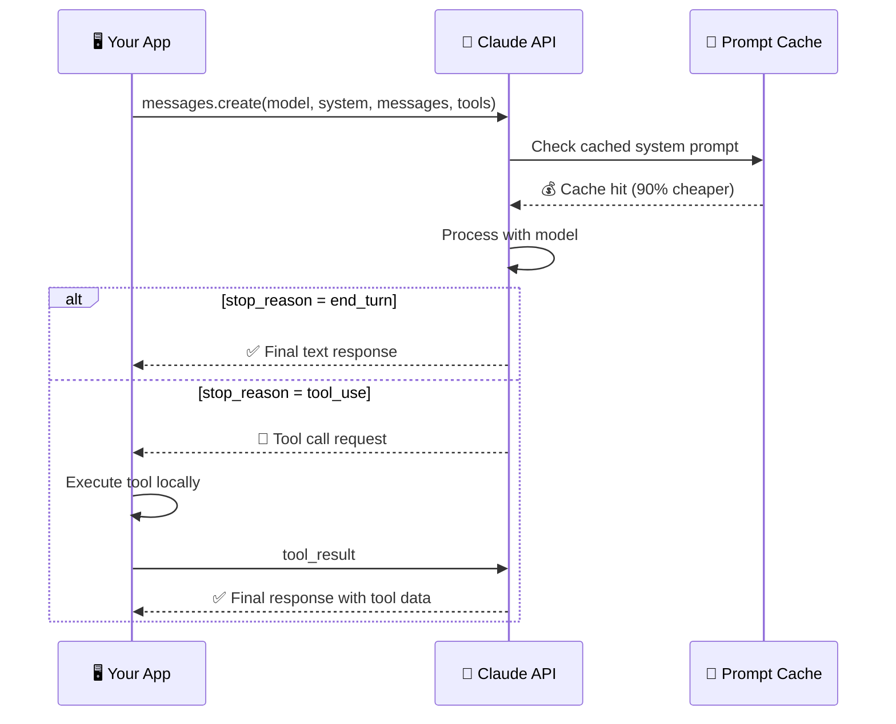
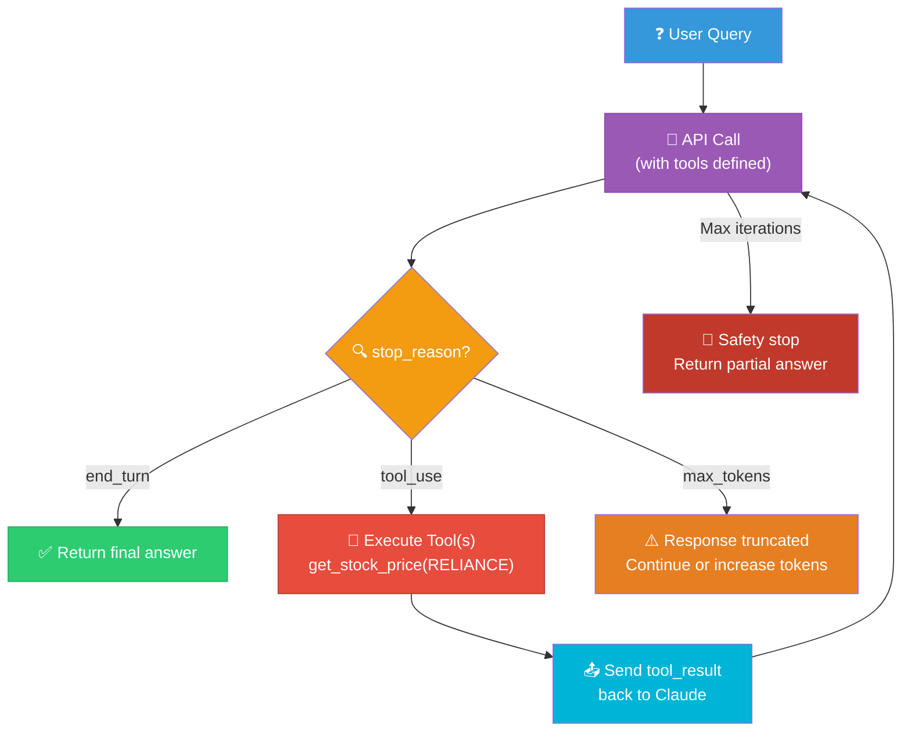
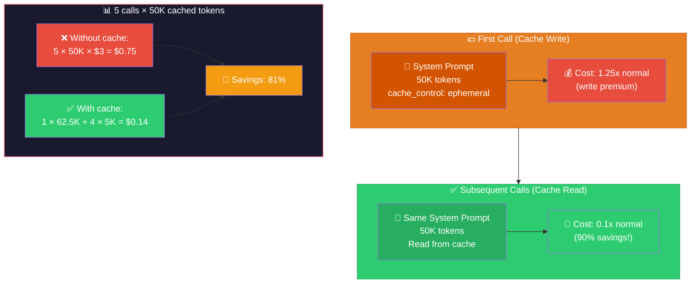
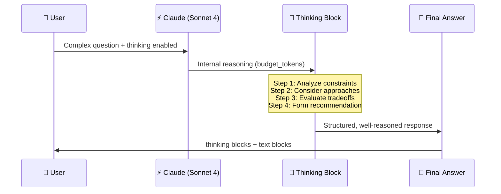
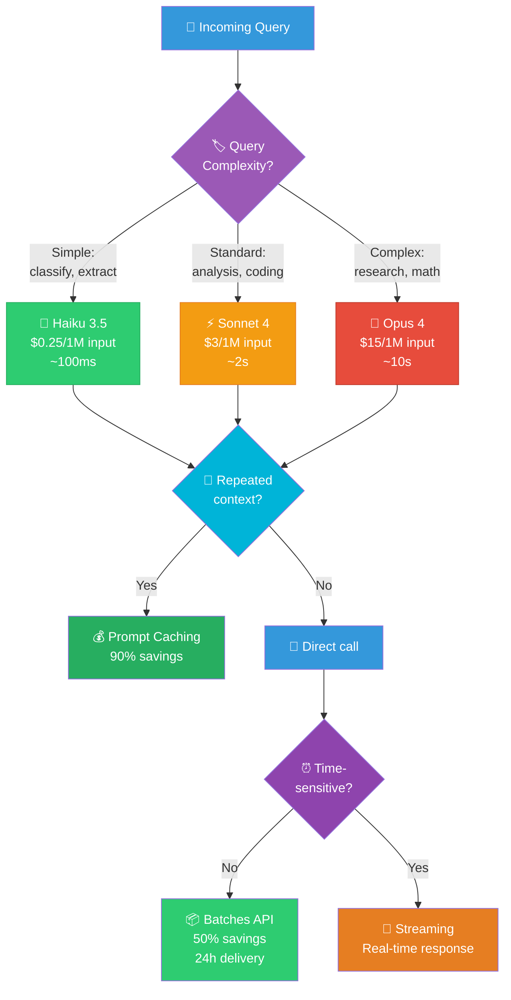
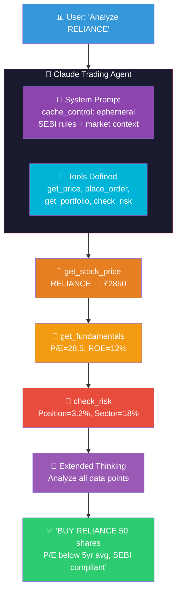
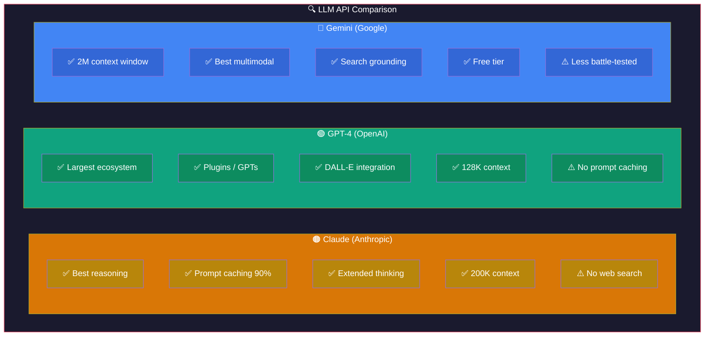
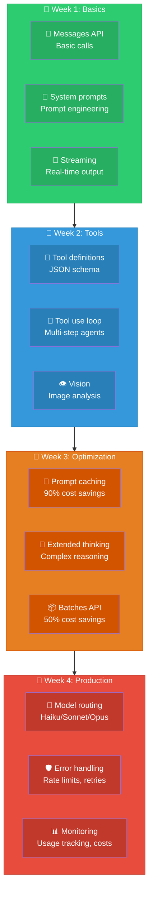

# Claude API: Visual Guide & Architecture Diagrams

## 1. Claude Model Family

## 2. Messages API Flow

## 3. Tool Use Agentic Loop

## 4. Prompt Caching Cost Flow

## 5. Extended Thinking Flow

## 6. Cost Optimization Strategy

## 7. Financial Trading Agent Architecture

## 8. Claude vs GPT vs Gemini Comparison

## 9. Learning Path

