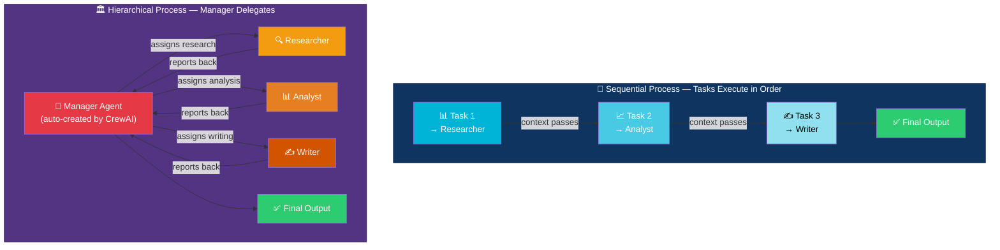
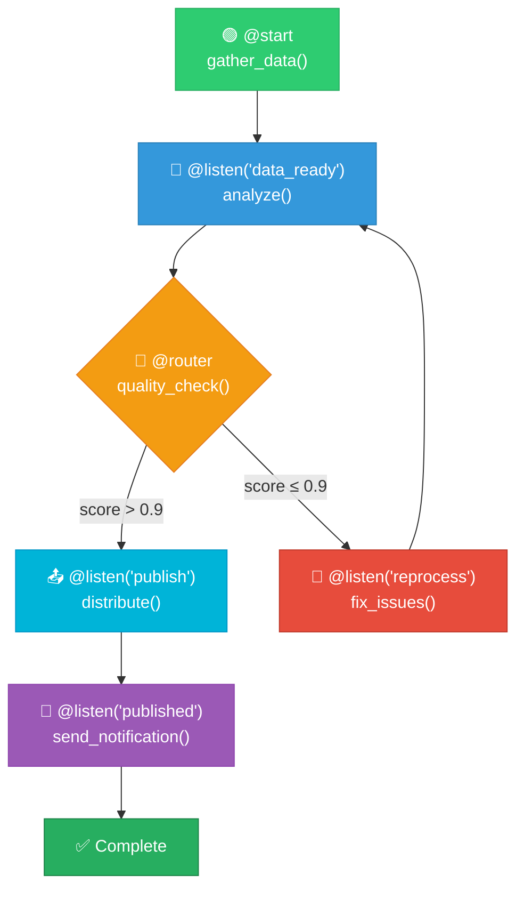
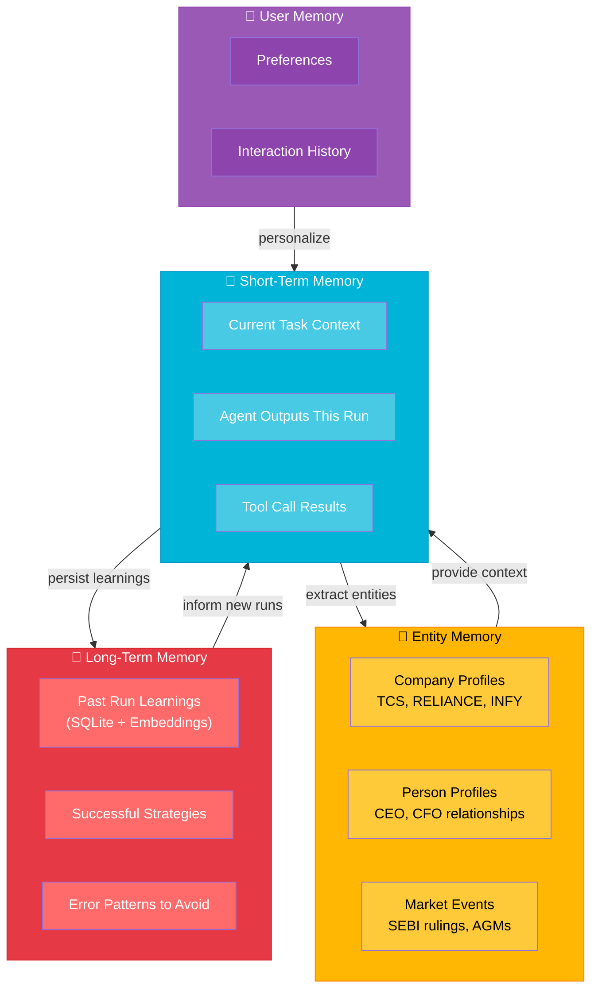
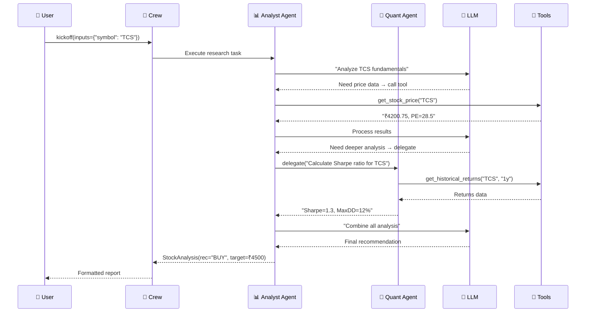
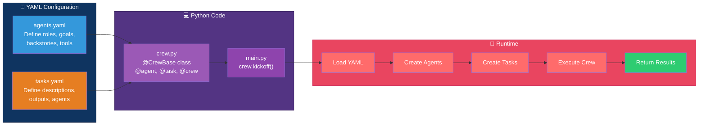
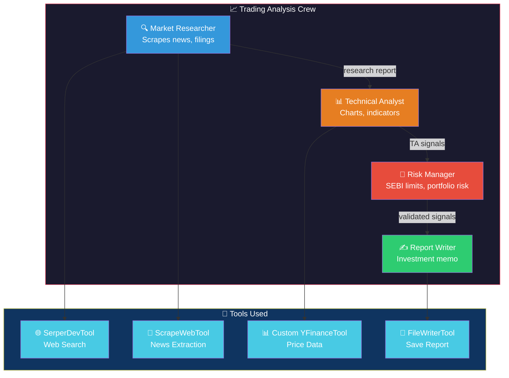
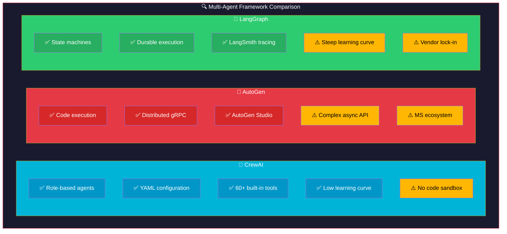
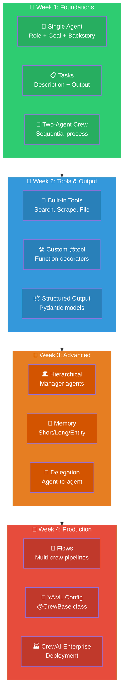

# CrewAI: Visual Guide & Architecture Diagrams

## 1. CrewAI Architecture Overview

```mermaid
graph TD
    CW["🚀 CrewAI Framework"]
    CW --> AG["🤖 Agents<br/>Role + Goal + Backstory"]
    CW --> TK["📋 Tasks<br/>Description + Expected Output"]
    CW --> CR["👥 Crews<br/>Team Orchestration"]
    CW --> FL["🔀 Flows<br/>Multi-Crew Pipelines"]

    AG --> TOOLS["🔧 Tools<br/>60+ Built-in"]
    AG --> LLM["🧠 LLM<br/>GPT-4o, Claude, Gemini"]
    AG --> MEM["💾 Memory<br/>Short/Long/Entity"]
    AG --> DELEG["🤝 Delegation<br/>Agent → Agent"]

    TK --> ASYNC["⚡ Async Tasks"]
    TK --> PYDANTIC["📦 Structured Output<br/>Pydantic Models"]
    TK --> CALLBACK["🔔 Callbacks"]

    CR --> SEQ["📏 Sequential Process"]
    CR --> HIER["🏛️ Hierarchical Process"]
    CR --> COND["🔀 Consensual Process"]

    FL --> START["🟢 @start"]
    FL --> LISTEN["👂 @listen"]
    FL --> ROUTER["🔀 @router"]

    style CW fill:#0078D4,color:#fff,stroke:#005A9E
    style AG fill:#00B4D8,color:#fff,stroke:#0096C7
    style TK fill:#E63946,color:#fff,stroke:#D62828
    style CR fill:#FFB703,color:#000,stroke:#FB8500
    style FL fill:#9B59B6,color:#fff,stroke:#8E44AD
    style TOOLS fill:#48CAE4,color:#fff
    style LLM fill:#48CAE4,color:#fff
    style MEM fill:#48CAE4,color:#fff
    style DELEG fill:#48CAE4,color:#fff
    style ASYNC fill:#FF6B6B,color:#fff
    style PYDANTIC fill:#FF6B6B,color:#fff
    style CALLBACK fill:#FF6B6B,color:#fff
    style SEQ fill:#FFCA3A,color:#000
    style HIER fill:#FFCA3A,color:#000
    style COND fill:#FFCA3A,color:#000
    style START fill:#8E44AD,color:#fff
    style LISTEN fill:#8E44AD,color:#fff
    style ROUTER fill:#8E44AD,color:#fff
```

## 2. Sequential vs Hierarchical Process

## 3. Flow Orchestration Pattern

## 4. Memory System Architecture

## 5. Tool Execution & Agent Delegation Flow

## 6. YAML Configuration Flow

## 7. Financial Trading Crew Example

## 8. CrewAI vs AutoGen vs LangGraph

## 9. Learning Path

