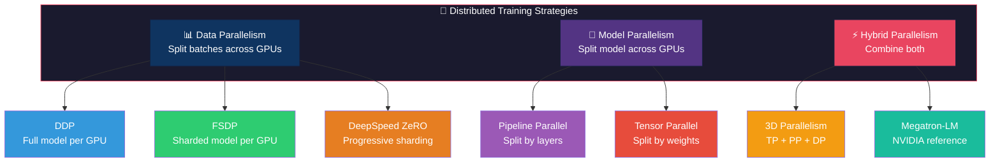
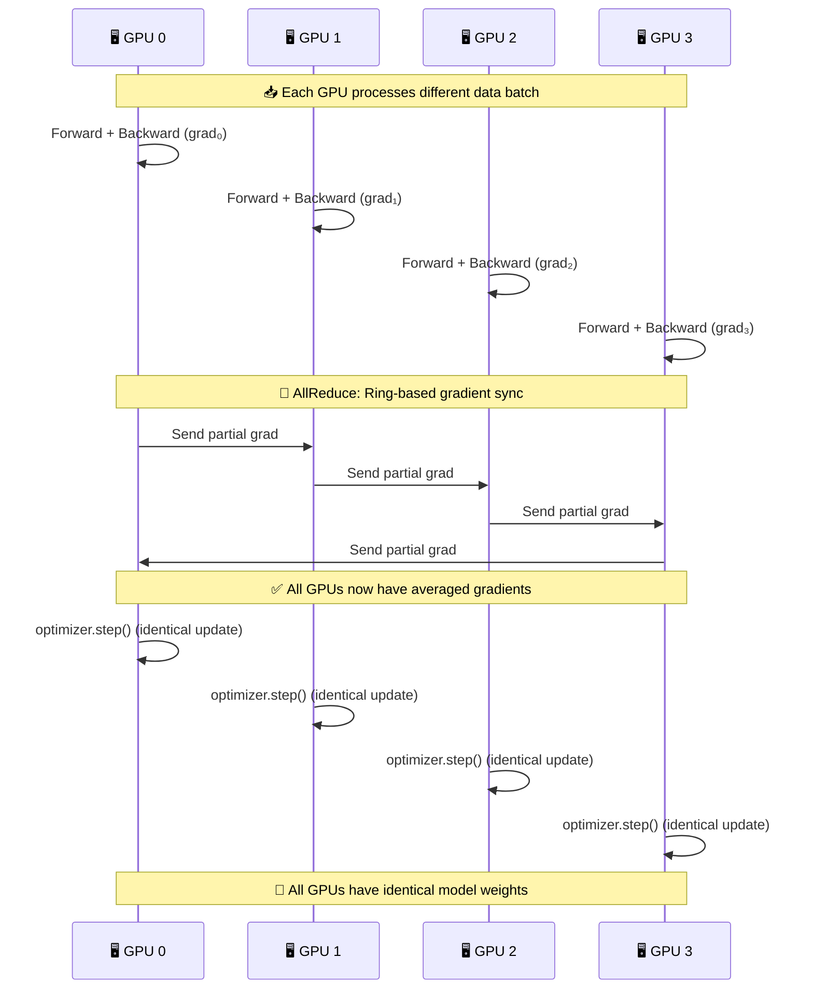
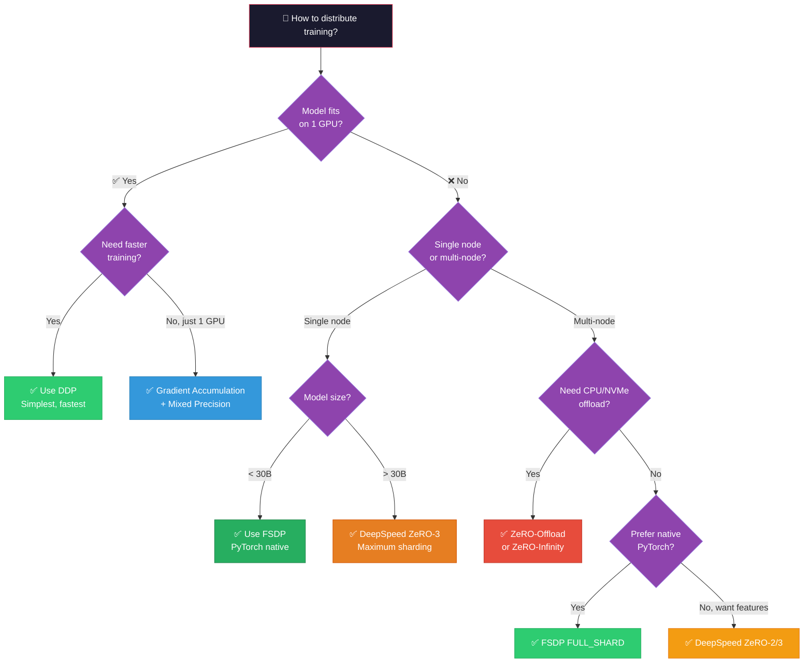
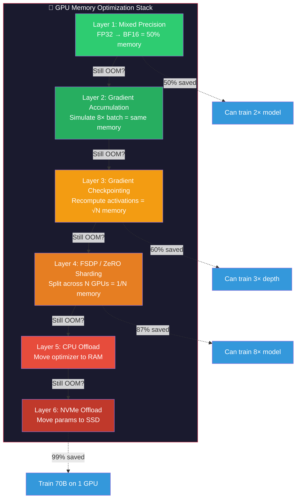
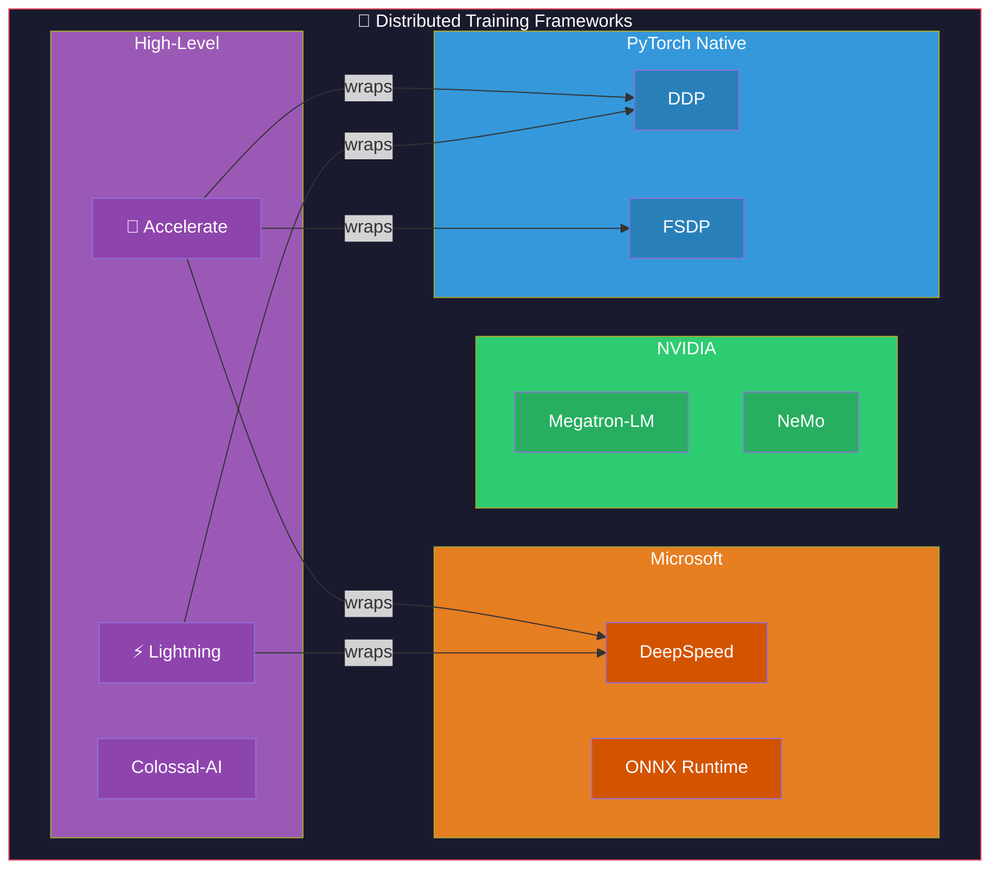
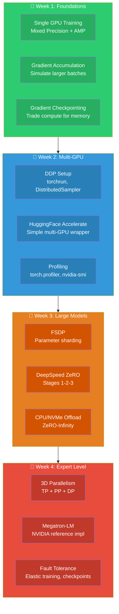

# Distributed Training: Visual Guide

## 1. Distributed Training Strategy Overview

## 2. DDP Communication Flow (AllReduce)

## 3. DeepSpeed ZeRO Stages Memory Breakdown

```mermaid
graph LR
    subgraph S0["Stage 0: DDP<br/>112 GB/GPU"]
        P0["📦 Params 28GB"]
        G0["📐 Grads 28GB"]
        O0["⚙️ Optimizer 56GB"]
    end

    subgraph S1["Stage 1: Shard Optimizer<br/>63 GB/GPU"]
        P1["📦 Params 28GB"]
        G1["📐 Grads 28GB"]
        O1["⚙️ Optim 7GB<br/>÷8 GPUs"]
    end

    subgraph S2["Stage 2: + Shard Grads<br/>31.5 GB/GPU"]
        P2["📦 Params 28GB"]
        G2["📐 Grads 3.5GB<br/>÷8 GPUs"]
        O2["⚙️ Optim 7GB<br/>÷8 GPUs"]
    end

    subgraph S3["Stage 3: + Shard Params<br/>14 GB/GPU"]
        P3["📦 Params 3.5GB<br/>÷8 GPUs"]
        G3["📐 Grads 3.5GB<br/>÷8 GPUs"]
        O3["⚙️ Optim 7GB<br/>÷8 GPUs"]
    end

    S0 -->|"44% savings"| S1
    S1 -->|"72% savings"| S2
    S2 -->|"87% savings"| S3

    style S0 fill:#e74c3c,color:#fff
    style S1 fill:#e67e22,color:#fff
    style S2 fill:#f1c40f,color:#000
    style S3 fill:#2ecc71,color:#fff
    style P0 fill:#c0392b,color:#fff
    style P1 fill:#d35400,color:#fff
    style P2 fill:#f39c12,color:#000
    style P3 fill:#27ae60,color:#fff
    style G0 fill:#c0392b,color:#fff
    style G1 fill:#d35400,color:#fff
    style G2 fill:#f39c12,color:#000
    style G3 fill:#27ae60,color:#fff
    style O0 fill:#c0392b,color:#fff
    style O1 fill:#d35400,color:#fff
    style O2 fill:#f39c12,color:#000
    style O3 fill:#27ae60,color:#fff
```

## 4. Pipeline Parallelism: Micro-Batch Scheduling

```mermaid
gantt
    title Pipeline Parallelism — GPipe vs 1F1B Schedule
    dateFormat X
    axisFormat %s

    section GPU 0 (Layers 0-7)
    F0-mb1 :active, f01, 0, 1
    F0-mb2 :active, f02, 1, 2
    F0-mb3 :active, f03, 2, 3
    F0-mb4 :active, f04, 3, 4
    Bubble  :crit, b0, 4, 8
    B0-mb4 :done, b04, 8, 9
    B0-mb3 :done, b03, 9, 10
    B0-mb2 :done, b02, 10, 11
    B0-mb1 :done, b01, 11, 12

    section GPU 1 (Layers 8-15)
    Bubble  :crit, w1, 0, 1
    F1-mb1 :active, f11, 1, 2
    F1-mb2 :active, f12, 2, 3
    F1-mb3 :active, f13, 3, 4
    F1-mb4 :active, f14, 4, 5
    Bubble  :crit, b1, 5, 7
    B1-mb4 :done, b14, 7, 8
    B1-mb3 :done, b13, 8, 9
    B1-mb2 :done, b12, 9, 10
    B1-mb1 :done, b11, 10, 11

    section GPU 2 (Layers 16-23)
    Bubble  :crit, w2, 0, 2
    F2-mb1 :active, f21, 2, 3
    F2-mb2 :active, f22, 3, 4
    F2-mb3 :active, f23, 4, 5
    F2-mb4 :active, f24, 5, 6
    B2-mb4 :done, b24, 6, 7
    B2-mb3 :done, b23, 7, 8
    B2-mb2 :done, b22, 8, 9
    B2-mb1 :done, b21, 9, 10

    section GPU 3 (Layers 24-31)
    Bubble  :crit, w3, 0, 3
    F3-mb1 :active, f31, 3, 4
    F3-mb2 :active, f32, 4, 5
    F3-mb3 :active, f33, 5, 6
    F3-mb4 :active, f34, 6, 7
    B3-mb4 :done, b34, 5, 6
    B3-mb3 :done, b33, 6, 7
    B3-mb2 :done, b32, 7, 8
    B3-mb1 :done, b31, 8, 9
```

## 5. FSDP vs DDP vs DeepSpeed Decision Guide

## 6. 3D Parallelism Layout (64 GPUs)

```mermaid
graph TB
    subgraph Cluster["🌐 64 GPU Cluster: TP=4 × PP=4 × DP=4"]
        subgraph N0["Node 0 — DP Rank 0"]
            subgraph TP0["TP Group (Layers 0-7)"]
                G00["GPU 0<br/>¼ weights"]
                G01["GPU 1<br/>¼ weights"]
                G02["GPU 2<br/>¼ weights"]
                G03["GPU 3<br/>¼ weights"]
            end
            subgraph TP1["TP Group (Layers 8-15)"]
                G04["GPU 4"]
                G05["GPU 5"]
                G06["GPU 6"]
                G07["GPU 7"]
            end
        end

        subgraph N1["Node 1 — DP Rank 0"]
            subgraph TP2["TP Group (Layers 16-23)"]
                G10["GPU 8"]
                G11["GPU 9"]
                G12["GPU 10"]
                G13["GPU 11"]
            end
            subgraph TP3["TP Group (Layers 24-31)"]
                G14["GPU 12"]
                G15["GPU 13"]
                G16["GPU 14"]
                G17["GPU 15"]
            end
        end
    end

    TP0 -->|"Pipeline"| TP1
    TP1 -->|"Pipeline"| TP2
    TP2 -->|"Pipeline"| TP3

    style Cluster fill:#1a1a2e,color:#fff,stroke:#e94560
    style N0 fill:#0f3460,color:#fff
    style N1 fill:#0f3460,color:#fff
    style TP0 fill:#e94560,color:#fff
    style TP1 fill:#f39c12,color:#fff
    style TP2 fill:#2ecc71,color:#fff
    style TP3 fill:#3498db,color:#fff
    style G00 fill:#c0392b,color:#fff
    style G01 fill:#c0392b,color:#fff
    style G02 fill:#c0392b,color:#fff
    style G03 fill:#c0392b,color:#fff
    style G04 fill:#d35400,color:#fff
    style G05 fill:#d35400,color:#fff
    style G06 fill:#d35400,color:#fff
    style G07 fill:#d35400,color:#fff
    style G10 fill:#27ae60,color:#fff
    style G11 fill:#27ae60,color:#fff
    style G12 fill:#27ae60,color:#fff
    style G13 fill:#27ae60,color:#fff
    style G14 fill:#2980b9,color:#fff
    style G15 fill:#2980b9,color:#fff
    style G16 fill:#2980b9,color:#fff
    style G17 fill:#2980b9,color:#fff
```

## 7. Mixed Precision & Memory Optimization

## 8. Framework Comparison

## 9. Learning Path

