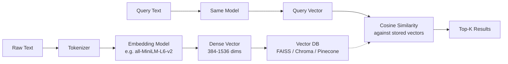

# Embeddings — Cheatsheet

## Architecture (30-second mental model)

## When to use vs alternatives
| Need | Use | Not |
|------|-----|-----|
| Semantic similarity / "meaning-based" search | Embeddings + vector search | Keyword search (BM25) |
| Exact keyword matching, boolean filters | BM25 / Elasticsearch | Embeddings alone |
| Best of both worlds (semantic + keyword) | Hybrid: embeddings + BM25 with RRF | Either alone |
| Cross-modal search (text to image) | Multi-modal embeddings (CLIP) | Text-only models |
| Low-latency on millions of vectors | ANN indexes (HNSW, IVF) | Brute-force cosine scan |

## 5 things you always forget
1. Vectors from different models live in incompatible learned metric spaces -- cosine similarity between cross-model vectors is mathematically meaningless, not just "slightly off." Even minor model version updates can shift the space.
2. Normalize your vectors before storing if using cosine similarity -- most models output unnormalized vectors; skipping this step silently degrades ranking quality.
3. Matryoshka embeddings (e.g., `text-embedding-3-small`) let you truncate dimensions at query time for speed vs quality trade-off -- embed at full dim, search at 256d for 4x speedup with ~2% quality loss.
4. Batch your embedding calls -- encoding one text at a time is 10-50x slower than batching 32-128 texts per call due to GPU parallelism and API overhead.
5. Embeddings drift when you update the model -- if you swap or fine-tune your embedding model, you must re-embed your entire corpus; there is no shortcut.

## Interview killer answer
> "In our production search system, we started with OpenAI ada-002 embeddings but found that fine-tuning sentence-transformers on our domain data improved recall@10 by 18 points. The key insight was that generic embeddings conflated terms that meant different things in our domain -- for example, 'agent' in insurance vs. 'agent' in AI. After fine-tuning, we also switched from FAISS Flat to HNSW indexing, which cut p99 latency from 120ms to 8ms at 5M vectors with less than 1% recall loss."
