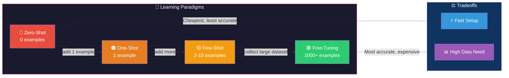
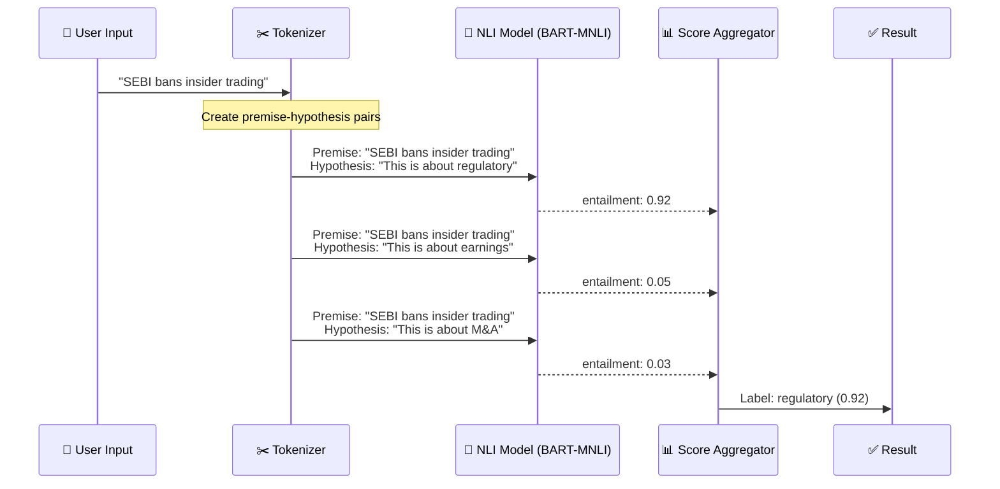
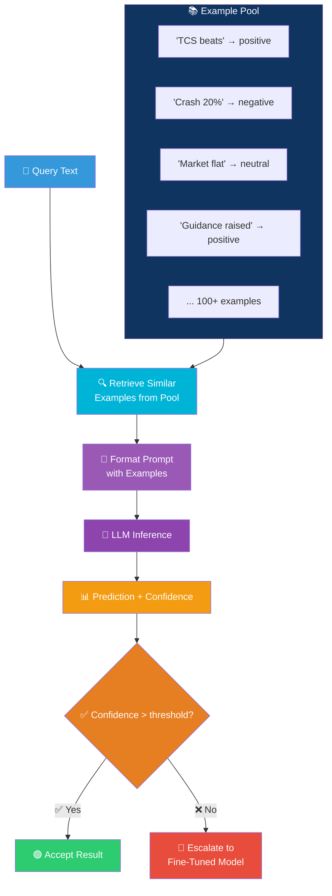
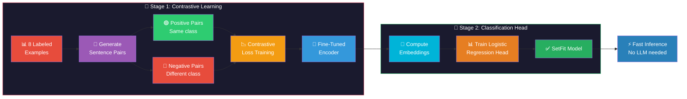
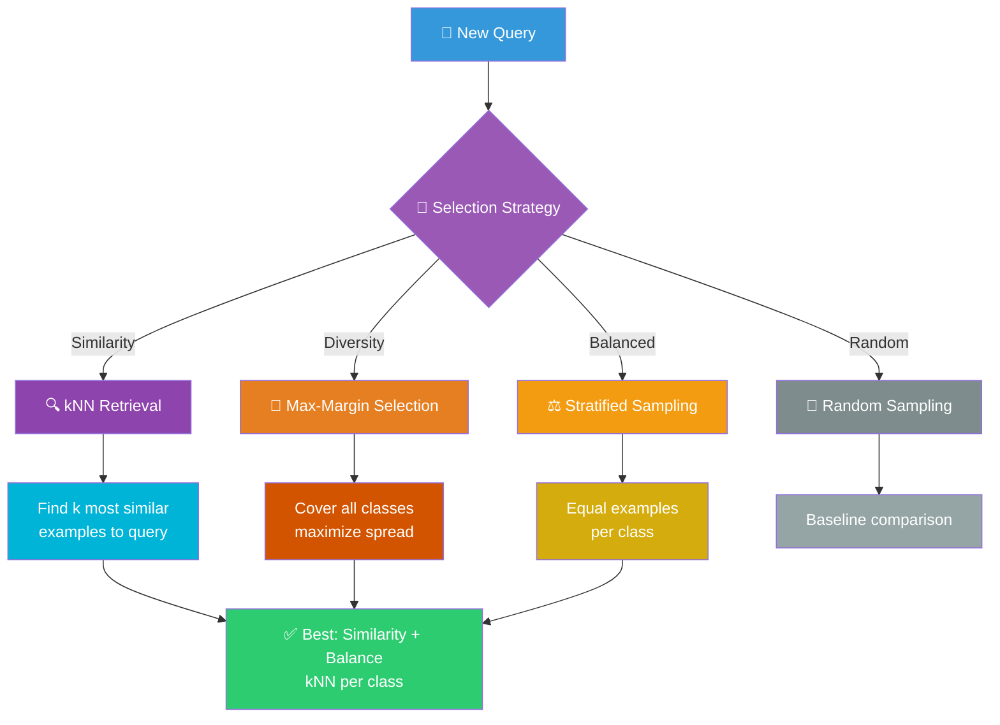
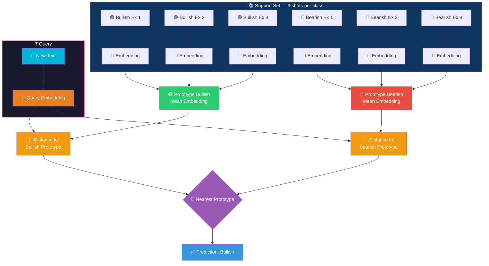
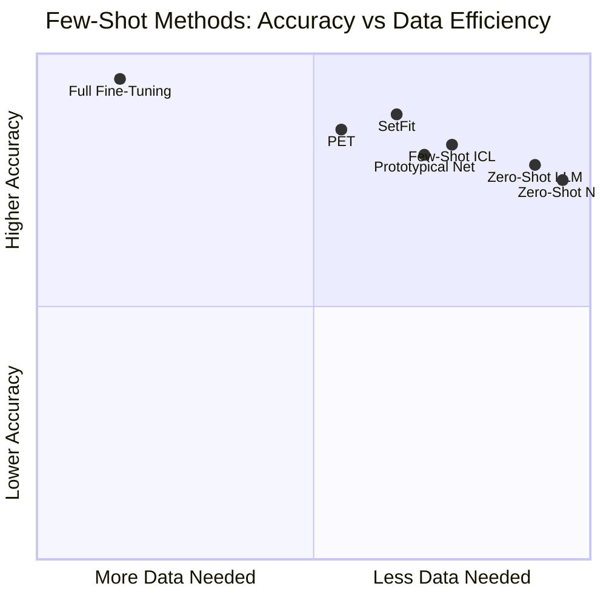
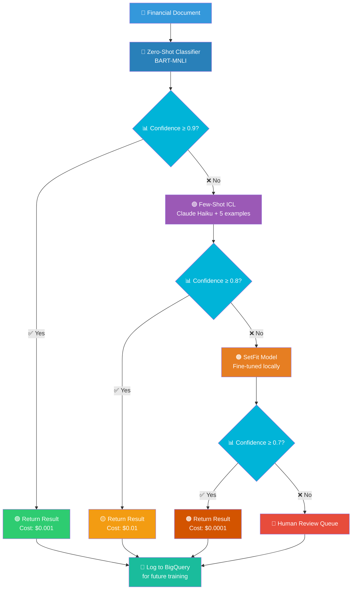
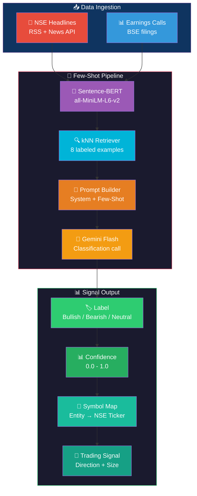
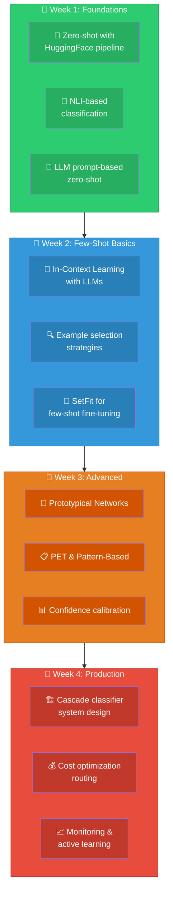

# Few-Shot & Zero-Shot Learning: Visual Guide & Architecture Diagrams

## 1. Learning Paradigm Spectrum

## 2. Zero-Shot Classification Flow (NLI-Based)

## 3. Few-Shot In-Context Learning Flow

## 4. SetFit Training Pipeline

## 5. Demonstration Selection Strategies

## 6. Prototypical Network Architecture

## 7. Method Comparison Matrix

## 8. Cascade Classification System

## 9. Financial Few-Shot Trading Classifier

## 10. Learning Path

