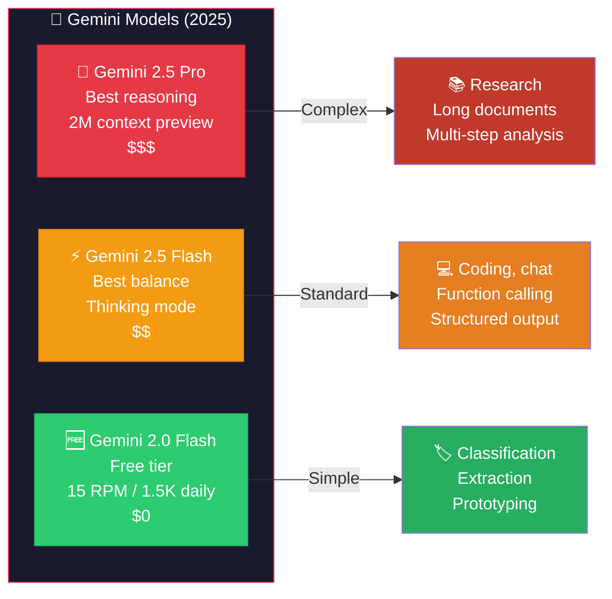
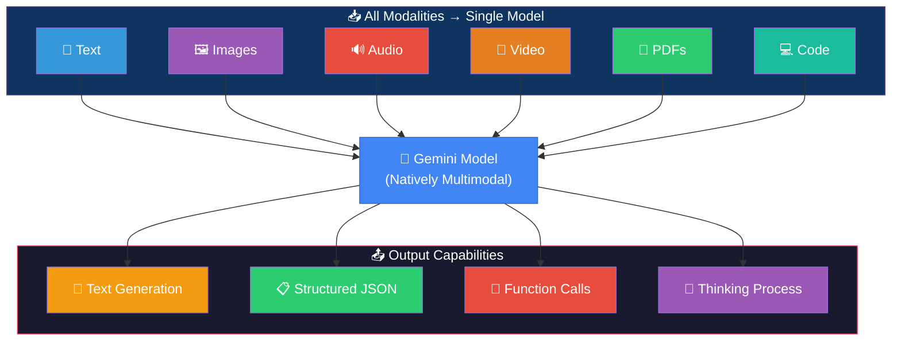
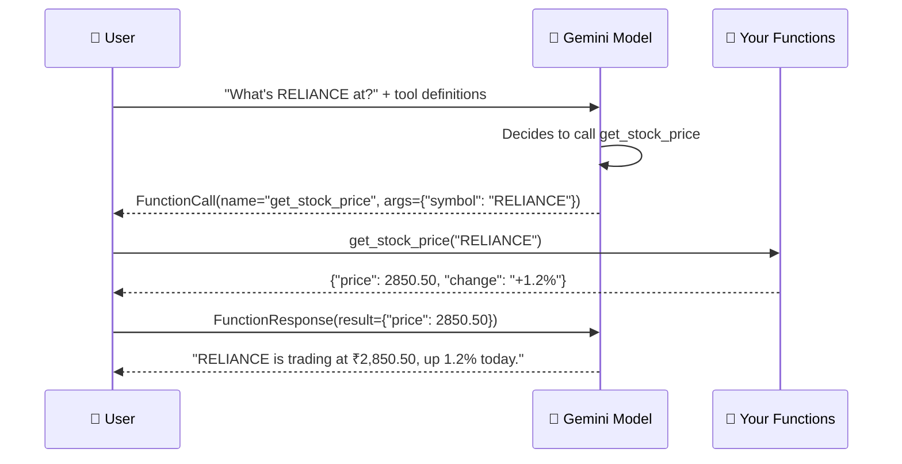
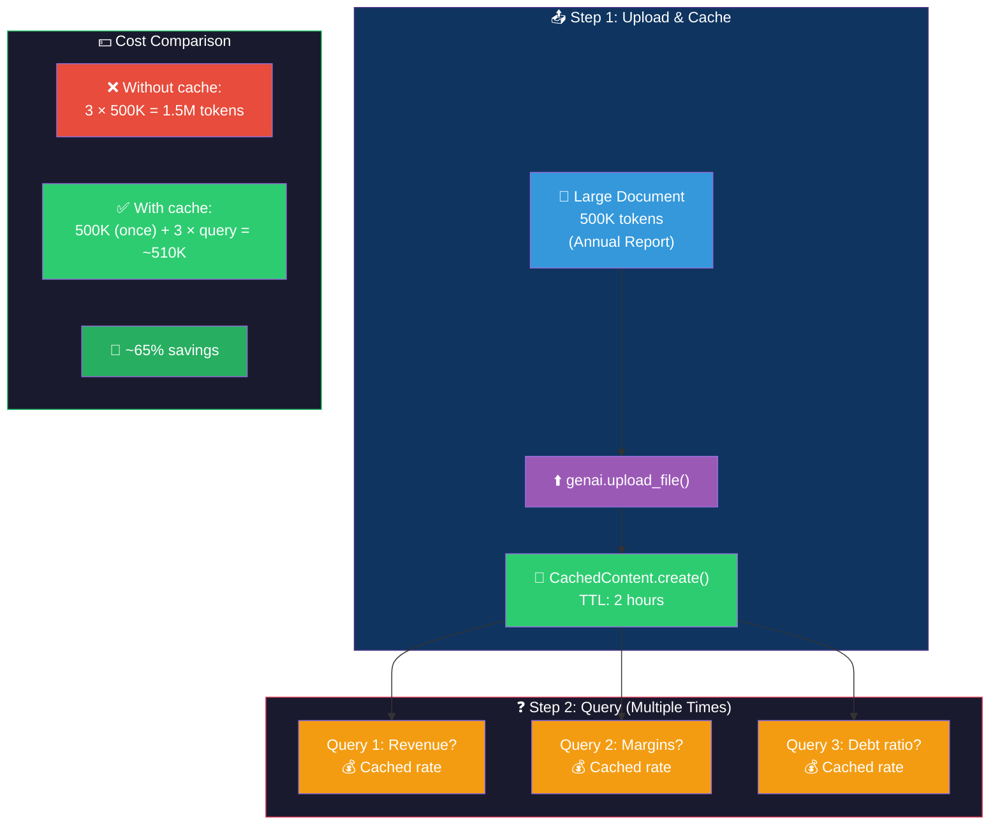
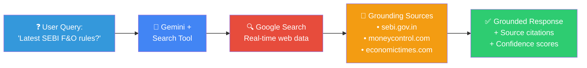
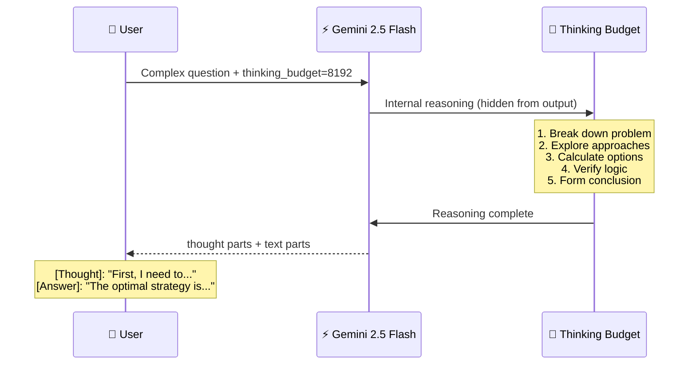
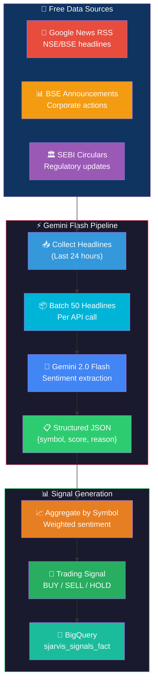
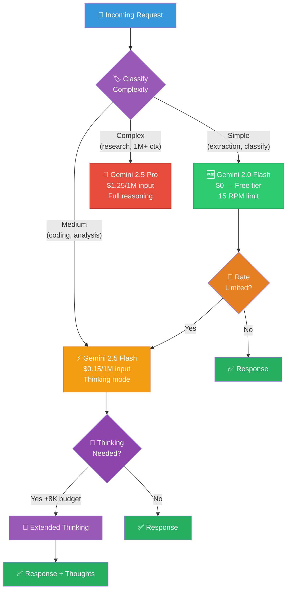
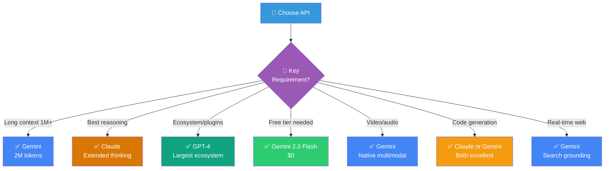
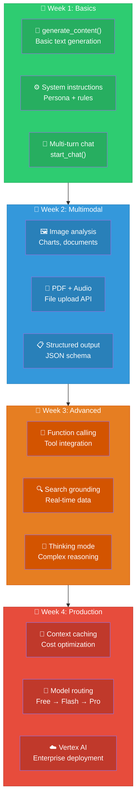

# Gemini API: Visual Guide & Architecture Diagrams

## 1. Gemini Model Family

## 2. Native Multimodal Architecture

## 3. Function Calling Flow

## 4. Context Caching Flow

## 5. Google Search Grounding

## 6. Thinking Mode Flow

## 7. Gemini Trading Sentiment Pipeline

## 8. Model Routing Strategy (Cost Optimization)

## 9. Gemini vs Claude vs GPT Decision Guide

## 10. Learning Path

