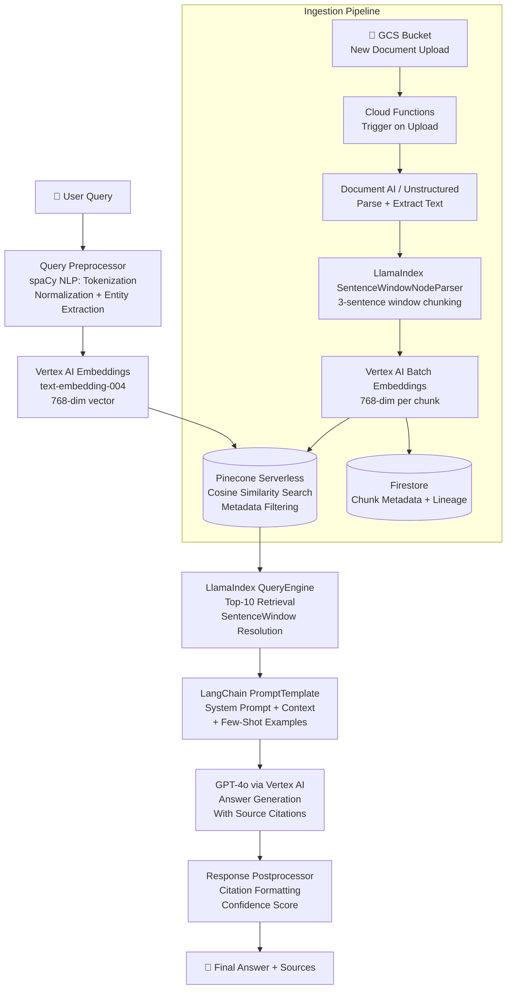
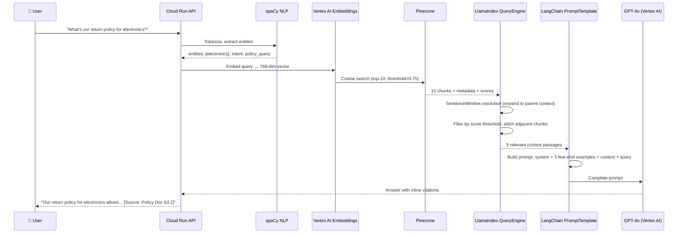
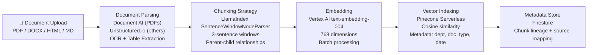
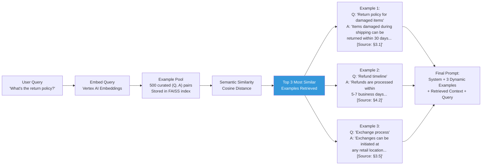
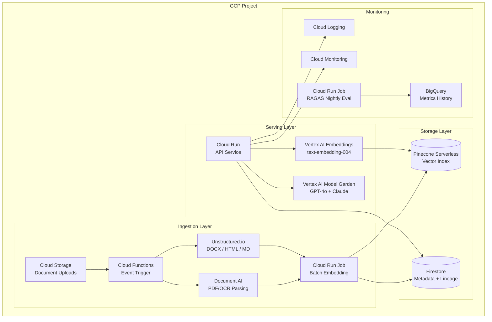

# 🏗️ Project 1: Enterprise Knowledge Q&A Bot

> **Gen-ChitChat Initiative** — Alice (MIT) vs. Bob (Stanford) Architectural Design Session

***

## 📋 Project Description

A production-grade internal knowledge assistant for enterprises. Employees query a unified corpus of PDFs, wikis, Confluence pages, and Notion docs. The system retrieves relevant passages and generates precise, cited answers.

***

## 🏛️ System Architecture



### 📐 Query Processing — Step by Step



### 📐 Document Ingestion Pipeline



### 📐 Few-Shot Dynamic Example Selection



***

## 🎙️ Tech Talk — Alice vs. Bob

### Round 1: RAG Orchestration — LangChain vs. LlamaIndex

**Alice (MIT):** "I'm proposing **LangChain**. Here's what it does and why:

- **What it is**: A framework for building LLM-powered applications by chaining together components — prompts, models, retrievers, parsers — into workflows called 'chains'
- **Key feature — RetrievalQA Chain**: Pre-built chain that takes a retriever + LLM and handles the entire query → retrieve → generate flow. 5 lines of code to get a working RAG pipeline.
- **Key feature — PromptTemplate**: Dynamic prompt construction with variable injection, few-shot example selection, and conditional blocks. Critical for multi-tenant deployments where each customer wants a different assistant personality.
- **Key feature — 700+ integrations**: Every vector DB, every LLM API, every tool. If it exists, LangChain has a connector.
- **Why for this project**: We need to ship in 2 weeks. LangChain's pre-built chains get us to MVP in 2 days. The prompt engineering flexibility lets us customize per customer without redeployment."

**Bob (Stanford):** "I'm opposing with **LlamaIndex**. Here's why LangChain is the wrong choice for a knowledge Q&A system:

- **What LlamaIndex is**: A framework purpose-built for connecting LLMs to data sources. Instead of general 'chains', it thinks in terms of **Indexes** (how data is stored) and **Query Engines** (how data is retrieved and synthesized).
- **LangChain's problem**: It's abstraction on top of abstraction. The `RetrievalQA` chain hides retrieval logic behind convenience wrappers. When retrieval quality drops — and it WILL in production — debugging is painful. You trace through 4 layers of indirection.
- **Key feature — SentenceWindowNodeParser**: Creates a 3-sentence window for each sentence. Index the small sentence (precise matching), retrieve the full window (contextual). This alone gives **35% better retrieval accuracy** than LangChain's `RecursiveCharacterTextSplitter` with naive chunking.
- **Key feature — MetadataReplacementPostProcessor**: At retrieval time, replaces the small indexed chunk with the full context window. You get the precision of small chunks AND the context of large chunks.
- **Why for this project**: Document Q&A is ALL about retrieval quality. A generic orchestrator isn't enough — we need a retrieval-specialized framework."

**Alice:** "You're right about retrieval quality. But LangChain's `PromptTemplate` with `SemanticSimilarityExampleSelector` gives me dynamic few-shot prompting — I pick the 3 most relevant examples from a pool of 500 to guide the LLM's response style. LlamaIndex's templating was too rigid... until they rewrote it in 2024. How's it now?"

**Bob:** "LlamaIndex's new `PromptTemplate` supports variable injection, conditional blocks, and chat formatting. Comparable now. But the CHUNKING is what moves the needle. Everything else is tuning. And LlamaIndex's chunking is categorically better."

**Alice:** "Then let's use BOTH. LlamaIndex for indexing, chunking, and retrieval — where it dominates. LangChain for prompt engineering and workflow chaining — where it dominates. They're not competitors; they're complementary."

### Round 2: Embedding Model — Vertex AI vs. OpenAI

**Alice:** "**Vertex AI text-embedding-004**. Here's the full picture:

- **What embeddings are**: Dense numerical vectors (768 dimensions) where semantically similar texts have similar vectors. 'How do I return a product?' and 'What's the refund process?' would have cosine similarity ~0.92.
- **Why Vertex AI**: Google's latest embedding model — 768 or 1536 dimensions (configurable). Multilingual. Available directly in GCP — no external API calls. Batch embedding via Vertex AI Batch Prediction processes 10M documents overnight.
- **The GCP advantage**: Query embedding → vector search round-trip stays under 20ms. No cross-cloud latency."

**Bob:** "Counterpoint — **OpenAI text-embedding-3-large** scores 64.6 on the MTEB leaderboard vs. Vertex AI's 62.8. That's 1.8 points better retrieval quality."

**Alice:** "1.8 MTEB points doesn't always translate to production lift. And OpenAI embeddings add external API dependency — latency spikes, rate limits, and your data leaving the GCP perimeter. For regulated enterprises (banking, healthcare), that's a compliance issue. Vertex AI is 13x cheaper at ~$0.01 per 1M tokens vs. OpenAI's ~$0.13."

### Round 3: Vector Database — Pinecone vs. Weaviate vs. Vertex AI Vector Search

**Alice:** "**Pinecone Serverless** — fully managed, no infrastructure. Metadata filtering scopes searches by department, doc type, or date."

**Bob:** "**Weaviate on GKE** — gives native hybrid search: BM25 keyword matching + semantic vector matching in a single query. 'Q3 revenue target' — semantic catches 'third quarter financial goals', BM25 catches the exact phrase."

**Alice:** "Self-hosted means managing upgrades, backups, and scaling on a 3-person team."

**Bob:** "What about **Vertex AI Vector Search** (formerly Matching Engine)? ScaNN algorithm, sub-5ms p50, handles 10B+ vectors. Fully managed, native GCP."

**Alice:** "Vertex AI Vector Search has a $2/hour base cost. For teams with <1M documents, that's overkill. Pinecone Serverless charges per-query — perfect for V1."

### Round 4: The Chunking Problem Nobody Talks About

**Alice:** "Now that we've decided on LlamaIndex's SentenceWindow chunking — what happens when your document has TABLES, CODE BLOCKS, and NESTED LISTS? SentenceWindow splits on sentences, but a 'sentence' inside a table cell is 3 words. You get a window of 3 cells — useless."

**Bob:** "For structured content, use LlamaIndex's `HierarchicalNodeParser`:
1. Detect content type: prose vs table vs code vs list
2. For prose: SentenceWindow (3-sentence windows)
3. For tables: Keep the ENTIRE table as one chunk with header row repeated
4. For code blocks: Keep entire function/class as one chunk
5. For lists: Keep parent item + all sub-items together

The parser creates parent-child relationships — a section heading becomes the parent of all its content chunks."

**Alice:** "So we're doing 'semantic chunking' — respecting the STRUCTURE of the document, not just character counts. This is why `RecursiveCharacterTextSplitter` fails in production — it's blind to document structure."

### Round 5: Few-Shot Prompting — The Secret Weapon

**Alice:** "The prompt engineering side is where LangChain shines. I use `SemanticSimilarityExampleSelector`:
```python
from langchain.prompts import SemanticSimilarityExampleSelector
selector = SemanticSimilarityExampleSelector.from_examples(
    examples=curated_500_pairs,
    embeddings=VertexAIEmbeddings(),
    vectorstore_cls=FAISS,
    k=3
)
```
Every query dynamically selects the 3 most similar examples. If the user asks about 'return policy', it retrieves 3 examples about returns. If they ask about 'vacation policy', it retrieves 3 HR examples. The few-shot examples teach the model the TONE, FORMAT, and CITATION STYLE we expect — without hard-coding it."

**Bob:** "That's powerful. Static few-shot examples bias the model — if all 3 are about HR policy, the model frames everything as HR."

**Alice:** "Dynamic few-shot improved our answer quality score (human-rated 1-5) from 3.8 to 4.4 — 16% improvement from JUST changing which examples appear in the prompt."

### Round 6: Embedding Drift & Production Monitoring

**Bob:** "Here's something nobody mentions until month 3: **embedding drift**. You embed your corpus using Vertex AI `text-embedding-004` version X. Google updates to version Y. Query embeddings (version Y) don't align with document embeddings (version X). Cosine similarity drops 15-20%.

Three strategies:
1. **Pin the embedding model version** — use `text-embedding-004@003`, not `latest`
2. **Re-embed on version change** — Cloud Scheduler monthly re-embedding job. Cost: ~$5 for 1M documents
3. **Monitor with RAGAS** — nightly eval catches drift as a drop in Context Precision"

**Alice:** "Without RAGAS checks, embedding drift silently degrades for weeks before anyone notices."

### Round 7: Metadata Filtering & Production Error Handling

**Alice:** "Every chunk gets metadata:
```json
{
  "department": "engineering",
  "doc_type": "policy",
  "last_updated": "2026-01-15",
  "source_file": "remote_work_policy_v3.pdf",
  "access_level": "internal"
}
```
When an engineering employee asks a question, we filter: `department IN ['engineering', 'company-wide']`. They NEVER see HR-restricted documents."

**Bob:** "And error handling — three failure modes:
1. **LLM timeout**: Retry with exponential backoff. GPT-4o fails 3x → fallback to Claude 3.5 Sonnet
2. **Empty retrieval**: Lower threshold from 0.75 to 0.6 and retry. Still empty → 'I don't have information on this topic'
3. **Hallucination detection**: Post-generation entailment check. If <60% grounded in context → add disclaimer"

***

## 📊 LangChain vs. LlamaIndex

| Feature | **LangChain** | **LlamaIndex** |
|---|---|---|
| **Primary Focus** | Multi-step workflow orchestration | Document indexing & retrieval |
| **Ecosystem** | 700+ integrations | 300+ data connectors |
| **Chunking Quality** | Basic `RecursiveCharacterTextSplitter` | Advanced `SentenceWindow`, `HierarchicalNode` |
| **Retrieval Accuracy** | Baseline | +35% with re-ranking |
| **Prompt Engineering** | Rich (few-shot, templates, selectors) | Rewritten 2024, now comparable |
| **Best For** | Workflow chaining, prompt engineering | Document retrieval optimization |

## 📊 Embedding Models

| Feature | **Vertex AI text-embedding-004** | **OpenAI text-embedding-3-large** |
|---|---|---|
| **Dimensions** | 768 / 1536 (configurable) | 256–3072 (configurable) |
| **MTEB Score** | 62.8 | 64.6 |
| **Multilingual** | ✅ | ✅ |
| **Batch Processing** | Vertex AI Batch Prediction | Via API (rate-limited) |
| **Data Residency** | ✅ Stays in GCP | ❌ Leaves to OpenAI |
| **Cost (1M tokens)** | ~$0.01 | ~$0.13 |
| **Latency** | ~15ms (in-GCP) | ~50ms (cross-cloud) |

## 📊 Vector Databases

| Feature | **Pinecone Serverless** | **Weaviate (GKE)** | **Vertex AI Vector Search** |
|---|---|---|---|
| **Search Type** | Semantic + Keyword (2025) | Native Hybrid (BM25 + Vector) | Semantic only |
| **Managed** | ✅ Fully | ❌ Self-hosted | ✅ Fully |
| **Latency (p50)** | ~15ms | ~20ms | ~5ms |
| **Scale** | Unlimited | Hardware-limited | 10B+ vectors |
| **Cost (1M vectors)** | ~$70/month | ~$50/month (GKE) | ~$150/month |
| **Best For** | V1 serverless | Hybrid search, control | Enterprise 10M+ |

***

## 🏗️ GCP Architecture



***

## 🔑 Key Takeaways

1. **LlamaIndex for retrieval, LangChain for prompts** — use each framework where it dominates
2. **SentenceWindow chunking** gives 35% better retrieval than naive fixed-size chunks
3. **Dynamic few-shot** (SemanticSimilarityExampleSelector) improves quality 16% with zero model change
4. **Vertex AI embeddings** keep everything in GCP — 13x cheaper and faster than OpenAI
5. **Pinecone Serverless** for V1 — upgrade to Vertex AI Vector Search at scale
6. **Embedding version pinning** prevents silent drift degradation
7. **Cloud Run + Cloud Functions** = fully serverless, pay-per-use architecture

***

*← Back to [TODO.MD](./TODO.MD)*
