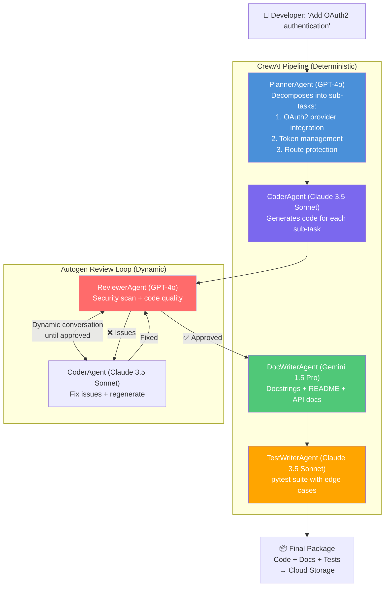
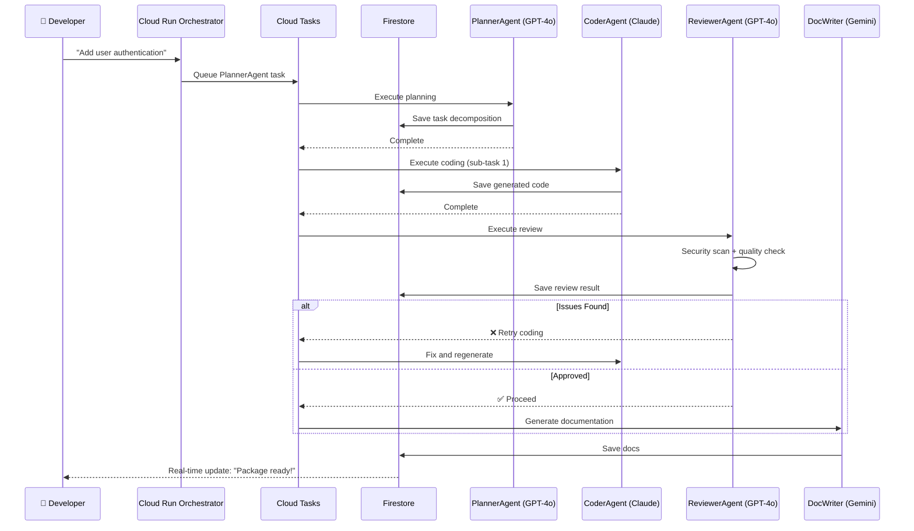
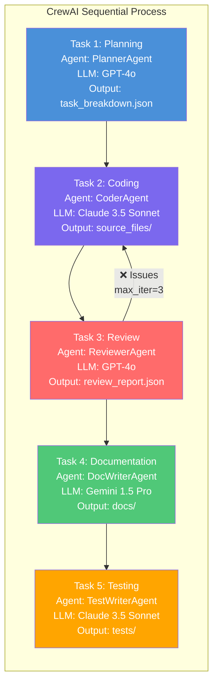
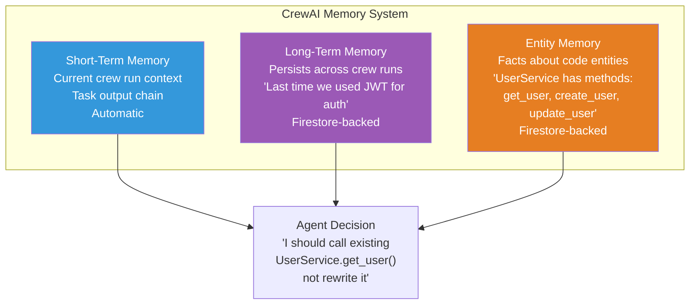
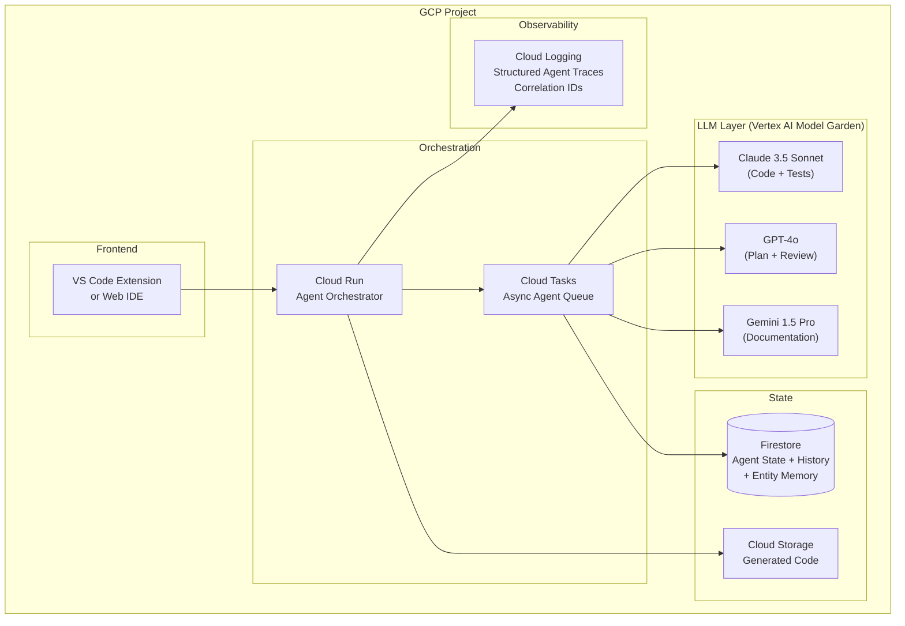

# 🏗️ Project 2: Multi-Agent Coding Assistant

> **Gen-ChitChat Initiative** — Alice (MIT) vs. Bob (Stanford) Architectural Design Session

***

## 📋 Project Description

A multi-agent system where specialized AI agents collaborate to write, review, test, and document code. Agents include a `PlannerAgent`, `CoderAgent`, `ReviewerAgent`, `TestWriterAgent`, and `DocWriterAgent`. Deployed on **GCP Cloud Run** with state persisted in **Firestore**.

***

## 🏛️ System Architecture



### 📐 Agent Communication Flow



### 📐 CrewAI Task Pipeline



### 📐 Agent Memory Architecture



***

## 🎙️ Tech Talk — Alice vs. Bob

### Round 1: Multi-Agent Framework — Autogen vs. CrewAI

**Alice (MIT):** "I'm proposing **Autogen** (by Microsoft). Multiple AI agents have a GROUP CONVERSATION — like a Slack channel where 5 agents chat:

- **ConversableAgent**: Every agent can send/receive messages. `PlannerAgent` posts a task breakdown, `CoderAgent` reads it and posts code, `ReviewerAgent` reads the code and posts feedback. Natural back-and-forth.
- **UserProxyAgent**: Represents the human. Before `CoderAgent` executes code, the human can approve or reject. Human-in-the-loop built into the conversation.
- **GroupChat Manager**: Orchestrates who speaks next — round-robin, LLM-selected, or custom logic.
- **Dynamic sub-conversations**: `ReviewerAgent` can pull `CoderAgent` into a SIDE conversation to clarify a function — like two people stepping out of a meeting to resolve a detail."

**Bob (Stanford):** "Autogen's philosophy is flawed for production. **CrewAI** models agents as a TEAM with roles:

- Each agent has a `role`, `goal`, and `backstory` — rich personas that shape behavior
- Tasks are explicit units of work with `expected_output` specs
- `Process.sequential`: Task 1 → Task 2 → Task 3. Deterministic and auditable
- `Process.hierarchical`: Manager assigns tasks dynamically WITH audit trails
- `CrewOutput`: Every task's result, execution time, and token usage — fully traceable
- **Memory**: Short-term (current run) + Long-term (across runs) + Entity memory (facts about code modules)

When your CTO asks 'what did the agent do?', I can replay the EXACT execution. Autogen's conversation log shows 47 messages — good luck tracing."

**Alice:** "But Autogen's dynamic sub-conversations are game-changing for code review! The `ReviewerAgent` finds a SQL injection → pulls `CoderAgent` into side chat → they fix it → rejoin. CrewAI can't do ad-hoc conversations."

**Bob:** "CrewAI handles this with `delegation=True` on the manager. If output quality is insufficient, the manager reassigns. And `max_iter=3` on the review task — if review fails, CrewAI loops back to coding. Same outcome, but deterministic and logged."

**Alice:** "Fair. Let's use BOTH — CrewAI for the deterministic pipeline (Plan → Code → Doc → Test), Autogen for the interactive Code ↔ Review loop where dynamic back-and-forth is essential."

### Round 2: LLM Assignment Per Agent

**Alice:** "Let's match LLM strengths to agent roles:
- **CoderAgent → Claude 3.5 Sonnet**: 92% HumanEval (vs GPT-4o's 87%). 200K context handles entire codebases.
- **ReviewerAgent → GPT-4o**: Best function calling for structured review tools: `flag_security_issue()`, `suggest_refactor()`, `approve_code()`.
- **DocWriterAgent → Gemini 1.5 Pro**: Structured output mode returns valid JSON docstrings every time."

**Bob:** "I largely agree. For the `PlannerAgent`, GPT-4o is best at task decomposition and structured planning. For `TestWriterAgent`, Claude 3.5 Sonnet — it's best at generating edge cases and test reasoning.

One concern: two agents on Claude means vendor concentration. If Anthropic has an outage, 2 of 5 agents are down."

**Alice:** "That's why we access ALL models through **Vertex AI Model Garden** — single billing, single auth, single monitoring. And we can swap models per agent without code changes."

### Round 3: Code Generation Quality — The Prompt is Everything

**Alice:** "The `CoderAgent` prompt determines code quality:

1. **Include file structure**: `'Project structure: src/auth/service.py, src/auth/models.py'` — without this, the agent generates monolithic files
2. **Include existing code signatures**: `'Existing: class UserRepository: def get_by_id(self, id: str) -> User'` — the agent CALLS existing code instead of reimplementing
3. **Specify test strategy**: `'Each function: 1 happy path, 1 edge case, 1 error handling test'`
4. **Ban patterns**: `'Do NOT use global state. Do NOT catch bare exceptions.'`"

**Bob:** "And the `backstory` in CrewAI IS the system prompt:
```python
CoderAgent(
    backstory='You are a senior Python engineer at Google. You follow PEP 8, '
              'write type hints on every function, prefer composition over '
              'inheritance, and never use print() for logging.'
)
```
This shapes EVERY piece of code the agent writes. Most underrated prompt technique in CrewAI."

### Round 4: Token Cost Management & Debugging

**Bob:** "Multi-agent systems consume MORE tokens than single-agent. 5-agent pipeline:
- PlannerAgent: ~2K tokens
- CoderAgent: ~8K tokens (sees plan + existing code)
- ReviewerAgent: ~12K tokens (sees plan + code + criteria)
- DocWriterAgent: ~10K tokens
- TestWriterAgent: ~10K tokens

Total: ~42K tokens per request ≈ $0.21 at GPT-4o pricing. 100 tasks/day = $630/month."

**Alice:** "CrewAI's `task.context` parameter gives precise control:
```python
doc_task = Task(
    description='Write docstrings',
    context=[code_task],  # Only sees CoderAgent output, NOT review
    agent=doc_writer
)
```
Cuts DocWriterAgent tokens from ~10K to ~5K. Across the pipeline, 30% token reduction."

**Bob:** "And for debugging: CrewAI's `CrewOutput` has per-task structured results:
```python
crew_output.tasks_output[1]  # CoderAgent
# → task_id, agent_role, output, raw_tokens_used, execution_time
```
Trace: PlannerAgent output → Did CoderAgent receive it? → Was it misinterpreted? Structured logs make this 10-minute detective work instead of 3-hour guessing. In Autogen, you'd read 47 conversation messages to find where the bug entered."

***

## 📊 Autogen vs. CrewAI

| Feature | **Autogen** | **CrewAI** |
|---|---|---|
| **Philosophy** | Agents have a group conversation | Agents form a team with roles |
| **Execution** | Non-deterministic dialogue | Sequential / Hierarchical (deterministic) |
| **Sub-conversations** | ✅ Dynamic, ad-hoc | ❌ Not supported |
| **Streaming** | ✅ Token-level | ❌ Limited |
| **Auditability** | Low (conversation-based) | High (task-level logging) |
| **Memory** | Flat chat history | Short-term + Long-term + Entity |
| **Structured Output** | Flexible but inconsistent | `CrewOutput` with every task result |
| **Language Support** | Python + .NET | Python only |
| **Best For** | Interactive, iterative workflows | Production, auditable pipelines |

## 📊 Claude vs. GPT-4o vs. Gemini — Per Agent Task

| Task | **Claude 3.5 Sonnet** | **GPT-4o** | **Gemini 1.5 Pro** |
|---|---|---|---|
| **Code Generation** | 🏆 92% HumanEval | 87% HumanEval | 84% HumanEval |
| **Code Review** | Excellent nuance | 🏆 Best tool calling | Good |
| **Documentation** | Good | Good | 🏆 Structured JSON output |
| **Context Window** | 200K | 128K | 🏆 1M |
| **Cost (input, per 1M tokens)** | $3.00 | $5.00 | $3.50 |

***

## 🏗️ GCP Architecture



***

## 🔑 Key Takeaways

1. **CrewAI for deterministic pipeline, Autogen for interactive review** — hybrid approach
2. **Multi-model strategy** — each agent gets the LLM best suited to its task
3. **Vertex AI Model Garden** unifies access to Claude, GPT-4o, and Gemini under single billing
4. **`task.context`** controls which agent outputs flow to which agent — 30% token savings
5. **Cloud Tasks** prevents HTTP timeouts on agents that take 30+ seconds
6. **Firestore** with real-time listeners gives instant developer feedback
7. **Entity memory** prevents agents from conflicting with existing code

***

*← Back to [TODO.MD](./TODO.MD)*
