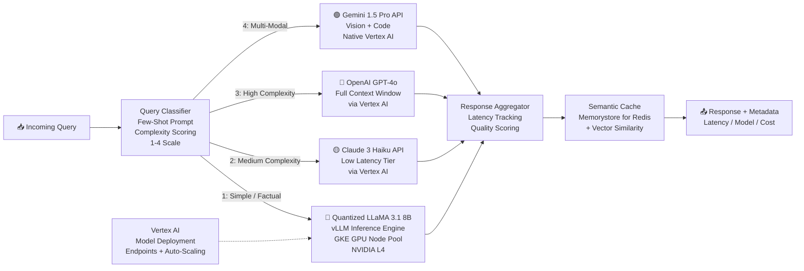
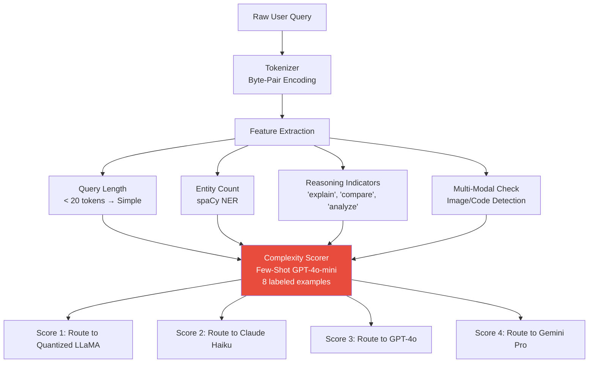
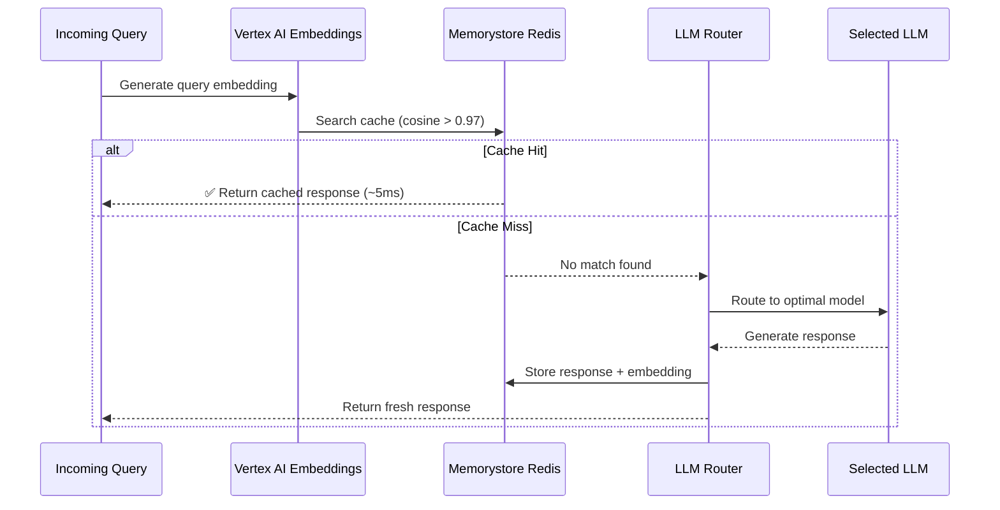
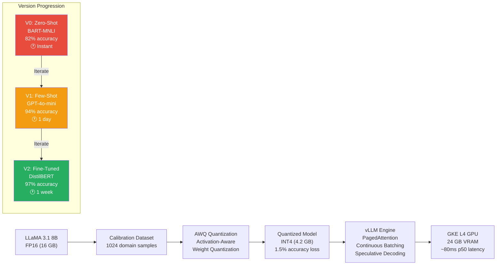
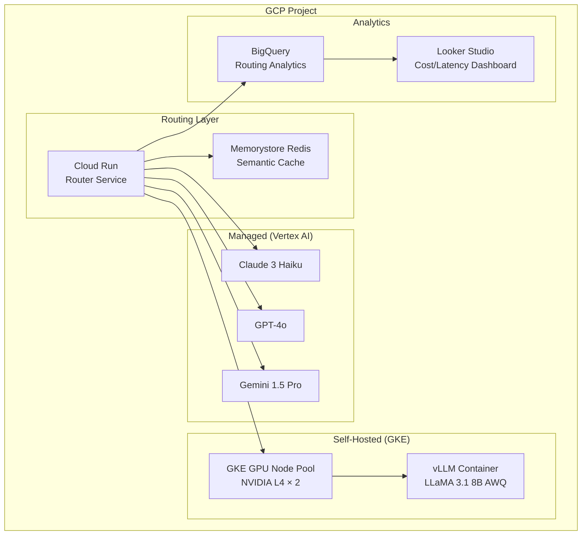

# 🏗️ Project 3: Ultra-Low Latency LLM Router

> **Gen-ChitChat Initiative** — Alice (MIT) vs. Bob (Stanford) Architectural Design Session

***

## 📋 Project Description

An intelligent LLM traffic router that classifies incoming queries by complexity and routes them to the optimal model — minimizing cost and latency while maintaining quality. Simple questions go to cheap/fast models; complex questions go to powerful/expensive models.

***

## 🏛️ System Architecture



### 📐 Query Classification Pipeline



### 📐 Semantic Caching Flow



### 📐 Model Quantization Pipeline



***

## 🎙️ Tech Talk — Alice vs. Bob

### Round 1: Query Classification Strategy

**Alice (MIT):** "The router uses **few-shot learning** with 8 labeled examples per complexity tier — no fine-tuning needed. Zero-shot gets us 78-82% routing accuracy; few-shot pushes it to 94%. The classifier prompt:

```
Classify this query's complexity (1-4):
1 = Simple factual, 2 = Medium analysis, 3 = Complex reasoning, 4 = Multi-modal

Examples:
'What is Python?' → 1
'Compare React vs Vue for SSR' → 2
'Design a distributed cache with consistency guarantees' → 3
'Describe this architecture diagram [image]' → 4

Query: {user_query}
Complexity:
```

GPT-4o-mini runs this classification in 50ms for $0.00001 per query."

**Bob (Stanford):** "Few-shot is fine for V1. But your classifier boundary is fuzzy — 'explain OAuth2 flow' is borderline 1/2. I'd build a **fine-tuned DistilBERT classifier** (68M params) that scores complexity on a continuous scale. Train on 10K labeled queries, inference in 5ms on CPU. No LLM call needed — saves cost AND latency."

**Alice:** "Fine-tuning a classifier for routing? That's over-engineering for V1. Few-shot gives 94% accuracy with zero training cost. And **zero-shot classification** via HuggingFace `pipeline('zero-shot-classification')` with BART-large-MNLI can classify into custom categories without ANY examples — accuracy is 82%, but instant to deploy."

**Bob:** "82% means 18% of queries go to the wrong model. In a system processing 1M queries/day, that's 180K mis-routed queries — 90K going to expensive models unnecessarily ($4,500/day wasted), and 90K going to cheap models that produce low-quality responses. At scale, a fine-tuned classifier pays for itself in 2 days. My proposal: V0 zero-shot → V1 few-shot → V2 fine-tuned. Progressive improvement."

### Round 2: Model Quantization — GPTQ vs. AWQ

**Alice:** "For the self-hosted tier, I'm deploying quantized **LLaMA 3.1 8B** (INT4 via **GPTQ**) on GKE with NVIDIA L4 GPUs. GPTQ is the gold standard — post-training quantization with a calibration dataset of 1,024 samples. Model goes from 16GB (FP16) to 4.2GB. Fits on a single L4 (24GB VRAM) with room for KV cache."

**Bob:** "**Model quantization** trade-offs, Alice. INT4 GPTQ loses ~3% accuracy on reasoning tasks vs. FP16. The calibration dataset matters enormously — if your 1,024 calibration samples don't represent your production distribution, accuracy drops further. I'd use **AWQ** (Activation-Aware Weight Quantization) — it identifies which weights are most important by analyzing activations, then quantizes less-important weights more aggressively. Same size, only 1.5% accuracy loss."

**Alice:** "That 1.5% delta matters for reasoning, but for 'simple factual' queries (our tier 1), even 3% loss is invisible to the user. 'What is the capital of France?' doesn't need high reasoning fidelity."

**Alice:** "Fair, AWQ is the better quantization. But there's a third option — **bitsandbytes NF4**:

- **NF4 (NormalFloat)**: Uses a data type designed for normally-distributed neural network weights. Standard INT4 wastes quantization bins on outliers. NF4 maps bins to follow the normal distribution.
- **Double Quantization**: bitsandbytes quantizes the QUANTIZATION CONSTANTS themselves — saves 0.5GB extra.
- **Killer feature**: NF4 is the ONLY quantization compatible with **QLoRA** — if we later fine-tune the quantized model, only NF4 supports it."

### Round 3: Inference Engine — vLLM vs. TGI

**Alice:** "**vLLM**. This is the most important infrastructure decision:
- **PagedAttention**: KV cache managed like virtual memory pages — allocated on demand, reused when freed. 10x more concurrent requests at the same hardware.
- **Continuous batching**: New requests join in-progress batches. No waiting for a full batch to form.
- **Speculative decoding**: A small 'draft' model generates candidate tokens fast, the large model verifies them in batch. 2x generation speed for repetitive outputs."

**Bob:** "vLLM is great for throughput. But **HuggingFace TGI** (Text Generation Inference) has a killer feature — **Multi-LoRA serving**. One base model, multiple LoRA adapters hot-swapped per request. If we later want to specialize the tier-1 model for different departments (legal, engineering, marketing), TGI serves all of them from a SINGLE base model."

**Alice:** "Multi-LoRA is compelling, but we're not doing LoRA in this project — raw quantized inference. vLLM's p50 latency is ~80ms at 8B scale. TGI is ~110ms."

**Bob:** "30ms difference — real in a latency-critical router. Let's go vLLM for this project."

### Round 4: GCP Infrastructure

**Alice:** "The entire setup on GCP: **GKE** with a GPU node pool (NVIDIA L4 × 2 for vLLM), **Cloud Run** for the router service (stateless, auto-scales to zero), **Memorystore for Redis** for the semantic cache, and **Vertex AI endpoints** for managed access to GPT-4o, Claude, and Gemini."

**Bob:** "Why not **Vertex AI Prediction endpoints** for the quantized model too? Single monitoring dashboard, single autoscaling policy, single billing line item."

**Alice:** "Vertex AI custom endpoints have cold start times of 3-5 minutes for GPU instances. GKE with `minReplicas: 1` keeps at least one warm instance always running. For a latency-critical router, cold starts are unacceptable."

**Bob:** "Set `minReplicas: 1` on the Vertex AI endpoint too. But now you get A/B testing, traffic splitting, and model versioning for free — route 10% to AWQ, 90% to GPTQ, measure quality live."

### Round 5: PagedAttention Deep Dive

**Alice:** "Let me explain PagedAttention because most teams deploy vLLM without understanding WHY:

Standard inference pre-allocates memory for worst case: `max_seq_length × batch_size = 4096 × 32 = 131K slots`. Most WASTED — average response is 200 tokens.

PagedAttention: Each 'page' holds KV cache for 16 tokens. Blocks allocated ON DEMAND. When a request finishes, blocks are FREED and reused. 20x less memory per request = 10-20x more concurrent requests per GPU."

**Bob:** "And **prefix caching**: if 100 requests share the same system prompt (1000 tokens), vLLM stores that prefix in shared blocks. All 100 requests reference the SAME physical blocks. Another 2x memory savings for enterprise deployments."

### Round 6: Semantic Cache Design

**Bob:** "The semantic cache has subtle design decisions:
1. **Threshold 0.97 vs 0.95**: 0.97 matches near-duplicates. 0.95 starts matching different questions. 0.97 is the sweet spot.
2. **TTL 24 hours**: Knowledge doesn't change hourly, but >24h risks stale data.
3. **Model-specific caches**: Tier-1 cache separate from Tier-3. A query cached at tier-3 quality should NOT be served from tier-1 cache.
4. **Cache invalidation**: When underlying knowledge base changes, invalidate cited cache entries."

***

## 📊 Query Classification Approaches

| Approach | **Zero-Shot (BART-MNLI)** | **Few-Shot (GPT-4o-mini)** | **Fine-Tuned (DistilBERT)** |
|---|---|---|---|
| **Training Data** | None | 8 examples in prompt | 10K labeled queries |
| **Accuracy** | 78-82% | 94% | 97% |
| **Latency** | ~50ms (local GPU) | ~80ms (API call) | ~5ms (CPU) |
| **Cost per Query** | Free (self-hosted) | $0.00001 | Free (self-hosted) |
| **New Category** | ✅ Add label string | ✅ Add prompt example | ❌ Retrain model |
| **Deploy Time** | Instant | 1 day | 1 week |

## 📊 Quantization Methods

| Method | **GPTQ** | **AWQ** | **bitsandbytes NF4** |
|---|---|---|---|
| **Accuracy Loss (vs FP16)** | ~3% | ~1.5% | ~1.8% |
| **Model Size (8B)** | 4.2 GB | 4.2 GB | 4.0 GB |
| **Calibration Required** | ✅ 1K+ samples | ✅ Smaller set | ❌ None |
| **QLoRA Compatible** | ❌ | ❌ | ✅ |
| **Inference Speed** | Fast | Fast | Moderate |

## 📊 vLLM vs. HuggingFace TGI

| Feature | **vLLM** | **HuggingFace TGI** |
|---|---|---|
| **Core Innovation** | PagedAttention (10x throughput) | Continuous batching + Flash Attention |
| **Latency (p50, 8B)** | ~80ms | ~110ms |
| **Throughput** | ~450 req/s | ~180 req/s |
| **Multi-LoRA** | ❌ Single model | ✅ Hot-swap adapters |
| **Quantization** | GPTQ, AWQ, INT8, FP8 | GPTQ, AWQ, bitsandbytes |
| **Best For** | Max throughput, raw inference | Multi-tenant LoRA serving |

***

## 🏗️ GCP Architecture



***

## 🔑 Key Takeaways

1. **Classification accuracy directly impacts your budget** — 18% misrouting at scale = thousands wasted daily
2. **AWQ beats GPTQ** on accuracy (1.5% vs 3% loss) at identical model size
3. **vLLM PagedAttention** is the single biggest throughput innovation — 10x over standard serving
4. **Semantic caching** is the easiest 35-45% cost reduction in any LLM system
5. **Multi-tier routing** turns LLM costs from a fixed expense into an optimizable variable
6. **Progressive improvement** — don't over-engineer V1, but plan the upgrade path

***

*← Back to [TODO.MD](./TODO.MD)*
