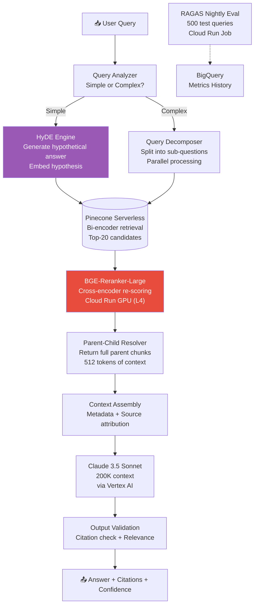
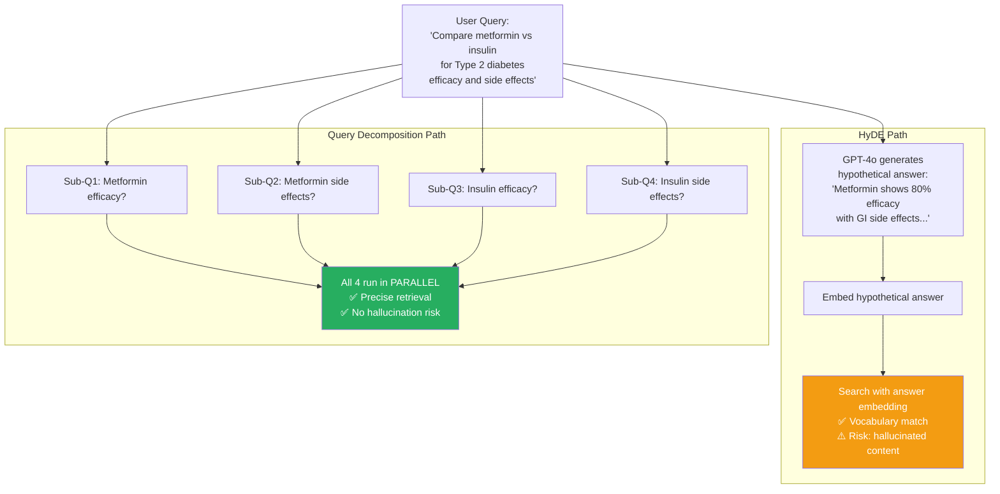
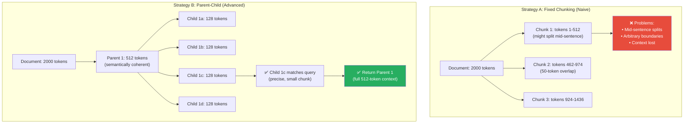
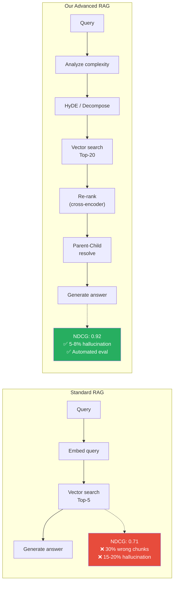
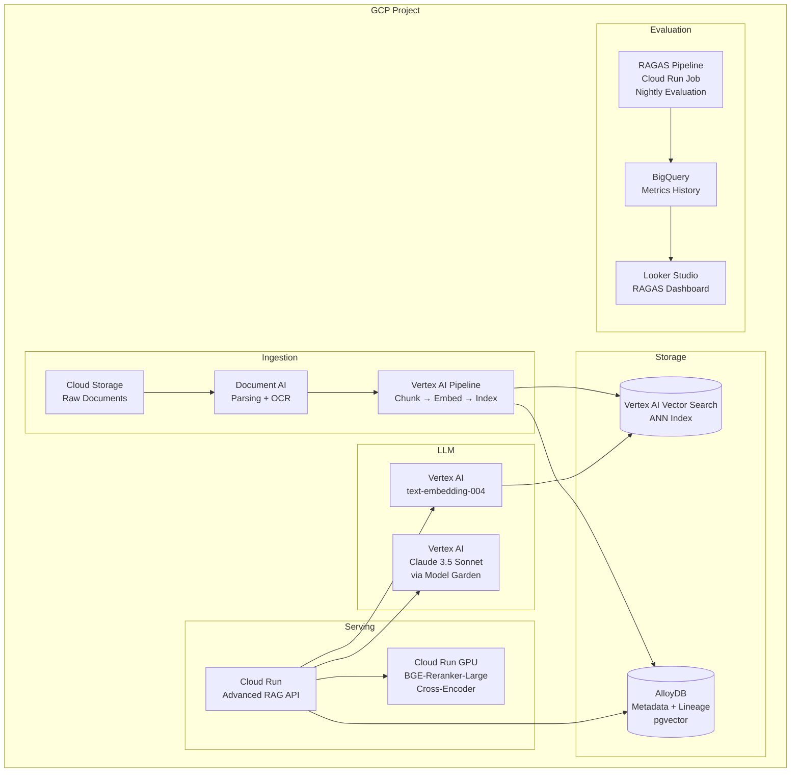

# 🏗️ Project 4: Advanced RAG Document Intelligence Pipeline

> **Gen-ChitChat Initiative** — Alice (MIT) vs. Bob (Stanford) Architectural Design Session

***

## 📋 Project Description

A next-generation RAG system for legal, medical, and financial document analysis. Goes beyond basic chunk-and-retrieve with HyDE, parent-child chunking, cross-encoder re-ranking, and automated evaluation.

***

## 🏛️ System Architecture

### 📐 HyDE vs. Query Decomposition

### 📐 Parent-Child Chunking

### 📐 Standard RAG vs. Advanced RAG — Pipeline Comparison

***

## 🎙️ Tech Talk — Alice vs. Bob

### Round 1: Query Enhancement — HyDE vs. Query Decomposition

**Alice (MIT):** "The fundamental problem: the user's query doesn't semantically match the document text. 'What are side effects of metformin?' vs 'Gastrointestinal adverse reactions associated with metformin include...' — cosine similarity is only 0.71.

**HyDE (Hypothetical Document Embeddings)**: Instead of embedding the question, ask GPT-4o to IMAGINE what a document answering this would look like. Embed THAT hypothetical. NDCG jumps from 0.71 to 0.89 — the hypothetical uses the same vocabulary as actual documents."

**Bob (Stanford):** "HyDE has a critical flaw — **if the hypothetical hallucinates, you search for the WRONG thing**. The LLM imagines 'metformin causes liver failure' → you embed that → you retrieve documents about liver failure.

**My counter: Query Decomposition** via LlamaIndex's `SubQuestionQueryEngine`. Break 'Compare metformin vs insulin efficacy and side effects' into 4 atomic sub-questions, run in parallel. No hallucination risk."

**Alice:** "Both solve different problems — HyDE fixes vocabulary mismatch, Decomposition handles complex multi-aspect queries. Use BOTH with a router: queries with 'compare'/'contrast' → Decomposition; domain-specific queries → HyDE."

### Round 2: Chunking — Why It's the #1 Improvement

**Bob:** "**Parent-Child chunking** via LlamaIndex. Parent chunks are 512 tokens. Each parent spawns 4 child chunks of 128 tokens. CHILDREN are indexed (small = precise matching), but when a child matches, you return the PARENT (contextual). Index small, retrieve large.

On our benchmark: **28% accuracy improvement** from chunking alone. That's the single biggest gain in the entire pipeline."

**Alice:** "And **SentenceWindowNodeParser** — creates 3-sentence windows. Center sentence is indexed, full window is retrieved via `MetadataReplacementPostProcessor`. Same principle: precise indexing + contextual retrieval."

### Round 3: Cross-Encoder Re-Ranking

**Alice:** "After retrieval, **BGE-Reranker-Large** (560M params) re-scores all 20 candidates. Unlike bi-encoders (query and doc embedded separately), cross-encoders process the (query, doc) PAIR together — tokens attend to each other. **Cuts hallucination by 22%.**"

**Bob:** "Optimization: filter by bi-encoder score first (remove similarity < 0.5), re-rank top-12 not top-20, batch all pairs on GPU. INT8 quantization cuts latency from 72ms to 36ms per batch."

### Round 4: RAGAS — Automated Evaluation

**Bob:** "**RAGAS** — four automated metrics computed by an LLM judge:
1. **Faithfulness**: % of answer statements grounded in context
2. **Answer Relevancy**: Does it address the original question?
3. **Context Precision**: Are retrieved chunks actually relevant?
4. **Context Recall**: Did we find ALL relevant information?

Track INDIVIDUALLY, not as an aggregate. Faithfulness=0.95 + Context Precision=0.60 = great generation but terrible retrieval. Fix retrieval, not the LLM."

### Round 5: HyDE Failure Modes & Chunk Contamination

**Bob:** "HyDE fails on ambiguous queries ('Tell me about Apple' → hypothetical about Apple Inc., but corpus is about apple farming) and out-of-domain queries (imagines a policy that doesn't exist). Mitigation: run PARALLEL HyDE and direct retrieval paths, re-ranker picks the best results."

**Alice:** "And watch for **chunk contamination** — same text in 5 PDFs creates 5 near-duplicate chunks. Top-5 results are all the same content from different sources. Fix: embedding deduplication at index time — similarity > 0.95 → merge, don't insert."

***

## 📊 Standard RAG vs. Advanced RAG

| Feature | **Standard RAG** | **Our Advanced RAG** |
|---|---|---|
| **Chunking** | Fixed size, overlapping | Parent-Child / SentenceWindow |
| **Query Handling** | Single vector lookup | HyDE + Sub-question decomposition |
| **Retrieval** | Top-K bi-encoder only | Top-K + Cross-encoder re-ranking |
| **Re-ranking** | None | BGE-Reranker-Large (22% hallucination reduction) |
| **Retrieval Precision (NDCG)** | ~0.71 | ~0.92 |
| **Hallucination Rate** | ~15–20% | ~5–8% |
| **Evaluation** | Manual or none | RAGAS automated metrics |
| **Latency** | Low (1 LLM call) | Higher (2–3 LLM calls + re-ranking) |
| **Best For** | Prototypes, simple corpora | Production, legal/medical/financial |

## 📊 Vertex AI Vector Search vs. Pinecone vs. Qdrant

| Feature | **Vertex AI Vector Search** | **Pinecone Serverless** | **Qdrant (on GKE)** |
|---|---|---|---|
| **Max Vectors** | 10B+ | Unlimited (serverless) | Hardware-limited |
| **Algorithm** | ScaNN (Google) | Proprietary ANN | HNSW |
| **Latency (p50)** | ~5ms | ~15ms | ~10ms |
| **Hybrid Search** | ❌ Vector only | ✅ (added 2025) | ✅ Native |
| **GCP Integration** | ✅ Native | ✅ GCP regions | ✅ Runs on GKE |
| **Cost (1M vectors)** | ~$150/month | ~$70/month | ~$50/month (self-hosted) |
| **Best For** | Enterprise scale (10M+) | Serverless simplicity | Cost-sensitive, self-hosted |

## 📊 Query Enhancement Techniques

| Technique | **HyDE** | **Query Decomposition** | **Multi-Query** |
|---|---|---|---|
| **What It Does** | Generate hypothetical answer, search with it | Split complex query into sub-questions | Rephrase query 3 ways, merge results |
| **Solves** | Vocabulary mismatch | Complex multi-aspect queries | Query ambiguity |
| **Accuracy Gain** | +25% NDCG | +20% on complex queries | +12% recall |
| **Hallucination Risk** | ⚠️ Possible | ✅ None | ✅ None |
| **Latency Cost** | +300ms (1 LLM call) | +200ms (parallel) | +200ms (parallel) |

***

## 🏗️ GCP Architecture

***

## 🔑 Key Takeaways

1. **The biggest RAG improvement is chunking** — Parent-Child alone gives 28% accuracy boost
2. **HyDE and Query Decomposition solve different problems** — use both with a smart router
3. **Cross-encoder re-ranking is non-negotiable** — 22% hallucination reduction
4. **RAGAS automated evaluation** closes the feedback loop without human annotators
5. **Start with Pinecone, grow to Vertex AI Vector Search** — right-size infrastructure to scale
6. **AlloyDB with pgvector** is underrated — metadata + vector search in one database

***

*← Back to [TODO.MD](./TODO.MD)*
