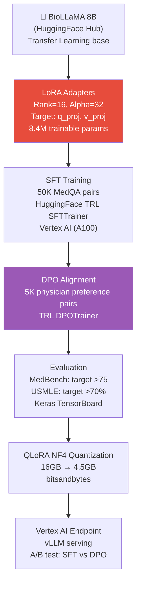
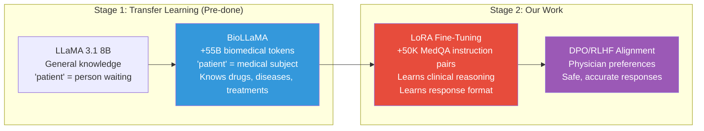
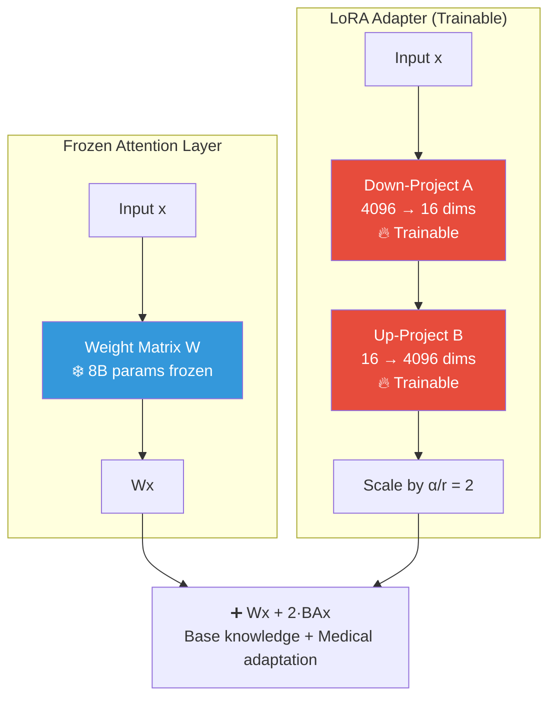
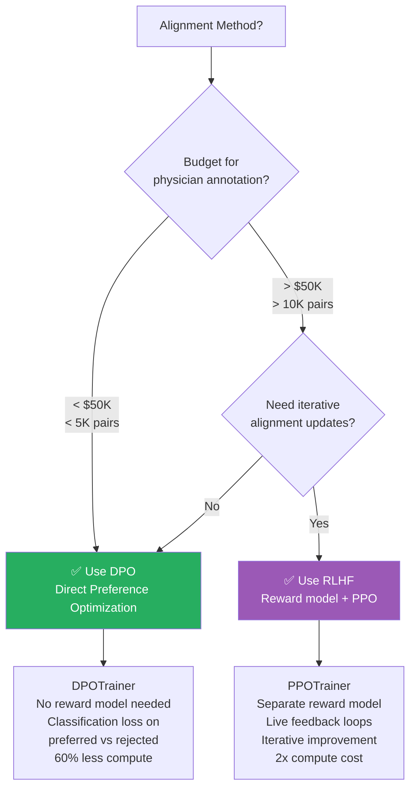
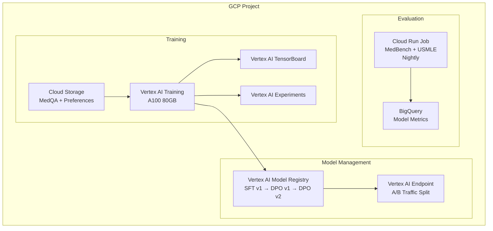

# 🏗️ Project 6: Domain-Specific Fine-Tuned LLM (Medical NLP)

> **Gen-ChitChat Initiative** — Alice (MIT) vs. Bob (Stanford) Architectural Design Session

***

## 📋 Project Description

Fine-tune a base LLM for medical Q&A — the model must understand medical terminology, follow clinical reasoning patterns, and produce physician-preferred responses. Uses **Transfer Learning** (BioLLaMA), **LoRA fine-tuning**, and **DPO/RLHF alignment**. Deployed on GCP with Vertex AI.

***

## 🏛️ System Architecture

### 📐 Transfer Learning Stages

### 📐 LoRA Weight Injection — Visualized

### 📐 Alignment Method Decision Tree

***

## 🎙️ Tech Talk — Alice vs. Bob

### Round 1: Why LoRA — The Math

**Alice (MIT):** "**LoRA** (Low-Rank Adaptation) is the only sane way to fine-tune in 2026. The core insight: weight updates during fine-tuning have low intrinsic rank — ΔW = BA where B ∈ ℝ^(d×r) and A ∈ ℝ^(r×d), with r << d.

For LLaMA 3.1 8B:
- d = 4096, r = 16
- Full weight matrix: 4096 × 4096 = 16.7M params per layer
- LoRA matrices: (4096 × 16) + (16 × 4096) = 131K params per layer
- Target `q_proj` + `v_proj` across 32 layers = 8.4M trainable (0.1%)"

**Bob (Stanford):** "But let's be precise about **Transfer Learning** first. We start from **BioLLaMA** — pre-trained on 55B biomedical tokens (PubMed, MIMIC-III, medical textbooks). The medical knowledge is ALREADY in the weights. LoRA then teaches HOW TO RESPOND — format, tone, clinical reasoning. Two-stage training, not one."

**Alice:** "Without the transfer learning base, LoRA alone would need 10x more data. BioLLaMA already knows 'metformin', 'HbA1c', 'contraindication'. LoRA teaches response patterns."

### Round 2: RLHF vs. DPO

**Bob:** "After SFT, the model generates plausible medical responses but not always physician-preferred. **RLHF**: physicians rank 4 responses — train a **Bradley-Terry reward model** r(x,y) with binary cross-entropy. Then PPO optimizes: maximize E[r(y)] - λ × KL(π_new || π_sft). The KL penalty (λ=0.05) prevents reward hacking."

**Alice:** "RLHF is EXPENSIVE — physician annotation $200K+ for 10K pairs. PPO needs 2 models in memory (80GB VRAM). Consider **DPO (Direct Preference Optimization)** — same preference pairs, no reward model, no PPO loop. Classification loss on preferred vs. rejected. 60% less compute, 5 lines of code with `DPOTrainer`."

**Bob:** "DPO is cleaner for static preferences. But RLHF gives **live feedback loops** — update reward model as guidelines evolve. For medical AI where guidelines change annually, iterative alignment matters."

### Round 3: LoRA Hyperparameters & Catastrophic Forgetting

**Alice:** "LoRA rank `r` is critical:
- Rank 4: MedBench 68 (too low)
- Rank 16: MedBench 75 (sweet spot)
- Rank 64: MedBench 75.5 (overfitting)

Alpha should be 2× rank. For rank=16, alpha=32. The adapter has meaningful but not overwhelming influence."

**Bob:** "Even with frozen weights, LoRA can cause **functional catastrophic forgetting** — correct on medical questions but forgets coherent formatting or 'I don't know' responses. Maintain a sanity suite: 50 general knowledge + 50 formatting + 50 'I don't know' triggers. Run after each checkpoint. If accuracy drops below 95%, stop training."

### Round 4: DPO Data Collection & Deployment

**Alice:** "DPO needs preference pairs. The trick: **synthetic negative generation**. Take physician-approved response, introduce ONE systematic flaw (remove safety caveat, change dosage, omit contraindication). One physician validates 100 synthetic negatives per hour. 5K pairs in ~25 physician-hours = **$3,750 instead of $25K**."

**Bob:** "Deploy with A/B testing on Vertex AI Endpoints: 90% → SFT model, 10% → DPO model. Evaluate after 1 week on physician ratings, hallucination rate, safety caveat presence, user satisfaction. The key: A/B testing in medical AI needs **safety gates**, not just quality metrics. A model that writes better but occasionally omits drug interactions is WORSE."

### Round 5: Quantization & Keras Monitoring

**Bob:** "Post-training, **QLoRA NF4** quantization — model from 16GB to 4.5GB. NF4 is information-theoretically optimal for normally-distributed weights. **Double Quantization** quantizes the quantization constants themselves, saving another 0.5GB."

**Alice:** "**Keras callbacks** for monitoring: `CSVLogger` for per-step metrics, `TensorBoard` sent to Vertex AI, `ReduceLROnPlateau` for auto learning rate, `EarlyStopping` to kill wasteful runs. Vertex AI `CustomTrainingJob` with `a2-highgpu-1g` (A100 80GB) handles infrastructure."

***

## 📊 Full Fine-Tuning vs. LoRA (PEFT) vs. QLoRA

| Feature | **Full Fine-Tuning** | **LoRA (PEFT)** | **QLoRA** |
|---|---|---|---|
| **Trainable Params** | 100% (8B) | ~0.1% (8.4M) | ~0.1% (8.4M) |
| **GPU Memory** | 80GB+ (A100) | 24GB (A10G) | 12GB (RTX 3090 / L4) |
| **Training Speed** | Baseline | 8x faster | 8x faster |
| **Training Cost (GCP)** | ~$500/run (A100 80GB) | ~$60/run (A10G) | ~$30/run (L4) |
| **Accuracy vs. Full FT** | Baseline | -0.5 to -1.5% | -1 to -2% |
| **Catastrophic Forgetting** | ⚠️ Risk | ✅ No (base frozen) | ✅ No (base frozen) |
| **Best For** | Max accuracy, big budget | Production fine-tuning | Consumer GPU / cost-sensitive |

## 📊 RLHF vs. DPO — Alignment Methods

| Feature | **RLHF (PPO)** | **DPO** |
|---|---|---|
| **Reward Model** | ✅ Required (separate model) | ❌ Not needed |
| **Training Loop** | PPO (complex, 2 models) | Single-pass classification |
| **Compute Cost** | High (2x models in memory) | 60% less |
| **Data Requirement** | 10K+ preference pairs | 5K+ preference pairs |
| **Iterative Update** | ✅ Update reward model, re-align | ❌ Retrain from scratch |
| **Code Complexity** | `PPOTrainer` (100+ lines config) | `DPOTrainer` (5 lines) |
| **Best For** | Evolving preferences, medical/legal | Static preferences, cost-sensitive |

## 📊 Transfer Learning Checkpoints — Medical LLMs

| Base Model | **BioLLaMA** | **MedAlpaca** | **PMC-LLaMA** |
|---|---|---|---|
| **Base Architecture** | LLaMA 3.1 8B | LLaMA 2 7B | LLaMA 2 7B |
| **Pre-train Corpus** | PubMed + MIMIC-III (55B tokens) | MedQA + HealthcareMagic | PubMed Central (4.8M papers) |
| **USMLE Pass Rate** | 67% | 58% | 54% |
| **Best For** | Clinical QA | Patient interaction | Research synthesis |

***

## 🏗️ GCP Architecture

***

## 🔑 Key Takeaways

1. **Transfer Learning is the foundation** — BioLLaMA provides medical vocabulary; LoRA teaches clinical reasoning
2. **LoRA trains 0.1% of parameters** — 8x cheaper, no catastrophic forgetting, mergeable into base model
3. **Start with DPO** (cheaper, simpler) → migrate to RLHF when budget + iterative needs justify it
4. **Synthetic negative generation** cuts DPO annotation cost from $25K to $3,750
5. **QLoRA NF4** for deployment reduces model from 16GB to 4.5GB with minimal accuracy loss
6. **A/B testing with safety gates** — medical AI needs safety metrics, not just quality metrics

***

*← Back to [TODO.MD](./TODO.MD)*
