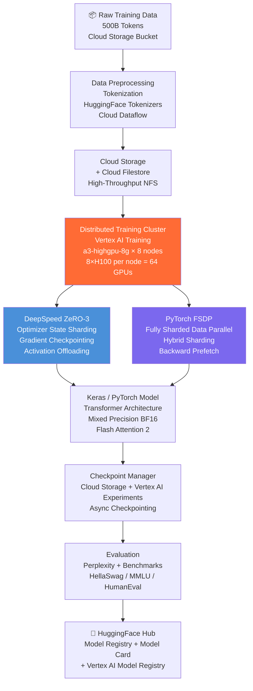
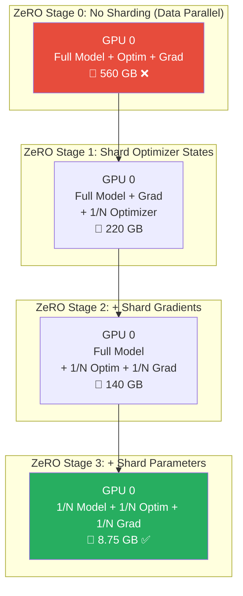
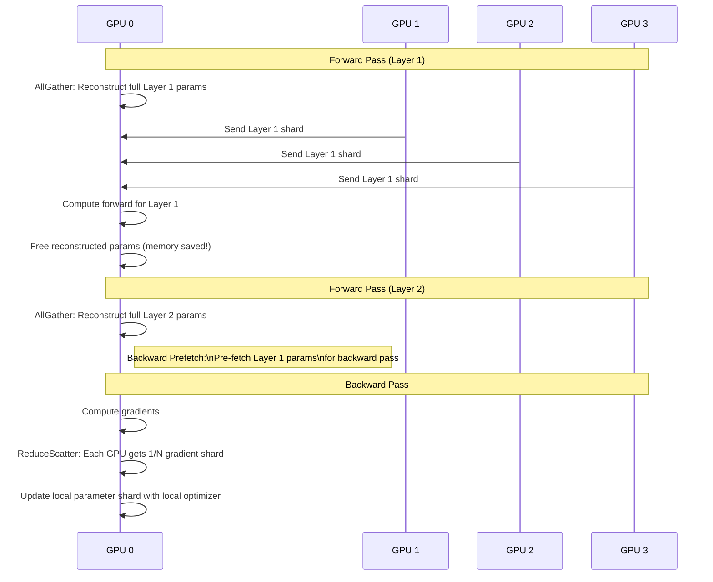
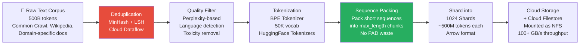
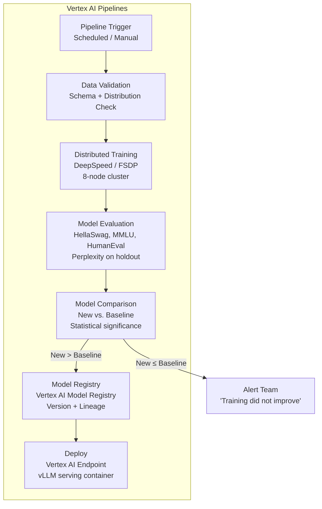
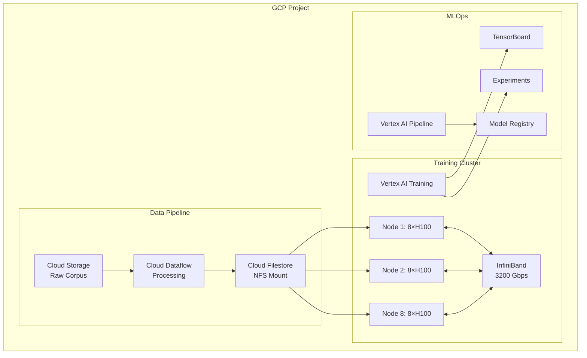

# 🏗️ Project 7: Distributed LLM Training Platform on GCP

> **Gen-ChitChat Initiative** — Alice (MIT) vs. Bob (Stanford) Architectural Design Session

***

## 📋 Project Description

Build infrastructure to train 7B–70B parameter models from scratch or continued pre-training on domain corpora. Requires sharding models across dozens of GPUs with efficient data pipelines. Deployed on **GCP** with Vertex AI Training, FSDP/DeepSpeed, and managed MLOps.

***

## 🏛️ System Architecture



### 📐 DeepSpeed ZeRO Stages — Visualized



### 📐 FSDP Communication Pattern



### 📐 Data Pipeline for Training



### 📐 MLOps Pipeline



***

## 🎙️ Tech Talk — Alice vs. Bob

### Round 1: DeepSpeed ZeRO-3 vs. PyTorch FSDP

**Alice (MIT):** "For **distributed training** at 70B scale, I'm using **DeepSpeed ZeRO Stage 3**. The math:
- FP16 model: 140 GB
- Optimizer states (Adam): 280 GB
- Gradients: 140 GB
- **Total: 560 GB**
- With 64 GPUs at ZeRO-3: **8.75 GB per GPU** ✅"

**Bob (Stanford):** "DeepSpeed has communication overhead — `AllGather` on every forward, `ReduceScatter` on every backward. **PyTorch FSDP** does the same sharding but natively integrated into PyTorch 2.0+. No external library. And FSDP's `backward_prefetch=BACKWARD_PRE` hides communication behind compute."

**Alice:** "DeepSpeed has **ZeRO-Infinity** — offload to CPU DRAM and NVMe SSDs. For 175B+ that doesn't fit in aggregate GPU memory, essential."

**Bob:** "ZeRO-Infinity is for extreme scale. For 7B–30B — 90% of enterprise training — FSDP is cleaner. And `hybrid_shard` shards intra-node (fast NVLink) but replicates inter-node (slower InfiniBand). Halves inter-node communication."

### Round 2: Hardware & GCP Infrastructure

**Alice:** "On GCP, **a3-highgpu-8g** — 8× H100 80GB, NVLink 4.0 (900 GB/s), inter-node GPUDirect-RDMA (3,200 Gbps). 8-node cluster = 64 GPUs, 5.12 TB aggregate."

**Bob:** "**Cloud Filestore** (managed NFS) for data loading — 100+ GB/s throughput. Regular Cloud Storage starves GPUs. GPU utilization must be >90% — anything less means data pipeline bottleneck."

**Alice:** "**Sequence packing** is the highest-ROI optimization. Instead of padding to 4096 tokens, pack 8 short sequences into one chunk. 8x more tokens per batch, free. Use proper attention masking so packed sequences don't attend to each other."

### Round 3: GPU Failure Management

**Bob:** "At 64 GPUs over 72 hours, ~15% probability of at least ONE GPU failure:
- **Hard failure**: GPU hangs, NCCL timeout
- **Soft failure**: ECC memory errors → NaN gradients → silent model corruption
- **Network failure**: InfiniBand drops 30 seconds, AllReduce hangs

Strategy: health checks every 1,000 steps, NaN detection after every backward pass, gradient clipping `max_grad_norm=1.0`, async checkpointing every 1,000 steps."

**Alice:** "Smart checkpointing: FSDP's `SHARDED_STATE_DICT` saves each GPU's shard independently (8 × 5GB vs one monolithic 280GB). Background thread saves while training continues. Keep last 3 + every 10th checkpoint. Validate before discarding predecessors."

### Round 4: Mixed Precision & Keras Monitoring

**Bob:** "**BF16** on H100, not FP16. BF16 has same range as FP32 (8 bits exponent) — no overflow, no loss scaling needed. One config line:
```python
mixed_precision=MixedPrecision(param_dtype=torch.bfloat16)
```
Saves 10-20 hours of NaN debugging vs FP16."

**Alice:** "**Keras callbacks** for monitoring: `CSVLogger` for per-step metrics, `TensorBoard` sent to Vertex AI, `ReduceLROnPlateau`, `EarlyStopping`. 5 lines of code vs. 50 lines of custom PyTorch logging. And `model.summary()` verifies FSDP is sharding correctly."

**Bob:** "Evaluation uses **HellaSwag** (commonsense), **MMLU** (multitask knowledge), **HumanEval** (code). Run via **Vertex AI Pipelines** after each training run. Auto-promote if statistically better (p < 0.05 on ≥2 benchmarks)."

***

## 📊 DeepSpeed ZeRO-3 vs. PyTorch FSDP

| Feature | **DeepSpeed ZeRO-3** | **PyTorch FSDP** |
|---|---|---|
| **Parameter Sharding** | ✅ Full | ✅ Full |
| **NVMe Offload** | ✅ ZeRO-Infinity | ❌ Not supported |
| **Hybrid Sharding** | ❌ Manual config | ✅ `hybrid_shard` strategy |
| **Integration** | External library | Native PyTorch 2.0+ |
| **Backward Prefetch** | ✅ Config-driven | ✅ Native `BACKWARD_PRE` |
| **Keras Compatibility** | Custom training loop | ✅ Native |
| **Best For** | 70B+, extreme scale | 7B–30B, clean codebase |

## 📊 GCP GPU Instance Types

| Instance | GPU | Memory | Interconnect | Cost/hr | Max Model |
|---|---|---|---|---|---|
| **a3-highgpu-8g** | 8× H100 80GB | 640 GB | NVLink 900 GB/s | ~$54/hr | ~70B |
| **a2-highgpu-8g** | 8× A100 80GB | 640 GB | NVLink 600 GB/s | ~$37/hr | ~30B |
| **g2-standard-96** | 8× L4 24GB | 192 GB | PCIe Gen4 | ~$14/hr | ~7B |

## 📊 Data Pipeline Optimizations

| Optimization | **Impact** | **Cost** |
|---|---|---|
| Cloud Filestore mount | GPU utilization: 60% → 95% | ~$500/month |
| Sequence Packing | 8x more tokens per batch | Free (code change) |
| Pre-tokenization | Data loading 10x faster | One-time (Cloud Dataflow) |
| 1024 shards | Parallel data loading | Free (data resharding) |

***

## 🏗️ GCP Architecture



***

## 🔑 Key Takeaways

1. **FSDP for 7-30B, DeepSpeed for 70B+** — right tool for right scale
2. **hybrid_shard** halves inter-node communication — crucial for multi-node training
3. **Sequence packing is a free 8x speedup** — pack short sequences, don't pad them
4. **Cloud Filestore prevents GPU starvation** — data pipeline must NEVER be the bottleneck
5. **BF16 on H100** — no overflow, no loss scaling, saves 10-20 hours of debugging
6. **Keras callbacks in 5 lines** replace 50 lines of custom monitoring code

***

*← Back to [TODO.MD](./TODO.MD)*
