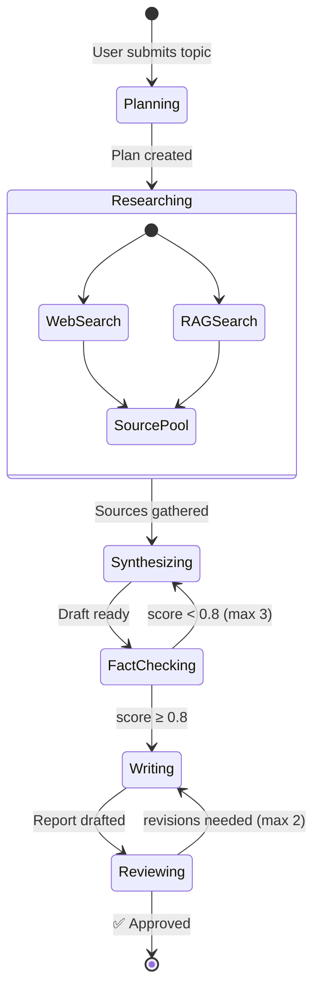
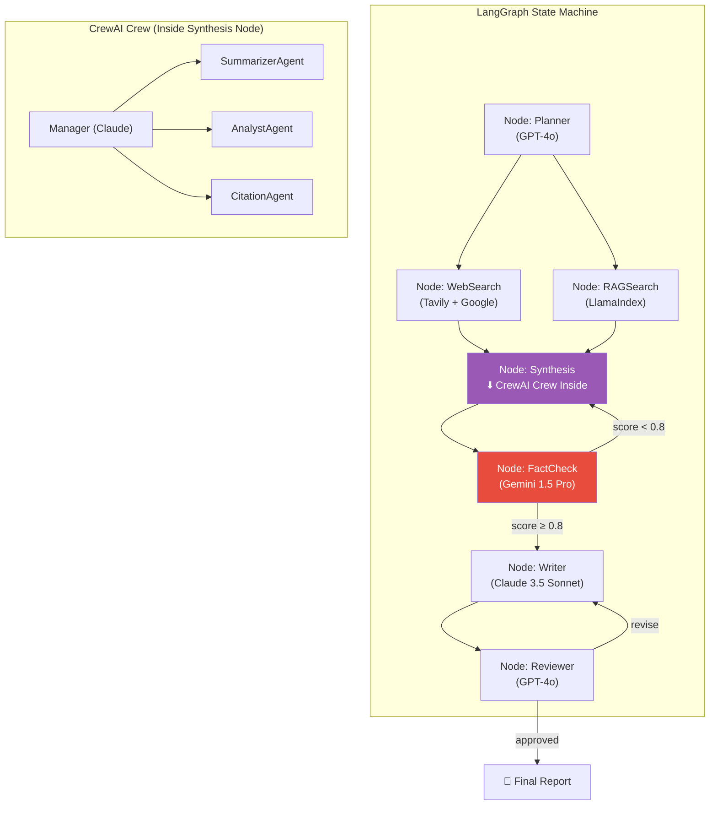
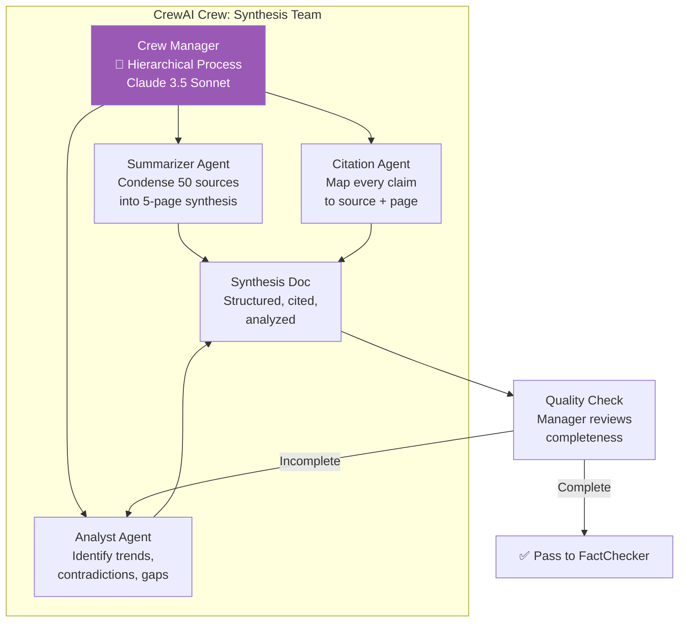
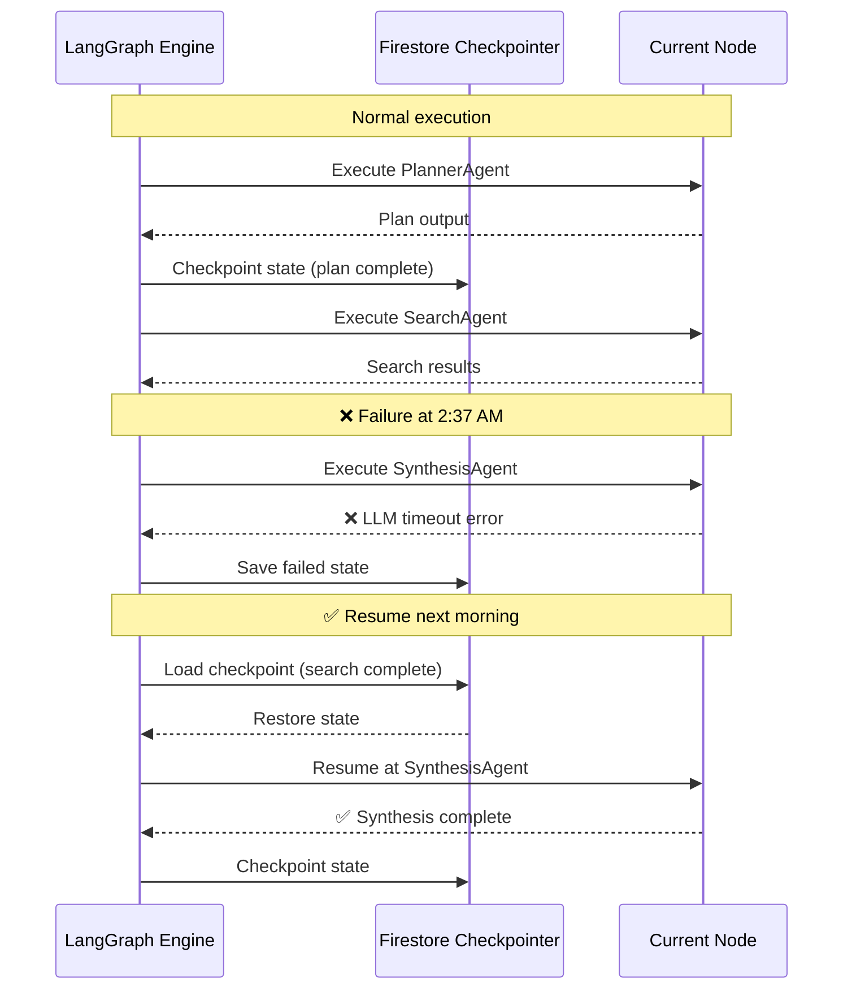
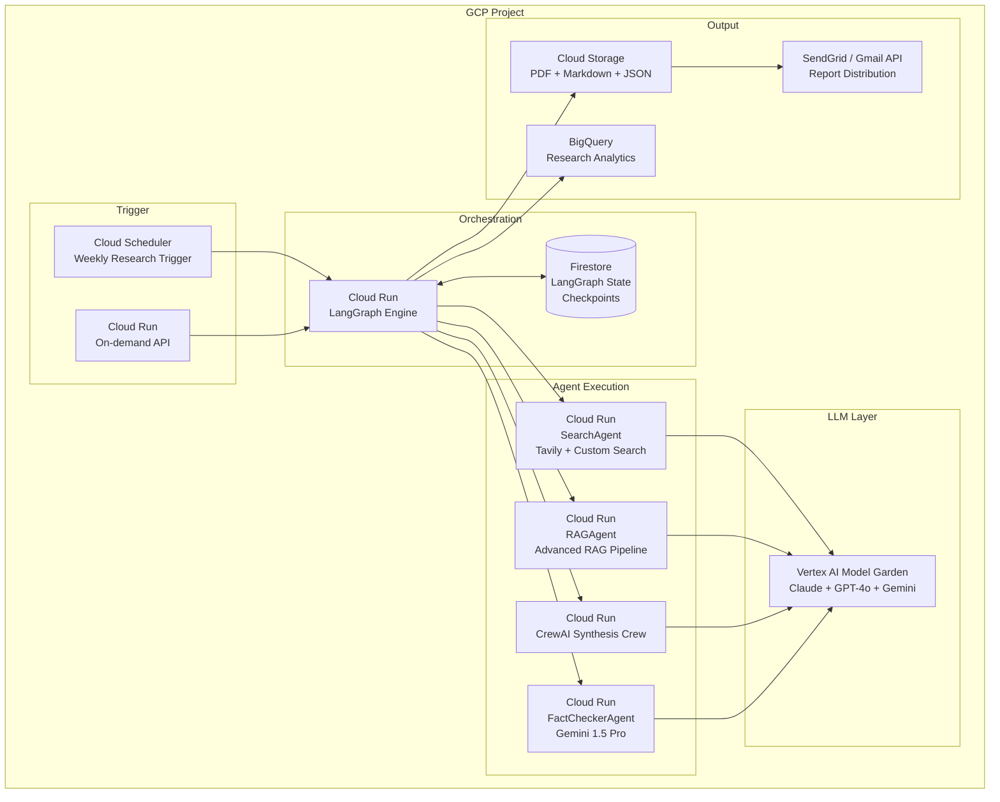

# 🏗️ Project 8: Autonomous Research & Report Generation Agent

> **Gen-ChitChat Initiative** — Alice (MIT) vs. Bob (Stanford) Architectural Design Session

***

## 📋 Project Description

A fully autonomous multi-agent system that researches any topic across the web, academic papers, and internal databases — then produces a structured, cited report. Uses **LangGraph** for stateful workflow orchestration and **CrewAI** for team-based synthesis. Deployed on **GCP** with Cloud Run, Firestore, and Vertex AI.

***

## 🏛️ System Architecture



### 📐 LangGraph + CrewAI Integration



### 📐 CrewAI Synthesis Team



### 📐 LangGraph Checkpointing & Replay



***

## 🎙️ Tech Talk — Alice vs. Bob

### Round 1: LangGraph vs. LangChain Chains

**Alice (MIT):** "**LangGraph** is a state machine built on directed graphs:
- **Nodes** = Agent actions (Plan, Search, Synthesize, FactCheck, Write, Review)
- **Conditional edges** = 'If fact_check_score < 0.8, go back to Synthesize'
- **Typed state** = Python dict flowing through all nodes
- **Checkpointing** = Resume from last checkpoint on failure

LangChain chains are linear pipelines — Step 1 → Step 2 → Step 3. No loops, no branching, no persistent state. Our pipeline NEEDS cycles (fact-check → revise → fact-check), conditional routing (score-based), and fan-out (search + RAG in parallel)."

**Bob (Stanford):** "For production persistence, implement a custom `FirestoreCheckpointer`. LangGraph's `MemorySaver` keeps state in memory — containers restart, state is lost. Firestore saves after every node. If FactCheckerAgent fails at 2AM, reload and resume."

### Round 2: CrewAI for Team Collaboration

**Bob:** "LangGraph orchestrates the workflow. But the Synthesis node needs internal teamwork — Summarizer, Analyst, Citation Agent. **CrewAI with Process.hierarchical**: a manager agent delegates, reviews, and reassigns:
```python
summarizer = Agent(
    role='Senior Research Analyst',
    goal='Condense 50 sources into coherent 5-page synthesis',
    backstory='McKinsey senior analyst with 15 years experience...'
)
```

The manager prompt is critical:
```
Review against sources. Check:
1. Key findings from ALL 25 sources represented?
2. Contradictions between sources noted?
3. Synthesis coherent, not just bullet points?
4. Citation markers accurate?
```
Specific criteria = specific feedback = targeted revisions."

### Round 3: Fact-Checking with Gemini's 1M Context

**Alice:** "**Gemini 1.5 Pro** — 1M token context window. Report + ALL source documents fit in a SINGLE prompt. One API call for full-document fact-checking. No chunking, no information loss. 98% recall on Needle-in-a-Haystack at 1M tokens."

**Bob:** "Compare: GPT-4o (128K) requires chunking sources and multi-step aggregation — cross-chunk claims get missed. Claude (200K) handles medium reports. Gemini is the only option for comprehensive single-call fact-checking."

### Round 4: Error Handling & Source Quality

**Alice:** "In a 6-node pipeline running 30+ minutes, failures are inevitable:
```python
def fact_check_route(state):
    if state['retry_count'] >= 3: return 'human_review'
    if state['fact_score'] < 0.8:
        state['retry_count'] += 1
        return 'synthesize'
    return 'write'
```
Key patterns: max retries per cycle, graceful degradation to human review, state accumulation (revision history)."

**Bob:** "Source quality scoring matters:
1. Academic papers: Trust 0.9
2. Official docs: Trust 0.85
3. Major publications: Trust 0.8
4. Expert blogs: Trust 0.7
5. Random pages: Trust 0.4

The Synthesizer weights by trust score. Recency matters too — for tech topics, 2024 papers are OUTDATED."

### Round 5: GCP Deployment & Feedback Loop

**Alice:** "Deployment: **Cloud Run** for stateless agent execution. **Firestore** for LangGraph state persistence. **Cloud Scheduler** for automated weekly research runs."

**Bob:** "Report output to **Cloud Storage** (PDF, Markdown, JSON) with **BigQuery** analytics — which topics are researched most, average time, fact-check failure rates. **Feedback API**: readers rate usefulness (1-5), feeding back into source selection. After 6 months: 'For cloud infrastructure topics, ArXiv + official docs produce the best reports.' That's institutional knowledge."

***

## 📊 LangGraph vs. LangChain Chains

| Feature | **LangGraph** | **LangChain Chains** |
|---|---|---|
| **Architecture** | Directed graph (nodes + conditional edges) | Linear/sequential chains |
| **State Management** | ✅ Persistent, typed state dict | Ephemeral, pass-through context |
| **Checkpointing** | ✅ `MemorySaver` / custom (Firestore) | ❌ Not supported |
| **Conditional Logic** | ✅ Native `add_conditional_edges` | Requires `RunnableBranch` workarounds |
| **Cycles / Loops** | ✅ Native (retry, feedback loops) | ❌ Not supported |
| **Resume on Failure** | ✅ From any checkpoint | ❌ Restart entire chain |
| **Best For** | Complex stateful agentic workflows | Simple pipelines, RAG chains |

## 📊 CrewAI Process Types

| Process | **Sequential** | **Hierarchical** |
|---|---|---|
| **Execution** | Task 1 → Task 2 → Task 3 | Manager assigns dynamically |
| **Delegation** | ❌ Fixed order | ✅ Manager can reassign |
| **Quality Gate** | No intermediate checks | Manager reviews each output |
| **Best For** | Simple workflows | Complex research teams |

## 📊 Long-Context LLMs for Fact-Checking

| Feature | **Gemini 1.5 Pro** | **Claude 3.5 Sonnet** | **GPT-4o** |
|---|---|---|---|
| **Context Window** | 1M tokens | 200K tokens | 128K tokens |
| **Max Report + Sources** | ~750 pages | ~150 pages | ~100 pages |
| **Single-Call Fact-Check** | ✅ Full corpus | ✅ Medium corpus | ❌ Requires chunking |
| **NIAH Recall** | 98% | 95% | 90% |
| **Cost (150K tokens)** | ~$0.50 | ~$0.45 | ~$0.75 |

***

## 🏗️ GCP Architecture



***

## 🔑 Key Takeaways

1. **LangGraph replaces LangChain** for any workflow with loops, conditions, or state
2. **LangGraph + CrewAI** operate at different levels — workflow vs. team
3. **Gemini's 1M context** is uniquely suited for fact-checking — no chunking needed
4. **Firestore checkpointing** enables resume-on-failure for long-running research tasks
5. **Multi-model strategy** matches LLM strengths to specific agent tasks
6. **Feedback loop** turns an automated pipeline into a learning system

***

*← Back to [TODO.MD](./TODO.MD)*
