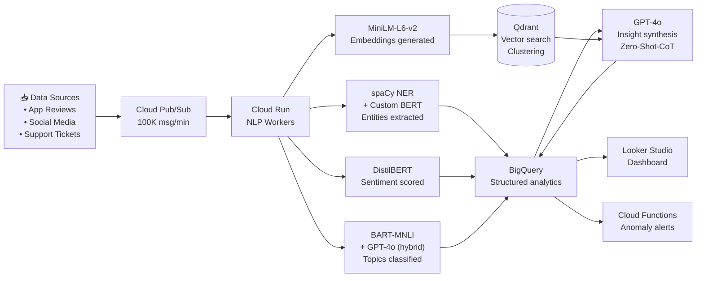
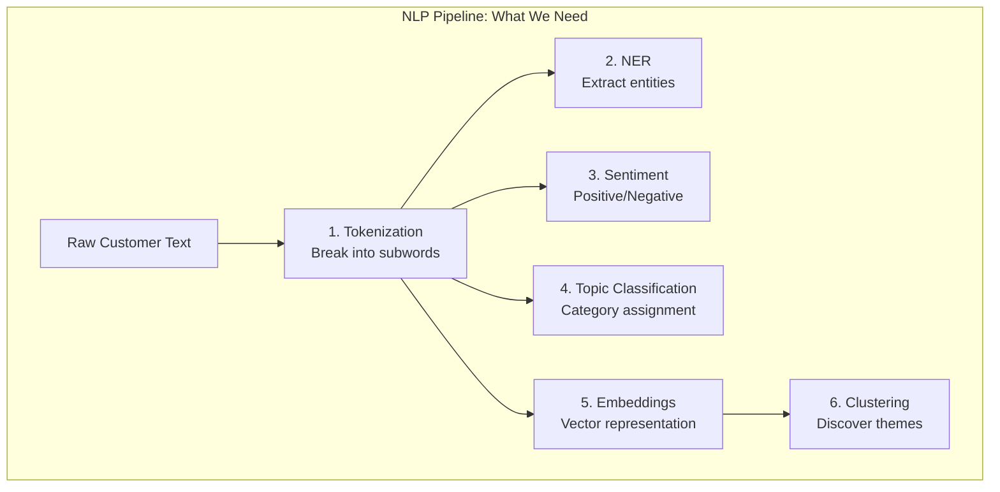
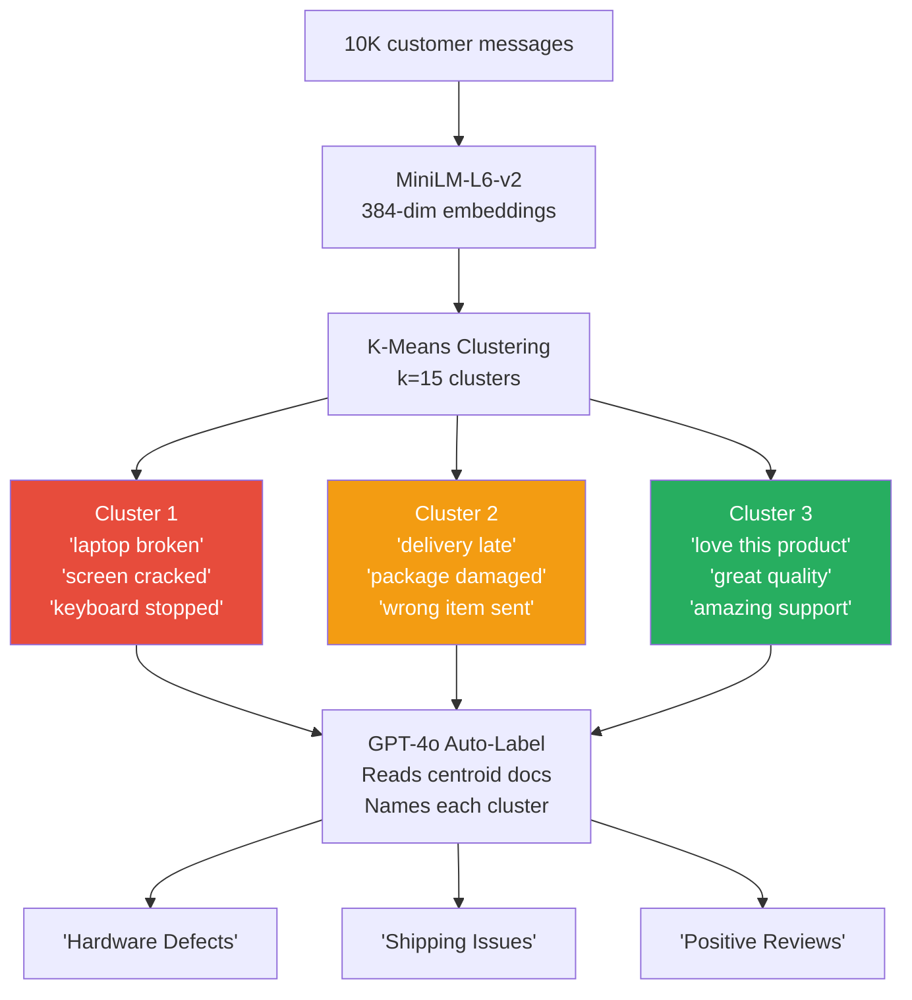
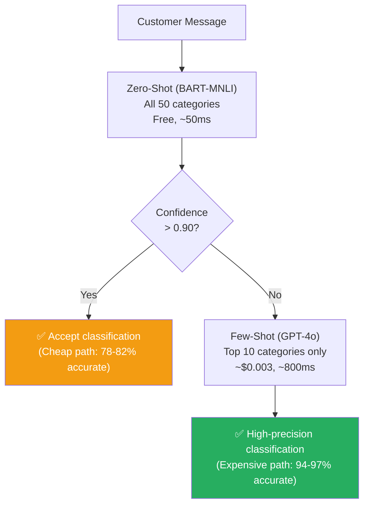
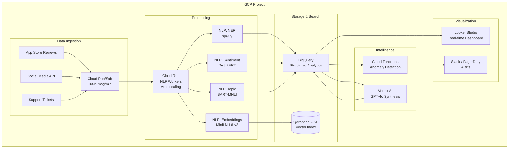

# 🏗️ Project 9: NLP Analytics Intelligence System

> **Gen-ChitChat Initiative** — Alice (MIT) vs. Bob (Stanford) Architectural Design Session

***

## 📋 Project Description

A deep NLP analytics platform that processes customer feedback, support tickets, and social media at scale. Extracts entities, classifies sentiment, discovers topics, and generates executive insights. Uses **spaCy**, **HuggingFace Transformers**, **Sentence Transformers**, and **GPT-4o** for a full NLP pipeline. Deployed on **GCP** with Cloud Pub/Sub, Cloud Run, BigQuery, and Looker Studio.

***

## 🏛️ System Architecture



### 📐 NLP Pipeline Components



### 📐 Embedding-Based Theme Discovery



### 📐 Hybrid Classification Router



***

## 🎙️ Tech Talk — Alice vs. Bob

### Round 1: NLP Building Blocks — The Right Tool for Each Task

**Alice (MIT):** "Let me map the **NLP core concepts** and tool decisions:

1. **Tokenization**: BPE (Byte-Pair Encoding) via HuggingFace Tokenizers — Rust-based, 100K tokens/sec. 'unforgettable' → `['un', 'for', 'get', 'table']`. No `[UNK]` tokens.

2. **NER**: **spaCy** `en_core_web_trf` (transformer-backed) — 91% F1 on 18 entity types. Plus POS tagging, dependency parsing, lemmatization in one `nlp(text)` call. For custom entities (product names, order IDs), fine-tune a HuggingFace `BertForTokenClassification` on 2K labeled examples.

3. **Sentiment**: **Fine-tuned DistilBERT** — 67M params, 94% domain accuracy, 15ms on CPU. Generic APIs don't know 'insane' means positive in tech reviews.

4. **Topic Classification**: HYBRID approach — zero-shot BART-MNLI handles all 50 categories (82% accuracy). Few-shot GPT-4o overrides for top 10 critical categories (94-97%)."

**Bob (Stanford):** "The hybrid zero-shot/few-shot split is elegant. If zero-shot confidence > 0.90, trust it. Below 0.90, escalate to GPT-4o with 5-10 examples. 90% of traffic takes the free path; 10% takes the precise path."

### Round 2: Embeddings & Clustering — Unsupervised Discovery

**Alice:** "**all-MiniLM-L6-v2** — 384-dim embeddings, 22.7M params, 10K sentences/sec on CPU. The most powerful feature: UNSUPERVISED theme discovery:
1. Embed 100K messages → 100K × 384-dim vectors
2. K-Means k=20
3. Sample 10 nearest messages per cluster centroid
4. GPT-4o auto-labels: 'Cluster 7: Battery Drain Complaints'

Zero human labeling. The data tells YOU what customers care about."

**Bob:** "K-Means needs k upfront. Use **HDBSCAN** instead — density-based, auto-discovers cluster count, identifies NOISE points. The noise (5-10% of messages) = emerging issues too new to form clusters. Weekly noise-point count increasing = early warning for new product issues."

**Alice:** "And **contextual embeddings** matter. BERT/MiniLM embeds 'bank' differently in 'river bank' vs 'bank account'. Static Word2Vec gives the same vector. That's why 'The app keeps crashing' and 'My phone application terminates unexpectedly' cluster together despite sharing zero words."

### Round 3: Real-Time NLP at Scale

**Bob:** "At 100K messages/minute, the bottleneck isn't NLP — it's message serialization:

| Operation | Latency | % of Total |
|---|---|---|
| Pub/Sub pull + deserialize | 15ms | 25% |
| spaCy NER | 20ms | 33% |
| DistilBERT sentiment | 15ms | 25% |
| BART-MNLI zero-shot | 10ms | 17% |

Optimization: batch pull 100 messages at once, use protobuf instead of JSON (10x faster deserialization). Cloud Run auto-scales: ~8 instances for 100K/min = ~$400/month."

### Round 4: Anomaly Detection & Synthesis

**Alice:** "Cloud Functions anomaly detector — BigQuery scheduled query every 15 minutes:
```sql
SELECT topic, COUNT(*) as count_15min, AVG(sentiment_score)
FROM analytics.nlp_results
WHERE timestamp >= TIMESTAMP_SUB(CURRENT_TIMESTAMP(), INTERVAL 15 MINUTE)
GROUP BY topic
HAVING count_15min > 2 * prev_count OR avg_sentiment < -0.5
```
We caught a product recall issue 4 hours before social media — battery complaints went 3/hour to 45/hour."

**Bob:** "For insight synthesis, **GPT-4o with Zero-Shot-CoT**: feed NER entities + sentiment distribution + topic trends + cluster data. 'Let's analyze step by step before summarizing.' Structured JSON output = action items for the CX team. CoT reduces analytical errors by 31%."

***

## 📊 Zero-Shot vs. Few-Shot Classification

| Feature | **Zero-Shot (BART-MNLI)** | **Few-Shot (GPT-4o Prompt)** | **Fine-Tuned (DistilBERT)** |
|---|---|---|---|
| **Training Data Needed** | None | 5–10 examples per class | 1K+ per class |
| **Accuracy (Domain)** | 78–82% | 94–97% | 98%+ |
| **New Category** | Instant (add label string) | Add examples to prompt | Retrain model (hours) |
| **Latency** | ~50ms (local GPU) | ~800ms (API call) | ~10ms (local) |
| **Cost** | Free (self-hosted) | ~$0.005 per call | Free (self-hosted) |
| **Best For** | Long-tail, rapid prototyping | High-precision critical categories | Enterprise scale |

## 📊 Embedding Models Comparison

| Model | **all-MiniLM-L6-v2** | **text-embedding-004** | **text-embedding-3-large** |
|---|---|---|---|
| **Provider** | Sentence Transformers | Google (Vertex AI) | OpenAI |
| **Dimensions** | 384 | 768 / 1536 | 256–3072 |
| **Speed** | 10K sent/sec (CPU) | Via API | Via API |
| **MTEB Score** | 56.3 | 62.8 | 64.6 |
| **Cost** | Free (self-hosted) | $0.00001/1K tokens | $0.00013/1K tokens |
| **Best For** | Self-hosted, high throughput | GCP native | Max accuracy |

## 📊 NLP Pipeline Component Summary

| Component | **Model** | **Task** | **Accuracy** | **Latency** |
|---|---|---|---|---|
| NER | spaCy `en_core_web_trf` | Entity extraction | 91% F1 | ~20ms |
| Sentiment | DistilBERT fine-tuned | Positive/Negative/Neutral | 94% | ~15ms |
| Topic | BART-large-MNLI | Zero-shot categorization | 82% | ~50ms |
| Embeddings | all-MiniLM-L6-v2 | Semantic representation | N/A | ~5ms |
| Synthesis | GPT-4o | Insight generation | N/A | ~800ms |

***

## 🏗️ GCP Architecture



***

## 🔑 Key Takeaways

1. **spaCy is the Swiss Army knife of NLP** — NER + POS + dependencies + lemma in one call
2. **Fine-tuned DistilBERT** beats generic sentiment APIs on domain-specific data
3. **Hybrid zero-shot/few-shot** balances cost and precision across 50+ categories
4. **Embedding clustering** discovers themes WITHOUT labeled data — GPT-4o auto-labels
5. **HDBSCAN noise points** as early warning for emerging product issues
6. **Cloud Pub/Sub + Cloud Run** handles 100K messages/minute of real-time NLP

***

*← Back to [TODO.MD](./TODO.MD)*
