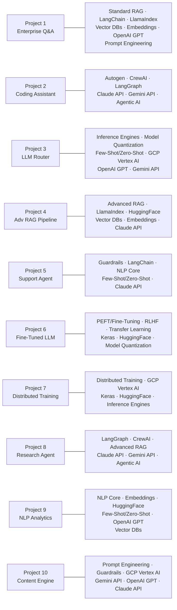

Here are the **10 Gen-ChitChat real-time project blueprints** — each a full architectural simulation between Alice (MIT) and Bob (Stanford), covering every technology in your stack.

> **Note:** All cloud components use **Google Cloud Platform (GCP)** — Vertex AI, Cloud Run, BigQuery, GCS, etc.

***

# 🏗️ Gen-ChitChat Initiative
## 10 Generative AI Project Blueprints

| # | Project | File | Key Technologies |
|---|---------|------|-----------------|
| 1 | [Enterprise Knowledge Q&A Bot](./Project-01-Enterprise-Knowledge-QA.md) | `Project-01-Enterprise-Knowledge-QA.md` | Standard RAG · LangChain · LlamaIndex · Vector DBs · Embeddings · OpenAI GPT · Prompt Engineering |
| 2 | [Multi-Agent Coding Assistant](./Project-02-Multi-Agent-Coding-Assistant.md) | `Project-02-Multi-Agent-Coding-Assistant.md` | Autogen · CrewAI · LangGraph · Claude API · Gemini API · Agentic AI |
| 3 | [Ultra-Low Latency LLM Router](./Project-03-Ultra-Low-Latency-LLM-Router.md) | `Project-03-Ultra-Low-Latency-LLM-Router.md` | Inference Engines · Model Quantization · Few-Shot/Zero-Shot · GCP Vertex AI · OpenAI GPT · Gemini API |
| 4 | [Advanced RAG Document Intelligence](./Project-04-Advanced-RAG-Document-Intelligence.md) | `Project-04-Advanced-RAG-Document-Intelligence.md` | Advanced RAG · LlamaIndex · HuggingFace · Vector DBs · Embeddings · Claude API |
| 5 | [Safe Customer Support Agent with Guardrails](./Project-05-Safe-Customer-Support-Agent.md) | `Project-05-Safe-Customer-Support-Agent.md` | Guardrails · LangChain · NLP Core · Few-Shot/Zero-Shot · Claude API |
| 6 | [Domain-Specific Fine-Tuned LLM (Medical)](./Project-06-Domain-Specific-FineTuned-LLM.md) | `Project-06-Domain-Specific-FineTuned-LLM.md` | PEFT/Fine-Tuning · RLHF · Transfer Learning · Keras · HuggingFace · Model Quantization |
| 7 | [Distributed LLM Training Platform on GCP](./Project-07-Distributed-LLM-Training-GCP.md) | `Project-07-Distributed-LLM-Training-GCP.md` | Distributed Training · GCP Vertex AI · Keras · HuggingFace · Inference Engines |
| 8 | [Autonomous Research & Report Agent](./Project-08-Autonomous-Research-Report-Agent.md) | `Project-08-Autonomous-Research-Report-Agent.md` | LangGraph · CrewAI · Advanced RAG · Claude API · Gemini API · Agentic AI |
| 9 | [NLP Analytics Intelligence System](./Project-09-NLP-Analytics-Intelligence.md) | `Project-09-NLP-Analytics-Intelligence.md` | NLP Core · Embeddings · HuggingFace · Few-Shot/Zero-Shot · OpenAI GPT · Vector DBs |
| 10 | [Multi-Modal Prompt Optimization Engine](./Project-10-MultiModal-Prompt-Optimization.md) | `Project-10-MultiModal-Prompt-Optimization.md` | Prompt Engineering · Guardrails · GCP Vertex AI · Gemini API · OpenAI GPT · Claude API |

***

## 🗺️ Technology Coverage Map

***

## ✅ Project Status Tracker

- [ ] Project 1 — Enterprise Knowledge Q&A Bot
- [ ] Project 2 — Multi-Agent Coding Assistant
- [ ] Project 3 — Ultra-Low Latency LLM Router
- [ ] Project 4 — Advanced RAG Document Intelligence
- [ ] Project 5 — Safe Customer Support Agent
- [ ] Project 6 — Domain-Specific Fine-Tuned LLM
- [ ] Project 7 — Distributed LLM Training on GCP
- [ ] Project 8 — Autonomous Research & Report Agent
- [ ] Project 9 — NLP Analytics Intelligence System
- [ ] Project 10 — Multi-Modal Prompt Optimization Engine

***

Every technology in your Gen-ChitChat stack — from **GCP Vertex AI and Distributed Training** all the way to **RLHF, Model Quantization, and Tree-of-Thought Prompt Engineering** — is now covered across these 10 projects with production-ready architectures, real Alice vs. Bob debates, Mermaid diagrams, and comparison tables. Each project is independently buildable and collectively forms a comprehensive curriculum for mastering the full Generative AI stack.