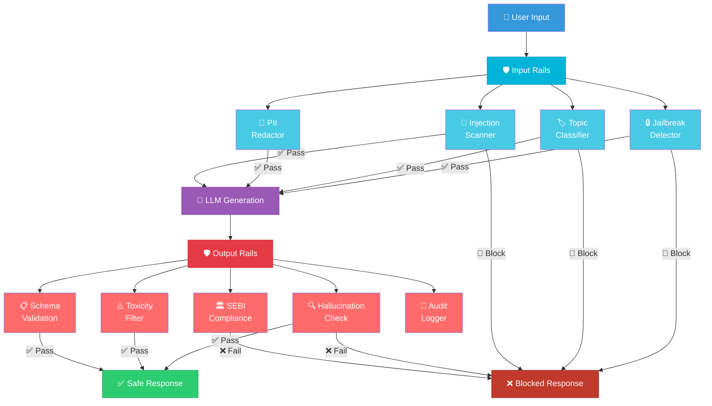
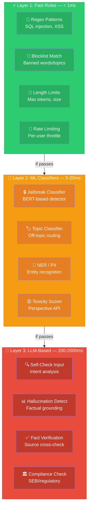
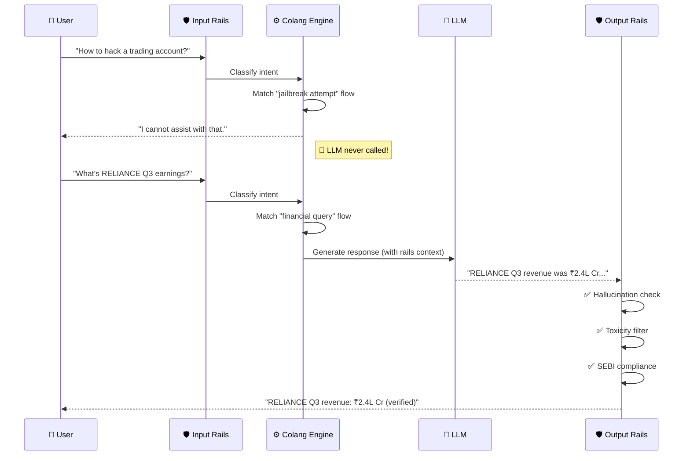
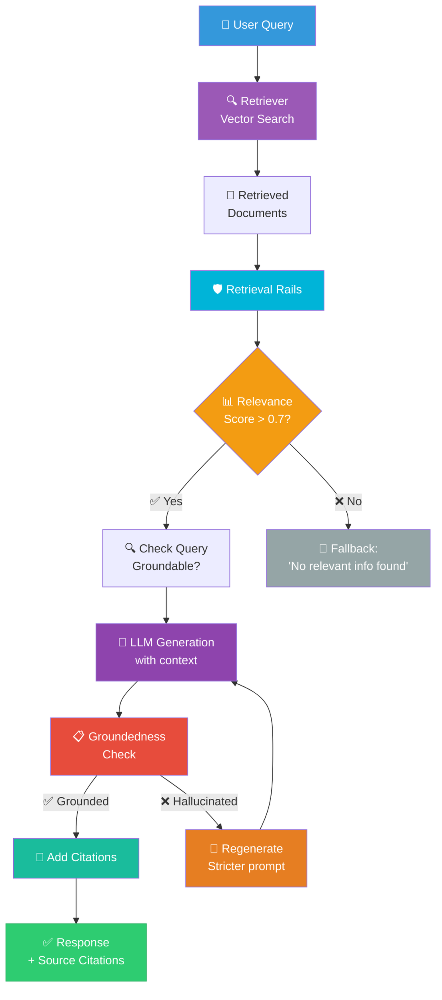
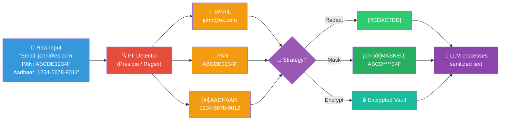
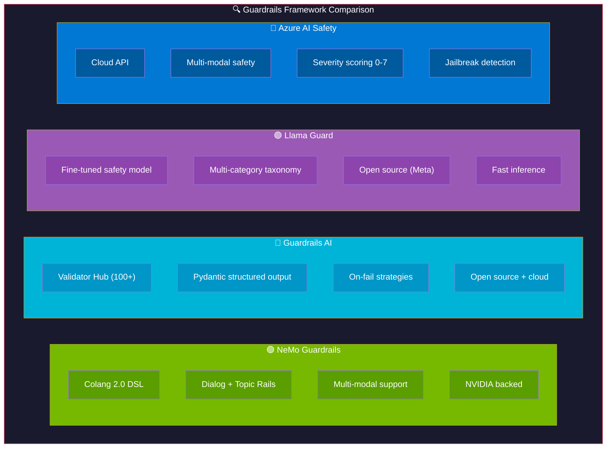
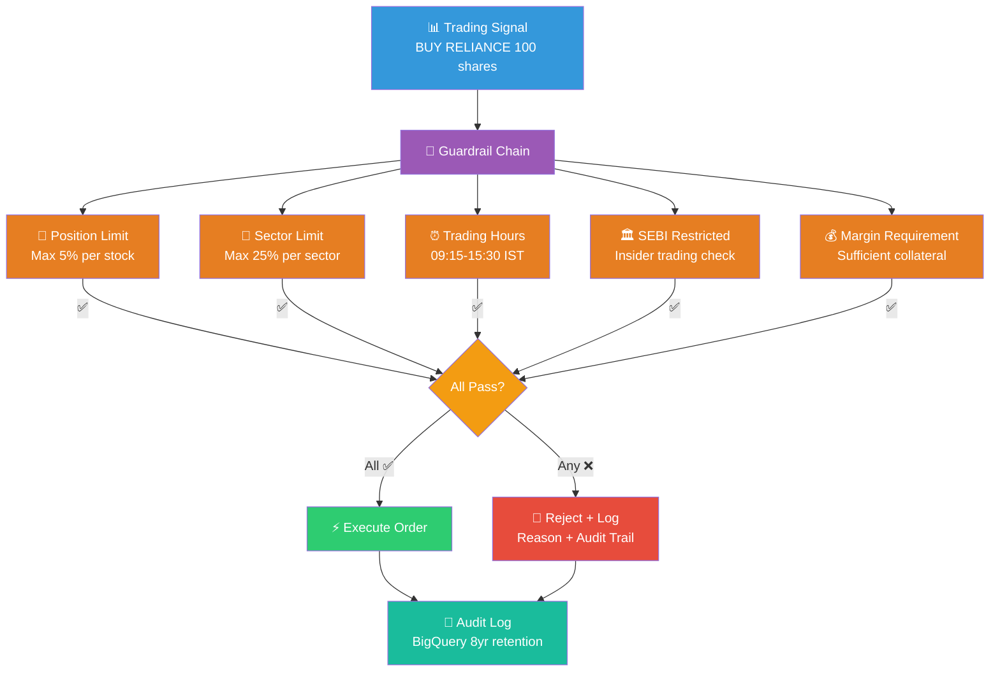
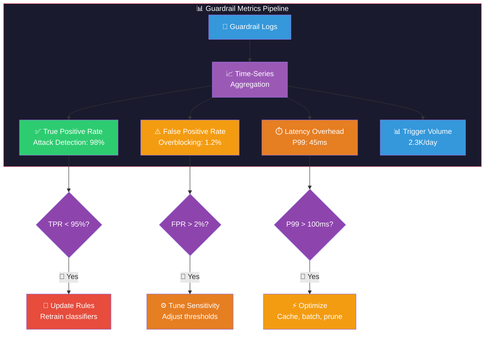
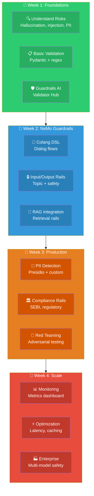

# AI Guardrails: Visual Guide & Architecture Diagrams

## 1. Guardrail Pipeline Architecture

## 2. Defense-in-Depth Layers

## 3. NeMo Guardrails Colang Flow

## 4. RAG Guardrail Flow

## 5. PII Protection Flow

## 6. Framework Comparison

## 7. SEBI Compliance Guardrail for Trading

## 8. Monitoring & Red Teaming Dashboard

## 9. Learning Path

