# Hugging Face: Visual Guide & Architecture Diagrams

## Table of Contents
1. [Ecosystem Overview](#ecosystem-overview)
2. [Transformers Library Architecture](#transformers-library-architecture)
3. [PEFT — Fine-Tuning Methods](#peft--fine-tuning-methods)
4. [LoRA Mathematical Flow](#lora-mathematical-flow)
5. [QLoRA Architecture](#qlora-architecture)
6. [RLHF Training Pipeline](#rlhf-training-pipeline)
7. [Pipeline API Flow](#pipeline-api-flow)
8. [Training with Trainer API](#training-with-trainer-api)
9. [Distributed Training Architecture](#distributed-training-architecture)
10. [Model Hub Workflow](#model-hub-workflow)
11. [PEFT Methods Comparison](#peft-methods-comparison)
12. [Financial Sentiment with HuggingFace](#financial-sentiment-with-huggingface)
13. [Learning Path](#learning-path)

---

## Ecosystem Overview

```mermaid
graph TD
    HF["🤗 Hugging Face"]

    HF --> Hub["🌐 Hub<br/>1M+ Model Checkpoints<br/>100K+ Datasets"]
    HF --> Libs["📚 Core Libraries"]
    HF --> Infra["🚀 Deployment / Infra"]

    Libs --> L1["🔄 transformers<br/>Architectures, Pipelines, Trainer"]
    Libs --> L2["🎯 peft<br/>LoRA, QLoRA, Adapters"]
    Libs --> L3["📊 datasets<br/>100K+ datasets, Arrow"]
    Libs --> L4["⚡ accelerate<br/>Multi-GPU, DeepSpeed, FSDP"]
    Libs --> L5["🎮 trl<br/>RLHF, PPO, SFT, DPO"]
    Libs --> L6["📏 evaluate<br/>ROUGE, BLEU, BERTScore"]
    Libs --> L7["✂️ tokenizers<br/>Rust-based fast"]
    Libs --> L8["🎨 diffusers<br/>Stable Diffusion, DALL-E"]

    Infra --> I1["☁️ Inference API<br/>Managed hosting"]
    Infra --> I2["🎮 Inference Endpoints<br/>Dedicated GPU"]
    Infra --> I3["🖥️ Spaces<br/>Gradio / Streamlit"]
    Infra --> I4["🤖 AutoTrain<br/>No-code fine-tuning"]

    style HF fill:#F39C12,color:#fff,stroke:#E67E22
    style Libs fill:#E74C3C,color:#fff,stroke:#C0392B
    style Hub fill:#1ABC9C,color:#fff,stroke:#16A085
    style Infra fill:#3498DB,color:#fff,stroke:#2980B9
    style L1 fill:#2ECC71,color:#fff
    style L2 fill:#9B59B6,color:#fff
    style L3 fill:#E67E22,color:#fff
    style L4 fill:#00B4D8,color:#fff
    style L5 fill:#E74C3C,color:#fff
    style L6 fill:#27AE60,color:#fff
    style L7 fill:#8E44AD,color:#fff
    style L8 fill:#D35400,color:#fff
    style I1 fill:#2980B9,color:#fff
    style I2 fill:#1ABC9C,color:#fff
    style I3 fill:#F39C12,color:#fff
    style I4 fill:#E74C3C,color:#fff
```

---

## Transformers Library Architecture

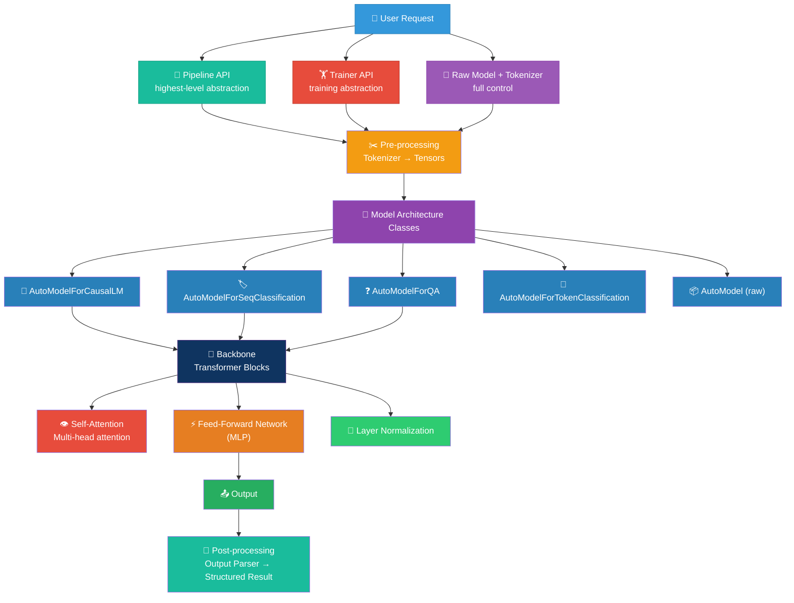

---

## PEFT — Fine-Tuning Methods

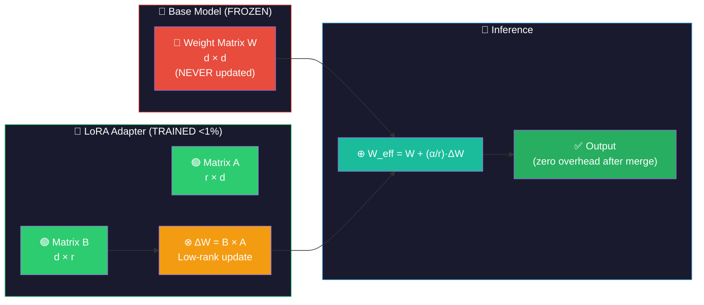

---

## LoRA Mathematical Flow

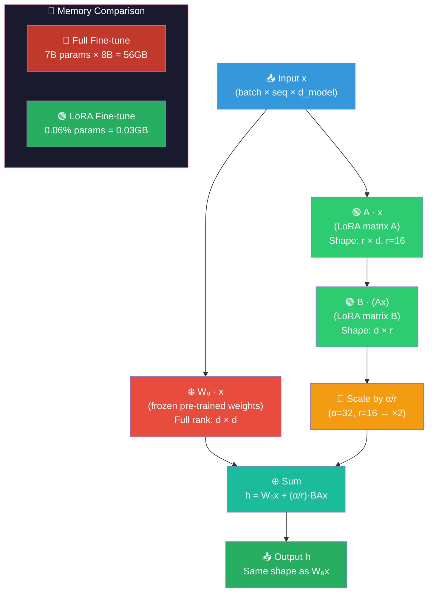

---

## QLoRA Architecture

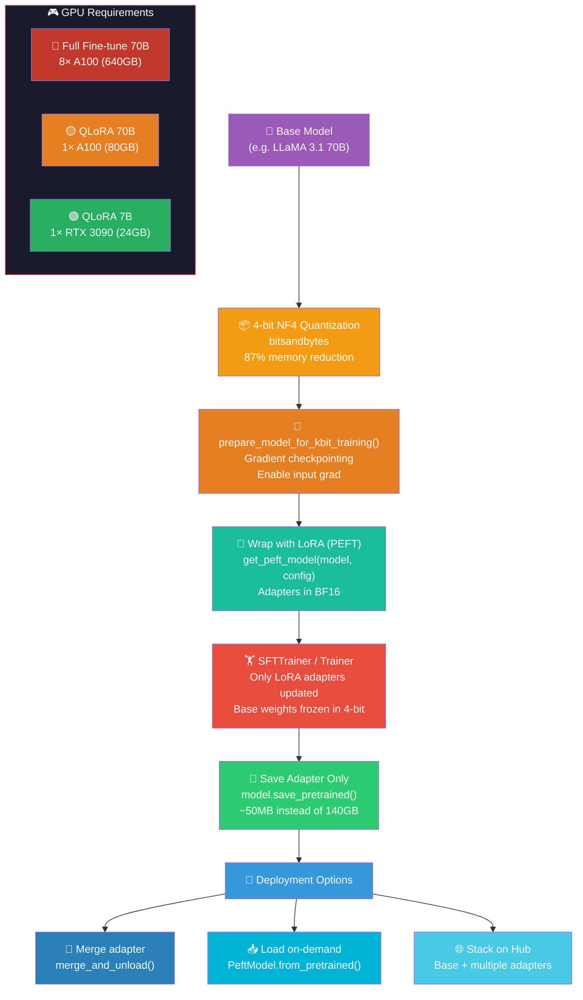

---

## RLHF Training Pipeline

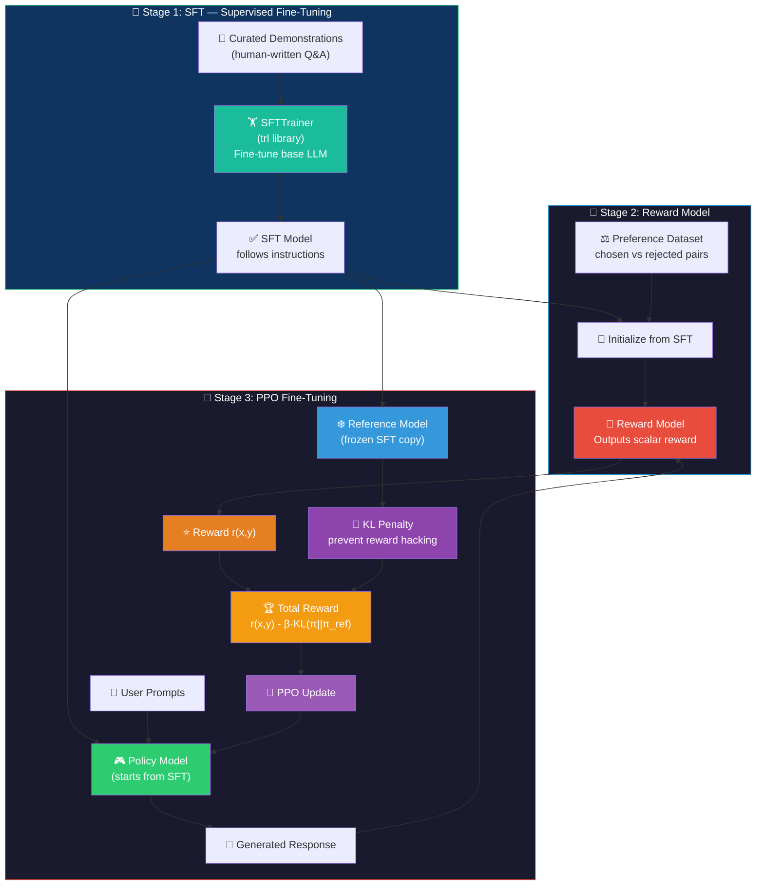

---

## Pipeline API Flow

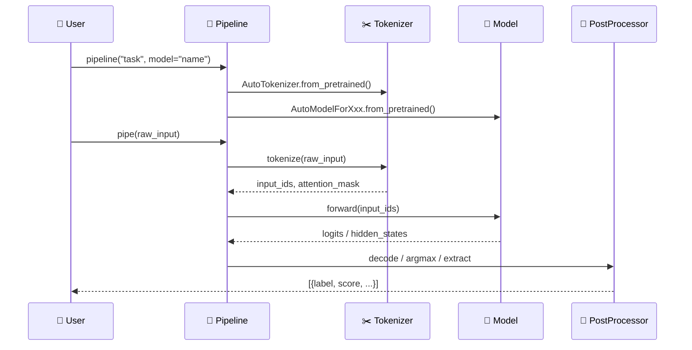

---

## Training with Trainer API

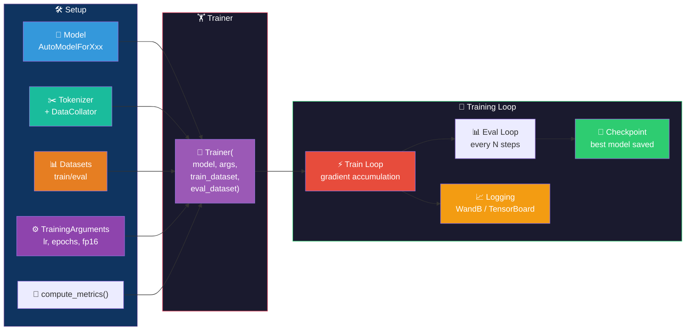

---

## Distributed Training Architecture

```mermaid
graph TD
    subgraph DDP["📡 Single Machine Multi-GPU (DDP)"]
        G1["🎮 GPU 0<br/>Full Model Copy"]
        G2["🎮 GPU 1<br/>Full Model Copy"]
        G3["🎮 GPU 2<br/>Full Model Copy"]
        G4["🎮 GPU 3<br/>Full Model Copy"]

        G1 --> ALL_REDUCE2["🔗 All-Reduce<br/>Sync Gradients"]
        G2 --> ALL_REDUCE2
        G3 --> ALL_REDUCE2
        G4 --> ALL_REDUCE2
    end

    subgraph ZERO["🔀 DeepSpeed ZeRO Stage 3 (Sharded)"]
        ZG1["🎮 GPU 0<br/>1/4 Params+Grads+Optim"]
        ZG2["🎮 GPU 1<br/>1/4 Params+Grads+Optim"]
        ZG3["🎮 GPU 2<br/>1/4 Params+Grads+Optim"]
        ZG4["🎮 GPU 3<br/>1/4 Params+Grads+Optim"]

        ZG1 --> GATHER2["📥 Gather Params<br/>for Forward/Backward"]
        ZG2 --> GATHER2
        ZG3 --> GATHER2
        ZG4 --> GATHER2
    end

    ACC2["⚡ Accelerate / DeepSpeed<br/>One-line launch"] --> ALL_REDUCE2
    ACC2 --> GATHER2

    style DDP fill:#0f3460,color:#fff,stroke:#E74C3C
    style ZERO fill:#1a1a2e,color:#fff,stroke:#2ECC71
    style ALL_REDUCE2 fill:#E74C3C,color:#fff
    style GATHER2 fill:#1ABC9C,color:#fff
    style ACC2 fill:#9B59B6,color:#fff
    style G1 fill:#3498DB,color:#fff
    style G2 fill:#2980B9,color:#fff
    style G3 fill:#00B4D8,color:#fff
    style G4 fill:#48CAE4,color:#fff
    style ZG1 fill:#2ECC71,color:#fff
    style ZG2 fill:#27AE60,color:#fff
    style ZG3 fill:#1ABC9C,color:#fff
    style ZG4 fill:#16A085,color:#fff
```

---

## Model Hub Workflow

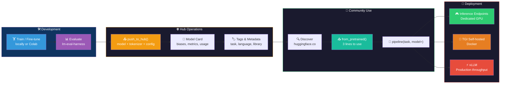

---

## PEFT Methods Comparison

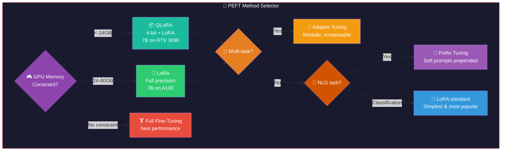

---

## Performance Characteristics

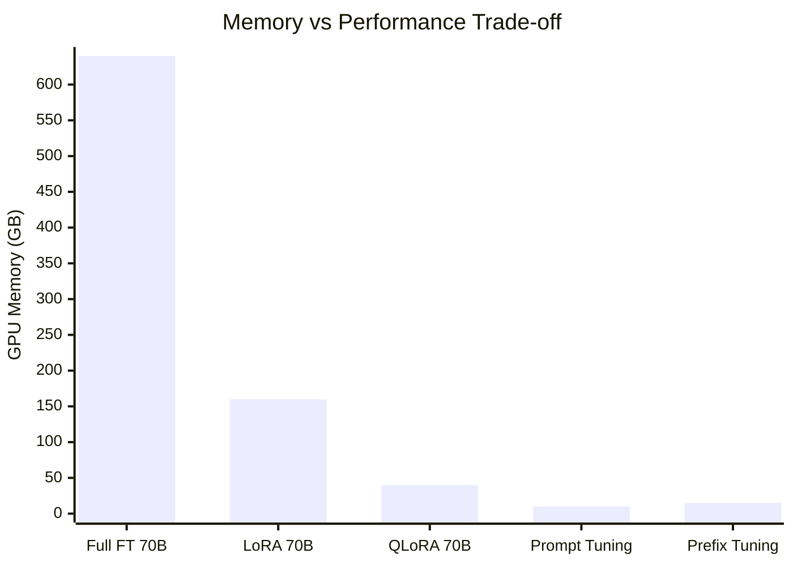

| Technique | VRAM (70B model) | Performance vs Full FT | Train Time |
|-----------|-----------------|------------------------|-----------|
| Full Fine-Tuning | 640GB (8× A100) | 100% baseline | 100% baseline |
| LoRA (r=64) | 160GB (2× A100) | ~97% | ~40% |
| QLoRA (4-bit) | 40GB (1× A100) | ~93% | ~70% |
| Adapter Tuning | 80GB (1× A100) | ~95% | ~50% |
| Prefix Tuning | 40GB | ~85% | ~30% |
| Prompt Tuning | 40GB | ~78% | ~20% |

---

## Financial Sentiment with HuggingFace

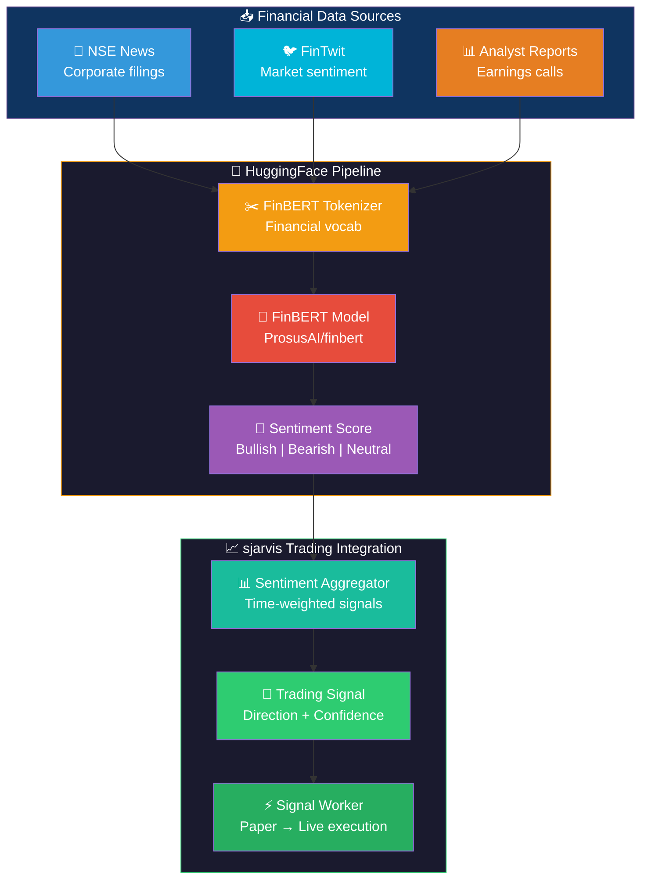

---

## Learning Path

```mermaid
flowchart LR
    subgraph Beginner["📗 Beginner"]
        B1["🔧 Pipeline API<br/>2 lines to run"]
        B2["📥 AutoModel + Tokenizer<br/>load any model"]
        B3["📊 Datasets library<br/>load standard data"]
        B1 --> B2 --> B3
    end

    subgraph Intermediate["📘 Intermediate"]
        I1["🏋️ Trainer API<br/>full fine-tuning"]
        I2["🎯 LoRA with PEFT<br/>parameter-efficient FT"]
        I3["📦 QLoRA<br/>4-bit quantized FT"]
        I1 --> I2 --> I3
    end

    subgraph Advanced["📕 Advanced"]
        A1["🎮 RLHF with TRL<br/>PPO + Reward Model"]
        A2["⚡ Accelerate + DeepSpeed<br/>distributed training"]
        A3["🔬 Custom Architecture<br/>write your own transformer"]
        A1 --> A2 --> A3
    end

    B3 --> I1
    I3 --> A1

    style Beginner fill:#2ECC71,color:#fff,stroke:#27AE60
    style Intermediate fill:#3498DB,color:#fff,stroke:#2980B9
    style Advanced fill:#E74C3C,color:#fff,stroke:#C0392B
    style B1 fill:#27AE60,color:#fff
    style B2 fill:#27AE60,color:#fff
    style B3 fill:#27AE60,color:#fff
    style I1 fill:#2980B9,color:#fff
    style I2 fill:#2980B9,color:#fff
    style I3 fill:#2980B9,color:#fff
    style A1 fill:#C0392B,color:#fff
    style A2 fill:#C0392B,color:#fff
    style A3 fill:#C0392B,color:#fff
```
