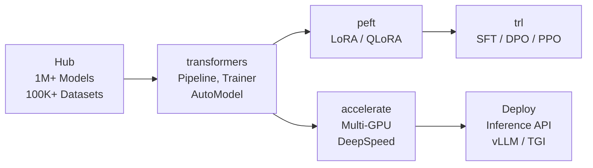

# HuggingFace -- Cheatsheet

## Architecture (30-second mental model)

## When to use vs alternatives
| Need | Use | Not |
|------|-----|-----|
| Open-source models with full control | HuggingFace Transformers | OpenAI API (closed, per-token cost) |
| Fine-tune LLM on your domain data | PEFT + Trainer / SFTTrainer | OpenAI fine-tuning (limited, expensive) |
| Run inference locally or on-prem | HF + vLLM / TGI | Cohere / OpenAI (cloud-only) |
| Quick prototype, no infra | OpenAI API | HuggingFace (needs GPU setup) |
| Managed enterprise ML pipeline | AWS SageMaker | HuggingFace (self-managed infra) |

## 5 things you always forget
1. Always use `AutoTokenizer.from_pretrained(same_model_name)` -- tokenizer mismatch silently destroys output quality
2. Set `tokenizer.pad_token = tokenizer.eos_token` for decoder-only models (GPT, LLaMA) or training crashes with cryptic errors
3. `pipeline()` returns a list even for single inputs -- always index `result[0]`
4. For gated models (LLaMA, Gemma), you must run `huggingface-cli login` or set `HF_TOKEN` env var before `from_pretrained()` works
5. `device_map="auto"` distributes across GPUs but requires `accelerate` installed -- without it, everything lands on CPU silently

## Interview killer answer
> "We serve 12 domain-specific models from a single LLaMA-70B base using HuggingFace PEFT adapters on vLLM -- each adapter is 50MB, hot-swapped per request via API key routing, so we get multi-tenant isolation without duplicating 140GB of base weights per customer. The key was targeting all-linear modules in LoRA and merging with safe_merge=True to avoid float precision loss in production."
