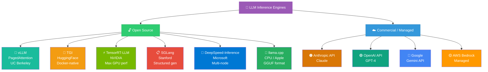
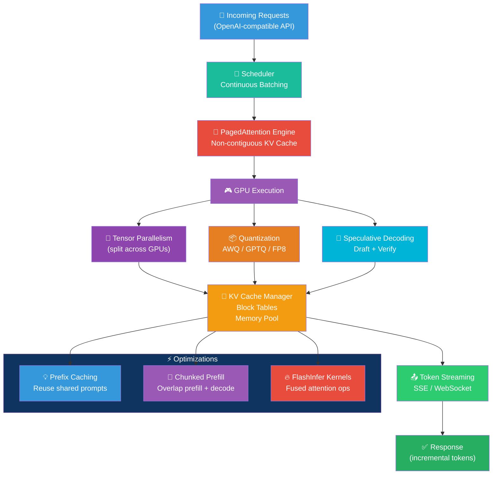
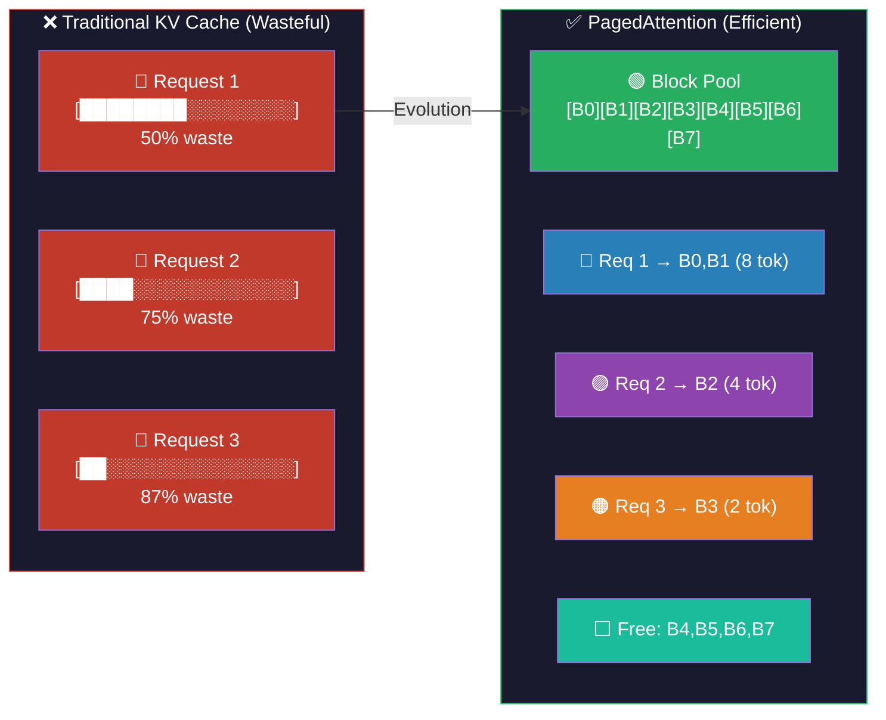
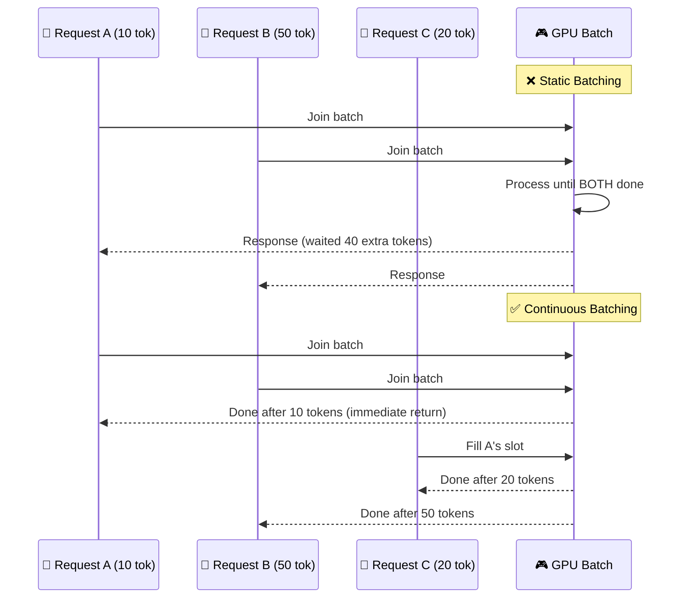
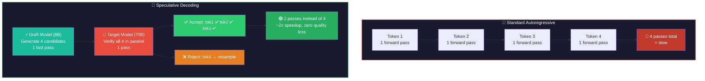
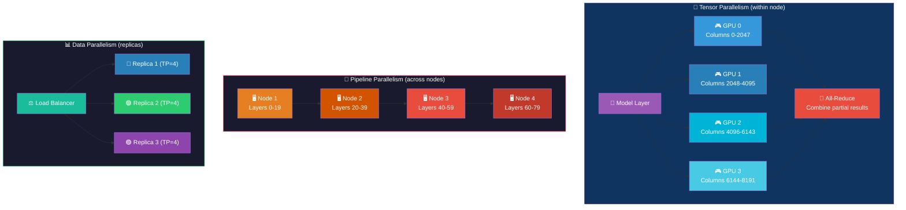
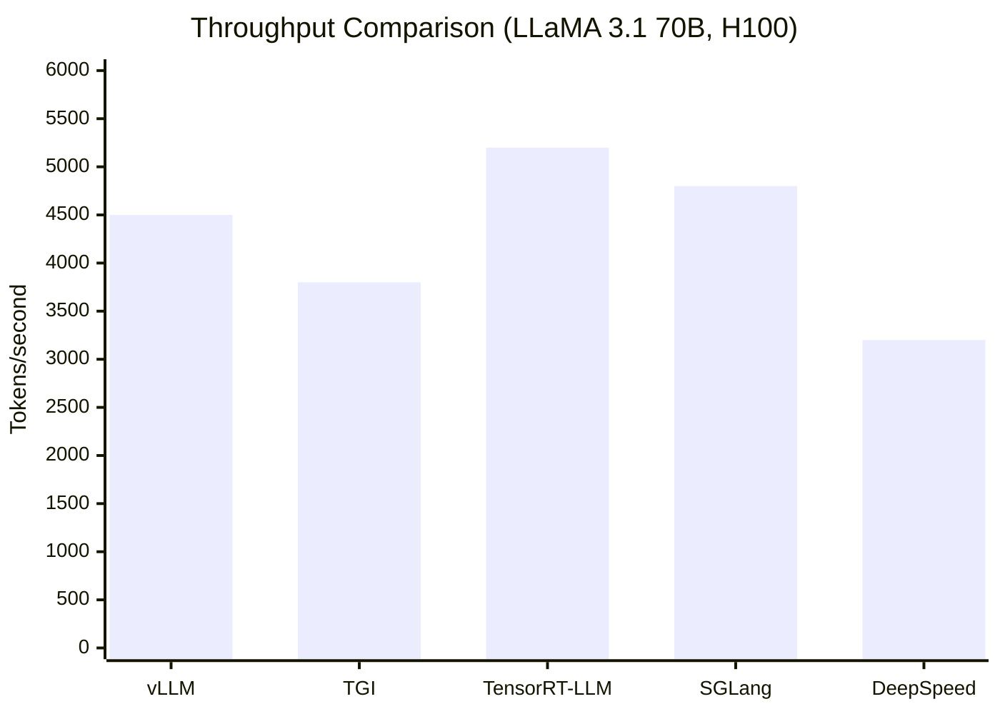
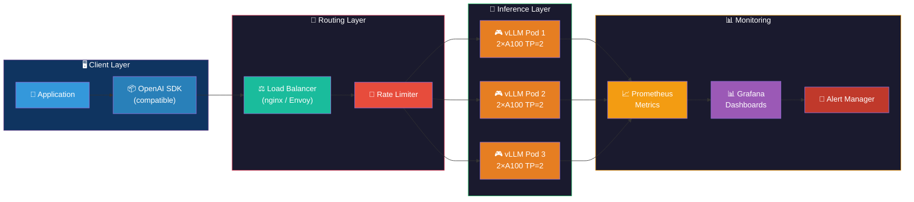
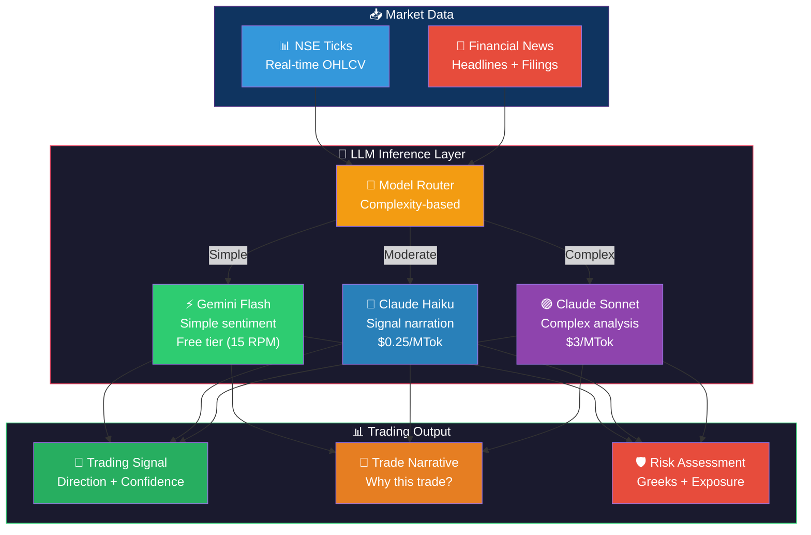

# Inference Engines: Visual Guide & Architecture Diagrams

## Table of Contents
1. [Inference Engine Landscape](#inference-engine-landscape)
2. [vLLM Architecture](#vllm-architecture)
3. [PagedAttention](#pagedattention)
4. [Continuous Batching](#continuous-batching)
5. [Speculative Decoding](#speculative-decoding)
6. [Multi-GPU Inference](#multi-gpu-inference)
7. [Engine Comparison](#engine-comparison)
8. [Production Deployment](#production-deployment)
9. [Financial Trading Inference Pipeline](#financial-trading-inference-pipeline)
10. [Learning Path](#learning-path)

---

## Inference Engine Landscape

---

## vLLM Architecture

---

## PagedAttention

---

## Continuous Batching

---

## Speculative Decoding

---

## Multi-GPU Inference

---

## Engine Comparison

| Engine | Best For | Key Feature |
|--------|---------|-------------|
| vLLM | General production | PagedAttention, easy setup |
| TGI | HuggingFace ecosystem | Docker-native, watermark |
| TensorRT-LLM | Max NVIDIA perf | Kernel fusion, FP8 |
| SGLang | Structured output | RadixAttention, JSON |
| DeepSpeed | Multi-node, huge models | ZeRO-Inference |
| llama.cpp | CPU / edge / Mac | GGUF, no GPU needed |

---

## Production Deployment

---

## Financial Trading Inference Pipeline

---

## Learning Path

