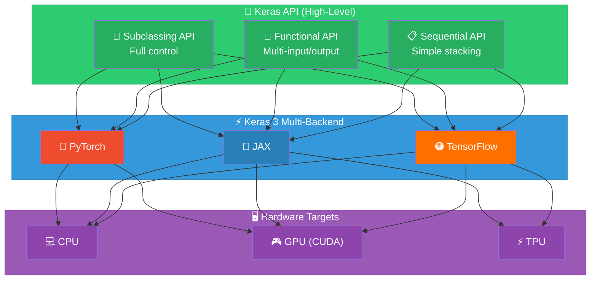
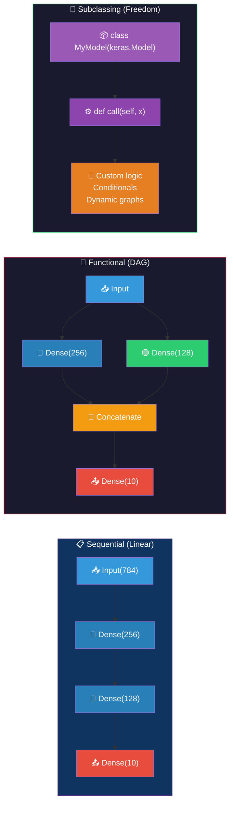
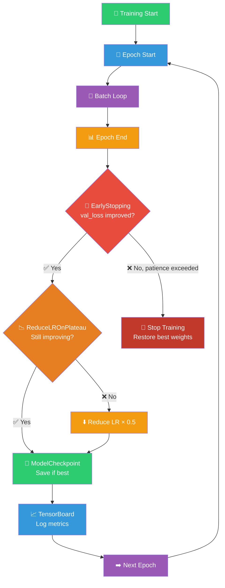
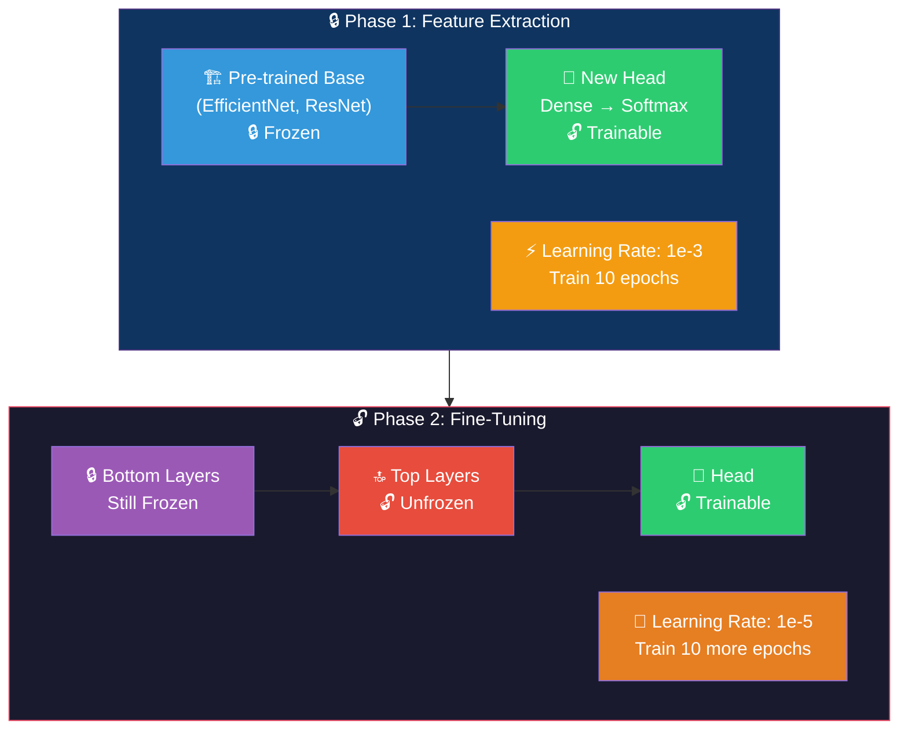
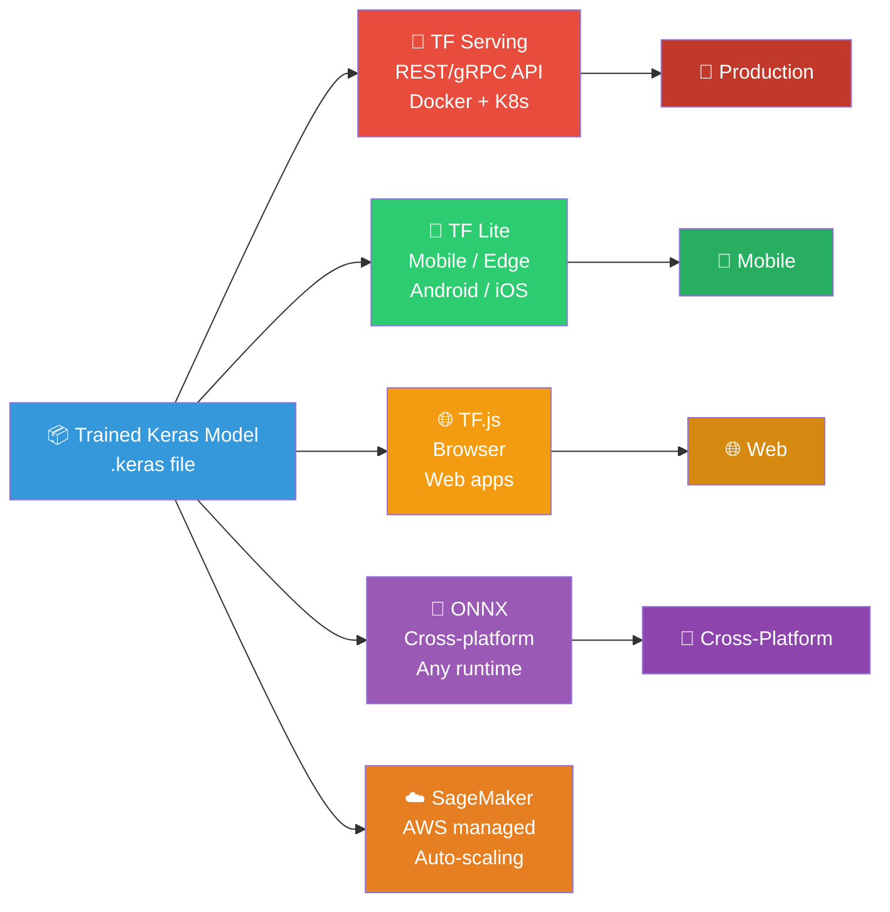
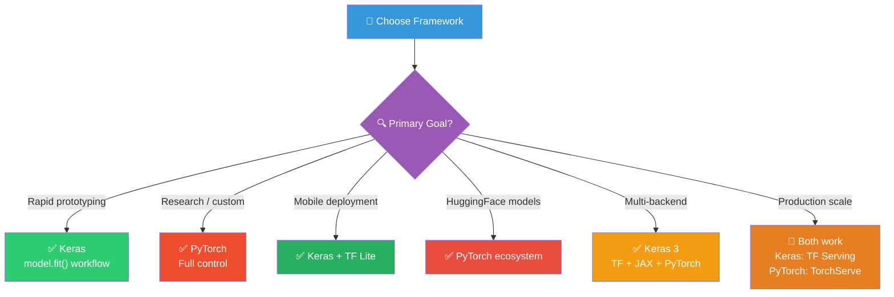
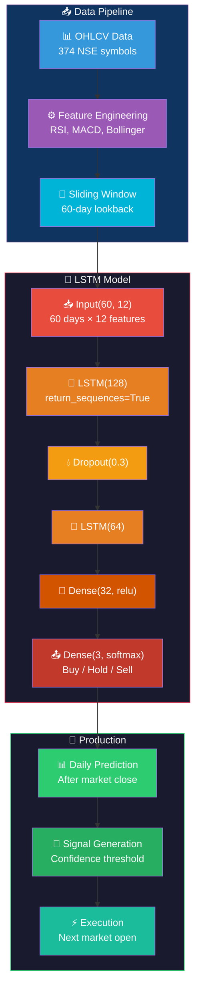
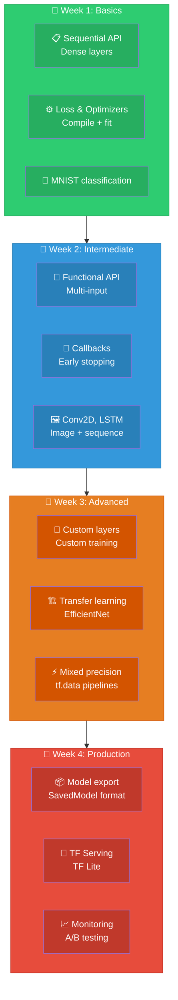

# Keras: Visual Guide & Architecture Diagrams

## 1. Keras Ecosystem Architecture



## 2. Model Building APIs Comparison



## 3. Training Loop Flow

```mermaid
sequenceDiagram
    participant Data as 📦 Dataset
    participant Model as 🧠 Keras Model
    participant Loss as 📉 Loss Function
    participant Opt as ⚙️ Optimizer
    participant CB as 🔔 Callbacks

    CB->>CB: on_epoch_begin()

    loop Each Batch
        Data->>Model: x_batch
        Model->>Loss: predictions vs y_batch
        Loss->>Opt: gradients
        Opt->>Model: update weights
    end

    CB->>CB: on_epoch_end()
    CB->>CB: EarlyStopping check
    CB->>CB: ReduceLROnPlateau check
    CB->>CB: ModelCheckpoint save
```

## 4. Layer Types Overview

```mermaid
flowchart TD
    subgraph Core["🔵 Core Layers"]
        DENSE["🧠 Dense<br/>Fully connected"]
        ACT["⚡ Activation<br/>relu, sigmoid"]
        DROP["💧 Dropout<br/>Regularization"]
    end

    subgraph Conv["🟢 Convolutional"]
        C2D["🖼️ Conv2D<br/>Image features"]
        POOL["📐 MaxPooling2D<br/>Downsample"]
        BN["📊 BatchNorm<br/>Stabilize"]
    end

    subgraph Seq["🟣 Sequence"]
        LSTM2["🔄 LSTM<br/>Long sequences"]
        GRU2["⚡ GRU<br/>Faster LSTM"]
        ATT2["👁️ Attention<br/>Self-attention"]
    end

    subgraph Special["🟠 Special"]
        EMB["📝 Embedding<br/>Token → vector"]
        FLAT["📏 Flatten<br/>Reshape"]
        CONCAT["🔗 Concatenate<br/>Merge branches"]
    end

    Core --> |"Tabular data"| DENSE
    Conv --> |"Images"| C2D
    Seq --> |"Time series / text"| LSTM2
    Special --> |"NLP / multi-input"| EMB

    style Core fill:#3498DB,color:#fff,stroke:#2980B9
    style Conv fill:#2ECC71,color:#fff,stroke:#27AE60
    style Seq fill:#9B59B6,color:#fff,stroke:#8E44AD
    style Special fill:#E67E22,color:#fff,stroke:#D35400
    style DENSE fill:#2980B9,color:#fff
    style ACT fill:#2980B9,color:#fff
    style DROP fill:#2980B9,color:#fff
    style C2D fill:#27AE60,color:#fff
    style POOL fill:#27AE60,color:#fff
    style BN fill:#27AE60,color:#fff
    style LSTM2 fill:#8E44AD,color:#fff
    style GRU2 fill:#8E44AD,color:#fff
    style ATT2 fill:#8E44AD,color:#fff
    style EMB fill:#D35400,color:#fff
    style FLAT fill:#D35400,color:#fff
    style CONCAT fill:#D35400,color:#fff
```



## 5. Callbacks Pipeline



## 6. Transfer Learning Workflow



## 7. Deployment Options



## 8. Keras vs PyTorch Decision Guide



## 9. Financial Time Series with Keras



## 10. Learning Path


